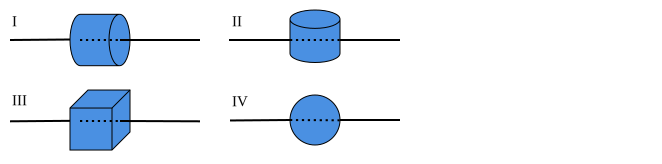
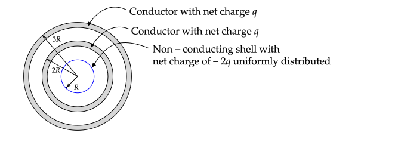

**PHYS 305 Midterm Exam**

October 18th, 2021

**Instructions**:

* Solve problem 1.
* Solve _two of_ problems 2., 3., and 4. Turn in **only two** of these problems. If more than two of these problems are turned in, I will grade only the first two.

# Gauss's Law (10 pts)

1. Which of the following object's surfaces can be used to compute the electric field due to a long line of charge using Gauss's law? Assume the line passes through the center of the objects, is infinitely long, and uniformly charged. Object IV is a sphere. Provide a brief justification for your answers.

2. Use Gauss's law to find the electric field $\mathbf{E}$ for all of the objects that can be used to find the electric field using Gauss's law. Justify all steps.

**Answer**:

1. I only. Based on [a symmetry argument](#example-long-line-of-charge), the electric field must be perpendicular to the line. The [conditions for using Gauss's law](gauss_law.html#using-charges-on-an-insulator) are only satisfied for I -- the field is constant on the curved surface and its angle with respect to the normal is constant. On the caps, the field is perpendicular to the normal. For II, the field is not constant on the caps. For III, the field is not constant on any of the sides. For IV, the angle between the normal to the surface and the field changes.
2. See [similar problem in notes](gauss_law.md#example-long-line-of-charge).

# Line of Charge (20 pts)

A straight line of charge extends from $(x,y)=(-b,0)$ to $(x,y)=(0,b)$. The line has a uniform charge density $\lambda_o$.

Find an equation for the electric field in the $x--y$ plane in terms of constants times an integral with an integrand involving $dx'$, $x'$, $x$, $y$, and $b$. You do not need to evaluate the integral.

**Answer**
The equation for the line is $y' = b+x'$.

$dl=dx'\sqrt{1+dy'/dx'}=dx'\sqrt{2}$

$dq=\lambda_odl$

$\mathbf{r}'=x'\xhat + y'\yhat = x'\xhat + (b+x')\yhat$

$\mathbf{r}=x\xhat + y\yhat$

$\displaystyle d\mathbf{E}=\sqrt{2}k\lambda_o\frac{(x-x')\xhat + [y-b-x')]\yhat}{\left[(x-x')^2+(y-b-x')^2\right]^{3/2}}dx'$

$\displaystyle\mathbf{E}(x,y)=\sqrt{2}k\lambda_o\int_{-b}^0\frac{(x-x')\xhat + [y-b-x')]\yhat}{\left[(x-x')^2+(y-b-x')^2\right]^{3/2}}dx'$
\newpage

# Boundary Value Problem (20 pts)

The following figure shows the cross-section of a U--shaped duct that is infinite in extent in the $\pm z$ direction.

The bottom side of the duct is open and the left and right sides extend from $y=0$ to $y=-\infty$ and are held at $V=0$. The top side of the duct is held at $V=V_o$.

Find a non--zero equation for $V(x,y)$ inside of the duct that satisfies three of the four boundary conditions.

Recall that for arbitrary constants $A,B,C,D,$ and $m$ the following four equations satisfy Laplace's equation in 2-D cartesian coordinates.

1. $V(x,y) = \big(A\cosh mx+B\sinh mx\big)\big(C\cos my+D\sin my\big)$
2. $V(x,y) = \big(A\cos mx+B\sin mx)(C\cosh my+D\sinh my\big)$
3. $V(x,y) = \big(Ae^{mx}+Be^{-mx})(C\cos my+D\sin my\big)$
4. $V(x,y) = \big(A\cos mx+B\sin mx\big)\big(Ce^{my}+De^{-my}\big)$

**Answer**:

This is similar to Example 3.3 of Griffiths.

To solve a boundary value problem in 2--D, one must specify the potential on a closed boundary. Here we set the lower boundary to be at $y=-\infty$. Due to the potentials on the three boundaries, a negative charge will appear on the sides and the charge density will increase as $y\rightarrow 0$. The lower boundary will be far away from all charges and so its potential can be set to zero. The boundary conditions are then

1. $V(x,0)=V_o$ (top)
2. $V(y,0)=0$ (left)
3. $V(y,a)=0$ (right)
4. $V(x,-\infty) = 0$ (bottom)

$V(x,y) = C'e^{-n\pi y/a}D\sin(n\pi x/a)$ with $n=\pm 1, \pm 2, ...$ satisfies BCs 2.-4. 

# Conductors (20 pts)

The following figure shows the cross--section of three spherical objects. The conducting spherical shells have a thickness of $t$ and outer radii of $2R$ and $3R$.

1. Find and plot $E_r$ vs. $r$ from $r=0$ to $r=\infty$
2. If $V(0)=0$, find $V(r)$ from $r=0$ to $r=2R$ (no plot needed.)

**Answer**

1\.

$r=0$ to $R$: $E_r=0$

$r=R$ to $2R-t$: $E_r=-2kq/r^2$

$r=2R-t$ to $2R$: $E_r=0$

$r=2R$ to $3R-t$: $E_r=-kq/r^2$

$r=3R-t$ to $3R$: $E_r=0$

$r\gt 3R$: $E_r=0$

2\. 

$r=0$ to $R$: $V=0$

$r=R$ to $2R-t$: $V=2kq(1/R-1/r)$

$r=2R-t$ to $2R$: $V=2kq(1/R-1/(2R-t))$
