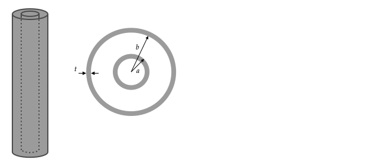

# Introduction

See also 3.1 of Griffiths.

## Overview

Many laws of physics are expressed as either ordinary differential equations or partial differential equations.

Recall from mechanics that the equation for the position of a particle in a uniform gravitational field is given by the ordinary differential equation

$$m\frac{d^2x}{dt^2}=-mg$$

This equation does not explicitly give the position of a mass versus time. To determine, one must first obtain a solution to this equation.

A general solution for $x(t)$ has the form

$$x(t)=C_1+C_2t-gt^2/2$$

where $C_1$ and $C_2$ are two constants.

To use this equation to find $x(t)$ for a mass, the values of the two constants must be known. Usually these two constants are determined based on the initial values of $x$ and $dx/dt$. For example, if $x(t=0)=0$ and $v(t=0)=0$, then $C_1=C_2=0$ and the trajectory of the mass is given by $x(t)=-gt^2/2$.

This type of problem is called an **initial value problem** -- given a differential equation for the position of the mass and it's initial values of $x$ and $v$, we arrive at a solution for $x$ for all $t$. Another example of an inital value problem is for the position $x$ of a mass on a spring. The differential equation for $x$ is $d^2x/dt^2-\omega_o^2x=0$. A general solution is $x(t)=C_1\sin(\omega_o t)+C_2\cos(\omega_o t)$.

A **boundary value problem** involves first finding a general solution to a partial differential equation with respect to the position (instead of time). The solution will have constants whose values are determined by the conditions at the boundary. For example, in electrostatics

$$\frac{\partial^2 V}{\partial x^2}=0$$

is a partial differential equation for $V$ for a system where the symmetry is such that the potential only depends on $x$. If we want to know $V(x)$, we need to know a general solution to this equation. It is

$$V(x)=C_1 + C_2x$$

The values for $C_1$ and $C_2$ are determined based on boundary conditions. For example, $V(x=0)=0$ and $V(x=L)=V_o$.

In this course, you will only be required to know how to derive the general solution for partial differential equations in 1--D for cartesian, cylindrical, and spherical coordinates.  Derivations are given in the [1--D section](#1-d).

For 2-- and 2--D partial differential equations, you will be given the general solution and asked to find the unknown constants given boundary value information.

## Finding $V$

There are generally two types of problems involving $V$ in electrostatics:
1. given the locations of charges, compute the electric potential and electric field at all locations in space; and
2. given the electric potential at certain locations in space, compute the electric potential and electric field at all locations in space.

### Type 1 Problems

For problems of type 1., we can compute $V$ using

$$V(\mathbf{r})=\sum_{i=1}^{N} \frac{kq\_{i}}{|\mathbf{r}-\mathbf{r}\_{i}'|}$$

for $N$ discrete charges, or the continuous approximation 

$$V(\mathbf{r})=\int \frac{kdq}{|\mathbf{r}-\mathbf{r}'|}$$

along with a given line, surface, or volume charge density ($\lambda, \sigma$, or $\rho$, respectively).

In many problems, we don't know the locations of the charges in the system. Consider the scenario shown in the following figure in which a net charge of $Q$ is placed on a conductor. 

The charges on the conductor will distribute themselves so that the electric field in the conductor is zero. In general, we don't know what the distribution will be -- we only know that whatever it is, it is such that the electric field is zero inside.

If the top cap is centered on the origin and in the $x$--$y$ plane, to compute the potential due to the top cap outside of the conductor, we may be tempted to start with

$$V(\mathbf{r})= \int_0^{2\pi}\int_0^R \frac{k\sigma(s')}{|\mathbf{r}-s'\hat{\mathbf{s}}|}s'ds'd\phi'$$

which was the approach used to find the potential due to charges distributed on a disk with a given $\sigma(s)$. However, in this case, we don't know $\sigma(s)$ and so we are stuck. A brute-force method of computing $\sigma$ uses the fact that the $V$ must be constant on the conductor: guess $\sigma$ the top, bottom, and side surfaces, compute $V$ using integration, and then repeat until a $V$ is found that is constant on the conductor.

In summary, we can only use the integral formula for $V$ if the charge densities are known. In general, if we place a net charge on a conductor, we do not know how it will distribute on its surface.

### Type 2 Problems

Problems of type 2. are called **boundary value problems** and are generally solved by finding solutions to a partial differential equation called Poisson's equation:

$$\nabla^2 V= -\frac{\rho}{\epsilon_0}$$

$\nabla^2$ is a new form of operator. It involves operation on a scalar function $f$ and results in a scalar function. In cartesian coordinates, 

$$\displaystyle \nabla^2f=\frac{\partial^2 f}{\partial x^2}+\frac{\partial^2 f}{\partial y^2}+\frac{\partial^2 f}{\partial z^2}$$

Therefore, Poisson's equation in cartesian coordinates is

$$\frac{\partial^2 V}{\partial x^2}+\frac{\partial^2 V}{\partial y^2}+\frac{\partial^2 V}{\partial z^2}=-\frac{\rho}{\epsilon_0}$$

Similar to the divergence and gradient operators, the $\nabla^2$ operator (also called the Laplacian or "del squared") has different forms for each coordinate system. These are given on the second--to last page of Griffiths.

Laplace's equation is Poisson's equation with $\rho=0$:

$$\nabla^2 V = 0$$

In cartesian coordinates, it is

$$\frac{\partial^2 V}{\partial x^2}+\frac{\partial^2 V}{\partial y^2}+\frac{\partial^2 V}{\partial z^2}=0$$

### Deriving Poisson's Equation

Poisson's Equation, $\nabla^2 V= -{\rho}/{\epsilon_0}$, follows directly from inserting the definition of the electric potential $\mathbf{E}=-\nabla V$ into Gauss' Law in differential form $\nabla\bfcdot\mathbf{E}=\rho/\epsilon_0$.

Gauss's law in differential form is

$$\nabla\bfcdot\mathbf{E}=\frac{\rho}{\epsilon_0}$$

Using $\mathbf{E}=-\boldsymbol{\nabla}V$, this is

$$\boldsymbol{\nabla}\bfcdot(-\boldsymbol{\nabla}V)=\frac{\rho}{\epsilon_0}$$

To evaluate $\boldsymbol{\nabla}\bfcdot(-\boldsymbol{\nabla}V)$, first write $\boldsymbol{\nabla}V$ in cartesian

$$\boldsymbol{\nabla}V=\xhat\frac{\partial V}{\partial x}+\yhat\frac{\partial V}{\partial y}+\zhat\frac{\partial V}{\partial z}$$

Then

$$\boldsymbol{\nabla}\bfcdot(-\boldsymbol{\nabla}V)=\boldsymbol{\nabla}\bfcdot\left(-\xhat\frac{\partial V}{\partial x}-\yhat\frac{\partial V}{\partial y}-\zhat\frac{\partial V}{\partial z}\right)$$

Using the definition of divergence of a vector function $\mathbf{U}$, which is

$$\boldsymbol{\nabla}\bfcdot\mathbf{U}=\xhat\frac{\partial U_x}{\partial x}+\yhat\frac{\partial U_y}{\partial y}+\zhat\frac{\partial U_z}{\partial z}$$

with $U_x=-\partial V/\partial x$, $U_y=-\partial V/\partial y$, $U_z=-\partial V/\partial z$ gives

$$\boldsymbol{\nabla}\bfcdot\left(-\xhat\frac{\partial V}{\partial x}-\yhat\frac{\partial V}{\partial y}-\zhat\frac{\partial V}{\partial z}\right)=-\frac{\partial^2 V}{\partial x^2}-\frac{\partial^2 V}{\partial y^2}-\frac{\partial^2 V}{\partial z^2}$$

and so 

$$\boldsymbol{\nabla}\bfcdot(-\boldsymbol{\nabla}V)=-\frac{\partial^2 V}{\partial x^2}-\frac{\partial^2 V}{\partial y^2}-\frac{\partial^2 V}{\partial z^2}$$

and

$$-\frac{\partial^2 V}{\partial x^2}-\frac{\partial^2 V}{\partial y^2}-\frac{\partial^2 V}{\partial z^2}=\frac{\rho}{\epsilon_0}$$

Moving the negative sign and using the definition of the Laplacian $\nabla^2$, gives Poisson's equation

$$\nabla^2V=-\frac{\rho}{\epsilon_0}$$

### Problem

Outside of a solid sphere of radius $R$ with uniformly distributed charge $Q$, the field is

$\displaystyle V(r)=kQ\frac{1}{r}$

inside, it is

$\displaystyle V(r)=\frac{kQ}{2R}\left[1-\frac{r^2}{R^2}\right]$

Compute $\nabla^2 V$ and verify that $\nabla^2V=-\frac{\rho}{\epsilon_0}$ inside and outside of the sphere. You may use the formula for $\nabla^2$ in any coordinate system. 

# 1-D

See also 3.2 of Griffiths.

## Cartesian

Suppose that we connect a battery with a potential difference $V_o$ to two large conducting plates. We want to know how $V$ varies between the plates.

This problem can be solved using two approaches.
1. By assuming the potential causes equal and opposite amount of charge to be uniformly distributed on the plates. This approach can only be used because we know (or assume) how the charges will distribute on the surfaces. If the plates were not large, we could not use this method.
2. By using the boundary value method.
 
### Charge Method

Assume charges of $\pm Q$ appear on the plates when the battery is connected so that the surface charge densities are $\pm Q/A$ and use the method demonstrated in the [capacitance notes](capacitance.html) notes to find $V$.

The electric field between the plates is $\mathbf{E}=-\sigma/\epsilon_o\xhat$. Using $V(x)=V(a)-\int_a^x\mathbf{E}\bfcdot d\mathbf{l}$ with $a=0$ and $d\mathbf{l}=dx'\xhat$

$\displaystyle V(x)=V(0)-\int_0^x -\frac{\sigma}{\epsilon_o}dx'$

Integration gives

$\displaystyle V(x) = V(0)+\frac{\sigma}{\epsilon_o}x$

We are not done because we need to write $\sigma$ in terms of $V_o$. To compute $\sigma$, plug in $x=d$ to get

$\displaystyle V(d)-V(0)=\frac{\sigma}{\epsilon_o}d$

The difference in potential $V(d)-V(0)$ was given as $V_o$. Substitution gives

$\displaystyle V_o=\frac{\sigma}{\epsilon_o}d\quad\Rightarrow\quad \sigma=\epsilon_o\frac{V_o}{d}$

Plugging this $\sigma$ into $\displaystyle V(x) = V(0)+\frac{\sigma}{\epsilon_o}x$ gives

$\displaystyle V(x)=V(0)+V_o\frac{x}{d}$

### Laplace's Equation Method

This problem may also be solved using Laplace's equation.

Between the plates, there are no charges, so $\rho=0$ and Laplace's equation applies. If the plates are large, then the potential will only vary in the $x$--direction, in which case Laplace's equation in cartesian components simplifies to:

$\displaystyle\nabla^2V = \frac{\partial^2 V}{\partial x^2} = 0$

This can be written as 

$\displaystyle\nabla^2V = \frac{d^2 V}{dx^2} = 0$

because $V$ only depends on $x$. This equation can be integrated twice to give

$\displaystyle V(x)=ax+b$

where $a$ and $b$ are constants. You can verify that $V = ax+b$ satisfies $\partial^2 V/\partial x^2 = 0$ by differentiating it twice with respect to $x$.

The interpretation of this equation is that in a configuration where it can be argued that potential only depends on $x$, the potential must increase or decrease linearly. In this example, the two boundary conditions are

1. $V(x=0)=0$
2. $V(x=d)=V_o$

These two conditions give two equations that can be solved to find the unknown constants $a$ and $b$:

$\displaystyle V(x=0)=0=a\cdot 0+b \Rightarrow b = 0$

$\displaystyle V(x=d)=V_o=ad+b=ad+0 \Rightarrow a=V_o/d$

so the solution is

$\displaystyle V(x) = \frac{V_o}{d}x$

This is the same result found using the charge method if we set $V(0)=0$ in the charge method equation to be consistent with what was used in Laplace's equation method.

After developing a solution to Laplace's equation, one should always verify that the solution matches the boundary conditions, in this case by plugging in the coordinates of the boundary:

1. $V(x) = \frac{V_o}{d}x \Rightarrow V(0)=0$ so the solution matches the $x=0$ boundary condition
2. $V(x) = \frac{V_o}{d}x \Rightarrow V(d)=V_o$ so the solution matches the $x=d$ boundary condition

1-D examples are simple. As will be seen when 2- and 3-D problems are considered, typically, one cannot find a single equation that satisfies all boundary conditions by following this method; a function can be found that satisfies some but not all of the boundary conditions. To fully solve the problem, one has to rely on the so-called "Fourier Trick" to find a solution. This method is described in the section on 2-D Cartesian.

### Problems

#### Checking Solution

A student came up with the following equation for the potential between the plates: $V(x)/V_o = e^{\tan^{-1}(x+1/2)} + x^3 - 1/\sqrt{x^2-1} + \tanh(1/\sqrt{e^x}+4\pi)$.  Without doing a calculation, we know this is wrong or the expression simplifies to $V(x)=V_ox/d$. Why?

%4. You have computed $V$ that satisfied Laplace's Equation and the boundary conditions. This solution is unique. Some students noted that the cubic term would not be zero after differentiating it twice and so the potential would not satisfy Laplace's Equation. But, this term could have been canceled by another term that appeared after taking the second derivative. The point of this problem was to make sure that you understood the uniqueness theorem, which is import for image problems.

## Cylindrical

Two long conducting cylinders of radius $a$ and $b$ are configured as shown in the following figure.

Assume the potential on the inner cylinder is $V_o$ and that on the outer cylinder is $0$.

The cylinders are conductors, and if they are long relative to their radius, the charges that appear on them will be approximately uniformly distributed on their surfaces. If the charge distribution is independent of $\phi$ and $z$, the potential will not depend on $\phi$ and $z$. So $V=V(s)$.

In cylindrical coordinates, the Laplacian is 

$$\nabla^2V={1 \over s}{\partial \over \partial s}\left(s {\partial V \over \partial s}\right) + {1 \over s^2}{\partial^2 V \over \partial \phi^2} + {\partial^2 V \over \partial z^2}$$

if $V=V(s)$, the derivatives in the second and third terms are zero, and so 

$$\nabla^2 V={1 \over s}{\partial \over \partial s}\left(s {\partial V \over \partial s}\right)$$

Because $V$ depends only on $s$, we can replace the partial derivative with the total derivative to obtain the ODE

$$\nabla^2 V={1 \over s}{d \over d s}\left(s {d V \over d s}\right)=0$$

The boundary conditions are

1. $V(a)=V_o$
2. $V(b)=0$

To solve the ODE, note that because $1/s$ is not zero, the only way for the left-hand side of

$${1 \over s}{d \over d s}\left(s {d V \over d s}\right)=0$$

to be zero is if

$$s {d V \over d s}=C_1$$

where $C_1$ is a constant. Direct integration of this equation gives

$$V(s) = {C_1 \ln s} + C_2$$

The two unknowns are solved for by using the boundary conditions

$$V(b) = 0 = {C_1 \ln b} + C_2 \Rightarrow C_2=-C_1\ln b$$

$$V(a) = V_o = {C_1 \ln a} + C_2\Rightarrow V_o=C_1(\ln a-\ln b)=C_1\ln(a/b)$$

Solving for $C_1$ and $C_2$ gives

$$C_1 = {V_o \over \ln(a/b)}$$
$$C_2 = -{{V_o / \ln b} \over \ln(a/b)}$$

Subsitution of these constants into $V(s) = {C_1 \ln s} + C_2$ gives

$$V(s) = {V_o \over \ln(a/b)}\left(\ln s - \ln b \right)$$

as a check of the algebraic steps, plug in $s=a$ and $s=b$ into this equation and verify that the boundary conditions used, $V(a)=V_o$ and $V(b)=0$ are satisfied.

The electric field can be found using $\mathbf{E}=-\nabla V$. In cylindrical coordinates, when $V$ depends only on $s$, the negative of the gradient of $V$ is given by

$$-\nabla V=-{\partial V \over \partial s} \hat{\mathbf{s}}$$

Evaluation of the derivative gives

$$\mathbf{E}=-{V_o \over \ln(a/b)}{1 \over s}\hat{\mathbf{s}}$$

Using $-\ln(a/b)=\ln(b/a)$, this can also be written as

$$\mathbf{E}={V_o \over \ln(b/a)}{1 \over s}\hat{\mathbf{s}}$$

This field points from $a$ to $b$ (in $+\hat{\mathbf{s}}$ direction) as expected because the potential on the inner surface is higher than that on the outer surface.

### Problem

For the example given, find $\mathbf{E}(s)$ between the cylinders using the charge method.

## Spherical

### Problem

Two conducting and concentric spherical shells with radius $a$ and $b$ (assume $b>a$) are at potential $V_o$ and $0$, respectively.

1. Find $V(r)$ between the spheres using Laplace's equation method.
2. Find $\mathbf{E}(r)$ between the spheres using the charge method.

# 2--D

See also 3.3.1 of Griffiths.

## Cartesian

Laplace's equation in 2-D cartesian coordinates is 

$$\nabla^2V = \frac{\partial^2 V}{\partial x^2} + \frac{\partial^2 V}{\partial y^2} = 0$$

For arbitrary constants $A,B,C,D,$ and $m$ the following four equations satisfy it

1. $V(x,y) = \big(A\cosh mx+B\sinh mx\big)\big(C\cos my+D\sin my\big)$
2. $V(x,y) = \big(A\cos mx+B\sin mx)(C\cosh my+D\sinh my\big)$
3. $V(x,y) = \big(Ae^{mx}+Be^{-mx})(C\cos my+D\sin my\big)$
4. $V(x,y) = \big(A\cos mx+B\sin mx\big)\big(Ce^{my}+De^{-my}\big)$

### Problem

Show that form 1. satisfies $\nabla^2V=0$

----

I use $m$ on this page instead of $k$ as is done in the text because I have been using $k$ for $1/(4\pi\epsilon_0)$.

One can argue that there are only two forms that we need to consider because (1.) and (3.) and (2.) and (4.) are equivalent if one considers the definitions $\sinh z \equiv (e^{mz}-e^{-mz})/2$ and $\cosh z\equiv (e^{mz}+e^{-mz})/2$.

### Problem

Show this.

----

In fact, all of the equations are equivalent. If the constant $m$ is imaginary, then it can be shown that form (1.) is equivalent to form (2.) using Euler's identity: $e^{iz}=\cos z+i\sin z$.

### Problem

Show this.

----

The reason that all four forms are listed is that for certain problems, a certain choice of the form to start with leads to less algebra. 

%There is no general rule about which form to start with beyond considering a few boundary conditions and looking at which equation will give coefficients that are zero immediately. An example of this will be given later.

