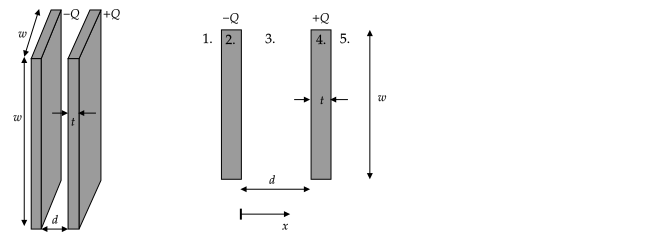

# Introduction

See also 3.1 of Griffiths.

## Overview

Many laws of physics are expressed as either ordinary differential equations or partial differential equations.

Recall from mechanics that the equation for the position of a particle in a uniform gravitational field is given by the ordinary differential equation

$$m\frac{d^2x}{dt^2}=-mg$$

This equation does not explicitly give the position of a mass versus time. To determine, one must first obtain a solution to this equation.

A general solution for $x(t)$ has the form

$$x(t)=C_1+C_2t-gt^2/2$$

where $C_1$ and $C_2$ are two constants.

To use this equation to find $x(t)$ for a mass, the values of the two constants must be known. Usually these two constants are determined based on the initial values of $x$ and $dx/dt$. For example, if $x(t=0)=0$ and $v(t=0)=0$, then $C_1=C_2=0$ and the trajectory of the mass is given by $x(t)=-gt^2/2$.

This type of problem is called an **initial value problem** -- given a differential equation for the position of the mass and it's initial values of $x$ and $v$, we arrive at a solution for $x$ for all $t$. Another example of an inital value problem is for the position $x$ of a mass on a spring. The differential equation for $x$ is $d^2x/dt^2-\omega_o^2x=0$. A general solution is $x(t)=C_1\sin(\omega_o t)+C_2\cos(\omega_o t)$.

A **boundary value problem** involves first finding a general solution to a partial differential equation with respect to the position (instead of time). The solution will have constants whose values are determined by the conditions at the boundary. For example, in electrostatics

$$\frac{\partial^2 V}{\partial x^2}=0$$

is a partial differential equation for $V$ for a system where the symmetry is such that the potential only depends on $x$. If we want to know $V(x)$, we need to know a general solution to this equation. It is

$$V(x)=C_1 + C_2x$$

The values for $C_1$ and $C_2$ are determined based on boundary conditions. For example, $V(x=0)=0$ and $V(x=L)=V_o$.

In this course, you will only be required to know how to derive the general solution for partial differential equations in 1--D for cartesian, cylindrical, and spherical coordinates.  Derivations are given in the [1--D section](#1-d).

For 2-- and 2--D partial differential equations, you will be given the general solution and asked to find the unknown constants given boundary value information.

## Finding $V$

There are generally two types of problems involving $V$ in electrostatics:
1. given the locations of charges, compute the electric potential and electric field at all locations in space; and
2. given the electric potential at certain locations in space, compute the electric potential and electric field at all locations in space.

### Type 1 Problems

For problems of type 1., we can compute $V$ using

$$V(\mathbf{r})=\sum_{i=1}^{N} \frac{kq\_{i}}{|\mathbf{r}-\mathbf{r}\_{i}'|}$$

for $N$ discrete charges, or the continuous approximation 

$$V(\mathbf{r})=\int \frac{kdq}{|\mathbf{r}-\mathbf{r}'|}$$

along with a given line, surface, or volume charge density ($\lambda, \sigma$, or $\rho$, respectively).

In many problems, we don't know the locations of the charges in the system. Consider the scenario shown in the following figure in which a net charge of $Q$ is placed on a conductor. 

The charges on the conductor will distribute themselves so that the electric field in the conductor is zero. In general, we don't know what the distribution will be -- we only know that whatever it is, it is such that the electric field is zero inside.

If the top cap is centered on the origin and in the $x$--$y$ plane, to compute the potential due to the top cap outside of the conductor, we may be tempted to start with

$$V(\mathbf{r})= \int_0^{2\pi}\int_0^R \frac{k\sigma(s')}{|\mathbf{r}-s'\hat{\mathbf{s}}|}s'ds'd\phi'$$

which was the approach used to find the potential due to charges distributed on a disk with a given $\sigma(s)$. However, in this case, we don't know $\sigma(s)$ and so we are stuck. A brute-force method of computing $\sigma$ uses the fact that the $V$ must be constant on the conductor: guess $\sigma$ the top, bottom, and side surfaces, compute $V$ using integration, and then repeat until a $V$ is found that is constant on the conductor.

In summary, we can only use the integral formula for $V$ if the charge densities are known. In general, if we place a net charge on a conductor, we do not know how it will distribute on its surface.

### Type 2 Problems

Problems of type 2. are called **boundary value problems** and are generally solved by finding solutions to a partial differential equation called Poisson's equation:

$$\nabla^2 V= -\frac{\rho}{\epsilon_0}$$

$\nabla^2$ is a new form of operator. It involves operation on a scalar function $f$ and results in a scalar function. In cartesian coordinates, 

$$\displaystyle \nabla^2f=\frac{\partial^2 f}{\partial x^2}+\frac{\partial^2 f}{\partial y^2}+\frac{\partial^2 f}{\partial z^2}$$

Therefore, Poisson's equation in cartesian coordinates is

$$\frac{\partial^2 V}{\partial x^2}+\frac{\partial^2 V}{\partial y^2}+\frac{\partial^2 V}{\partial z^2}=-\frac{\rho}{\epsilon_0}$$

Similar to the divergence and gradient operators, the $\nabla^2$ operator (also called the Laplacian or "del squared") has different forms for each coordinate system. These are given on the second--to last page of Griffiths.

Laplace's equation is Poisson's equation with $\rho=0$:

$$\nabla^2 V = 0$$

In cartesian coordinates, it is

$$\frac{\partial^2 V}{\partial x^2}+\frac{\partial^2 V}{\partial y^2}+\frac{\partial^2 V}{\partial z^2}=0$$

### Deriving Poisson's Equation

Poisson's Equation, $\nabla^2 V= -{\rho}/{\epsilon_0}$, follows directly from inserting the definition of the electric potential $\mathbf{E}=-\nabla V$ into Gauss' Law in differential form $\nabla\bfcdot\mathbf{E}=\rho/\epsilon_0$.

Gauss's law in differential form is

$$\nabla\bfcdot\mathbf{E}=\frac{\rho}{\epsilon_0}$$

Using $\mathbf{E}=-\boldsymbol{\nabla}V$, this is

$$\boldsymbol{\nabla}\bfcdot(-\boldsymbol{\nabla}V)=\frac{\rho}{\epsilon_0}$$

To evaluate $\boldsymbol{\nabla}\bfcdot(-\boldsymbol{\nabla}V)$, first write $\boldsymbol{\nabla}V$ in cartesian

$$\boldsymbol{\nabla}V=\xhat\frac{\partial V}{\partial x}+\yhat\frac{\partial V}{\partial y}+\zhat\frac{\partial V}{\partial z}$$

Then

$$\boldsymbol{\nabla}\bfcdot(-\boldsymbol{\nabla}V)=\boldsymbol{\nabla}\bfcdot\left(-\xhat\frac{\partial V}{\partial x}-\yhat\frac{\partial V}{\partial y}-\zhat\frac{\partial V}{\partial z}\right)$$

Using the definition of divergence of a vector function $\mathbf{U}$, which is

$$\boldsymbol{\nabla}\bfcdot\mathbf{U}=\xhat\frac{\partial U_x}{\partial x}+\yhat\frac{\partial U_y}{\partial y}+\zhat\frac{\partial U_z}{\partial z}$$

with $U_x=-\partial V/\partial x$, $U_y=-\partial V/\partial y$, $U_z=-\partial V/\partial z$ gives

$$\boldsymbol{\nabla}\bfcdot\left(-\xhat\frac{\partial V}{\partial x}-\yhat\frac{\partial V}{\partial y}-\zhat\frac{\partial V}{\partial z}\right)=-\frac{\partial^2 V}{\partial x^2}-\frac{\partial^2 V}{\partial y^2}-\frac{\partial^2 V}{\partial z^2}$$

and so 

$$\boldsymbol{\nabla}\bfcdot(-\boldsymbol{\nabla}V)=-\frac{\partial^2 V}{\partial x^2}-\frac{\partial^2 V}{\partial y^2}-\frac{\partial^2 V}{\partial z^2}$$

and

$$-\frac{\partial^2 V}{\partial x^2}-\frac{\partial^2 V}{\partial y^2}-\frac{\partial^2 V}{\partial z^2}=\frac{\rho}{\epsilon_0}$$

Moving the negative sign and using the definition of the Laplacian $\nabla^2$, gives Poisson's equation

$$\nabla^2V=-\frac{\rho}{\epsilon_0}$$

### Problem

Outside of a solid sphere of radius $R$ with uniformly distributed charge $Q$, the field is

$\displaystyle V(r)=kQ\frac{1}{r}$

inside, it is

$\displaystyle V(r)=\frac{kQ}{2R}\left[1-\frac{r^2}{R^2}\right]$

Compute $\nabla^2 V$ and verify that $\nabla^2V=-\frac{\rho}{\epsilon_0}$ inside and outside of the sphere. You may use the formula for $\nabla^2$ in any coordinate system. 

# 1-D

See also 3.2 of Griffiths.

## Cartesian

Suppose that we connect a battery with a potential difference $V_o$ to two large conducting plates. We want to know how $V$ varies between the plates.

This problem can be solved using two approaches.
1. By assuming the potential causes equal and opposite amount of charge to be uniformly distributed on the plates. This approach can only be used because we know (or assume) how the charges will distribute on the surfaces. If the plates were not large, we could not use this method.
2. By using the boundary value method.
 
### Charge Method

Assume charges of $\pm Q$ appear on the plates when the battery is connected so that the surface charge densities are $\pm Q/A$ and use the method demonstrated in the [capacitance notes](capacitance.html) notes to find $V(x)$.

The electric field between the plates is $\mathbf{E}=-\sigma/\epsilon_o\xhat$. Using $V(x)=V(a)-\int_a^x\mathbf{E}\bfcdot d\mathbf{l}$ with $a=0$ and $d\mathbf{l}=dx'\xhat$

$\displaystyle V(x)=V(0)-\int_0^x -\frac{\sigma}{\epsilon_o}dx'$

Integration gives

$\displaystyle V(x) = V(0)+\frac{\sigma}{\epsilon_o}x$

We are not done because we need to write $\sigma$ in terms of $V_o$. To compute $\sigma$, plug in $x=d$ to get

$\displaystyle V(d)-V(0)=\frac{\sigma}{\epsilon_o}d$

The difference in potential $V(d)-V(0)$ was given as $V_o$. Substitution gives

$\displaystyle V_o=\frac{\sigma}{\epsilon_o}d\quad\Rightarrow\quad \sigma=\epsilon_o\frac{V_o}{d}$

Plugging this $\sigma$ into $\displaystyle V(x) = V(0)+\frac{\sigma}{\epsilon_o}x$ gives

$\displaystyle V(x)=V(0)+V_o\frac{x}{d}$

### Laplace's Equation Method

This problem may also be solved using Laplace's equation.

Between the plates, there are no charges, so $\rho=0$ and Laplace's equation applies. If the plates are large, then the potential will only vary in the $x$--direction, in which case Laplace's equation in cartesian components simplifies to:

$\displaystyle\nabla^2V = \frac{\partial^2 V}{\partial x^2} = 0$

This can be written as 

$\displaystyle\nabla^2V = \frac{d^2 V}{dx^2} = 0$

because $V$ only depends on $x$. This equation can be integrated twice to give

$\displaystyle V(x)=ax+b$

where $a$ and $b$ are constants. You can verify that $V = ax+b$ satisfies $\partial^2 V/\partial x^2 = 0$ by differentiating it twice with respect to $x$.

The interpretation of this equation is that in a configuration where it can be argued that potential only depends on $x$, the potential must increase or decrease linearly or be constant. In this example, the two boundary conditions are

1. $V(x=0)=0$
2. $V(x=d)=V_o$

These two conditions give two equations that can be solved to find the unknown constants $a$ and $b$:

$\displaystyle V(x=0)=0=a\cdot 0+b \Rightarrow b = 0$

$\displaystyle V(x=d)=V_o=ad+b=ad+0 \Rightarrow a=V_o/d$

so the solution is

$\displaystyle V(x) = \frac{V_o}{d}x$

This is the same result found using the charge method, $V(x)=V(0)+V_o\frac{x}{d}$, if we set $V(0)=0$ to be consistent with what was used in Laplace's equation method.

After developing a solution to Laplace's equation, one should always verify that the solution matches the boundary conditions, in this case by plugging in the coordinates of the boundary:

1. $\displaystyle V(x) = \frac{V_o}{d}x \Rightarrow V(0)=0$ so the solution matches the $x=0$ boundary condition

2. $\displaystyle V(x) = \frac{V_o}{d}x \Rightarrow V(d)=V_o$ so the solution matches the $x=d$ boundary condition

1-D examples are simple. As will be seen when 2- and 3-D problems are considered, typically, one cannot find a single equation that satisfies all boundary conditions by following this method; a function can be found that satisfies some but not all of the boundary conditions. To fully solve the problem, one has to rely on the so-called "Fourier Trick" to find a solution. This method is described in [2-D Cartesian](#2-d-cartesian).

### Problems

#### Computing $\sigma$

In section 2.5.3 of Griffiths, the equation for the electric field immediately outside of a conductor is stated to be $\mathbf{E}=(\sigma/\epsilon_o)\hat{\mathbf{n}}$.

Find the surface charge densities on each plate by computing $\mathbf{E}$ using $\mathbf{E}=-\boldsymbol{\nabla} V$.

#### Checking Solution

A student came up with the following equation for the potential between the plates: $V(x) = V_o(\tan^{-1}(x/d+1/2) + (x/d)^3)$.  Without doing a calculation, we know this is wrong or the expression simplifies to $V(x)=V_ox/d$. Why?

%4. You have computed $V$ that satisfied Laplace's Equation and the boundary conditions. This solution is unique. Some students noted that the cubic term would not be zero after differentiating it twice and so the potential would not satisfy Laplace's Equation. But, this term could have been canceled by another term that appeared after taking the second derivative. The point of this problem was to make sure that you understood the uniqueness theorem, which is import for image problems.

## Cylindrical

Two long and concentric conducting cylinders of radius $a$ and $b$ are configured as shown in the following figure.

Assume the potential on the inner cylinder is $V_o$ and that on the outer cylinder is $0$.

The cylinders are conductors, and if they are long relative to their radius, the charges that appear on them will be approximately uniformly distributed on their surfaces. If the charge distribution is independent of $\phi$ and $z$, the potential will not depend on $\phi$ and $z$. So $V=V(s)$.

In cylindrical coordinates, the Laplacian is 

$$\nabla^2V={1 \over s}{\partial \over \partial s}\left(s {\partial V \over \partial s}\right) + {1 \over s^2}{\partial^2 V \over \partial \phi^2} + {\partial^2 V \over \partial z^2}$$

if $V=V(s)$, the derivatives in the second and third terms are zero, and so 

$$\nabla^2 V={1 \over s}{\partial \over \partial s}\left(s {\partial V \over \partial s}\right)$$

Because $V$ depends only on $s$, we can replace the partial derivative with the total derivative to obtain the ODE

$$\nabla^2 V={1 \over s}{d \over d s}\left(s {d V \over d s}\right)=0$$

The boundary conditions are

1. $V(a)=V_o$
2. $V(b)=0$

To solve the ODE, note that because $1/s$ is not zero, the only way for the left-hand side of

$${1 \over s}{d \over d s}\left(s {d V \over d s}\right)=0$$

to be zero is if

$$s {d V \over d s}=C_1$$

where $C_1$ is a constant. Direct integration of this equation gives

$$V(s) = {C_1 \ln s} + C_2$$

The two unknowns are solved for by using the boundary conditions

$$V(b) = 0 = {C_1 \ln b} + C_2 \Rightarrow C_2=-C_1\ln b$$

$$V(a) = V_o = {C_1 \ln a} + C_2\Rightarrow V_o=C_1(\ln a-\ln b)=C_1\ln(a/b)$$

Solving for $C_1$ and $C_2$ gives

$$C_1 = {V_o \over \ln(a/b)}$$
$$C_2 = -{{V_o / \ln b} \over \ln(a/b)}$$

Subsitution of these constants into $V(s) = {C_1 \ln s} + C_2$ gives

$$V(s) = {V_o \over \ln(a/b)}\left(\ln s - \ln b \right)$$

as a check of the algebraic steps, plug in $s=a$ and $s=b$ into this equation and verify that the boundary conditions used, $V(a)=V_o$ and $V(b)=0$ are satisfied.

The electric field can be found using $\mathbf{E}=-\nabla V$. In cylindrical coordinates, when $V$ depends only on $s$, the negative of the gradient of $V$ is given by

$$-\nabla V=-{\partial V \over \partial s} \hat{\mathbf{s}}$$

Evaluation of the derivative gives

$$\mathbf{E}=-{V_o \over \ln(a/b)}{1 \over s}\hat{\mathbf{s}}$$

Using $-\ln(a/b)=\ln(b/a)$, this can also be written as

$$\mathbf{E}={V_o \over \ln(b/a)}{1 \over s}\hat{\mathbf{s}}$$

This field points from $a$ to $b$ (in $+\hat{\mathbf{s}}$ direction) as expected because the potential on the inner surface is higher than that on the outer surface.

### Computing $\sigma$

Find the surface charge densities on the cylinders.

### Computing $\mathbf{E}$ using Charge Method

For the example given, find $\mathbf{E}(s)$ between the cylinders using the charge method.

## Spherical

In spherical coordinates, the Laplacian is

$$\nabla^2V = { {1 \over r^{2}}{\partial  \over \partial r}\left(r^{2}{\partial V \over \partial r}\right)+{1 \over r^{2}\sin \theta }{\partial  \over \partial \theta }\left(\sin \theta {\partial V \over \partial \theta }\right)+{1 \over r^{2}\sin ^{2}\theta }{\partial ^{2}V \over \partial \phi ^{2}}}$$

If $V=V(r)$, then this reduces to

$$\nabla^2V = { {1 \over r^{2}}{\partial  \over \partial r}\left(r^{2}{\partial V \over \partial r}\right)}$$

### Example

1\. Find $V(r)$ that satisfies $\displaystyle { {1 \over r^{2}}{\partial  \over \partial r}\left(r^{2}{\partial V \over \partial r}\right)}=0$ in terms of $r$ and two unknown constants.

2\. Two concentric spherical conducting shells are connected to a battery such that the inner shell is at a potential of $0$ and the outer shell is at a potential of $V_o$. The inner shell has an outer radius of $a$. The outer shell has an inner radius of $b$. Use your equation from part 1. and these boundary conditions to find $V(r)$ between the conductors in terms of $V_o$, $a$, and $b$.

3\. In section 2.5.3 of Griffiths, the equation for the electric field immediately outside of a conductor is stated to be $\mathbf{E}=(\sigma/\epsilon_o)\hat{\mathbf{n}}$. Use the potential $V(r)$ found in part 2. to find the electric field $\mathbf{E}(r)$ between $a$ and $b$ and then evaluate this electric field at $a$ and $b$ to find the surface charge densities at $a$ and $b$.

4\. Use equation for capacitance for this configuration (see  [capacitance](capacitance.html)) to eliminate $V_o$ from the surface charge densities. You should find that the surface charge densities on the inner and outer conductors are $-Q/4\pi a^2$ and $Q/4\pi b^2$, respectively.

**Answer**:

1\. In spherical coordinates, the Laplacian is 

$\displaystyle \nabla^2V={ {1 \over r^{2}}{\partial  \over \partial r} \left(r^{2}{\partial V \over \partial r}\right) + {1 \over r^{2} \sin \theta }{\partial  \over \partial \theta } \left(\sin \theta {\partial V \over \partial \theta }\right) + {1 \over r^{2} \sin ^{2}\theta }{\partial ^{2}V \over \partial \varphi ^{2}}}$

 Because the system is invariant with rotation by $\phi$ and $\theta$, the potential must be independent of $\theta$ and $\phi$; as a result, the second two terms are zero. Therefore, we need to solve

$\displaystyle \nabla^2V={1 \over r^{2}}{\partial \over \partial r} \left(r^{2}{\partial V \over \partial r}\right)=0$

Becuase $V$ depends only on $r$, we can replace the partial derivative with the total derivative

$\displaystyle \nabla^2V={1 \over r^{2}}{d \over d r} \left(r^{2}{d V \over d r}\right)=0$

To solve the ODE, note that the following must hold

$\displaystyle r^2{dV\over dr} = c_1$

where $C_1$ is a constant.  Direct integration gives

$\displaystyle V(r) = {c_1 \over r} + c_2$

2\. The two unknowns are solved for by using the boundary conditions $V(a)=V_o$ and $V(b)=0$:

$\displaystyle V(a) = 0 = {c_1 \over a} + c_2$

$\displaystyle V(b) = V_o = {c_1 \over b} + c_2$

Solving for $c_1$ and $c_2$ gives

$\displaystyle c_1 = {V_o \over \left({1\over b}-{1\over a}\right)}$

$\displaystyle c_2 = -{{V_o/a}\over{\left({1\over b}-{1\over a}\right)}}$

and subsitution of these constants into $V(r) = {c_1/r} + c_2$ gives

$\displaystyle V(r) = {V_o \over \left({1\over a}-{1\over b}\right)}{\left({1\over a}-{1\over r}\right)}$

As a check of the algebraic steps, plug in $r=a$ and $r=b$ into this equation and verify that the boundary conditions used, $V(a)=V_o$ and $V(b)=0$, are satisfied. Also note that this is the same result obtained in problem 1.4.

3\. The electric field can be found using $\mathbf{E}=-\nabla V$. In spherical coordinates, when $V$ depends only on $r$,

$\displaystyle \boldsymbol{\nabla} V={\partial V \over \partial r} \hat{\mathbf{r}}$

giving

$\displaystyle \mathbf{E}=-{V_o \over \left({1\over a}-{1\over b}\right)}{1\over r^2}\hat{\mathbf{r}}$

This field points outward radially inward as expected given the potential on the outer surface is higher than that on the inner surface.

Evaluated at $a$, 

$\displaystyle \mathbf{E}(a)=-{V_o \over \left({1\over a}-{1\over b}\right)}{1\over a^2}\hat{\mathbf{r}}$

At $r=a$, $\hat{\mathbf{n}}=\hat{\mathbf{r}}$, so $\displaystyle \sigma_a = -{V_o \over \left({1\over a}-{1\over b}\right)}{1\over a^2}$

Evaluated at $b$, 

$\displaystyle \mathbf{E}(b)=-{V_o \over \left({1\over a}-{1\over b}\right)}{1\over b^2}\hat{\mathbf{r}}$

At $r=b$, $\hat{\mathbf{n}}=-\hat{\mathbf{r}}$, so $\displaystyle \sigma_b = +{V_o \over \left({1\over a}-{1\over b}\right)}{1\over b^2}$

4\.

Using $V_o=Q/C$ and the equation for capacitance for this configuration derived in [capacitance](capacitance.html):

$\displaystyle C=\frac{4\pi\epsilon_o}{\frac{1}{a}-\frac{1}{b}}$

Substitution of $V_o=Q/C$ into

$\displaystyle \sigma_a = -{V_o \over \left({1\over a}-{1\over b}\right)}{1\over a^2}$ and $\displaystyle \sigma_b ={V_o \over \left({1\over a}-{1\over b}\right)}{1\over b^2}$

gives

$\displaystyle \sigma_a =-\frac{Q}{4\pi a^2}$ and $\displaystyle \sigma_b =+\frac{Q}{4\pi b^2}$

# 2--D Cartesian

See also 3.3.1 of Griffiths.

## General Solution

Laplace's equation in 2-D cartesian coordinates is 

$$\nabla^2V = \frac{\partial^2 V}{\partial x^2} + \frac{\partial^2 V}{\partial y^2} = 0$$

For arbitrary constants $A,B,C,D,$ and $m$ the following equations satisfy it

1. $V(x,y) = \big(A\cosh mx+B\sinh mx\big)\big(C\cos my+D\sin my\big)$
2. $V(x,y) = \big(A\cos mx+B\sin mx)(C\cosh my+D\sinh my\big)$
3. $V(x,y) = \big(Ae^{mx}+Be^{-mx})(C\cos my+D\sin my\big)$
4. $V(x,y) = \big(A\cos mx+B\sin mx\big)\big(Ce^{my}+De^{-my}\big)$
5. $V(x,y) =  \big(A\cos(mx+B)\big)\big(C\cosh(mx+B)\big)$
6. $V(x,y) =  \big(A\cosh(mx+B)\big)\big(C\cosh(mx+B)\big)$

(This can be shown using the method of Separation of Variables covered in Chapter 3 of Griffiths. I use $m$ on this page instead of $k$ as is done in the text because I have been using $k$ for $1/(4\pi\epsilon_0)$.) 

All forms are equivalent in the sense that the constants in one equation can be written in terms of constants in any of the other equations. For example, if we write form 3. as $V(x,y) = \big(A'e^{m'x}+Be^{-m'x})(C'\cos m'y+D'\sin m'y\big)$, then one can show that $A=(A'+B')/2$, $B=(A'-B')/2$, $C=C'$, $D=D'$, and $m=m'$.

The reason that all four forms are listed is that for certain problems, a certain choice of the form to start with leads to less algebra. 

The general solution steps are

1. Start with one of the forms 1.--4. and use the boundary conditions to find an equation that satisfies some of the four boundary conditions. There is no general rule about which form to start with beyond considering a few boundary conditions and looking at which equation will give coefficients that are zero immediately.
2. Use superposition and Fourier's trick to find an equation that satisfies all four boundary conditions.

## Problem -- Relationship Between Forms 1.--4.

Laplace's equation in cartesian coordinates when $V=V(x,y)$ is

$$\nabla^2V = \frac{\partial^2 V}{\partial x^2} + \frac{\partial^2 V}{\partial y^2} = 0$$

For arbitrary constants $A,B,C,D,$ and $m$ the following four equations satisfy it

1. $V(x,y) = \big(A\cosh mx+B\sinh mx\big)\big(C\cos my+D\sin my\big)$
2. $V(x,y) = \big(A\cos mx+B\sin mx)(C\cosh my+D\sinh my\big)$
3. $V(x,y) = \big(Ae^{mx}+Be^{-mx})(C\cos my+D\sin my\big)$
4. $V(x,y) = \big(A\cos mx+B\sin mx\big)\big(Ce^{my}+De^{-my}\big)$

1\. Show that equation 1. satisfies $\nabla^2V=0$. Recall that the definitions of the hyperbolic $\sin$ and $\cos$ are $\sinh z = (e^{mz}-e^{-mz})/2$ and $\cosh z = (e^{mz}+e^{-mz})/2$.

2\. Show that equation 1. is related to equation 3. Do this by labeling the constants in equation 3. with primes and finding the constants in equation 1. in terms of the primed constants.

3\. Show that equation 2. is related to equation 4. Do this by labeling the constants in equation 4. with primes and finding the constants in equation 2. in terms of the primed constants.

4\. Show that equation 1. can be derived from equation 2. by using Euler's identity $e^{iz}=\cos z+i\sin z$ and the definitions of the hyperbolic $\sin$ and $\cos$. Do this by labeling the constants in equation 2. with primes and finding the constants in equation 1. in terms of primed constants.

**Answer**:

2\. Form 3. with primed constants is

$V(x,y) = \big(A'e^{m'x}+B'e^{-m'x})(C'\cos my+D'\sin m'y\big)$

Using

$\cosh mx=(1/2)(e^{mx}+e^{-mx})$ and $\sinh mx=(1/2)(e^{mx}-e^{-mx})$

we can write

$e^{m'x}=\cosh m'x+\sinh m'x$ and $e^{-m'x}=\cosh m'x-\sinh m'x$

Inserting these into the equation for $V(x,y)$ gives

$\displaystyle V(x,y) = \Big((A'+B')\cosh m'x+(A'-B')\sinh m'x\Big)(C'\cos my+D'\sin m'y\big)$

and based on comparison with

$V(x,y) = \big(A\cosh mx+B\sinh mx\big)\big(C\cos my+D\sin my\big)$

we conclude 

$A=A'+B'$, $B=A'-B'$, $C=C'$, $D=D'$, and $m=m'$.

As a check, if $A'=B'=1$ and $m'=1$, form 3. is

$V(x,y) = \big(e^{x}+e^{-x})(C'\cos y+D'\sin y\big)=(2\cosh x)(C'\cos y+D'\sin y)$

With $A'=B'=1$, $A=2$, and $B=0$, so form 1. is

$V(x,y) = (2\cosh mx)(C\cos my+D\sin my)$

3\.

$A=A'$, $B=B'$, $C=C'+D'$, $D=C'-D'$, and $m=m'$.

4\.

Euler's identity is

$e^{iz}=\cos z+i\sin z$

Replacing $z$ with $-z$ gives

$e^{-iz}=\cos (-z)+i\sin (-z) = \cos z - i\sin z$

Adding the last two equations gives $\displaystyle \cos z = \frac{e^{iz}+e^{-iz}}{2}$. Subtracting gives $\displaystyle \sin z = \frac{e^{iz}-e^{-iz}}{2i}$.

Comparison of

$\displaystyle \cos z = \frac{e^{iz}+e^{-iz}}{2}$ with $\displaystyle \cosh z=\frac{e^{z}+e^{-z}}{2}$ gives

$\cos z=\cosh iz$ and $\cosh z=\cos (iz)$

Comparison of $\displaystyle \sin z = \frac{e^{iz}-e^{-iz}}{2i}$ with $\displaystyle \sinh z=\frac{e^{z}-e^{-z}}{2}$ gives

$\sin z=-i\sinh i z$ and $\sinh z=-i\sin (iz)$.

Form 2. with primed constants is 

$V(x,y) = \big(A'\cos m'x+B'\sin m'x)(C'\cosh m'y+D'\sinh m'y\big)$

Using the above identities, this can be written as

$V(x,y) = \big(A'\cosh m'ix-iB'\sinh im'x\big)\big(C'\cos (im'y)-iD'\sin (im'y)\big)$

From comparison with form 1.

$V(x,y) = \big(A\cosh mx+B\sinh mx\big)\big(C\cos my+D\sin my\big)$

we conclude

$A=A'$, $B=-iB'$, $C=C'$, $D=-iD'$, and $m=im'$.

or
$A
=A'$, $B=+iB'$, $C=C'$, $D=+iD'$, and $m=-im'$.

## Solution Step 1.

Start with one of the forms 1.--4. and use the boundary conditions to find an equation that satisfies some of the boundary conditions. 
 
%In examples 3.3 and 3.4 of Griffiths, which are 2-D cartesian problems, he comes up with an equation for $V(x,y)$ that satisfies three of the four boundary conditions and has one unknown constant:

%Example 3.3: 

%$$V(x,y) = Ce^{-n\pi x/a}\sin(n\pi y/a)\mbox{ with } n=1,2,...$$

%Example 3.4:

%$$V(x,y) = C\cosh(n\pi x/a)\sin(n\pi y/a)\mbox{ with } n=1,2,...$$

%The capital letter used for the leading constant can be $A,B,C,$ or $D$ or a combination of them (the product of constants is a constant); in the derivation of the above two equations, Griffiths notes that the $C$ in the final equations is not the same as the $C$ in the original equations (one of forms 1.--4.). Technically it would be better to use something like $C'$ in the final equation to emphasize this point, but to keep the notation simple, he redefines $C$.

In Examples 3.3 and 3.4, Griffiths happens to choose

1. The best form 1.--4. to start with
2. The best order of boundary conditions to address

The problem students have with solving other problems is when they don't happen to choose the "best" way to get to the answer. In the following, I go through examples 3.3 and 3.4 by addressing the boundary conditions in a different order than Griffiths did. In doing so, I highlight some of the actual complications one will encounter if the "best" order of addressing the boundary conditions is not selected.

Prior to reading the following two examples, read Griffiths' solutions to Example 3.3 and 3.4.

### Example 3.3 of Griffiths

The boundary conditions are

1. $V = 0$ when $y = 0$
2. $V = 0$ when $y = a$
3. $V = V_o(y)$ when $x = 0$ -- (Griffiths starts with $V_o(y)$ and then gives the solution for $V=V_o=const$)
4. $V\rightarrow 0$ as $x\rightarrow\infty$

Griffiths starts with form 3.

$V(x,y) = \big(Ae^{mx}+Be^{-mx})(C\cos my+D\sin my\big)$

and boundary condition 4. Here I am going to start with form 3. but boundary condition 1.

**BC 1.**: $V = 0$ when $y = 0$

Plugging $V = 0$ and $y = 0$ into

$V(x,y) = \big(Ae^{mx}+Be^{-mx})(C\cos my+D\sin my\big)$

gives

$0 = \big(Ae^{mx}+Be^{-mx})(C\cos m0+D\sin m0\big)$

or

$0 = \big(Ae^{mx}+Be^{-mx}\big)C$

There are two ways for this equation to be true for any $x \ge 0$

1. Both $A$ and $B$ are zero. We reject this option because then form 3. reduces to $V(x,y)=0$, which satisfies Laplace's equation, but can't satisfy all of the boundary conditions.
2. $C=0$.

If $C=0$, we are left with

$V(x,y) = \big(Ae^{mx}+Be^{-mx}\big)D\sin my$

or, defining $A'=AD$ and $B'=BD$,

$V(x,y) = \big(A'e^{mx}+B'e^{-mx}\big)\sin my$

**BC 2.**: $V = 0$ when $y = a$

Plugging these values into the equation we left off with after addressing boundary condition 1. gives

$0 = \big(A'e^{mx}+B'e^{-mx}\big)\sin ma$

There are two ways for this equation to be true for any $x \ge 0$:

1. Both $A'$ and $B'$ are zero. We reject this option because then we are left with $V(x,y)=0$, which satisfies Laplace's equation, but can't satisfy all of the boundary conditions.
2. $\sin ma=0$.

The only way for $\sin ma=0$ to be true generally is if $ma=0,\pm \pi,\pm 2\pi,...$. 

From this we conclude

$m=\frac{n\pi}{a}$ with $n$ constrained to be $0, \pm 1, \pm 2, ...$

This leaves

$V(x,y) = \big(A'e^{n\pi x/a}+B'e^{-n\pi x/a}\big)\sin n\pi y/a$

Inspection of this equation allows us to reject the possibility that $n=0$; if $n=0$, this equation reduces to $V(x,y)=0$, which cannot satisfy all of the boundary conditions.

**BC 3.**: $V = V_o$ when $x = 0$

Plugging these values into the equation we left off with after addressing boundary condition 2. gives

$V_o = \big(A'e^{n\pi 0/a}+B'e^{-n\pi 0/a}\big)\sin n\pi y/a$

or, because $e^0=1$,

$V_o = \big(A'+B'\big)\sin n\pi y/a$

This equation is true but is not immediately useful for simplifying our equation for $V(x,y)$. So we move on to the next boundary condition.

**BC 4.**: $V = 0$ when $x \rightarrow \infty$

Plugging these values into the equation we left off with after addressing boundary condition 2. gives

$0 = \big(A'e^{n\pi \infty/a}+B'e^{-n\pi \infty/a}\big)\sin n\pi y/a$

or, because $e^{-\infty}=0$,

$0 = \big(A'e^{n\pi \infty/a}\big)\sin n\pi y/a$

There is only one way for this equation to be true: $A'=0$. (There is technically a mathematical issue that I am ignoring because zero times infinity is indeterminate; there is a way around this issue, but for now, it is not important and I'll use this dubious notation.)

This leaves

$V(x,y) = B'e^{-n\pi x/a}\sin n\pi y/a$

which the same as equations 3.28 and 3.29 with one exception. In the above I concluded $n$ could be $\pm 1, \pm 2, ...$ where Griffiths concludes $n=1, 2, 3, ...$. The equivalence of these two conclusions will be shown when $B'$ is computed.

The final step is determining $B'$. This would seem to be impossible because boundary condition 3., $V = V_o$ when $x = 0$, gives

$V_o = B'e^{-n\pi 0/a}\sin n\pi y/a=B'\sin(n\pi y/a)$

and this equation needs to hold true for any $0\le y \le a$. Another way to show that finding a $B'$ that satisfies boundary condition 3. is impossible, suppose $y=a/2$ and $n=1$, then we have

$V_o = B'e^{-n\pi 0/a}\sin n\pi y/a=B'\sin(\pi/2)$

Giving $B'=V_o$. Now suppose $y=a/4$ and $n=1$, then

$V_o = B'e^{-n\pi 0/a}\sin n\pi y/a=B'\sin(\pi/4)$

Giving $B'=\sqrt{2}V_o$. One can repeat this for all allowed values and $n$ and you will come to the conclusion that there is no single value of $B'$ that can satisfy this equation for any $0\le y \le a$.

To satisfy this last boundary condition, superposition and "Fourier's Trick" is needed, which is covered in [step 2](#solution-step-2).

### Example 3.4 of Griffiths

The boundary conditions are

1. $V = 0$ when $y = 0$
2. $V = 0$ when $y = a$
3. $V = V_o$ when $x = b$
4. $V = V_o$ when $x = -b$

Griffiths starts with form 3.

$V(x,y) = \big(Ae^{mx}+Be^{-mx})(C\cos my+D\sin my\big)$

and a symmetry argument to conclude $A=B$. Here I am going to start with form 3. but boundary condition 1. In addition, I won't make use of the symmetry argument.

**BC 1.**: $V = 0$ when $y = 0$

**BC 2.**: $V = 0$ when $y = a$

The starting form 3. and boundary conditions 1. and 2. are identical to that from example 3.3, so we can re-use the result concluded from addressing them:

$V(x,y) = \big(A'e^{n\pi x/a}+B'e^{-n\pi x/a}\big)\sin n\pi y/a$

with $n$ constrained to be $0, \pm 1, \pm 2, ...$.

**BC 3.**: $V = V_o$ when $x = b$

Plugging the boundary values into the equation we left off with after addressing boundary condition 2. gives

$V_o = \big(A'e^{n\pi b/a}+B'e^{-n\pi b/a}\big)\sin n\pi y/a$

Now we seem stuck. How does one constrain $A'$ and $B'$ for this equation to hold? We have one other boundary condition to address, so perhaps it will provide some insight.

**BC 4.**: $V = V_o$ when $x = -b$

$V_o = \big(A'e^{-n\pi b/a}+B'e^{n\pi b/a}\big)\sin n\pi y/a$

Here we would seem to be stuck again. However, notice that the equation here can be combined with that from BC 3:

$\big(A'e^{n\pi b/a}+B'e^{-n\pi b/a}\big)\sin n\pi y/a=\big(A'e^{-n\pi b/a}+B'e^{n\pi b/a}\big)\sin n\pi y/a$

The $\sin n\pi y/a$ term appears on both sides and can be dropped, leaving

$\big(A'e^{n\pi b/a}+B'e^{-n\pi b/a}\big)=\big(A'e^{-n\pi b/a}+B'e^{n\pi b/a}\big)$

which simplifies to

$A'\big(e^{n\pi b/a}-e^{-n\pi b/a}\big)=B'\big(e^{n\pi b/a}-e^{-n\pi b/a}\big)$

The terms in parentheses are identical, so we conclude

$A'=B'$

Therefore, the equation we ended with when addressing BC 2.,

$V(x,y) = \big(A'e^{-n\pi b/a}+B'e^{n\pi b/a}\big)\sin n\pi y/a$

simplifies to

$V(x,y) = A'\big(e^{-n\pi x/a}+e^{n\pi x/a}\big)\sin n\pi y/a$

This can be futher simplified using the definition $\cosh z=(e^z+e^{-z})/2$

$V(x,y) = 2A'\cosh(n\pi x/a)\sin(n\pi y/a)$

This equation is equivalent to Griffiths' 3.41 if $2A'$ is replaced with a constant labeled $C$. As with example 3.3, we ended up with one constant that is still unknown. 

Note that $n=0$ would give $V(x,y)=0$, which does not satisfy all of the boundary conditions. As a result, the allowed values of $n$ are $\pm 1, \pm 2, ...$. 

As was the case in my solution to example 3.3, above I concluded $n$ could be $\pm 1, \pm 2, ...$ where Griffiths concludes $n=1, 2, 3, ...$. The equivalence of these two conclusions will be shown when $A'$ is computed in [step 2.](#solution-step-2).

### Problem -- Long Square Tube

### Problem -- Long Rectangular Tube

## Step 2 preparation

### Problem -- Integrals

1. Show that $\displaystyle\int_0^\pi \sin 2x \sin x dx$ = 0. (Note that without any calculation, this is expected from a plot of $\sin x$ and $\sin 2x$ and thinking about the area under the curve for their product.)

2. Show that $\displaystyle \int_0^\pi \sin nx \sin lx dx$ = 0 for integer $n$ and $l$ if $l\ne n$ by explicitly evaluating the integral.

3. Compute $\displaystyle\int_0^\pi \sin^2 nx dx$ for
   1. any $n\ne 0$ and
   2. for integer $n$.

**Comment**:

The motivation for giving you these problems is to help you remember that

$\int_0^\pi \sin nx \sin lx dx = 0$ if $l\ne n$ which is important for Fourier sum problems.

A way to reason this out without doing a calculation is by considering a plot of the integrand $\sin nx\sin lx$ over the interval $0\le x\le \pi$ by plotting two $\sin$ curves for $l\ne m$ and thinking about what the product of the curves looks like; over half interval the product will be positive and over the other half of the interval it will be negative, so the integral will be zero.

When $l=m$, the integrand is $\sin^2 mx$, which is always positive, so its integral is not zero over any interval of $x$.

%**Answer**

%1\. There are two ways to approach this.
%1. Use trig identity $2\sin(nx)\sin(lx)=\cos(nx-lx)+\cos(nx+lx)$ and integrate. Note that this identity can be derived by writing $\sin$ in terms of complex exponentials, multiplying, and then re-writing the resulting four complex exponential terms in terms of $\sin$ and $\cos$.

%   $\displaystyle I=\frac{1}{2}\left[\frac{\sin((n-l)x)}{n-l}+\frac{\sin((n+l)x)}{n+l}\right]_0^\pi=0$ because $n-l$ and $n+l$ are integer and $\sin m\pi=0$ for integer $m$. 

%2. Using symmetry by defining $u=x-\pi/2$ so that we need to integrate $\int_{-\pi/2}^{\pi/2} \sin(2u+\pi)\sin(u+\pi/2)$. The first term is an even function on the integration interval. The second term is odd. The integral of the product of an even and odd function is zero.

%2\. The result follows from the integration used in part 1. of this answer.

%3\. Using the trig identity $2\sin(nx)\sin(lx)=\cos(nx-lx)+\cos(nx+lx)$ with $l=n$, we have $2\sin^2(nx)=1+\cos(2nx)$ and so
%1. $I=\frac{1}{2}\left[x + \frac{\sin(2nx)}{2n}\right]_0^\pi=\frac{\pi}{2}+\frac{\sin(2n\pi)}{2n}$
%2. $I=\frac{\pi}{2}$ because $\sin(m\pi)$ is zero for integer $m$ and $2n$ is integer.

%3\. For $n \gt 0$, $\frac{\pi}{2}-\frac{\sin(2\pi n)}{4n}$

### Problem -- Superposition 

Show that

$V(x,y) = C_1e^{-\pi x/a}\sin\pi y/a + C_2e^{-2\pi x/a}\sin 2\pi y/a + C_3e^{-3\pi x/a}\sin 3\pi y/a + ... $

satisfies Laplace's equation.

% and the boundary conditions of Example 3.3.

**Answer**

From a previous problem, we know that equations of this form of each term satisfy Laplace's equation. Here will show this again. Define these terms as

$V_n=C_ne^{-n\pi x/a}\sin n\pi y/a$

Then for any $n$,

\begin{aligned}
\nabla^2 V_n = & \\
= & \text{ } \nabla^2\big(C_ne^{-n\pi x/a}\sin [n\pi y/a]\big) \\
= & \text{ } C_n\sin [n\pi y/a]\frac{\partial^2 e^{-n\pi x/a}}{\partial x^2} + C_ne^{-n\pi x/a}\frac{\partial^2 \sin [n\pi y/a]}{\partial y^2} \\
= & \text{ } C_n \sin [n\pi y/a] (-n\pi x/a)(-n\pi x/a)e^{-n\pi x/a} + C_n e^{-n\pi x/a}(n\pi x/a)(-n\pi x/a)\sin [n\pi y/a] \\
= & \text{ } 0
\end{aligned}

The Laplacian of a sum can be written as the sum of Laplacians

$\displaystyle\nabla^2 (V_1+V_2+...) = \nabla^2 V_1 + \nabla^2 V_2 + ...$

Because $\nabla^2 V_n=0$, we conclude

$\displaystyle\nabla^2 (V_1+V_2+...) = 0 + 0 + ... = 0$

## Solution Step 2.

In this step, we start with an equation that satisfies two or three of the boundary conditions, but cannot satisfy the remaining one(s). Then,

1. Re--write one of the remaining boundary conditions as a sum of equations that satisfy the other boundary conditions and
2. Apply Fourier' trick: Multiply the equation from 1. by a $\sin$ or $\cos$ function and integrate.

### Example 3.3

The equation

$V(x,y) = Ce^{-n\pi x/a}\sin n\pi y/a$ with $n=0, \pm 1, ...$

satisfied three of the four boundary conditions in Example 3.3 but there is no $C$ or $n$ that can satisfy the last boundary condition $V(0,y)=V_o$:

$V_o = Ce^{-n\pi 0/a}\sin n\pi y/a=C\sin n\pi y/a$

As a result, we try a sum of terms with $n=1, 2, ...$

$V_o = C_1\sin \pi y/a + C_2\sin 2\pi y/a + C_3\sin 3\pi y/a + ... $

Multiplying this by $dy\sin l\pi y/a$ and integrating from $y=0$ to $y=a$ gives

**Equation A**:

$\displaystyle \int_0^a V_ody \sin (l\pi y/a) =$

$\displaystyle \phantom{\int_0^a V_ody \sin (l\pi y/a)
=}\phantom{+}C_1\int_0^a dy \sin (l\pi y/a) \sin (\pi y/a)$

$\displaystyle \phantom{\int_0^a V_ody \sin (l\pi y/a) =}+C_2\int_0^a dy\sin( l\pi y/a) \sin (2\pi y/a)$

$\displaystyle \phantom{\int_0^a V_ody \sin (l\pi y/a) =}+C_3\int_0^a dy \sin (l\pi y/a) \sin (3\pi y/a)$

$\displaystyle\phantom{\int_0^a V_ody \sin (l\pi y/a) =}+ ...$

To show that $C_1, C_2,$ and $C_3$ are

* $\displaystyle C_1=\frac{4V_o}{1\pi}$;

* $\displaystyle C_2=0$; and

* $\displaystyle C_3=\frac{4V_o}{3\pi}$,

set $l=1$ in Equation A and evaluate all of the integrals. This will give you $C_1$. Next, set $l=2$ in Equation A and evaluate all of the integrals.  This will give you $C_2$. Finally, set $l=3$ in Equation A and evaluate all of the integrals to get $C_3$.

%Do you see why the limits of integration were chosen to be $[0,a]$? If not, try finding $C_1,C_2,C_3$ using integration limits of $[0,a/3]$.

### Problem

In class, I started the problem of finding the potential $V(x,y)$ inside of a long square duct with boundary conditions

1. $V(0,y) = 0$ (left)
1. $V(a,y) = 0$ (right)
1. $V(x,0) = 0$ (bottom)
1. $V(x,a) = V_o$ (top)

Finish this problem. That is, find the coefficients $C_n$ in the equation

$\displaystyle V(x,y)=\sum_{n=0}^\infty C_n \sin \left(\frac{n\pi}{a} x \right)\sinh \left(\frac{n\pi}{a} y\right)$

I recommend that you do the full problem, but you may start the problem by beginning with the equation that I ended with after addressing the third boundary condition.

**Answer**

$C_n=4V_o/(n\pi\sinh n\pi)$ for $n=1,3,...$

$C_n=0$ for $n=2,4,...$

$\displaystyle V(x,y)=\frac{4V_o}{\pi}\sum_{n=1,3,...}^\infty \sin(n\pi x/a)\frac{\sinh(n\pi y/a)}{n\sinh(n\pi)}$

### Plotting Results

In a previous problem, you found the $C_n$s in

$\displaystyle V(x,y)=\sum_{n=0}^\infty C_n \sin \left(\frac{n\pi}{a} x \right)\sinh \left(\frac{n\pi}{a} y\right)$

Use this equation with the values of $C_n$ found in your solution and plot $V(x,a)$ vs. $x$ in the range $x=0$ to $x=a$. Plot only the terms in the sum for $n\le 10$.

# 2-D Cartesian Problems

## Long Rectangular Duct

Find the potential $V(x,y)$ inside of a long rectangular duct, $0 \le x\le b$; $0 \le y\le a$, with boundary conditions

1. $V(0,y) = V_o$ (left)
1. $V(b,y) = 0$ (right)
1. $V(x,0) = 0$ (bottom)
1. $V(x,a) = 0$ (top)

Note that this is a rectangular duct, so your solution should have an $a$ and $b$.

Do this by following the steps that I used in class, which are also in the notes.

**Answer**

$\displaystyle V(x,y)=\frac{4V_o}{\pi}\sum_{n=1,3,...}^\infty\frac{1}{n}\left(\cosh(n\pi x/a)-\frac{\sinh(n\pi x/a)}{\tanh(n\pi b/a)}\right)\sin(n\pi y/a)$

This can be simplified to

$\displaystyle V(x,y)=\frac{4V_o}{\pi}\sum_{n=1,3,...}^\infty\left(\frac{\sinh[n\pi (b-x)/a]}{n\sinh(n\pi b/a)}\right)\sin(n\pi y/a)$

_Short--cut solution_

One could have started assuming an equation of the form

$V(x,y) = A\sinh(mx-B)[C\sin(mx)+D\cos(mx)]$

which can be shown to be related to any of the four forms that were given in the noted. BCs 3. and 4. give $D=0$ and $m=n\pi/a$, leaving

$V(x,y) = AC\sinh(n\pi x/a-B)[\sin(n\pi y/a)]$

To satisfy BC 2., one needs $\sinh(n\pi x/a-B)=0$, so $B=n\pi b/a$ and replacing $AC$ with $C$

$V(x,y) = C\sinh(n\pi(x-b)/a)[\sin(n\pi y/a)]$

To satisfiy BC 2., we use

$V(0,y) = C_1\sinh(-\pi b/a)\sin(\pi y/a)+C_2\sinh(-2\pi b/a)\sin(2\pi y/a)+...$

and Fourier's trick as usual. In this case, we arrive at the simplified form given above.

## Long Rectangular Duct

Show that your answer to the previous problem is consistent with the solution for Griffiths Example 3.3 in the limit that $a/b\rightarrow 0$.
