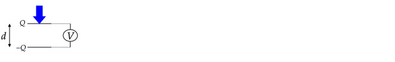
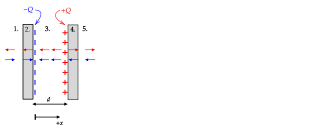

See also 2.5.4 of Griffiths.

# Introduction

Capacitance is a property of any two isolated conductors; conductors are isolated when there can be no flow of charges between them. Capacitance is a quantity that can be used to answer any of these three questions.

1. If I put $+Q$ on one of the conductors and $-Q$ on the other, what will be the difference in electric potential, $\Delta V$, between the conductors?
2. If I put $+Q$ on one of the conductors and $-Q$ on the other, how much energy will it take to move a test charge $q_o$ from one conductor to the other?
3. If I have a battery with an electric potential difference $\Delta V$ between its terminals and I connect each terminal to different conductors, how much charge will appear on the conducting surfaces?

The reason that we can answer these questions is that the amount of charge $Q$ and potential difference $\Delta V$ are related by

$$C=\frac{Q}{|\Delta V|}$$

where $C$ is called capacitance and represents a capacity to hold charge. Said another way, when connected to a 1 $V$ battery, the capacitor that has more capacitance will have more charge appear on each of its conductors.

This italicized $C$ in $C=Q/|\Delta V|$ is different from an un-italicised C, which is the SI abbreviation for a Coulomb. (In E&M, we often run out of symbols and make confusing notation choices; another example is that electric potential is denoted by $V$ and the units of electric potential are V for Volts.)

The SI unit of capacitance is Coulombs/Volt; this ratio is defined to be a Farad (F).

By definition, capacitance is always a positive number.

Various different forms of the equation for capacitance are used, for example $C={Q}/{V}$, $C={Q}/{\Delta V}$, $C={Q}/{|\Delta V|}$, and $C=|Q|/|\Delta V|$. 

* In the equation $C={Q}/{V}$, it is implied that $V$ means the difference in potential between the positively charged conductor and the negatively charged conductor $V \equiv V_{+} - V_{-}$ (as opposed to $V \equiv V_{-} - V_{+}$). In this case, $V$ is positive.

* In the equation $C={Q}/{\Delta V}$, it is implied that $\Delta V \equiv V_{+} - V_{-}$ (as opposed to $\Delta V \equiv V_{-} - V_{+}$). In this case, $\Delta V$ is positive.

* In the equation $C={Q}/{|\Delta V|}$, the absolute value of the potential difference between the conductors is taken. The reason for this is that $V$ and $\Delta V$ alone is ambiguous -- they could mean $V_{+} - V_{-}$ or $V_{-}-V_{+}$. With the absolute value, it does not matter which is used -- the computed capacitance will be the same.

# Common Capacitors

The only ingredients needed to form a capacitor are two isolated conductors. The two conductors do not need to have the same shape and size. Several types of capacitors are shown in the following diagram.

%\begin{center}

%\end{center}

The capacitance of two conductors depends on how far they are separated and their shape (physical dimensions). As an example, the capacitance of the parallel plate capacitor shown in (b.) depends on the plate area and the separation distance $d$. The capacitance of concentric spherical conducting shells shown in (d.) depends on the outer radius of the inner shell and the inner radius of the outer shell.

# Capacitor Applications

* Conversion of mechanical energy an electrical signal

    In the following diagram, when the top charged plated is pressed down, the separation between the plates decreases and the voltmeter registers an increase in the voltage. One can use this configuration to create keys on a computer keyboard (but there are many complications -- for example each keypress will result in a small loss of charge).
    
    

* Conversion of electrical energy to mechanical

    When a capacitor is connected to a battery, the two oppositely charged sides attract each other, and the force of attraction increases as $V$ increases. If a spring is placed between the capacitor plates, it will compress when $V$ is increased. As a result, energy from the battery is converted into mechanical energy -- the spring can be removed in its compressed state and be used to lift a mass.

    
    
* Conversion of electrical energy to thermal energy

   Suppose that you charge a capacitor using a battery. If you disconnect the battery, you will have energy stored in the capacitor.

   If you later connect a resistor between two charged surfaces, current will flow and the wire will heat up. In this case, the electrical energy has been converted into thermal energy (and thermal energy involves the motion of particles, so this is also a form of electrical to mechanical energy conversion).

* Modifying the amplitude of a waveform

  When a voltage source that generates a time--varying potential of $V_o\sin\omega t$ that is connected to a resistor and a capacitor, the voltage amplitude across the capacitor is $V_o$ reduced by a factor that depends on $\omega$.

# Calculating Capacitance

To measure capacitance, place $-Q$ on one conductor and $+Q$ on the other and then measure the potential difference $\Delta V$ between the conductors. The capacitance is then $Q/|\Delta V|$. Alternatively, connect each initially uncharged conductor to the terminals of a battery and then measure the amount of charge that appears on either one of the conductors. By conservation of charge, the amount of charge that appears on one conductor will be equal and opposite to what appears on the other.

In general, computing capacitance requires solving a partial differential equation either analytically or numerically. (Analytical methods are covered in Chapter 3 of Griffiths). The reason is that if we charge up a capacitor, we need to know the electric field that results, and this requires knowledge of how the charges are distributed on the two conductors that form the capacitor. Previously Coulomb's law was used to compute the electric field when the distribution of charges was known. In general, when a net charge is placed on a conductor, their distribution will not be not known, and Coulomb's law cannot be used to find the electric field.

However, there are a few capacitors for which a simple method can be used to compute the capacitance. These capacitors have a geometry such that a symmetry argument and Gauss's law can be used to determine the electric field between the two conductors that form the capacitor. In this case, we can find the potential difference by integrating the electric field from one conductor to the other to find the potential difference $\Delta V$. The capacitance is then $Q/|\Delta V|$.

Gauss's law can be used to find the electric field for certain types of charge distributions such as charges uniformly distributed on a large plane, a long cylindrical shell, and a spherical shell. If these objects are conductors, we can argue that a net charge placed on them will be uniformly distributed on their surface and so Gauss's law can be used to find the electric field.

The general technique for computing capacitance when Gauss's law applies is:

1. Place an equal an opposite amount of charge on the conductors.
2. Use Gauss's law to compute the electric field between the conductors.
3. Use $\Delta V=-\int \mathbf{E}\cdot d\mathbf{l}$ to find the potential difference between the conductors. The integration is along any path that starts on the negatively charged surface and ends on the positively charged surface. Although any path can be used, there will be a path for evaluation of the integral is easy.
4. Compute $C$ using the definition $C = Q/|\Delta V|$.

%In the previous tutorial, $\Delta V$ was computed between points in a region where there was a constant electric field or a region where there was an electric field due to a single charge.

%If there are multiple charges, $\Delta V$ could still be computed by considering the potential due to each charge individually and then summing the results.

%In general, it is difficult to compute the electric field between two charged conductors. To compute the total $\Delta V$, one needs to compute the $\Delta V$ due to each and every charge on the conductors.

%It would seem that to compute $\Delta V$ for the diagram shown, we would need to know the position of the charges on the surface and then find the $\Delta V$ due to each charge and then sum the result.

\newpage

## Example -- Parallel Plates

An equal and opposite amount of charge is placed on two large, conducting, and parallel plates as shown on the left. On the right, a side view of the plates is shown. The area of the plates is $A=w^2$ and $w\gg d$ (this constraint allows us to assume that the charge distribution will be approximately uniform).

%\input{Capacitance/figures/Parallel_Plates_Example}

1\. How will the charges distribute on each of the plates? That is, how much charge is on each of the four faces of area $A=w^2$? Assume that no charge appears on the other (narrow) faces of the plates, which have a much smaller area.

2\. What is the electric field in the five regions?

%3a. How much work would it take to move a charge $q_o$ from the left plate to the right plate (i.e., the distance $d$ shown)? Said another way, what is the difference in electric potential energy, $U_r-U_l$, between the right and left plate?

%3b. How much work does it take to move a charge $q_o$ from the outer face of a plate to the inner face of the same plate? (Hint: What is the electric field inside of the plates?)

3a. What is the electric potential difference, $V(d)-V(0)$, between the left and right plate?

3b. What is the difference in electric potential between the inner and outer faces of one of the plates?

4a. Write the capacitance in terms of $\epsilon_o$, $A$, and $d$.

4b. Explain why the thickness of the plates does not appear in the equation for capacitance.

5\. Plot $E(x)$ and $V(x)$. Use $V(0)=0$.

----

**Answer**

1\. All of the negative charges will spread themselves out over the right face of the left plate. All of the positive charges will spread themselves out over the left face of the right plate. This configuration produces zero electric field inside both conductors as expected by Gauss's Law. Any other configuration of charges will lead to a non-zero electric field inside the conductors.

The right face will have a charge density of $\sigma=Q/A$ and the left face will have $-Q/A=-\sigma$.

%\input{Capacitance/figures/Parallel_Plates_Example_Answer}

2\. Each of the inner faces looks like a large sheet of charge. The electric field due to a sheet of charge has a magnitude of $\sigma/2\epsilon_o$. (You can show this using Gauss's Law.) The direction of the electric field due to the charges on each plate for each region is shown in the diagram. In all regions except for 3., the total field is zero, so $\mathbf{E}_1=\mathbf{E}_2=\mathbf{E}_4=\mathbf{E}_5=0$. The total electric field between the plates is to the left and is twice the field from a single large sheet of charge:

$\displaystyle\mathbf{E}_3=-\frac{\sigma}{2\epsilon_0}\xhat-\frac{\sigma}{2\epsilon_0}\xhat=-\frac{\sigma}{\epsilon_0}\xhat=-\frac{Q}{A\epsilon_o}\xhat$

%3a. How much work would it take to move a charge $q_o$ from the left plate to the right plate (i.e., the distance $d$ shown)? Said another way, what is the difference in electric potential energy, $U_r-U_l$, between the right and left plate?

%From the previous tutorial, the work required to move a charge in a constant electric field is $W=\pm |\mathbf{F}|L$. The magnitude of the force on a test charge between the plates is $q_oE$. The force on the test charge is to the left and so it will take positive work to move it to the right. The work is then:

%$$W=+q_oEd=\frac{q_oQd}{A\epsilon_o}$$

%The change in potential energy due to this move is the same as the work required for the move.

%$$U_r-U_l=\frac{q_oQd}{A\epsilon_o}$$

%3b. How much work does it take to move a charge $q_o$ from the outer face of a plate to the inner face of the same plate? (Hint: What is the electric field inside of the plates?)

%The electric field inside of the conductors is zero, so no work is required to move a charge inside of it.

3a. What is the electric potential difference, $V(d)-V(0)$, between the left and right plate?

To compute $V$ in the middle region, start with

$\displaystyle V(x)=V(0) - \int_0^x \mathbf{E}\bfcdot d\mathbf{l}$ 

With $d\mathbf{l}=dx'\xhat$ and $\mathbf{E}=-(Q/A\epsilon_o)\xhat$, this is

$\displaystyle V(x)= V(0) - \int_0^x -(Q/A\epsilon_o)dx'$

Integration gives $\displaystyle V(x)-V(0)=\frac{Q}{A\epsilon_o}x$.

This potential increases with $x$, which is expected from the diagram -- the electric field is in the opposite direction of movement when moving in the direction of increasing $x$ in region 3.

Plugging in $x=d$ gives

$\displaystyle V(d)-V(0)=\frac{Q}{A\epsilon_o}d$.

3b. What is the difference in electric potential between the inner and outer faces of one of the plates?

Zero because the electric field is zero inside of the plates. Although the potential difference is zero, the potential inside of the plates may be non--zero. For example, if $V(0)=0$, the potential of the right plate, $V(d)$, is $\frac{Q}{A\epsilon_o}d$.

4\. Write the capacitance in terms of $\epsilon_o$, $A$, and $d$.

The potential difference found in 3a is $\displaystyle\Delta V = \frac{Qd}{A\epsilon_o}$. Plugging this into the equation for capacitance gives

$\displaystyle C=\frac{Q}{|\Delta V|} = \frac{A\epsilon_o}{d}$.

As expected, the capacitance only depends on the geometry of the conductors (via the area $A$ in this case) and the separation distance $d$.

5\. Plot $E(x)$ and $V(x)$. Use $V(0)=0$.

To help draw the plot, I've added a diagram showing the direction and magnitude of the electric field in all regions. 

## Problem -- Spherical Capacitor

Charge is uniformly distributed on two concentric spherical conducting shells, the cross-section of which is shown. Both shells have a thickness of $t$. The inner shell has an outer radius of $a$ and net charge of $-Q$. The outer shell has an inner radius of $b$ and a net charge of $+Q$. 

1a. Use Gauss's law to show that there can be no charge on the inner surface of the inner conductor. 

1b. Use Gauss's law to show that the charge on the inner surface of the outer conductor is $+Q$. 

2\. What is the electric field in each of the 5 labeled regions? Region $1.$ is the empty volume inside of the inner conductor, region $2.$ is the volume of the inner conductor, region $3.$ is the empty volume between the conductors, region $4.$ is the volume of the outer conductor, and region $5.$ is the region outside of the outer conductor.

%3\. How much work will it take to move a charge $q_o$ from the outer surface of the inner shell to the inner surface of the outer shell? Said another way, what is the difference in potential energy, $PE_b-PE_a$, for this charge?

3\. What is the potential difference, $V(b)-V(a)$?

4\. Write the capacitance in terms of $\epsilon_o$, $a$, and $b$.

% In the future, remove Q from diagram as some thought it meant +Q was on outer part of outer shell.

**Answer**:

A common error was assuming that $+Q$ was on the outer surface of the outer conductor because of the position of the label on the diagram. As will be shown, this is not possible.

The system is invariant with respect to rotation about any axis. As a result, the charge density on any surface must be uniform and any field must be radial. Any electric field must also be invariant with respect to rotation about any axis.

1a. A Gaussian sphere centered on the origin with a radius $a-t\lt r\lt a$ will have $E=0$ on its surface because its surface is inside a conductor. In this case, $\Phi_E=0$. Thus, $Q_{encl}=0$. All of the charges on the inner conductor must be on its surface, so $Q$ at $r=a-t$ must be zero. As a result, all of the net $-Q$ on the inner conductor must be on its outer surface.

1b. A Gaussian sphere centered on the origin with radius $b \lt r\lt b+t$ will have no charge enclosed, so $\Phi_E=0$. Because the field is radial, the flux integral simplifies to $\Phi_E=E_r 4\pi r^2$. Thus, $\Phi_E=0$ implies that $E_r=0$ and so $Q_{encl}=0$. The total charge enclosed is the charge on the inner conductor and the charge on the inner surface of the outer is $Q_{encl}=0=-Q + q(r=b)$. From this it follows that the charge on the inner surface of the outer conductor is $+Q$.

2.

Region 1: A Gaussian sphere centered on the origin with radius $0 \lt r\lt a-t$ will have no charge enclosed, so $\Phi_E=0$. Because the field is radial, the flux integral simplifies to $\Phi_E=E_r 4\pi r^2$. Thus, $\Phi_E=0$ implies that $E_r=0$.for $r\ne 0$. At $r=0$, $E_r$ must be zero because if it were non-zero, it would not be invariant with respect to rotation about any axis. From this it follows that $\mathbf{E}=0$.

A common error was to state that because no charge is enclosed, $\mathbf{E}$. This statement is not true in general. A Gaussian sphere with a point charge outside of it will have no charge enclosed, but $\mathbf{E}$ is not zero everywhere on the Gaussian surface.

Region 2: Zero because inside a conductor.

Region 3: Due to the symmetry argument, the flux integal similifies to $\Phi_E=E_r4\pi r^2$. The enclosed charge is $-Q$, so $E_r=-Q/4\pi \epsilon_o r^2$ and $\mathbf{E}=-Q\hat{\mathbf{r}}/4\pi \epsilon_o r^2$ because the symmetry argument tells use that $\mathbf{E}$ may only have a radial component.

Region 4: Zero because inside a conductor.

Region 5: $Q_{encl}=0$ and the flux integral simplifies to $E_r4\pi r^2$ due to the symmetry arguments. From this it follows that $E_r=0$ and $\mathbf{E}=0$.

3.

In general,

$\displaystyle V(r)=V(a)-\int_a^r \mathbf{E}\bfcdot d\mathbf{l}$

If we choose $d\mathbf{l}=dr'\hat{\mathbf{r}}$, then

$\displaystyle V(r)=V(a)+\frac{Q}{4\pi}\int_a^r \frac{1}{r'^2}dr'$

and

$\displaystyle V(r)=V(a)+\frac{Q}{4\pi\epsilon_o}\left(\frac{1}{a}-\frac{1}{r}\right)$

When $r=b$, we have

$\displaystyle V(b)-V(a)=\frac{Q}{4\pi\epsilon_o}\left(\frac{1}{a}-\frac{1}{b}\right)$

Note that $V(b)-V(a)$ is positive, which is expected because moving from $a$ to $b$ we are moving against the direction of $\mathbf{E}$.

4.

In this problem, we put a charge of $\pm Q$ on the capacitor surfaces and a potential difference of $V(b)-V(a)$ was the result. Thus,

$\displaystyle C=\frac{Q}{V(b)-V(a)} = \frac{4\pi\epsilon_o}{\frac{1}{a}-\frac{1}{b}}$

----

In preparation for the next problem, note that using this equation, we can re--write

$\displaystyle V(r)=V(a)+\frac{Q}{4\pi\epsilon_o}\left(\frac{1}{a}-\frac{1}{r}\right)$

as

$\displaystyle V(r)=V(a)+\frac{V(b)-V(a)}{\frac{1}{a}-\frac{1}{b}}\left(\frac{1}{a}-\frac{1}{r}\right)$

As a check of the algebra, plugging in $r=a$ gives $V(a)$ and $r=b$ gives $V(b)$.

If we choose to define $V(b)=V_o$ and $V(a)=0$, we have

$\displaystyle V(r)=\frac{V_o}{\frac{1}{a}-\frac{1}{b}}\left(\frac{1}{a}-\frac{1}{r}\right)$

which will be useful for checking the answer in the next problem.

%## Problem

%Charge is uniformly distributed on two concentric spherical conducting shells, the cross-section of which is shown. Both shells have a thickness of $t$. The inner shell has an outer radius of $a$. The outer shell has an inner radius of $b$.

%

%1a. Use Gauss's law to show that there can be no charge on the inner surface of the inner conductor. 

%1b. Use Gauss's law to show that the charge on the inner surface of the outer conductor is $+Q$. 

%2\. What is the electric field in each of the 5 labeled regions? Region $1.$ is the empty volume inside of the inner conductor, region $2.$ is the volume of the inner conductor, region $3.$ is the empty volume between the conductors, region $4.$ is the volume of the outer conductor, and region $5.$ is the region outside of the outer conductor.

%3\. How much work will it take to move a charge $q_o$ from the outer surface of the inner shell to the inner surface of the outer shell? Said another way, what is the difference in potential energy, $PE_b-PE_a$, for this charge?

%4\. What is the potential difference, $V_{b}-V_{a}$?

%5\. Write the capacitance in terms of $\epsilon_o$, $a$, and $b$.

%1a. {\bf Answer}: Consider a Gaussian sphere with the same center as the shells and a radius between \(a-t\) and \(a\) (i.e., inside the inner conductor). The electric field at any point on the Gaussian sphere will be zero because the surface is inside a conductor. From Gauss's law, it follows that the charge enclosed by the Gaussian sphere is zero. Because it is a conductor, the charges on the inner shell must be on either its inner surface or its outer surface; as a result, the total enclosed charge for this Gaussian sphere (which must be zero from Gauss's law) is the charge on the inner surface, so the charge on the inner surface must be zero. From this we can conclude that all of the $-Q$ on the inner shell resides on its outer surface. (You did a problem similar to this on another tutorial - the difference was that there was a point charge at the center of the shell; in that problem, there was charge on the inside surface of the shell.)

%1b. {\bf Answer}: A Gaussian sphere with the same center as the shells and a radius between \(b\) and \(b+t\) (i.e., inside the outer conductor) will have an electric field of zero everywhere on its surface. From Gauss's law, it follows that the charge enclosed by this surface is zero. We know that $-Q$ is enclosed by this surface -- this is the net charge on the inner shell. The other enclosed charge is the charge on the inner surface of the outer shell. The charge on this surface has to be $+Q$ for the net enclosed charge to be zero and for Gauss's law to be satisfied.

%1c. {\bf Answer}: In 1b., it was established that $+Q$ must be on the inner surface of the outer conductor. If the outer conductor has a net charge of $+Q$, then all of the charge is on the inner surface and the charge on the outer surface must be zero.

%2. {\bf Answer}: Regions 2. and 4. are inside of a conductor, so the electric field must be zero. To find the electric field in the other region, consider an equivalent problem. A charge of $-Q$ is uniformly distributed on the surface of a sphere of radius $a$ and a charge of $+Q$ is uniformly distributed on the surface of a sphere of radius $b$. 

%In the previous tutorial, Gauss's law was used to show that (1) outside a uniformly charged spherical surface, the field is the same as if all of the charge was at the origin and (2) inside the surface, the field is zero. 

%Based on (2), we can conclude that the field in Region 1. is zero. 

%Region 3. is inside of the outer shell, so the field due to the charges on the outer shell is zero because of (2). In Region 3., the field due to the -Q charge on the inner shell is inwards with a magnitude of $kQ/r^2$, which follows from (1). 

%In Region 5., the field due to the inner shell is equal and opposite to the field due to the outer shell (the field is that of two equal and opposite charges at the origin). As a result, the field in Region 5. is zero.

%4. {\bf Answer}: The electric field in region 3. is inwards with a magnitude of $kQ/r^2$. This is equivalent to the electric field due to $-Q$ at the origin. From the previous tutorial, the change in potential energy of a test charge $q_o$ when it is moved a radius of $a$ to $b$ when there is a charge $q$ at the origin is

%$$U_b-U_a=kqq_o\left(\frac{1}{b}-\frac{1}{a}\right)$$

%In this problem, the charge at the origin is $-Q$, so

%$$U_b-U_a=-kQq_o\left(\frac{1}{b}-\frac{1}{a}\right)$$

%Note that moving a positive charge in this direction corresponds to an increase in its potential energy (this is equivalent to moving a positive charge away from a negative charge at the origin). This is consistent with the equation above, which is positive ($a<b$, so the term in parenthesis is negative making the right-hand side positive).

%5. {\bf Answer}:

%$$V_{b}-V_{a} = \frac{U_{b}-U_{a}}{q_o} = -kQ\left(\frac{1}{b}-\frac{1}{a}\right)= kQ\left(\frac{1}{a}-\frac{1}{b}\right)$$

%5. {\bf Answer}:

%$$C = \frac{Q}{|\Delta V|} = \frac{Q}{kQ(\frac{1}{a}-\frac{1}{b})}=\frac{1}{k}\frac{1}{\frac{1}{a}-\frac{1}{b}}=\frac{4\pi\epsilon_o}{\frac{1}{a}-\frac{1}{b}}$$
