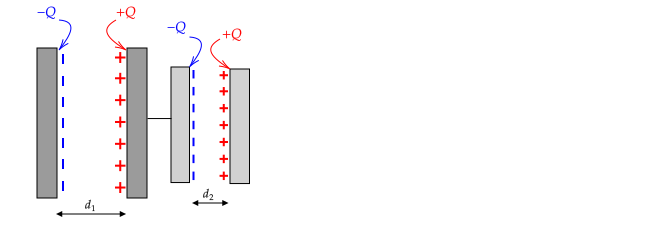
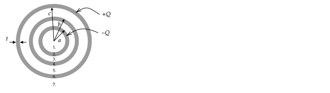
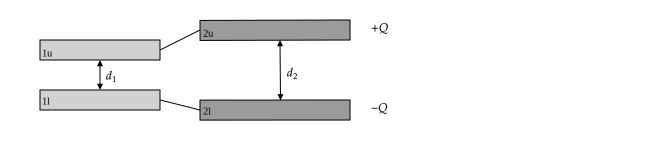

# Combinations of Capacitors

In this section, justifications are given for the equations

$$\frac{1}{C_{eq}} = \frac{1}{C_1}+\frac{1}{C_2}\quad\quad \text{capacitors in series}$$

and

$$C_{eq}=C_1+C_2\quad\quad\text{capacitors in parallel}$$

used to compute the equivalent capacitance for capacitors.

## Capacitors in Series

So far we have only considered single capacitors. Here we consider two capacitors which are comprised of a total of four conductors. If two of the conductors are touching or connected via a wire as shown in the diagram, the capacitors are considered to be in series. The touching capacitors can be made to touch either by physically touching the conductors or by connecting them with a conducting wire which has the same effect.

\begin{tcolorbox}[enhanced,breakable,parbox=false,colframe=blue!50!blue,colback=white,title=Example 3.1,height fill]

Four conducting plates are configured as shown. The surface area of the two plates on the left is $A_1$ and the area for the two plates on the right is $A_2$.

All of the conductors initially have a net charge of zero, and then charges are placed on the two outer conducting plates as shown in the diagram.

1. In order for the electric field to be zero inside of the inner two conductors, what charges need to be spread over the surfaces of the two inner plates? (There are a total of four surfaces -- two with area $A_1$ and two with area $A_2$)?

{\bf Answer:} The charges will distribute as shown in the following diagram. The net charge on the inner two conductors is zero -- because of conservation of charge you cannot have a net charge if you have not placed any charge on those plates. In response to the electric field that forms when charges are placed on the outer two conductors, the charges move to make the net electric field inside of all of the conductors zero. 

2. What is the electric field in all of the regions of space?

{\bf Answer:} If you look at the superposition of the electric fields from the positive and negative plates for each conductor (remember that for a sheet the field is not dependent on distance), they will cancel outside of the conductors as described in Example 2.1. In the configuration shown, the electric field outside of the region spanned by $d_1$ is zero due to the charges on the left two conductors; the charges on the right two conductors create a zero electric field outside of the region spanned by $d_2$.

In the region spanned by $d_1$, the electric field is due to only to the surfaces labeled 1. and 2. As described in Example 2.1, this field is $\mathbf{E}=-(Q/\epsilon_o A) \ihat$. 

Similarly, the electric field in the region spanned by $d_2$ is $\mathbf{E}=-(Q/\epsilon_o A ) \ihat$ and is only due to the charges on surfaces 3. and 4. In all other regions, the electric field is zero.

3. How much work is required to move a charge $q_o$ from surface 1. to surface 4.?

{\bf Answer:} To move from surface 1. to 2. takes $W=+q_oEd={q_oQd_1}/{A_1\epsilon_o}$ (draw the field lines and make sure that the $+$ makes sense). To move from surface 2. to 3. takes no work because the electric field is zero inside of a conductor. To move from surface 3. to 4. takes $W=+q_oEd={q_oQd_2}/{A_2\epsilon_o}$. The total work is:

$$W=\frac{q_oQd_1}{A_1\epsilon_o}+\frac{q_oQd_2}{A_2\epsilon_o}$$

4. What is the difference in potential energy of the charge $q_o$ between surface 1. and 4.?

{\bf Answer:} The difference in potential energy is the same as the amount of work required to move a charge from surface 1. to 4:

$$U_4-U_1=\frac{q_oQd_1}{A_1\epsilon_o}+\frac{q_oQd_2}{A_2\epsilon_o}$$

5. What is the difference in potential between surface 1. and 4.?

{\bf Answer:} $$V_4-V_1=\frac{U_4-U_1}{q_o}=\frac{Qd_1}{A_1\epsilon_o}+\frac{Qd_2}{A_2\epsilon_o}$$

6. The capacitance of this configuration is the amount of charge placed on the outer surfaces divided by the potential difference between the outer surfaces. What is this capacitance?

{\bf Answer:} 

$$C = \frac{Q}{|V_4-V_1|} = \frac{Q}{\frac{Qd_1}{A_1\epsilon_o}+\frac{Qd_2}{A_2\epsilon_o}}=\frac{1}{\frac{d_1}{A_1\epsilon_o}+\frac{d_2}{A_2\epsilon_o}}$$

We have derived the formula for how capacitors add in series. To see this, invert the previous formula

$$\frac{1}{C} = \frac{d_1}{A_1\epsilon_o}+\frac{d_2}{A_2\epsilon_o} = \frac{1}{C_1}+\frac{1}{C_2}$$ 

where $C_1={A_1\epsilon_o}/{d_1}$ and $C_2={A_1\epsilon_o}/{d_1}$.

\end{tcolorbox}

\newpage

### Problem

\begin{tcolorbox}[enhanced,breakable,parbox=false,colframe=black!50!black,colback=white,title=Problem 3.1,height fill]

The cross-section of three conducting shells is shown in the following diagram. All shells have a thickness $t$. The inner shell has an outer radius of $a$. The middle shell has an outer radius of $b$. The outer shell has an inner radius of $c$.

All of the shells are initially uncharged. A charge of $-Q$ is placed on the inner shell and a charge of $+Q$ is placed on the outer shell.

%\input{Capacitance/figures/Spherical_Series}

1. In order for the electric field to be zero inside all of the conductors, how will the charges distribute on the six conducting surfaces (each shell has an inner and outer surface)?

\ifsolutions
{\bf Answer}:

Inner-most shell: Inner surface has no charge; Outer surface has $-Q$.

Middle shell: Inner surface has $+Q$; Outer surface has $-Q$.

Outer shell: Inner surface has $+Q$; Outer surface has zero.
\else
\vspace{2cm}
\fi

2. What will the electric field be in each of the 7 regions shown?

\ifsolutions
{\bf Answer}:

$\mathbf{E}=0$ in Regions 2., 4., and 6. (inside conductor).

$\mathbf{E}=-kQ\hat{\mathbf{r}}/r^2$ in Region 3. 

$\mathbf{E}=-kQ\hat{\mathbf{r}}/r^2$ in Region 5. 

$\mathbf{E}=0$ in Region 7.
\else
\vspace{2cm}
\fi

3. What is the difference in potential $V_c-V_a$?

\ifsolutions
{\bf Answer}:

There is a change in potential when going from a radius of $a$ to a radius of $b-t$ of $V_{b-t}-V_a$. Moving from $b-t$ to $b$, there is no change in potential (a conductor is an equipotential). There is a change in potential in going from $b$ to $c$ of $V_c-V_b$.

$$V_c-V_a=(V_c-V_b) + (V_{b-t}-V_a)$$

In Regions 3. and 5. the electric field is the same as if a charge $-Q$ was at the origin.

$$V_c-V_b=-kQ\left(\frac{1}{c}-\frac{1}{b}\right)$$

$$V_{b-t}-V_a=-kQ\left(\frac{1}{b-t}-\frac{1}{a}\right)$$

$$V_c-V_a=(V_c-V_b) + (V_{b-t}-V_a)=-kQ\left(\frac{1}{c}-\frac{1}{b}\right)-kQ\left(\frac{1}{b-t}-\frac{1}{a}\right)$$
\else
\vspace{2cm}
\fi

4. What is the capacitance of this configuration?

\ifsolutions
{\bf Answer}:

$$C=\frac{Q}{|\Delta V|} = \frac{4\pi\epsilon_o}{\left(\frac{1}{b}-\frac{1}{c}\right)+\left(\frac{1}{a}-\frac{1}{b-t}\right)}$$

Notice that this answer is what you would get if you added the capacitance of two capacitors in series -- one capacitor has an inner shell at $a$ and an outer shell at $b-t$. Another capacitor has an inner shell at $b$ and an outer shell at $c$. The equivalent capacitance for two capacitors in series is found using the sum of the inverses:

$$\frac{1}{C_{eq}} = \frac{1}{C_{inner}} + \frac{1}{C_{outer}}$$

From earlier, the capacitance of two shells is

$$C=\frac{4\pi\epsilon_o}{\frac{1}{r_i}-\frac{1}{r_o}}$$

where $r_o$ and $r_i$ are the inner and outer radius, respectively. Thus,

$$C_{outer} = \frac{4\pi\epsilon_o}{\frac{1}{b}-\frac{1}{c}}$$

$$C_{inner} = \frac{4\pi\epsilon_o}{\frac{1}{a}-\frac{1}{b-t}}$$

Plugging these two equations into ${1}/{C_{eq}} = {1}/{C_{inner}} + {1}/{C_{outer}}$ and solving for $C_{eq}$ will give the same answer stated at the start of the answer to this problem.
\else
\vspace{2cm}
\fi

\end{tcolorbox}

## Capacitors in Parallel

Capacitors are said to be in parallel when each conductor in a single capacitor touches directly, or via a wire, another conductor on another capacitor.

### Example

In the following diagram, two parallel plate capacitors are connected by a wire as shown. The conductors are initially uncharged and then $-Q$ is placed on the lower-right conductor and $+Q$ is placed on the upper-right conductor.

As in the previous example, all of the charges will spread out over the inside faces of the plates. In this case, the charge $Q$ will be split and some charge will appear on the inner face of the upper left conductor ($1u$) and the rest on the inner face on the top right conductor ($2u$). In equation form, this statement is

$$Q=q_{1u}+q_{2u}$$

It can be shown from Gauss's law that $q_{1l} = -q_{1u}$ and $q_{2u} = -q_{2u}$.

Because the two conductors on the top are at the same potential and the two conductors on the bottom are at the same potential (why?), the potential differences between the upper and lower plates of the capacitors must be the same: 

$$\Delta V_1=\Delta V_2$$

For the full system:

$$Q = C \Delta V$$

For each of the capacitors, $C_1 = q_1/\Delta V_1$ and $C_2 = q_2/\Delta V_2$. These can be re-written as $q_1 = C_1 \Delta V_1$ and $q_2 = C_2 \Delta V_2$. Plugging these equations into $Q = q_1 + q_2$ gives

$$C\Delta V = Q = q_1 + q_2 = C_1 \Delta V_1 + C_2 \Delta V_2$$

Because $\Delta V=\Delta V_1=\Delta V_2$, we conclude that the net capacitance of this configuration is

$$C = C_1 + C_2$$

which is expected because the capacitors are connected in parallel.

\newpage

### Problem

\includegraphics[scale=0.3]{Capacitance/Q24.17_fig.png}

1a. Which of the plates in the $C_1$, $C_2$, $C_3$ group are at the same potential? How do those potentials relate to the potentials $V_a$ and $V_d$?

\ifsolutions
{\bf Answer}: The left plate of $C_1$ is at the same potential as the left plate of $C_3$. These plates have a potential of $V_a$. The right plate of $C_2$ is at the same potential as the right plate of $C_3$. These plates have a potential of $V_d$.
\else
\vspace{1.7 cm}
\fi

2. What is the charge on the right-hand plate of $C_1$ relative to the left-hand plate of $C_2$? Why?

\ifsolutions
{\bf Answer}: They are equal and opposite. If the capacitors were initially uncharged and a battery is connected to $a$ and $d$, charge will appear on both of the surfaces mentioned; by conservation of charge, the sum of the charges on both surfaces must be zero, so the charge on each surface must be equal and opposite.
\else
\vspace{1.7 cm}
\fi

3. Which of the capacitors in this network are in series and which are in parallel? Explain how you know. 
\ifsolutions

%In the following diagram, the reduction steps used in this paragraph are shown. In the first step, capacitor $C_4$ was moved to make the circuit look a bit more familiar.

%\begin{center}
%\includegraphics[width=0.75\textwidth]{Capacitance/figures/Problem_4_1_Solution.jpg}
%\end{center}

{\bf Answer}: $C_1$ and $C_2$ are in series. They are connected and the charge on their surfaces are equal in magnitude. 

There are no other {\it individual} capacitors that are in series or parallel. However, if the capacitors $C_1$ and $C_2$ are replaced with a capacitor having capacitance $C_{12}$ found using 

$1/C_{12}=1/C_1+1/C_2,$

then $C_{12}$ is in parallel with $C_3$. The combination of $C_{12}$ and $C_3$ is equivalent to a capacitor $C_{123}$ with a capacitance computed by adding $C_{12}$ and $C_{3}$ in parallel: 

$C_{123} = C_{12} + C_{3}.$

The capacitor $C_{123}$ is in series with $C_{4}$. Thus, 

$1/C_{1234}=1/C_{123}+1/C_4.$

\else
\vspace {1.7cm}
\fi

4. If each of the capacitors has the same capacitance, $C = 4.00~\mu$F, and  $V_a$ - $V_b = +28.0$ V, what is the potential across each of the capacitors? Justify your answers. 

\ifsolutions
{\bf Answer}: 

Using $C_1=C_2=C_3=C_4=C$, the equations from the answer to question 3. give

1/C_{12}=1/C_1+1/C_2\quad\Rightarrow\quad C_{12}=\frac{C}{2}$

$C_{123} = C_{12} + C_{3}=\frac{C}{2}+C\quad\Rightarrow\quad C_{123}=\frac{3}{2}C$

$1/C_{1234}=1/C_{123}+1/C_4=\frac{1}{\frac{3}{2}C}+\frac{1}{C}\quad\Rightarrow\quad C_{1234}=\frac{3}{5}C$

The charge on the surfaces of the equivalent capacitor is found using:

%$Q_{1234} = C_{1234}(V_d-V_a)$
$Q_{1234} = C_{1234}(V_b-V_a) = (3/5)(4\muF) \times (28V) = 67.2 \muC$
    
This is the charge on capacitor 4 so:

$V_4 = Q_{1234}/C_4 = 67.2 \muC/4\muF = 16.8$V

The voltage drop across $V_{123}$ is 28V - 16.8V = 11.2V. Since capacitor 3 is in parallel with capacitors 1 and 2, $V_3 = 11.2$V which is also the potential across $C_{12}$. 

$C_{12} = C/2 = Q_{12}/V_{123} \Rightarrow Q_{12} = 22.4 \muC$

$V_1 = V_2 = Q_{12}/C = 5.6$V
%This equation has two unknowns, the charge and the potential difference.

%In the last diagram below of the figure above, the capacitor $C_{1234}$ is split back into $C_{123}$ and $C_4$ in series. Because they are in series, the magnitude of the charge on each surface is still $Q_{1234}$. The given potential difference applies to the capacitor on the left, $C_{123}$: 

%$V_b-V_a=Q_{1234}/C_{123}$

%Solving for $Q_{1234}$ gives

%$Q_{1234}=(V_b-V_a)C_{123} = 28\left(\frac{3}{5}C\right)$

%This value of $Q_{1234}$ can be used to find $V_d-V_b$ using 

%$Q_{1234} = C_{4}(V_d-V_b)$

%Solving for $V_d-V_b$ gives

%$V_d-V_b=\frac{Q_{1234}}{C_{4}}=\frac{28\left(\frac{3}{5}C\right)}{C}= 28\left(\frac{3}{5}\right)~\mbox{V}$

%which is the potential across $C_4$. This equation along with the given $V_b-V_a$ can be used to answer the following question.

%The potential across $C_3$ is $V_b-V_a$, which was given.

%The potential across $C_{12}$ is also $V_b-V_a$. The potential across $C_1$ added to the potential across $C_2$ must be equal to $V_b-V_a$. To find these potentials, we first need to find the charge on $C_{12}$.

%$Q_{12}=C_{12}(V_b-V_a)=\frac{C}{2}28$

%$Q_{12}$ can be used to compute the potential across each of $C_1$ and $C_2$. Both capacitors will have a charge of $Q_{12}$ on them because they are in series.

%$V_1=Q_{12}/C_1=(\frac{C}{2}28)/C=14~\mbox{V}$

%$V_2=Q_{12}/C_2=14~\mbox{V}$

%The fact that $V_1=V_2$ is expected because $C_1=C_2$.

%The potential across $C_3$ is $V_b-V_a$, which was given.

%$V_3=V_b-V_a=28~\mbox{V}$

%The potential across $C_4$ is $V_d-V_b$, which was found earlier:

%$V_4=V_d-V_b=\frac{Q_{1234}}{C_{4}}=28\frac{3}{5}~\mbox{V}$

%The fact that the potential across the three capacitors on the left is larger than that across $C_4$ is consistent with the fact that the equivalent capacitance of the three capacitors on the left, $C_{123}=3C/2$, is larger than that of $C_4=C$.
\else
\vspace {1.7cm}
\fi

5. What is $V_d$ - $V_a$? What is $V_b - V_d$? Explain. 

%$$V_d-V_a = (V_d-V_b) + (V_b-V_a)=V_3+V_4=28\left(\frac{3}{5}+1\right)=28\frac{8}{5}~\mbox{V}$$

$V_d-V_a = V_{123} = 11.2$V as shown above.

$V_b - V_d = V_4 = 16.8$V as shown above.

%The first term in parenthesis was computed in part 4. The second term was given as $28$~V. This equation states that the potential across the capacitors between $a$ and $b$ added to the potential across $C_4$ is the total potential difference across the capacitor network.

## Assumptions for $C_{eq}$ Formulas

It is important to note that these equations assume that the electric field created by the charges on $C_1$ do not affect the distribution of charges on $C_2$. If this is not the case, there will be additional "cross-coupling" term in the equations for $C_{eq}$. To see why additional term are needed in the equations, consider the following two capacitors separated by small and large disances.

In the case on the left, the electric field created by the charges on $C_1$ is small at the location of $C_2$. As a result, the assumption that the charge distribution on $C_2$ is still valid. In the case on the left, the charges on $C_1$ cause the charges on $C_2$ to no longer be uniforimly distributed, and vice-versa. As a result, the assumptions used to compute $C_1$ and $C_2$ are no longer valid. In order to compute the capacitance for this case, one would need to compute six capacitances, one for each pair of conductors. Using $u$ for the upper and $l$ for the lower plates, the pairs are

1. $C_{1u}$ and $C_{1l}$
2. $C_{2u}$ and $C_{2l}$
3. $C_{1u}$ and $C_{2u}$
4. $C_{1u}$ and $C_{2l}$
4. $C_{1l}$ and $C_{2u}$
6. $C_{1l}$ and $C_{2l}$

In general, capacitance decreases with the separation distance between conductors. As the distance between $C_1$ and $C_2$ increases, the extra capacitances 3.-6. decrease.

In the following, as in most circuit applications considered at the introductory level, we will assume that the capacitors are far enough apart that the two formulas for $C_{eq}$ given above apply.

= Capacitors =

See also
* Khan Academy [https://www.youtube.com/watch?v=rkntp3_cZl4 Overview]
* Section 5.1-5.2 of [http://web.mit.edu/viz/EM/visualizations/coursenotes/modules/guide05.pdf]

== Overview ==

When two conductors are held at a potential difference, an amount of charge \(\pm Q\) will appear on their surfaces. The capacity of the conductors is defined as the ratio of the amount of charge that appears given the potential difference:

$$C=Q/|\Delta V|$$

It can be thought of in terms of an efficiency - how much charge you get out given a potential difference input.

The capacitance depends on the geometry of the system and has units of \(\epsilon_o\) times a length scale.

The "self-capacitance" of a conductor is the capacitance computed when one conductor is an infinite distance away (and assumed to be a sphere with infinite radius).

== Series and parallel ==

== Calculating ==

There are two general techniques for computing capacitance.
1. Assume charges of \(\pm Q\) on conductors, compute \(\mathbf{E}\) using Gauss' Law and then use \(V=-\int \mathbf{E}\cdot d\mathbf{l}\) to compute potential difference. If the geometry does not allow straightforward use of Gauss' Law, use
2. The boundary value method. Assume a potential difference between the conductors, solve Laplace's Equation to get the electric field between the conductors, and use the electric field to compute the surface charge density on the conductors. From the surface charge density, compute the total charge on one of the conductors.

Typically, definition of capacitance is given as

$$C=Q/V$$

where \(V\) is understood to be a potential difference. Using this equation often leads to a nonsensical negative capacitance depending on how the potential difference is computed (\V_1-V_2\) or \(V_2-V_1\).

$$C=Q/|\Delta V|$$

is a better formula as it ensures \(C\) will never be negative. For the capacitance between two conductors, this equation will give a positive capacitance independent of the sign of the potential difference.

A better definition, which will be needed when more than two conductors are involved, is

$$C=Q/(V_{+Q}-V_{-Q})$$

where \(V_{+Q}\) is the surface that is positively charged.

## Problems

### Capacitors in Series

When two capacitors are connected in series to a battery, each capacitor plate ends up with an equal amount of charge on it even if their capacitances differ.  Explain why this is.

{| class="wikitable collapsible collapsed"
! align="left" |&nbsp;Answer
|-
|
Two capacitors in series look like this: <code>------| |----| |-------</code>, where the dashed lines are wires. Every charge removed from one of the outer plates ends up on the other outer plate (charges cannot jump the gap between capacitor plates). The inner plates are connected by a wire and so every charge that leaves one of the inner plates must end up on the other inner plate.
|}

### Capacitors in Series

Two capacitors with surface areas \(A_1\) and \(A_2\) and separation distances of \(d_1\) and \(d_2\) are placed in series.

What is the capacitance of the combined capacitors?  Treat the surfaces of the plates as infinite. Justify any equations used.

### Capacitors in Parallel

Two capacitors with surface areas \(A_1\) and \(A_2\) and separation distances of \(d_1\) and \(d_2\) are placed in parallel.

What is the capacitance of the combined capacitors?  Treat the surfaces of the plates as infinite. Justify any equations used.

### Disconnecting Capacitors

Suppose that a capacitor with capacitance \(C\) is connected to a battery with potential \(V_o\).  It is then disconnected (such that the plates remain fully charged) and connected to a battery with potential \(2V_o\).  In terms of \(V_o\) and \(C\), what is
1. the capacitance and
2. amount of charge on the capacitor when it is connected to the \(2V_o\) battery?

{| class="wikitable collapsible collapsed"
! align="left" |&nbsp;Answer
|-
|
1. \(C\). The capacitance does not change. It depends on the area and separation distance of the capacitor plates.
2. \(Q=C2V_o\). Note that the second battery needed to do less work to fully charge the capacitor than it would have if the capacitor was initially uncharged.
|}

### Plates

Two large conducting plates of area \(A\) are separated by a distance \(d\). Assume \(d/\sqrt{A}\ll 1\). 

1. Estimate the capacitance
2. Explain what the approximation \(d/\sqrt{A}\ll 1\) allowed you to assume

{| class="wikitable collapsible collapsed"
! align="left" |&nbsp;Hing
|-
|
\(C=\epsilon_o A/d\).
|}

### Cylindrical

Two infinitely long conducting hollow cylinders of radius \(a\) and \(b\) (\(a<b\)) are oriented along the \(z\)-axis.

1. Compute their capacitance per unit length.
2. Show that when \((b-a)/a\) is small, the capacitance per unit length, \(C/l\) is the same as at of two infinite conducting plates with \(A=2\pi a l\).

{| class="wikitable collapsible collapsed"
! align="left" |&nbsp;Partial Answer
|-
|
1. \({C\over L} = {2\pi\epsilon_0 \over \ln(b/a)}\)
2. Define \(\delta=(b-a)/a\) and use \(\ln(1+\delta)\simeq \delta - \delta^2/2\) for \(\epsilon << 1\).
|}

### Spherical

Two hollow conducting spheres of radius \(a\) and \(b\) (\(a<b\)) are centered on the origin.

1. Compute their capacitance.
2. Compute the capacitance when \((b-a)/a << 1\) and compare with the capacitance of two parallel plates.
3. Compute the self-capacitance of a conducting sphere of radius \(a\)

{| class="wikitable collapsible collapsed"
! align="left" |&nbsp;Partial Answer
|-
|
1. \(C={4\pi\epsilon_0\over\left({1\over a} - {1\over b}\right)}\)
2. When (\b\rightarrow\infty\), \(C\rightarrow 4\pi\epsilon_0a\)
3. Define \(\delta=(b-a)/a\) and use the Taylor series expansion
|}

### Grounded Capacitors

https://physics.stackexchange.com/questions/189056/capacitance-of-spherical-capacitor-when-earthed

### Compound Capacitors

When computing the capacitance, the wires that connect the two conductors is neglected.

Discuss how the capacitance will change when they are accounted for.

## Dielectrics

The capacitance can be increased by placing a (non-conducting) dielectric material between the conductors that are being held at a potential difference.

In response to the external electric field, a dielectric's charges reconfigure in a way that reduces the electric field between the conductors. As a result, the total electric field between the conducting surfaces is reduced.  Consider two conducting plates charged to \(\pm Q_o\) by a battery with a potential difference \(\Delta V_{o}\). The capacitance is

$$C_o=Q_o/\Delta V_o$$

and the relationship of \(\Delta V_o\) to the electric field is

$$\Delta V_{o}=-\int\mathbf{E}_o\cdot d\mathbf{l}$$

When the dielectric is inserted, the new electric field between the plates, \(\mathbf{E}_d\) is smaller than \(\mathbf{E}_o\) due to the polarization electric field, \(\mathbf{E}_p\). As a result, the potential difference between the plates with the dielectric inserted, \(V_d\), is now

$$\Delta V_{d}=-\int\mathbf{E}_{d}\cdot d\mathbf{l}$$

where \(\mathbf{E}_d=\mathbf{E}_o-\mathbf{E}_p\).

In the formula \(C_d=Q_o\Delta V_{d}\), the denominator is smaller and the charge is the same. The result is an increased value of capacitance over \(C_o\).

Another way of looking at this is to reconnect the battery after the dielectric is inserted. This forces the potential difference between the plates to be as it was originally, \(\Delta V_{o}\), which requires the electric field to be as it was originally, \(\mathbf{E_o}\). New charges must appear on the conducting plates in order to increase the electric field over the decrease from \(\mathbf{E}_o\) to \(\mathbf{E}_o-\mathbf{E}_p\) that was caused by the polarization electric field in the dielectric. In the formula \(C_d=Q_d\Delta V_o\), the numerator is larger while the denominator is \(\Delta V_o\). The result is an increased value of capacitance over \(C_o\). In this way of thinking about the problem, the new charges appear to cancel out the opposing electric field of the dielectric.

'''Example'''

A parallel plate capacitor with area \(A\) and separation distance \(d\) is charged to a potential difference \(\Delta V_o\) by a battery and then the battery is removed. Assume the positive direction to be to the right.

1. Calculate the electric field magnitude and direction between the plates.
2. Calculate the charge on the plates.

A dielectric is then inserted, and an induced electric field of \(E_p=-\chi_eE_o\) appears in the dielectric, where \(\chi_e < 1\).

1. Does the amount of charge on the plates change when the capacitor is inserted?
2. Compute the potential difference between the plates.
3. Compute the capacitance.

The battery with potential difference \(\Delta V_o\) is then reconnected.

Compute the 
1. electric field that must exist between the plates.
2. electric field due to (1) the charges on the plates and (2) polarization
3. charge on the plates that are consistent with the computed electric field due to the charges
4. capacitance
5. amount of new charge that appeared on each plate

