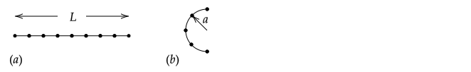
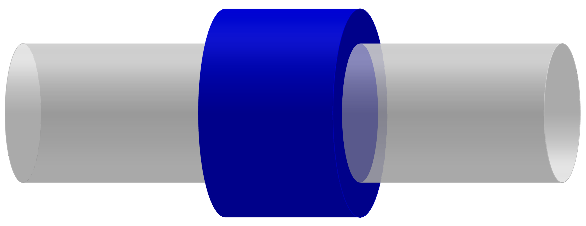
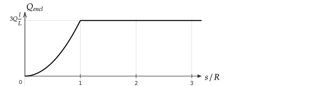

# Introduction

Charge densities are used for two types of problems in E&M.

1. Computing $\mathbf{E}$ using Coulomb's law due to an continuous distribution of charge and
2. Computing the charge enclosed in a Gaussian sphere.

Charges are quantized, and so technically, it does not make sense to discuss a continuous charge distribution. However, when there are many charges, the continuous approximation is very accurate when used for computing an electric field.

To create a discrete charge distribution, imagine smearing discrete charges along a line, on a surface, or within a volume.

* A line of length $L$ with a charge $Q$ spread uniformly on it has a charge density of $\lambda=Q/L$ with units of $[\text{C}]/[\text{m}]$.  If the charge is nonuniformly distributed, the notation $\lambda(l)$ or $\lambda(\mathbf{r})$ is used and $\lambda=dQ/dl$ is the the density at a location where $dQ$ is in a length $dl$.
* A surface with area $A$ and a charge $Q$ spread uniformly on it has a charge density of $\sigma=Q/A$ with units of $[\text{C}]/[\text{m}^2]$. If the charge is nonuniformly distributed, the notation $\sigma(x,y)$ or $\sigma(\mathbf{r})$ is used and $\sigma=dQ/dA$ is density at a location where $dQ$ is in an area $dA$.
* A volume with volume $\tau$ and a charge $Q$ spread uniformly in it has a charge density of $\rho=Q/\tau$ with units of $[\text{C}]/[\text{m}^3]$. If the charge is nonuniformly distributed, the notation $\rho(x,y,z)$ or $\rho(\mathbf{r})$ is used and $\rho=dQ/d\tau$ at a location where $dQ$ is in a volume $d\tau$.

# Linear Charge Density $\lambda$

## Uniform

$\lambda$ is the charge per unit length. The total charge on a line of length $L$ when $\lambda$ is uniform is $Q=\lambda L$.

If the line is curved, integration may be needed to compute the length of the line $\mathcal{L}$ using $L=\int_{\mathcal{L}}dl$.

In order to do an integration, the general differential length $dl$ must be written in terms of a coordinate system (e.g., Cartesian, cylindrical, spherical). For example, if the line of charge is along the $x$-axis, then $dl=dx$. If the line of charge is along the $y$-axis, then $dl=dy$. If the line of charge is a circle of radius $b$ in the $x$-$y$ plane centered on the origin, then $dl=ds$, where $ds$ is a differential length along the circle. When $dl$ cannot be written by inspection, the following general procedure is needed.

In the following diagram, a differential element of a curve is shown. To write this in Cartesian coordinates, a right triangle is used to relate $dx$, $dy$, and $dl$.

$$(dl)^2 = (dx)^2 + (dy)^2\quad\Rightarrow\quad dl = \sqrt{(dx)^2 + (dy)^2}$$

This equation cannot yet be used for integration because it involves two differentials. Factoring out $dx$ gives

$$dl=|dx|\sqrt{1 + \left(\frac{dy}{dx}\right)^2}$$

(The factor in the square root also appears in the equation for the unit normal vector to a line derived in [Vectors](#normal-unit-vectors).) If we integrate in the direction of increasing $x$, then $|dx|=dx$ and so 

$$dl=dx\sqrt{1 + \left(\frac{dy}{dx}\right)^2}$$

### Example -- Computing $\lambda$

If the uniformly spaced point charges each with charge $q$ and shown by dots are uniformly smeared onto the line they are on, what is $\lambda$? 

**Answer**: (a) $9q/L$ and (b) 5$q/\pi a$.

### Problem -- Computing $\lambda$

A 2-meter line has $-10$ Coulombs of charge spread uniformly on it.  

1. Compute $\lambda$.
2. How many electrons does this correspond to?
3. What is the spacing between the electrons on the line of charge?

### Example -- Computing $L$

A parabola $y=x^2/b$ from $x=-b$ to $x=b$ has a uniform linear charge denstiy $\lambda_o$. Compute the total charge on the line. 

%You will need to use an integral table or a program such as [Wolfram|Alpha](https://www.wolframalpha.com/examples/mathematics/calculus-and-analysis/) to solve the integral.

**Answer**

Using

$dl=dx\sqrt{1 + \left(\frac{dy}{dx}\right)^2}$

with $y=x^2/b$ gives

$dl = dx\sqrt{1 + \left(2x/b\right)^2}$

$\displaystyle L=\int_{\mathcal{L}}dl=\int_{-b}^bdx\sqrt{1 + \left(2x\right/b)^2}$

Although this integral can be solved with a [trig substitution](https://ocw.mit.edu/courses/mathematics/18-01sc-single-variable-calculus-fall-2010/unit-4-techniques-of-integration/part-b-partial-fractions-integration-by-parts-arc-length-and-surface-area/session-78-computing-the-length-of-a-curve/MIT18_01SCF10_Ses78d.pdf), the use of [Wolfram|Alpha](https://www.wolframalpha.com/input/?i=integrate+sqrt%281%2B4x%5E2%2Fb%5E2%29+dx+from+-b+to+b) is acceptable on a homework problem. (On exams, I am only interested in seeing that you set up the integral if the integral is non--trivial to evaluate.)

### Problem

A line $y=\sin(x/b)$ from $x=0$ to $x=b$ has a uniform linear charge density $\lambda_o$. Compute the total charge on the line.

**Answer**: $\int_0^b\sin(x/b)dx = b-\cos(1)$

## Non--uniform

As shown in the previous figure, when $\lambda$ varies along a line, it is related to the total charge according to

$$dQ=\lambda(l) dl$$

where $dl$ is a {\it generic} differential length and $l$ is a position on the line. Equivalently,

$$\lambda(l) = \frac{dQ}{dl}$$

Integration of $\lambda(l)dl$ over the length of the line gives the total charge on a line.

$$Q=\int_{\mathcal L} \lambda(l) dl$$

In order to do an integration, the generic length $l$ variable (and $dl$)  must be written in terms of a coordinate system (e.g., Cartesian, cylindrical, spherical) as described previously.

### Example -- Non-uniform $\lambda$ on Straight Line

A line of charge of length $L$ has a linearly increasing charge density, a charge density of zero on the left end, and a total charge $Q$. Compute $\lambda(l)$ in terms of $Q$, $L$, where $l$ is the distance from the left end of the line.

**Answer**

Based on the problem statement, we can write $\lambda(l)=\lambda_ol$ where $l$ is the distance from the left end of the line. To find $\lambda_o$, use

$\displaystyle Q=\int_0^L\lambda(l)dl=\int_0^L\lambda_o l dl=\lambda_o\frac{L^2}{2}\quad\Rightarrow\quad \lambda_o=2Q/L^2\quad \Rightarrow\quad\lambda(l)=\lambda_o l = (2Q/L^2)l$

### Problem -- Non-uniform $\lambda$ on Straight Line

Along a line from $x=0$ to $x=b$, a total charge $Q$ is distributed non-uniformly such that $\lambda(x) = \alpha x^2$. What is the constant $\alpha$ in terms of $Q$ and $b$?

**Answer**: $dQ = \lambda(x)dx\Rightarrow Q = \int_\mathcal{L} \lambda(x)dx\Rightarrow Q = \int_0^b \alpha x^2dx\Rightarrow \alpha=3Q/b^3$

## Problem -- Non-uniform $\lambda$ on Curved Line

A parabola $y=x^2/b$ from $x=-b$ to $x=b$ has a non--uniform linear charge denstiy $\lambda(x)=\lambda_o\sqrt{1+4x^2/b^2}$. Compute the total charge on the line. 

**Answer**:

$\displaystyle dl=dx\sqrt{1 + \left(\frac{dy}{dx}\right)^2}=dx\sqrt{1+4\frac{x^2}{b^2}}$

and so

$\displaystyle Q=\int_{\mathcal{L}}\lambda dl = \lambda_o\int_{-b}^b\left(1+\frac{4x^2}{b^2}\right)dx=\lambda_o\left[x+\frac{4}{3}\frac{x^3}{b^2}\right]_{-b}^b=\lambda_o\left(2b+\frac{8}{3}b\right)=\frac{14}{3}\lambda_ob$

### Example -- Non-uniform $\lambda$ on Curved Line

Charge is distributed on a half--circle of radius $R$ from $\phi=0$ to $\phi=\pi$.

The charge density is $\lambda(\phi)=\lambda_o\sin\phi$.

Compute the total charge $Q$ on the line.

**Answer**

**Check**: Before attempting to solve the problem, note that $\lambda$ is positive in the range $\phi=[0,\pi]$, so we expect a non--zero and positive net charge $Q$.

**Approach I**

Before doing integration, we need to write $dl$ in terms of a differential length using a coordinate system. Given that $\lambda$ was given in cylindrical coordinates, it makes sense to write $dl$ using cylindrical coordinates. From the following figure, $dl=Rd\phi$. (A useful way to check if you have written down the correct $dl$ is to integrate it -- if you get the length of the line, you likely have the correct $dl$.)

$$Q = \int_{\mathcal{L}}\lambda(l) dl=\int_0^{\pi}\lambda_o\sin\phi Rd\phi=2\lambda_o R$$

**Approach II**

This problem was straightforward to solve using cylindrical coordinates. In the following, it is solved in cartesian coordinates. The technique used here can be used for arbitrary curves for which $dl$ is not simple.

For the given circle, $y=\sqrt{R^2-x^2}$, so $dy/dx=-x/\sqrt{R^2-x^2}$ and

$$dl=dx\sqrt{1 + \left(\frac{dy}{dx}\right)^2} = dx\sqrt{1 + \left(\frac{-x}{\sqrt{R^2-x^2}}\right)^2}=dx\frac{|R|}{\sqrt{R^2-x^2}}$$

In cartesian coordinates, $\sin\phi=y/\sqrt{x^2+y^2}$. The integral is then

$$Q = \int_{\mathcal{L}}\lambda(l) dl=\int_{-R}^{R}\lambda_o\frac{y}{\sqrt{x^2+y^2}}dx\frac{|R|}{\sqrt{R^2-x^2}}$$

(The $|R|$ was written because it follows from $\sqrt{R^2}$ and sometimes keeping the absolute value sign matters. However, because $R$ is positive by definition, $|R|=R$, the absolute value was not needed.)

Before integrating, we note that $y$ depends on the differential variable $x$, so it must be written in terms of $x$. Subtitution of $y=\sqrt{R^2-x^2}$ and then integrating gives the same result as Approach I:

$$Q = \int_{\mathcal{L}}\lambda(l) dl=\int_{-R}^{R}\lambda_o\frac{\sqrt{R^2-x^2}}{|R|}dx\frac{|R|}{\sqrt{R^2-x^2}}=\lambda_o\int_{-R}^{R}dx=2\lambda_oR$$

# Surface Charge Density, $\sigma$

## Uniform

$\sigma$ is the charge per unit length. The total charge on a surface is $Q=\lambda A$, where $A$ is the surface area $A=\int_{\mathcal{A}} dA$.

As with lines, to perform the integral, the differential written in terms of a generic differential area $dA$ and must be expressed in a coordinate system. This is demonstrated in the following example.

### Example

A total charge $Q$ is uniformly distributed on a square that lies between $-b\le x\le b$ and $-b\le y\le b$.

1. Compute the charge density $\sigma$ on the square.
2. Verify that $\sigma \int_{\mathcal{A}}dA$, where $\mathcal{A}$ is the surface on which there is a charge, gives the expected answer.

**Answer**

1. $\sigma=Q/(2b)^2$
2. $\displaystyle A = \int_{\mathcal{A}}dA=\int_{-b}^{b}\int_{-b}^{b}dxdy = \int_{-b}^{b}dx\int_{-b}^{b}dy=\int_{-b}^{b}dx(2b)=(2b)^2$, so $\sigma A = Q$.

## Non--Uniform

The relationship between the total charge and $\sigma$ when $\sigma$ varies over an area is

$$Q = \int_{\mathcal{A}}\sigma dA$$

If $\sigma$ is uniform in the $L$ direction, $\sigma L = \lambda$. That is, the surface charge distribution can be described by linear charge distribution. To demonstrate this visually, consider the charge distribution shown below. The amount of charge in the thin rectangle can be written as $\lambda(x)dx$ or $\sigma(x)dxl_y$. As a result, $\lambda(x)=\sigma(x)l_y$. 

To demonstrate this mathematically, suppose $\sigma$ is uniform in $y$ so that $\sigma = \sigma(x)$

$\displaystyle Q=\int_{x}\int_{y} \sigma(x) dx dy=\int_{x}l_y\sigma(x)dx=\int_x\lambda(x) dx$

As a result, we can find the total charge by integrating $\sigma$ over the full area or only $\lambda$ over $x$.

### Example -- Computing $Q$

A square that lies between $-b\le x\le b$ and $-b\le y\le b$ has a charge distribution of $\sigma = \sigma_o x^2/b$ on it.

Compute the total charge on the square.

**Answer**

Assume the square is in the $x$--$y$ plane and is centered on the origin. A differential area in cartesian coordinates in the $x$--$y$ plane is $dA=dxdy$.

$$Q = \int_{\mathcal{A}}\sigma dA=\int_{-b}^b\int_{-b}^b\sigma(x,y) dxdy=\int_{-b}^b\int_{-b}^b\sigma_o \frac{x^2}{b} dxdy$$

A variation on this problem is when the charge density is given in cylindrical coordinates as $\lambda = \lambda_o s^2/b$. In this case, prior to integration we would need to express $\lambda$ in cartesian coordinates: $\lambda(x,y) = \lambda_o (x^2+y^2)/b$.

### Problem -- Computing $Q$

A total charge $Q$ is uniformly distributed on a disk of radius $b$ that lies in the $x$--$y$ plane and is centered on the origin.

* Compute the charge density $\sigma$ on the square without integration.
* Compute the charge density $\sigma$ on the square with integration.

### Example -- Relating $\sigma$ to $\lambda$

Lines of charge of length $L$ and uniform charge density $\lambda$ are placed side-by-side to form a sheet of width $w$.  Compute $\sigma$.

### Problem --  Relating $\sigma$ to $\lambda$

A rectangle in the region $x=[0,l_x]$ and $y=[0,l_y]$ has a charge density $\sigma(x)=\sigma_ox^2/l_x^2$.

Show that the charge can be computed by integrating $\sigma(x)$ over the area or $\lambda(x)=\sigma(x)l_y$ over the line from $x=0$ to $x=l_x$.

# Volume Charge Density, $\rho$

## Example

A total charge $Q$ is uniformly distributed within a sphere of radius $b$ that is centered on the origin.

1\. Compute the charge density $\rho$.

2\. Integrate this $\rho$ over the volume and show that it gives $Q$.

**Answer**: 

1\. $\displaystyle\rho = \frac{Q}{\frac{4}{3}\pi b^3}$

2\. To do the integral, we need to choose a coordinate system and write the differential $d\tau$ in this coordinate system. From calculus, in spherical coordinates, $d\tau=\sin\theta r^2 dr d\theta d\phi$ and so the equation for charge in integral form is

$\displaystyle
Q=\int_{\mathcal{V}}\rho d\tau=\int_0^{2\pi}\int_0^\pi\int_0^b\rho\sin\theta r^2 dr d\theta d\phi=\rho \int_0^{2\pi}\int_0^\pi\int_0^b\sin\theta r^2 dr d\theta d\phi = \rho \frac{4}{3}\pi b^3
$

In the above $\rho$ was be factored out of the integral because it does not depend on $r$, $\theta$, or $\phi$. Substitution of 

$\displaystyle\rho = \frac{Q}{\frac{4}{3}\pi b^3}$ gives $Q=Q$

## Problem

A sphere of radius $a$ has volume charge density of $\rho_o r^2/b^2$. Compute the total charge.

## Problem

A sphere of radius $b$ is centered on the origin and has a surface charge density of $\sigma_o \cos\theta$, where $\theta$ is the spherical coordinate polar angle. Compute the total charge on the surface of the sphere.

# Enclosed Charge

When using Gauss's law, one often needs to find the amount of charge enclosed in a surface. An example is computing the amount of charge inside of a cylinder that intersects a plane with a charge distribution $\sigma$.

%From the diagram, the amount of enclosed charge is the amount of charge on the disk that is the intersection of the cylinder and plane.

## Example -- Line of charge

A total of $+3Q$ is uniformly distributed on a line of length $L$. The blue Gaussian cylinder shown has a length $l$, radius $r$, and the same centerline as the charged line. Assume $L > l$.

1. Find the charge density of the line.

2. Find an equation that relates $Q_{encl}$ and $r$. Plot $Q_{encl}$ vs $r$.

**Answer**:

1\. Because the charge is uniformly distributed on the line, the the charge density is simply the total charge divided by the length: $\lambda={3Q}/{L}$.

2\. The dashed line in the figure is the part of the line inside of the Gaussian cylinder. The length of the dashed line is $l$. The charge enclosed for all four cases is $Q_{encl}=\lambda l=3Q{l}/{L}$. In retrospect, one could have obtained this equation without considering the charge density -- the charge enclosed is the total charge $\times$ the ratio $l/L$. 

The equation for the charge enclosed does not depend on the radius of the Gaussian cylinder, and so the plot is a horizontal line with an amplitude of $3Q{l}/{L}$. Visually, this is expected. If the radius of the cylinder increases, the length of the line inside the cylinder does not change. 

Check: As $l\rightarrow 0$, we expect from the diagram that the amount of charge enclosed should approach zero. This equation also says that as the ratio $l/L\rightarrow 0$, $Q_{encl}\rightarrow 0$. Does this make sense?

%3\.

%

%4\. As noted in the answer to part 2., the enclosed charge does not change as the radius of the Gaussian cylinder changes. So $Q_{encl}(r)=3Q{l}/{L}=\text{constant}$, corresponding to the straight line on the graph.

## Problem -- Hollow Cylinder

A hollow cylinder of radius $R$ and length $L$ has a charge of $+3Q$ distributed _on its curved surface_. The blue Gaussian cylinder shown has a length $l$ and radius $s$ and has the same centerline as the charged cylinder. Assume $l \lt L$.

1. Find both the surface charge density of the charged cylinder and its charge per unit length.

2. Find an equation that relates $Q_{encl}$ and $s$. Plot $Q_{encl}$ vs $s$.

%**Answer**:

%1\. The surface is an area, so the appropriate charge density will be a surface charge density, which has units of charge per length$^2$. The area of the curved surface is the circumference $\times L = 2\pi RL$. The charge is uniformly distributed, so the charge density is simply the total charge divided by the area: $\sigma={3Q}/{2\pi RL}$.

%2\. Imagine that the blue Gaussian cylinder was fully inside of the hollow cylinder. There would be no charge inside of it. As a result, the charge enclosed for $r=0$ and $r=R/2$ is zero. Once the Gaussian cylinder's radius is larger than the hollow cylinder's radius, the total charge inside the Gaussian cylinder does not change. To find the charge enclosed in this case, we need to find the area of the hollow cylinder enclosed. It is $2\pi R l$. The charge enclosed is the charge density computed in part 1. times this area: $Q_{encl}=\sigma (2\pi R l) = 3Q{l}/{L}$. In retrospect, one could have obtained this equation without considering the surface charge density - the charge enclosed is the total charge $\times$ the ratio $l/L$.

%Check: Visually, as the length of the Gaussian cylinder shrinks to zero, the enclosed charge should approach zero. The equation for $Q_{\encl}$ is consistent with this observation.

%3\.

%\include{Gauss/figures/Cylindrical_Shell_and_Gaussian_Cylinder_Graph}

%4\. The enclosed charge is zero for $r<R$, so $Q_{\encl}(r)=0$.

%5\. The enclosed charge is constant for $r>R$, so, $Q_{encl}(r)=3Q{l}/{L}=const$.

## Problem -- Solid cylinder

A solid cylinder of radius $R$ and length $L$ has a charge of $+3Q$ uniformly distributed within it. The blue Gaussian cylinder shown has the same centerline as the charged cylinder, length $l$, and radius $s$. Assume $l \lt L$.

1. Find the volume charge density of the charged cylinder and its charge per unit length.

2. Find an equation that relates $Q_{encl}$ and $s$. Plot $Q_{encl}$ vs $s$.

%**Answer**:

%1\. The insulating cylinder is a volume. The volume of a cylinder is its cross-sectional area time its height, $\pi R^2 L$. The charge density is charge/volume, $\rho=3Q/(\pi R^2 L)$.

%2\. When $r<R$, the Gaussian cylinder is fully inside of the insulating cylinder. The charge in the Gaussian cylinder is the charge density of the insulating cylinder times the volume of the Gaussian cylinder: $Q_{encl}=\rho \pi r^2 l = 3Q(r^2/R^2)(l/L)$.

%For any $r\ge R$, the amount of charge inside the Gaussian cylinder does not change with $r$. The amount of charge depends on the volume of the insulator inside of the Gaussian cylinder, which is $\pi R^2 l$, so $Q_{encl}=\rho \pi R^2 l = 3Q(l/L)$. When $l=L$, $Q_{encl}=3Q$, which makes sense because all of the insulator is inside of the Gaussian cylinder.

%3\. For $r<R$, the curve will be a parabola because of the $r^2$. For $r>R$, curve will be a horizontal line that intersects with the parabola at $r=R$. For values outside of the cylinder, r $>$ R, the enclosed charge will be constant.

%4\. As noted in part 2, the charge enclosed is $Q_{encl}=\rho \pi r^2 l = 3Q(r^2/R^2)(l/L)$. Because of the dependence on r$^2$ the curve is parabolic. 

%5\. As noted in part 2, the charge enclosed is $Q_{encl}=3Q$ so it is constant. 

## Problem -- Solid Cylinder

A solid cylinder of radius $R$ and length $L$ has a charge of $+3Q$ uniformly distributed within it. The blue Gaussian cylinder shown has the same center line as the solid cylinder, length $l$, and radius $s$.

1. Find the volume charge density of the charged cylinder and its charge per unit length.

2. Find an equation that relates $Q_{encl}$, the charge inside the Gaussian cylinder, and $s$. Draw a plot of $Q_{encl}$ vs $s$.

**Answer**

_Note: An earlier version of this solution had $Q$ in place of $3Q$._

1. $\rho=3Q/(\pi R^2 L)$; $3Q = \lambda L$, so $\lambda = 3Q/L$
2. &nbsp;

   $s \le R$, $Q_{encl}=\rho \pi s^2 l=3Q(s^2/R^2)(l/L)$
   
   $s\ge R$, $Q_{encl}=\rho\pi R^2 l = 3Q(l/L)$

## Problem -- Spherical shell

A sphere of radius $R$ has a charge of $+3Q$ distributed _on its surface_.

%The cross-section of the sphere is shown along with a dashed line representing the surface of a Gaussian sphere, which has the same center as the charged sphere and a radius $r$.

%
%\draw[step=0.4cm,gray,very thin] (0,0) grid (6.4,2.4)

1. Find the surface charge density on the sphere.

2. Find an equation that relates $Q_{encl}$ and $r$ for a Gaussian sphere of radius $r$ with the same center as the charged sphere. Plot $Q_{encl}$ vs $r$.

%**Answer**:

%1\. $\sigma = 3Q/4\pi R^2$

%2\. When $r < R$, $Q_{encl}=0$. When $r\ge R$, $Q_{encl}=3Q$ because all of the charge is enclosed.

%3\. 

%4\. $Q_{encl}=0$

%5\. Plot should be a horizontal line between $r$ and $R$ at y = 0 and a horizontal line for $r\ge R$ at y = $3Q$.

## Problem -- Solid sphere

A sphere of radius $R$ has a charge of $+3Q$ distributed uniformly _throughout_ it.

1. Find the charge density of the sphere.

2. Find an equation that relates $Q_{encl}$ and $r$ for a Gaussian sphere of radius $r$ with the same center as the charge sphere. Plot $Q_{encl}$ vs $r$.

## Problem -- Solid sphere

A solid sphere of radius $R$ that is centered on the origin has a charge density of $\rho(r)=\rho_o r^2/R^2$.

Compute and plot the charge enclosed in a Gaussian sphere centered on the origin versus the radius of the Gaussian sphere.

**Answer**:

A common error was to write $Q_{encl}=\rho V$. This is only true if $\rho$ is constant within $V$. To avoid this type of error, always start by writing the general equation: $Q_{encl}=\int \rho d\tau$. (Do this for Gauss's law in integral form -- don't start with $\phi_E=EA$, start with $\phi_E=\oint \mathbf{E}\bfcdot d\mathbf{A}$.)

$r\le R$: $\displaystyle Q_{encl}=\int \rho(r) d\tau=4\pi\int_0^r\rho_o(r'^2/R^2)r'^2dr'=\rho_o\frac{4\pi}{5}\frac{r^5}{R^2}$

$r\ge R$: $\displaystyle Q_{encl}=\rho_o\frac{4\pi}{5}R^3$

## Problem -- Sheet

A square sheet with side length $L$ has a charge of $+3Q$ distributed uniformly on it. The blue Gaussian cylinder has a height $h$ and radius $s$, and half of it is above the sheet.

%\draw[step=0.4cm,gray,very thin] (0,0) grid (6.4,2.4)

1. Find the charge density of the sheet.

2. Find an equation that relates $Q_{encl}$ and $s$ for $s\lt L/2$. Plot $Q_{encl}$ vs $s$.

%**Answer**:

%1\. $\sigma=3Q/L^2$

%2\. The amount of charge enclosed for $r\le L/2$ is $Q_{encl}=\sigma \pi r^2 = 3Q r^2/L^2$.

%3\. 

%4\. The line should be a parabola that passes through the origin.
