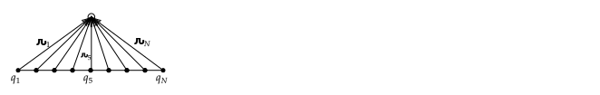
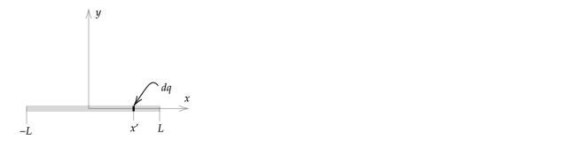
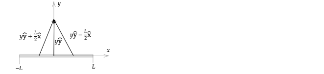
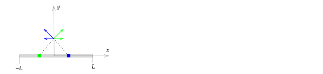
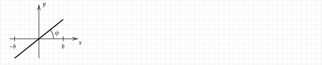

# Introduction

Previously, you have calculated the electric field due to a collection of point charges. From superposition, the electric field at any point in space is the sum of the electric field due to all point charges.

Suppose that you wanted to know the electric field created by a plastic rod that was positively charged by rubbing it against fabric. The number of charges that you would need to account for is on the order of $\gt 10^{20}$. If you could do one calculation per second, computing the electric field due to each of the charges would take longer than the time since the Big Bang.

To allow for an answer in a finite amount of time, the approximation that charge is uniformly distributed along a line can be made. Consider $N=9$ charges placed on a line as shown on the left-hand side of the diagram below. To compute the electric field at the open circle, we would need to compute the electric field due to each of the nine charges there. Instead, we will make the approximation that the charges are smeared out onto the line to form a continuous charge density.

Mathematically, we are converting a sum to an integral. The electric field at the open circle is

$$
\mathbf{E}=
 kq\_1\frac{\hat{\textbf{\char"0509}}\_1}{\char"0509\_1^2}
+kq\_2\frac{\hat{\textbf{\char"0509}}\_2}{\char"0509\_2^2}
+...+kq\_N\frac{\hat{\textbf{\char"0509}}\_N}{\char"0509\_N^2}
$$

In the notation of Griffiths, $\mathbf{r}$ is the position of the point of interest, and $\mathbf{r}'$ is the position of a charge, so

$$\textbf{\char"0509}\_i=\mathbf{r}-\mathbf{r}_i'$$

As a sum, this is

$$
\mathbf{E}=\sum_{i=1}^Nkq\_i\frac{\hat{\textbf{\char"0509}}\_i}{\char"0509\_i^2}
$$

Smearing the $q_i$ to give a continuous charge density $\lambda(l)$  over all differential elements $l$ allows us to write

$$
\mathbf{E}\simeq \int_{\mathcal{L}} k\lambda(l) dl\frac{\hat{\textbf{\char"0509}}}{\char"0509^2}
$$

where $\mathcal{L}$ is the line. The accuracy of the integral approximation increases with $N$.

The arguments given above do not depend on the fact that the charges are on a line, and so the $\mathcal{L}$ can be dropped, and $\lambda(l) dl$ can be replaced with $dq$. In addition, by convention, the approximation symbol is replaced with an equality symbol, giving

$$\boxed{\mathbf{E}=\int k\frac{\hat{\textbf{\char"0509}}}{\char"0509^2}dq}$$

where $dq$ represents a differential charge on a diffential line, area, or volume element.

The advantage of using the integral approximation is that to get an answer; we only need to solve an integral -- we do not need to compute electric field contribution for each point charge and then do a vector sum.

To emphasize the fact that the result of the integration depends on the unprimed variable $\mathbf{r}$, and that the result of integration should not have any primed variables, we sometimes explicitly include the dependence of $\mathbf{E}$ on $\mathbf{r}$:

$$\mathbf{E}(\mathbf{r})=\int k\frac{\hat{\textbf{\char"0509}}}{\char"0509^2}dq$$

In the case where $\mathbf{r}$ was written with cartesian coordinates, this would be

$$\mathbf{E}(x,y,z)=\int k\frac{\hat{\textbf{\char"0509}}}{\char"0509^2}dq$$

> $dq$ depends on primed coordinates and so for clarity it would be better written as $dq'$, $dq(\mathbf{r'})$ or $dq(x',y',z')$. However, this is not the convention.
>
> When integrating, the $x$, $y$, and $z$ (or unprimed cylindrical or spherical coordinates) that appear in ${\hat{\textbf{\char"0509}}}/{\char"0509^2}$ should be treated as constants during integration because they do not depend on the primed dummy integration variable. As an example, consider the integral
>
> $\displaystyle f(x) = \int_{a}^b\frac{1}{x'-x}dx'$
>
> The result of integration will not depend on $x'$ because $x'$ is "integrated over". The result of the integration
>
> $\displaystyle f(x) = \ln(b-x) - \ln(a-x)$
>
> does not depend on $x'$.

To simplify notation, we often use the definition

$$d\mathbf{E}\equiv k\frac{\hat{\textbf{\char"0509}}}{\char"0509^2}dq$$

for the integrand, which corresponds to the electric field at $\mathbf{r}$ due to a differential charge $dq$ at $\mathbf{r}'$.

# Steps

Introductory physics textbooks often give examples of finding the electric field due to a continuous charge distribution for which there is a short-cut solution (e.g., a ring or disk of charge). However, most continuous charge distribution problems do not have a short-cut solution. Griffiths gives only one example (Example 2.2) on computing the electric field using a general method.

In this section, I provide steps that can be used to find the electric field for an arbitrary continuous charge distribution using Example 2.2 as an example for the steps. Part of the method of solution shown here will be needed later when computing dipole approximations; the steps for computing the electric potential, $V$, due to a continuous charge distribution and the magnetic field, $\mathbf{B}$, due to a current system will also be similar (in the case of currents, the Biot-Savart equation is used instead of Coulomb's Law).

## Identifying Answer Features

Based on the problem statement and diagram, write down features that you expect your solution to have. These statements should have the form

* "For large $z$, the solution should approach that for the case where all charge on line/sheet, etc. is at the origin."
* "For small $z$, the solution should approach that for an infinite sheet of charge."
* "The computed electric field should have only a $z$-component."

Such statements can be used to check your final answer and also intermediate steps.

### Example

A line of charge from $x=-L$ to $x=L$ with a uniform charge density $\lambda_o$. We can make several statements about the electric field $\mathbf{E}$ on the $y$--axis.

1. $\mathbf{E}(y)$ should only have a $y$--component due to cancellation symmetry. 
2. For $y\gg L$ (far away from the line), one expects an answer that approaches the answer for a problem where all of the charges on the line are placed at the origin. In this case, the basic form of Coulomb's Law for the electric field due to a charge at the origin can be used to find the answer in terms of the parameters given: $|\mathbf{E}=kQ/y^2|=k(2\lambda_oL)/y^2$ and $\mathbf{E}$ is in the $\yhat$ direction for $y\gt 0$ and in the $-\yhat$ direction for $y\lt 0$.
3. For $y\ll L$, one expects an answer that approaches the answer for an infinite line of charge (an ant placed near the origin will conclude that the charges extend to infinity in both directions). In this case, one can look up the equation for the electric field due to an infinite line of charge (or use Gauss' Law to find it).

### Problem

A circular ring of radius $R$ in the $x$--$y$ plane and centered on the origin has a charge density $\lambda_o$.

Write at least two predictions about the electric field on the $z$--axis due to the ring.

## Finding $dl$, $dA$, or $d\tau$

The differential charge $dq$ must be written in terms of a coordinate system prior to integration. 

* For charges on a line, $dq=\lambda dl$
* For charges on a surface, $dq=\sigma dA$
* For charges in a volume, $dq=\rho d\tau$

In this step, the general differentials $dl$, $dA$, or $d\tau$ are written in terms of a coordinate system (usually cartesian, cylindrical, or spherical). The choice of coordinate system depends on the problem; usually, the coordinate system that is "best" will be somewhat obvious ("best" is used in the sense that it makes the integration easiest).

Note that when writen with a coordinate variable (e.g., $dx'$ instead of the generic variable $dl$), the differential element is written with a prime. The reason is that the position of the charges that cause the electric field is by convention written with a prime, and we want to integrate over the position of the charges. Ideally, we would use $dq'$, $dl'$, $d\sigma'$, and $d\tau'$ to emphasize this, but this is not the convention.

### Example -- Constant Line of Charge

For a line of charge with charge density $\lambda_o$ over $-L\le x\le L$, find $dq$ in cartesian coordinates.

**Answer**

If the differential charges lie on the $x$--axis, then $dl = dx'$. So the electric field due to $dq$ can now be written by replacing $dq$ with $\lambda_o dx'$. If $\lambda$ depends on $x'$, we should write $dq=\lambda(x')dx'$ to emphasize the fact that the charge on a differential element depends on $x'$.

### Example -- Variable Line of Charge

Find $dq$ for charges with a uniform density $\lambda_o$

1. a differential charge on the line $y=x$ and
2. a differential charge on the curve $y=x^2/b$, where $b$ is a constant.

**Answer**

From [Charge Densities](charge_densities.html),

$\displaystyle dl=dx\sqrt{1+\left(\frac{dy}{dx}\right)^2}$

1\. $\displaystyle \lambda dl=\lambda_odx\sqrt{2}$ (That $dl$ is $dx$ inflated by $\sqrt{2}$ should be clear from the diagram used to derive the relationship between $dl$ and $dx$.) Prior to use in integration we will need to replace $dx$ with $dx'$.

2\. $\displaystyle dq=\lambda dl=\lambda_o dx\sqrt{1+\left(\frac{2x}{b}\right)^2}$. Prior to use in integration we will need to replace $dx$ with $dx'$ and $x$ with $x'$.

### Problem

Write an equation for $dq$ in spherical coordinates for a uniform charge $\lambda_o$ on

1. a circle of radius $R$ centered on the origin and in the $x$--$y$ plane; and
2. the same circle when shifted along the $z$--axis by $z_o$.

## Find ${\hat{\textbf{\char"0509}}}/{\char"0509^2}$

First, write the full definition of $\mathbf{r}$ and $\mathbf{r}'$ using cartesian unit vectors.

The point where we want to compute the field is $\mathbf{r}=x\hat{\mathbf{x}}+y\hat{\mathbf{y}}+z\hat{\mathbf{z}}$.

The position of a differential charge that contributes to the field at $\mathbf{r}$ is $\mathbf{r}'=x'\hat{\mathbf{x}}+y'\hat{\mathbf{y}}+z'\hat{\mathbf{z}}$.

Both $\mathbf{r}$ and $\mathbf{r}'$ can be written in any coordinate system, but in general cartesian unit vectors should be used.

Next, simplify $\mathbf{r}$ and $\mathbf{r}'$ based on the problem statement. For example, if the problem is to compute the electric field on the $y$--axis, then $x=z=0$. If all charges are on the $x$--axis, then $y'=z'=0$.

Finally, insert the reduced $\mathbf{r}$ and $\mathbf{r}'$ into $\displaystyle\frac{\hat{\textbf{\char"0509}}}{\char"0509^2}=\frac{\textbf{\char"0509}}{\char"0509^3}=\frac{\mathbf{r}-\mathbf{r}'}{|\mathbf{r}-\mathbf{r}'|^3}$

%$$\frac{\hat{\textbf{\char"0509}}}{\char"0509^2}=\frac{\textbf{\char"0509}}{\char"0509^3}=\frac{\mathbf{r}-\mathbf{r}'}{|\mathbf{r}-\mathbf{r}'|^3}=\frac{(x-x')\xhat + (y-y')\yhat + (z-z')\zhat}{\Big[\sqrt{(x-x')^2 + (y-y')^2 + (z-z')}\Big]^3}$$

%Instead of writing this general equation, it is often easier to first write a reduced version $\mathbf{r}$ and $\mathbf{r}'$ based on the problem statement and geometry and then compute ${\hat{\textbf{\char"0509}}}/{\char"0509^2}$. This is demonstrated in the following example.

%Note that one should generally write ${\textbf{\char"0509}}/{\char"0509^3}$ with cartesian unit vectors. This equation will be integrated, and if the unit vectors depend on one or more of the differential lengths used in integration, they must be first written in terms of

### Example -- Line of Charge

For a line of charge with charge density $\lambda$ over $-L\le x\le L$, find ${\hat{\textbf{\char"0509}}}/{\char"0509^2}$ for a point on the $y$--axis.

**Answer**

The point of interest has $x=z=0$ and so $\mathbf{r}=y\hat{\mathbf{y}}$

If the differential charges are all on the $x$--axis, then $y'=z'=0$ and $\mathbf{r}'=x'\hat{\mathbf{x}}$. We can now write

$${\textbf{\char"0509}} = \mathbf{r}-\mathbf{r}'= y\hat{\mathbf{y}}-x'\hat{\mathbf{x}}$$

$$\char"0509 = \sqrt{x'^2+y^2}$$

$$\frac{\hat{\textbf{\char"0509}}}{\char"0509^2}=\frac{\textbf{\char"0509}}{\char"0509^3}=\frac{\mathbf{r}-\mathbf{r}'}{|\mathbf{r}-\mathbf{r}'|^3}=\frac{y\yhat-x'\xhat}{\Big[\sqrt{x'^2+y^2}\Big]^3}$$

**Common Errors**

1\. Not having a primed variable in the equation for ${\hat{\textbf{\char"0509}}}/{\char"0509^2}$. In the next step, suggestions are given that will allow you to catch this type of error.

2\. Miscalculation of the magnitude, which is

$$\char"0509=|y\hat{\mathbf{y}}-x'\hat{\mathbf{x}}|=\sqrt{y^2+x'^2}$$

If this does not make sense, make sure to review [Vectors](#vectors.html) and the following. In general, $\{\textbf{\char"0509}}$ will have the form

$$\textbf{\char"0509}=A\hat{\mathbf{x}}+B\hat{\mathbf{y}}+C\hat{\mathbf{z}}$$

so that

$$\char"0509=\big|A\hat{\mathbf{x}}+B\hat{\mathbf{y}}+C\hat{\mathbf{z}}\big|=\sqrt{A^2+B^2+C^2}$$

where $A, B,$ and $C$ depend on the problem. In the example given here, $A=-x'$ and $C=z$.

3\. Wrong signs in the calculation of $\mathbf{r}-\mathbf{r}'$ -- the negative sign applies to all of the components of $\mathbf{r}'$.

For example, if

$$\mathbf{r}=\hat{x\mathbf{x}}+y\hat{\mathbf{y}}+z\hat{\mathbf{z}}$$

and

$$\mathbf{r}'=\hat{x'\mathbf{x}}+y'\hat{\mathbf{y}}+z'\hat{\mathbf{z}}$$

then the error is to write

$$\mathbf{r}-\mathbf{r}'= x\hat{\mathbf{x}}+y\hat{\mathbf{y}}+z\hat{\mathbf{z}}-x'\hat{\mathbf{x}}+y'\hat{\mathbf{y}}+z'\hat{\mathbf{z}}=(x-x')\hat{\mathbf{x}}+(y+y')\hat{\mathbf{y}}+(z+z')\hat{\mathbf{z}}$$

instead of

$$\mathbf{r}-\mathbf{r}'= \hat{x\mathbf{x}}+y\hat{\mathbf{y}}+z\hat{\mathbf{z}}-\left(x'\hat{\mathbf{x}}+y'\hat{\mathbf{y}}+z'\hat{\mathbf{z}}\right)= x\hat{\mathbf{x}}+y\hat{\mathbf{y}}+z\hat{\mathbf{z}}-x'\hat{\mathbf{x}}-y'\hat{\mathbf{y}}-z'\hat{\mathbf{z}}$$

This correct version simplifies to

$$\mathbf{r}-\mathbf{r}'=(x-x')\hat{\mathbf{x}}+(y-y')\hat{\mathbf{y}}+(z-z')\hat{\mathbf{z}}$$

### Example

Write an equation for ${\hat{\textbf{\char"0509}}}/{\char"0509^2}$ in cylindrical coordinates with cartesian unit vectors for a point of interest on the $z$--axis for charges on a circle of radius $R$ centered on the origin and in the $x$–$y$ plane.

**Answer**:

$\mathbf{r}=z\zhat$, $\mathbf{r}'=R\cos\phi'\xhat + R\sin\phi'\yhat$ (draw a diagram to check this!)

$\displaystyle \frac{\hat{\textbf{\char"0509}}}{\char"0509^2}= \frac{z\hat{\mathbf{z}}-R\cos(\phi')\hat{\mathbf{x}}-R\sin(\phi')\hat{\mathbf{y}}}{(z^2+R^2)^{3/2}}$

Note that I have used $\phi'$ instead of $\phi$ in this equation and $d\phi$ for the differential. Because there is no $\phi$ in $\mathbf{r}$, I could use $\phi$. However, it is better to use $\phi'$ so there will not be confusion for a problem where there is an $\phi$ in $\mathbf{r}$.

### Problem

Write an equation for ${\hat{\textbf{\char"0509}}}/{\char"0509^2}$ in spherical coordinates with cartesian unit vectors for a point of interest on the $z$--axis and charges on

1. a circle of radius $R$ centered on the origin and in the $x$--$y$ plane; and
2. the same circle when shifted along the $z$--axis by $z_o$.
 
## Checking $d\mathbf{E}$

Recall that the integral to be solved is

$$\mathbf{E}(\mathbf{r})=\int k\frac{\hat{\textbf{\char"0509}}}{\char"0509^2}dq$$

and the notation for the integrand of

$$d\mathbf{E}=k\frac{\hat{\textbf{\char"0509}}}{\char"0509^2}dq$$

At this point, you have ${\hat{\textbf{\char"0509}}}/{\char"0509^2}$ and $dq$ in terms of coordinate system variables. (Don't forget to write the coordinates in $dq$ with primes.) The integrand $d\mathbf{E}$ is the electric field at any point $\mathbf{r}$ due to a charge $dq$ at $\mathbf{r}'$.

To check $d\mathbf{E}$, plug in a few values of $(x,y,z)$ and $(x',y',z')$ and verify that the resulting $d\mathbf{E}$ is consistent the expected result.

### Example -- Line of Charge

For a line of charge with charge density $\lambda_o$ over $-L\le x\le L$ and for a point on the $y$--axis, $dq=\lambda_o dx'$ and

$$d\mathbf{E}=\frac{y\yhat-x'\xhat}{\Big[\sqrt{x'^2+y^2}\Big]^3}k\lambda_o dx'$$

Provide three checks of this equation.

**Answer**:

1\. Plug in $x'=-L/2$, $x'=0$, and $x'=L/2$ and verify that the direction is as expected for $y\gt 0$. In the following diagram, a vector for the numerator of $d\mathbf{E}$ is shown. These vectors point in the direction expected if there is a charge at their tails. If we scaled the vectors draw by the denominator in $d\mathbf{R}$, the vector in the center will be shorter, which is expected because the $dq$ at its tail is closer to the point of interest.

The above could be repeated by plugging in values of $y=-L$, in which case all of the vectors should point downwards.

2\. We expect that as $y$ increases, $d\mathbf{E}$ the angle with respect to the $y$--axis should decrease. This statement is consistent with the equation for $d\mathbf{E}$ because for fixed $x'$, the $y\yhat$ term becomes much larger than the $x'\xhat$ term as $y$ increases.

3\. For $x'=0$, we expect $d\mathbf{E}$ to be that for a point charge $dq$ at the origin. Plugging in $x'=0$ gives $d\mathbf{E}=kdq\yhat/(y|y|)$. This has the expected magnitude and direction for $y\gt 0$ and $y\lt 0$.

### Problem

For a point of interest on the $z$--axis and due to a uniform charge density of $\lambda_o$ on a circle of radius $R$ centered on the origin and in the $x$–$y$ plane, $dq=Rd\phi'$ and ${\hat{\textbf{\char"0509}}}/{\char"0509^2}$ and so

$\displaystyle d\mathbf{E} = k\lambda_o Rd\phi'\frac{z\hat{\mathbf{z}}-R\cos(\phi')\hat{\mathbf{x}}-R\sin(\phi')\hat{\mathbf{y}}}{(z^2+R^2)^{3/2}}$

Provide at least two checks of this equation. Include a diagram.

## Simplifying $d\mathbf{E}$ using Symmetry Arguments

The most frequent type of symmetry will be cancelation symmetry, where pairs of differential charges create an electric field at a point with a component that cancels.

### Example -- Constant $\lambda$

For a line of charge with constant charge density $\lambda_o$ over $-L\le x\le L$ and for a point on the $y$--axis,

$$d\mathbf{E}=\frac{y\yhat-x'\xhat}{\Big[\sqrt{x'^2+y^2}\Big]^3}k\lambda_o dx'$$

Identify symmetries that can be used to simplify the problem.

**Answer**

Vectors for $d\mathbf{E}$ and $dE_x$ are shown for to points on the line that are equidistant from the origin in the following figure. The quantity of differential charge for both cases is equal to $\lambda_o dx'$.

Because the horizontal components cancel, we conclude that the horizontal component of the $\mathbf{E}$ will end up to be zero after integration.

A mathematical way of stating this is $dE_x(x')=-dE_x(-x')$, so integration of $dE_x$ over $\pm L$ will be zero.

(If $\lambda(x')$ is not constant, for example it is $\lambda(x')=\lambda_oe^{x'/L}$, then differential charges on the left side of the line have less charge and so there are no cancelling pairs as was the case for the previous example. In this case, the left--most $dq$ is $\lambda_oe^{-1}dx'$ and the right--most  $dq$ is $\lambda_oe^{1}dx'$.)

### Problem -- Ring of Charge

$d\mathbf{E}$ for a point of interest on the $z$--axis and due to a uniform charge density $\lambda_o$ on a circle centered on the origin and in the $x$–$y$ plane is

$\displaystyle d\mathbf{E} = k\lambda_o d\phi'\frac{z\hat{\mathbf{z}}-R\cos(\phi')\hat{\mathbf{x}}-R\sin(\phi')\hat{\mathbf{y}}}{(z^2+R^2)^{3/2}}$

Simplify this equation using a symmetry argument. Include a diagram.

## Integrating $d\mathbf{E}$

There are two possibilities:
1. The integral can be solved "exactly", which informally means standard methods can be used to do the integration, e.g., using trig substitutions, an integral table, or entering the integral into Mathematica or WolframAlpha. The technical term is a "closed--form" solution. An example of an integral with a closed--form solution is $\int_0^{\pi} \sin (ku) du = (\cos (k\pi) - 1)/k$.
2. The solution of the integral can only be expressed as an infinite series. An example is the elliptic integral of the first kind:

   $\int_0^{\pi/2}du/\sqrt{1+k^2\sin^2u}=(\pi/2)\big(1+k^2(1/2)^2+k^4((1\cdot 2)/(3\cdot 4))^2+...\big)$.
   
   We will encounter such integrals later in the semester -- they also appear in classical mechanics.

   In these cases, one can convert the integrand to a polynomial using a Taylor Series or related expansion prior to integration. This will be covered in detail later in the semester when electric and magnetic dipoles are covered. The basic procedure is to re-write the integrand as an infinite series, e.g.,

   $$\int f(x')dx' = \int \left(\frac{b_1}{x'}+\frac{b_2}{x'^2} + ... + c_0 + c_1x' + c_2x'^2 + ...\right)dx'$$

where the constants $b_1, b_2, ..., c_0, c_1, ...$ are determined using the Taylor Series expansion formula (or related method for expanding a function). Written in this way, the integral only involves the integration of polynomials. There are subtleties to this method -- one needs to ensure that the series is converging; sometimes, several approximations to $f(x')$ are needed, one for locations near the charge distribution and one at far locations. These issues will be considered in detail later in the semester.

### Example -- Integral can be solved exactly

For a line of charge with uniform charge density $\lambda_o$ over $-L\le x\le L$, find $\mathbf{E}(y)$, the electric field at a point on the $y$--axis.

**Answer**:

Previously it was found that

$\displaystyle d\mathbf{E}=\frac{y\yhat-x'\xhat}{\Big[\sqrt{x'^2+y^2}\Big]^3}k\lambda_o dx'$

so

$\displaystyle \mathbf{E}=\int_{-L}^{L}\frac{y\yhat-x'\xhat}{\Big[\sqrt{x'^2+y^2}\Big]^3}k\lambda_o dx'q$

$\displaystyle \phantom{\mathbf{E}}=k\lambda_oy\yhat\int_{-L}^{L} dx'\frac{1}{\Big[\sqrt{x'^2+y^2}\Big]^3}-k\lambda_o\xhat\int_{-L}^{L} dx'\frac{x'}{\Big[\sqrt{x'^2+y^2}\Big]^3}$

The constants, cartesian unit vectors, and $y$ have been factored out of the integral because they do not depend on the dummy integration variable $x'$.

Based on arguments given earlier, the second integral will be zero. This leaves

$\displaystyle \mathbf{E}(y)=k\lambda_oy\yhat\int_{-L}^{L} dx'\frac{1}{\Big[\sqrt{x'^2+y^2}\Big]^3}$

(On exams, you will only be asked to set up the integral.) The integral can be evaluated using a trig substitution, and the result is

$\displaystyle \mathbf{E}(y)=k\frac{2L\lambda_o}{y\sqrt{L^2 + y^2}}\yhat$

Because $2L\lambda_o$ is the total charge on the line, the answer can also be written in terms of the total charge on the line, $Q$, as

$
\displaystyle E_y = k\frac{Q}{y\sqrt{L^2 + y^2}}
$

Suppose that we were not able to integrate

$\displaystyle \mathbf{E}(y)=k\lambda_o\yhat\int_{-L}^{L} dx'\frac{y}{\Big[\sqrt{x'^2+y^2}\Big]^3}dx'$

To demonstrate the method that applies when we there is not a closed--form solution to the integral, here we will expand the integrand assuming that $y\gg L$ and $y>0$. First, factor out $y$ from the square root and also from the integral (it does not depend on $x'$)

$\displaystyle \mathbf{E}(y)=\frac{k\lambda_o}{y^2}\yhat\int_{-L}^{L} dx'\frac{1}{\Big[\sqrt{1+\left(\frac{x'}{y}\right)^2}\Big]^3}$

The integrand has the form $1/(1+\delta)^n$, where $n=3/2$ and $\delta = x'/y$. The maximum value of $\delta$ is $L/y$, which is small based on assumtion. We can thus write

$\displaystyle \mathbf{E}(y)= \frac{k\lambda_o}{y^2}\yhat\int_{-L}^{L} dx'\left(1-\frac{3}{2}\frac{x'^2}{y^2} + ...\right)$

Integrating the first two terms gives

$\displaystyle \mathbf{E}(y)\simeq \frac{k\lambda_o}{y^2}\yhat\left(2L - \frac{L^3}{y^2}\right)=\frac{2k\lambda_o L}{y^2}\yhat\left(1-\frac{L^2}{y^2}\right)$

If only the first term in parenthesis is kept, the result is the same as that for a charge $2k\lambda_o L$ at the origin, which was a prediction made prior to solving the problem. Does it make sense physically that the "correction" to the term that corresponds to all of the charges at the origin is negative and the same for positive and negative $y$?

### Problem

The electric field on the $z$--axis due to a uniform charge density $\lambda_o$ on a circle of radius $R$ centered on the origin and in the $x$–$y$ plane is

$\displaystyle \mathbf{E}(z) = \int_0^{2\pi}k\lambda_o d\phi'\frac{z\hat{\mathbf{z}}}{(z^2+R^2)^{3/2}}$

Find an exact solution to this integral.
 
## Checking Answer

The final step is to check the predictions made prior to starting the problem.

### Example

For a line of charge with uniform charge density $\lambda_o$ over $-L\le x\le L$, $\mathbf{E}(y)$, the electric field at a point on the $y$--axis is

$\displaystyle \mathbf{E}(y)=k\frac{2L\lambda_o}{y\sqrt{L^2 + y^2}}\yhat$

Check the predictions made previously about the answer, which were

1. $\mathbf{E}(y)$ should only have a $y$--component due to cancellation symmetry. 
2. For $y\gg L$ (far away from the line), one expects an answer that approaches the answer for a problem where all of the charges on the line are placed at the origin. In this case, the basic form of Coulomb's Law for electric fields can be used to find the answer in terms of the parameters given $|\mathbf{E}|=kQ/y^2=k(2\lambda_oL)/y^2$ and $\mathbf{E}$ is in the $\yhat$ direction for $y\gt 0$ and in the $-\yhat$ direction for $y\lt 0$.
3. For $y\ll L$, one expects an answer that approaches the answer for an infinite line of charge (an ant placed near the origin will conclude that the charges extend to infinity in both directions). In this case, one can look up the equation for the electric field due to an infinite line of charge (or use Gauss' Law to find it).

**Answer**:

1. This is clearly true.
2. To address $y\gg L$, we can factor out $y$ from the square root to arrive at

   $\displaystyle \mathbf{E}(y)=\frac{2k\lambda L}{y|y|}\frac{1}{\sqrt{1+\left(\frac{L}{y}\right)^2}}\yhat$
   
  When $y\gg L$, the square root term is nearly unity. And the result is $ \mathbf{E}(y)=2k\lambda_o L\yhat/y^2$ when $y\gt 0$ and $ \mathbf{E}(y)=-2k\lambda_o L\yhat/y^2$ when $y\lt 0$.
3. To address $y\ll L$, we can first factor out $L$ from the square root to arrive at
 
   $\displaystyle \mathbf{E}(y)=\frac{2k\lambda_o }{y}\frac{1}{\sqrt{1+\left(\frac{y}{L}\right)^2}}\yhat$

  When $y\ll L$, the square root term is nearly unity, leaving $E_y=2k\lambda_o\yhat/y$. The electric field for a line of charge is usually given in cylindrical coordinates as $\mathbf{E}=2k\lambda_o\hat{\mathbf{s}}/s$. When $y>0$, $s=y$ and $\hat{\mathbf{s}}=\yhat$; when $y<0$, $s=-y$ and $\hat{\mathbf{s}}=-\yhat$ and so the prediction is correct.
  
### Problem

Check the exact answer found previously for the electric field on the $z$–axis due to a uniform charge density $\lambda_o$ on a circle of radius $R$ centered on the origin and in the $x$–$y$ plane.

# Problems

## Line of Charge on $x$--axis

A line of charge with a uniform charge density of $\lambda_o$ extends from $0$ to $L$ on the $x$-axis, wh

Follow and show the steps given in the notes and find $\mathbf{E}$ on the $y$--axis in terms of one or more of $k,\lambda_o,L,y$ and cartesian unit vectors.

## Line of Charge at Angle to $x$--axis

A line of charge in the $x$-$y$ plane has a charge density of $\lambda_o$, passes through the origin, is at an angle of $\phi$ with the $x$-axis, and extends from $x=-b$ to $x=b$.

Find $\mathbf{E}$ on the $y$--axis using two methods:

1\. By following the steps in the notes.
2\. Transforming the equation for $\mathbf{E}(y)$ given in the notes for a line of charge on the $x$--axis between $x=-L$ and $x=L$ to coordinate system rotated by $\alpha$ about the $z$--axis.