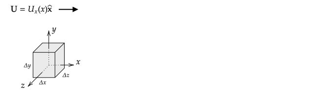

# Definition

## $\text{div}(\mathbf{U})$

See 1.2.4 of Griffiths.

The divergence of a vector field is is a scalar function of position and is defined to be

$$\text{div}(\mathbf{U})=\lim_{\Delta \tau\rightarrow 0}\frac{\oint \mathbf{U}\bfcdot d\mathbf{A}}{\Delta \tau}=\lim_{\Delta \tau\rightarrow 0}\frac{\Phi_U}{\Delta \tau}$$

at any point in space, where $\Delta \tau$ is a differential volume that surrounds the point. The numerator is a flux, so the physical interpretation is that it is proportional to the net flux into or out of a vanishingly small volume.

In general, this formula will not be used to compute divergence. However, it is important to understand its meaning by using it at least once, which is done in the following example.

Note that Griffiths does not state the definition given above. Instead, in Chapter 1.2.4, he uses the formula $\boldsymbol{\nabla}\bfcdot\mathbf{U}$ and states that the divergence is "a measure of how much the vector $\mathbf{U}$ spreads out (diverges) from the point in question". One needs to be very careful with this definition as it does not always work as expected. The vector fields and field lines for $\mathbf{U}=\hat{\mathbf{s}}/s$ and $\mathbf{U}=\hat{\mathbf{r}}/r^2$ appear to be diverging everwhere. However, for these two $\mathbf{U}$, $\text{div}(\mathbf{U})$ is zero everwhere except at the origin.

%However, the derivation of 
$\text{div}(\mathbf{U})=\boldsymbol{\nabla}\bfcdot\mathbf{U}$ does not apply to arbitrary $\mathbf{U}$.

There are two vector functions for each coordinate system that you should know the divergence for.

**Cartesian**

1. $\mathbf{U} = \xhat$ for $x>0$ and $\mathbf{U} = \xhat$ for $x<0$ -- the divergence is zero for all $x$ except as $x \rightarrow 0$ where it approaches infinity.
2. $\mathbf{U} = x\xhat$ -- the divergence is constant for all $x$

**Cylindrical**

1. $\mathbf{U}=s\hat{\mathbf{s}}$ -- the divergence is constant for all $s$
2. $\mathbf{U}=\hat{\mathbf{s}}/s$ -- the divergence is zero for all $s$ except as $s\rightarrow 0$ where it approaches infinity.

**Spherical**

1. $\mathbf{U}=r\hat{\mathbf{r}}$ -- the divergence is constant for all $r$
2. $\mathbf{U}=\hat{\mathbf{r}}/r^2$ -- the divergence is zero for all $r$ except as $r\rightarrow 0$ where it approaches infinity.

### Example

If $\mathbf{U}=U_x(x)\xhat$ 

1\. Compute $\text{div}(\mathbf{U})$ that applies for any point $x$.

2\. Evaluate $\text{div}(\mathbf{U})$ when $U_x(x)=U_o$

**Answer**

A side view of a cube centered on the origin with sides of length $\Delta x$, $\Delta y$, and $\Delta z$ is shown in the following figure.

1\. 
Only two of the six sides contribute to the flux $\oint \mathbf{U}\bfcdot d\mathbf{A}$. The right face at $x=\Delta x/2$ contributes $+U_x(x+\Delta x/2)\Delta y\Delta z$ and the left face at $x=-\Delta x/2$ contributes $-U_x(x-\Delta x/2)\Delta y\Delta z$. The differential volume is $\Delta \tau = \Delta x\Delta y\Delta z$. As a result, 

$\displaystyle\text{div}(\mathbf{U})=\lim_{\Delta \tau\rightarrow 0}\frac{\oint \mathbf{U}\bfcdot d\mathbf{A}}{\Delta \tau}$

$\displaystyle\phantom{\text{div}(\mathbf{U})}=\lim_{\Delta \tau\rightarrow 0}\frac{+U_x(x+\Delta x/2)\Delta y\Delta z-U_x(x-\Delta x/2)\Delta y\Delta z}{\Delta x\Delta y\Delta z}$

This simplifies to

$\displaystyle\text{div}(\mathbf{U})=\lim_{\Delta x\rightarrow 0}\frac{U_x(x+\Delta x/2)-U_x(x-\Delta x/2)}{\Delta x}$

which is the definition of the derivative of $U_x(x)$. We conclude that

$\displaystyle\text{div}(\mathbf{U})=\frac{dU_x(x)}{dx}$

2\. When $U_x(x)=U_o$, $\displaystyle\frac{dU_x(x)}{dx}=0$, so $\text{div}(\mathbf{U})=0$. The geometrical interpretation of this result is that for a small volume the flux in equals the flux out, which should be clear from the diagram and then flow analogy of field lines.

## $\boldsymbol{\nabla}\bfcdot\mathbf{U}$

If $\partial U_x/\partial x$, $\partial U_y/\partial y$, and $\partial U_z/\partial z$ all exist, then we do not need to evaluate a surface integral and take a limit to compute $\text{div}(\mathbf{U})$. In this case, in cartesian coordinates, it can be shown that 

$$\text{div}(\mathbf{U}) = \boldsymbol{\nabla}\bfcdot\mathbf{U}=\frac{\partial U_x}{\partial x}+\frac{\partial U_y}{\partial y}+\frac{\partial U_z}{\partial z}$$

where the definition

$$\boldsymbol{\nabla} \equiv  \xhat\frac{\partial }{\partial x}+\yhat\frac{\partial }{\partial y}+\zhat\frac{\partial f}{\partial z}$$

was used. If $\mathbf{U}=U_x(x)\xhat$ as in the previous problem, we get $\boldsymbol{\nabla}\bfcdot\mathbf{U}=\frac{\partial U_x(x)}{\partial x}=\frac{d U_x(x)}{d x}$, which is the same result found using the definition of $\text{div}(\mathbf{U})$ involving a limit in the previous example.

In general, we will compute divergences using the formula $\boldsymbol{\nabla}\bfcdot\mathbf{U}$ instead of the equation that defines $\text{div}(\mathbf{U})$.

> Caution: It is easy to mix up the gradient and divergence. 
> The gradient involves applying the vector operator $\boldsymbol{\nabla}$ to a scalar function $f(x,y,z)$, so the result is a vector:
>
>$\displaystyle\boldsymbol{\nabla}f(x,y,z)=\frac{\partial f}{\partial x}\xhat+\frac{\partial f}{\partial y}\yhat+\frac{\partial f}{\partial z}\zhat$
>
> The divergence involves dotting the vector operator $\boldsymbol{\nabla}$ with a vector function $\mathbf{U}(x,y,z)$, so the result is a scalar:
>
> $\displaystyle\boldsymbol{\nabla}\bfcdot\mathbf{U}=\frac{\partial U_x(x,y,z)}{\partial x}+\frac{\partial U_y(x,y,z)}{\partial y}+\frac{\partial U_z(x,y,z)}{\partial z}$

### Example

If $\mathbf{U}=U_o\xhat$, compute $\text{div}(\mathbf{U})$ using $\boldsymbol{\nabla}\bfcdot\mathbf{U}$.

**Answer**:

Here $U_x=U_o$ and $U_y=U_z=0$ so

$\displaystyle\boldsymbol{\nabla}\bfcdot\mathbf{U}=\frac{\partial U_x(x,y,z)}{\partial x}+\frac{\partial U_y(x,y,z)}{\partial y}+\frac{\partial U_z(x,y,z)}{\partial z}=\frac{\partial U_o}{\partial x}=0$

which is the same result found in the previous example using the definition of $\text{div}(\mathbf{U})$

### Example

If $\mathbf{U}=U_o\hat{\mathbf{s}}$, compute  $\text{div}(\mathbf{U})$ using $\boldsymbol{\nabla}\bfcdot\mathbf{U}$.

**Answer**:

To compute

$\displaystyle\boldsymbol{\nabla}\bfcdot\mathbf{U}=\frac{\partial U_x(x,y,z)}{\partial x}+\frac{\partial U_y(x,y,z)}{\partial y}+\frac{\partial U_z(x,y,z)}{\partial z}$

we need to first write $\mathbf{\hat{s}}$ fully in cartesian coordinates. From [Vectors](vectors.md#cylindrical), $\hat{\mathbf{s}} = \cos\phi\xhat + \sin\phi\yhat$, $\cos\phi = x/\sqrt{x^2+y^2}$, and $\sin\phi = y/\sqrt{x^2+y^2}$, so

$$\hat{\mathbf{s}}=\frac{x}{\sqrt{x^2+y^2}}\xhat + \frac{y}{\sqrt{x^2+y^2}}\yhat$$

and thus $U_x=U_ox/\sqrt{x^2+y^2}$, $U_y = U_o y/\sqrt{x^2+y^2}$, and $U_z=0$. To finish the problem, evaluate

$\displaystyle\frac{\partial U_x(x,y,z)}{\partial x}+\frac{\partial U_y(x,y,z)}{\partial y}+\frac{\partial U_z(x,y,z)}{\partial z}$

The result should be $\displaystyle\frac{U_o}{\sqrt{x^2+y^2}}=\frac{U_o}{s}$.

An easier way to solve this is to use the vector operator $\boldsymbol{\nabla}$ written in cylindrical coordinates. The equation is given on the second--to--last page of Griffiths and is

$\displaystyle\boldsymbol{\nabla}\cdot\mathbf{U}={1 \over s}{\partial \left( s U_s  \right) \over \partial s}+{1 \over s}{\partial U_\phi \over \partial \phi}+{\partial U_z \over \partial z}$

For $\mathbf{U}=U_o\hat{\mathbf{s}}$, $U_s=U_o$ and $U_\phi=U_z=0$ and so the last two terms are zero and the first term is straight--forward to calculate:

$\displaystyle\boldsymbol{\nabla}\cdot\mathbf{U}={1 \over s}{\partial \left( s U_s  \right) \over \partial s}=\frac{1}{s}\frac{\partial (sU_o)}{\partial s}=\frac{U_o}{s}=\frac{U_o}{\sqrt{x^2+y^2}}$

### Problem

Sketch the vector field $\mathbf{U}=U_o\hat{\mathbf{r}}$ and then compute  $\text{div}(\mathbf{U})$ using $\boldsymbol{\nabla}\bfcdot\mathbf{U}$ in two ways:

1\. using the equation for $\boldsymbol{\nabla}$ fully in cartesian coordinates, and

2\. using the equation for $\boldsymbol{\nabla}$ fully in spherical coordinates.

### Example

Outside of a solid and long cylinder of radius $R$ with a uniform linear charge density of $\lambda$, the field is

$\displaystyle\mathbf{E}(s)=2k\lambda\frac{\boldsymbol{\hat{s}}}{s}$

inside, it is

$\displaystyle\mathbf{E}(s)=2k\lambda\frac{s}{R^2}\boldsymbol{\hat{s}}$

Compute $\boldsymbol{\nabla}\bfcdot\mathbf{E}$ using any coordinate system and plot it versus $s$.

**Answer**

In cylindrical coordinates,

$\displaystyle\boldsymbol{\nabla}\cdot\mathbf{U}={1 \over s}{\partial \left( s U_s  \right) \over \partial s}+{1 \over s}{\partial U_\phi \over \partial \phi}+{\partial U_z \over \partial z}$

Inside and outside the sphere, $U_\phi=U_z=0$ so we need only to evaluate

$\displaystyle\boldsymbol{\nabla}\cdot\mathbf{U}={1 \over s}{\partial \left( s U_s  \right) \over \partial s}$

Outside, $\displaystyle U_s=\frac{2k\lambda}{s}$ so that $\displaystyle\boldsymbol{\nabla}\cdot\mathbf{U}={1 \over s}{\partial \left( s U_s  \right) \over \partial s}=\frac{1}{s}\frac{\partial (s\frac{2k\lambda}{s}))}{\partial s}=\frac{2k\lambda}{s}\frac{\partial (1)}{\partial s}=0$

Note that this equation is only valid for $s>0$ as it is for this problem; if $s=0$, the result is $0/0$.

Inside, $\displaystyle U_s=2k\lambda\frac{s}{R^2}$ so that $\displaystyle\boldsymbol{\nabla}\cdot\mathbf{U}=\frac{2k\lambda}{R^2}\frac{1}{s}\frac{\partial (s^2)}{\partial s}=\frac{4k\lambda}{R^2}$

The plot is constant for $0\le s\le R$ and zero for $s \gt R$.

### Problem

Sketch the vector field $\mathbf{U}=\hat{\mathbf{r}}/r^2$ and then show that  

$\boldsymbol{\nabla}\bfcdot\mathbf{U}=0$ if $r\ne 0$

and

$\boldsymbol{\nabla}\bfcdot\mathbf{U}=\frac{0}{0}$ if $r=0$. 

You may do this using any coordinate system.

### Problem

Outside of a solid sphere of radius $R$ with uniformly distributed charge $Q$, the field is

$\displaystyle\mathbf{E}(r)=kQ\frac{1}{r^2}\boldsymbol{\hat{r}}$

inside, it is

$\displaystyle\mathbf{E}(r)=kQ\frac{r}{R^3}\boldsymbol{\hat{r}}$

Compute $\boldsymbol{\nabla}\bfcdot\mathbf{E}$ using any coordinate system and plot it versus $r$.

# The Divergence Theorem

See also 1.3.4 of Griffiths.

The divergence theorem is

$$\int_{\mathcal{V}} (\boldsymbol{\nabla}\bfcdot\mathbf{U}) d\tau=\oint_{\mathcal A} \mathbf{U}\cdot d\mathbf{A}=\Phi_U$$

This is a key vector calculus theorem that is used to derive Gauss's law. The interpretation is that if we add up all of the divergences within a volume $\mathcal{V}$, we will get the same result if we compute the flux through the closed surface $\mathcal{A}$ that encloses the volume.

## Example

Sketch the vector field $\mathbf{U}=\hat{\mathbf{r}}$ and then verify the divergence theorem using for $\mathcal{V}$ a sphere of radius $R$ centered on the origin.

**Answer**

In spherical coordinates,

$\displaystyle\boldsymbol{\nabla}\cdot\mathbf{U}={1 \over r^2}{\partial \left( r^2 U_r \right) \over \partial r} + {1 \over r\sin\theta}{\partial \over \partial \theta} \left(  U_\theta\sin\theta \right) + {1 \over r\sin\theta}{\partial U_\phi \over \partial \phi}$

Here $U_\theta=U_\phi=0$ and $U_r=1$. As a result, the second and third terms are zero and the first term evaluates as

$\displaystyle\boldsymbol{\nabla}\cdot\mathbf{U}={1 \over r^2}{\partial \left( r^2 U_r \right) \over \partial r}={1 \over r^2}{\partial \left( r^2 (1) \right) \over \partial r}=\frac{2}{r}$

A differential volume for a sphere centered on the origin is $d\tau=r^2\sin\theta dr d\theta d\phi$. The volume integral is then

$\displaystyle\int_{\mathcal{V}} (\boldsymbol{\nabla}\bfcdot\mathbf{U}) d\tau= \int_{r=0}^{R}\int_{\theta=0}^\pi\int_{\phi=0}^{2\pi} \frac{2}{r}r^2\sin\theta dr d\theta d\phi=4\pi R^2$

A differential element of area on a sphere of radius $R$ centered on the origin is

$dA=R^2\sin\theta d\phi d\theta$

This element has a normal vector of $\mathbf{\hat{r}}$, so

$d\mathbf{A}=\mathbf{\hat{n}}dA=\mathbf{\hat{r}}R^2\sin\theta d\phi d\theta$

and so

$\mathbf{U}\cdot d\mathbf{A}=R^2\sin\theta d\phi d\theta$

The integral over a closed surface is

$\displaystyle \oint_{\mathcal A} \mathbf{U}\cdot d\mathbf{A}=\int_{\theta=0}^\pi \int_{\phi=0}^{2\pi} R^2\sin\theta  d\theta d\phi=4\pi R^2$

Therefore, 

$\displaystyle\int_{\mathcal{V}} (\boldsymbol{\nabla}\bfcdot\mathbf{U}) d\tau=4\pi R^2=\oint_{\mathcal A} \mathbf{U}\cdot d\mathbf{A}=4\pi R^2$

## Problem

Sketch the vector field $\mathbf{U}=r\hat{\mathbf{r}}$ and then verify the divergence theorem using for $\mathcal{V}$ a sphere of radius $R$ centered on the origin.

## Problem

Outside of a solid sphere of radius $R$ with uniformly distributed charge $Q$, the field is

$\displaystyle\mathbf{E}(r)=kQ\frac{1}{r^2}\boldsymbol{\hat{r}}$

inside, it is

$\displaystyle\mathbf{E}(r)=kQ\frac{r}{R^3}\boldsymbol{\hat{r}}$

Verify the divergence theorem using

1. the volume $r\le R$ and
2. the volume $r\ge R$ (note that this volume has two surfaces).

## Problem 

Sketch the vector field  $\mathbf{U}=\hat{\mathbf{r}}/r^2$ and a sphere of radius $R$ centered on $z=2R$.

Then use the divergence theorem to find the flux $\Phi_U$ through the sphere. If you choose to evaluate a surface integral rather than a volume integral, keep in mind that the normal to this sphere is not simply $\hat{\mathbf{r}}$ because it is not centered on the origin.