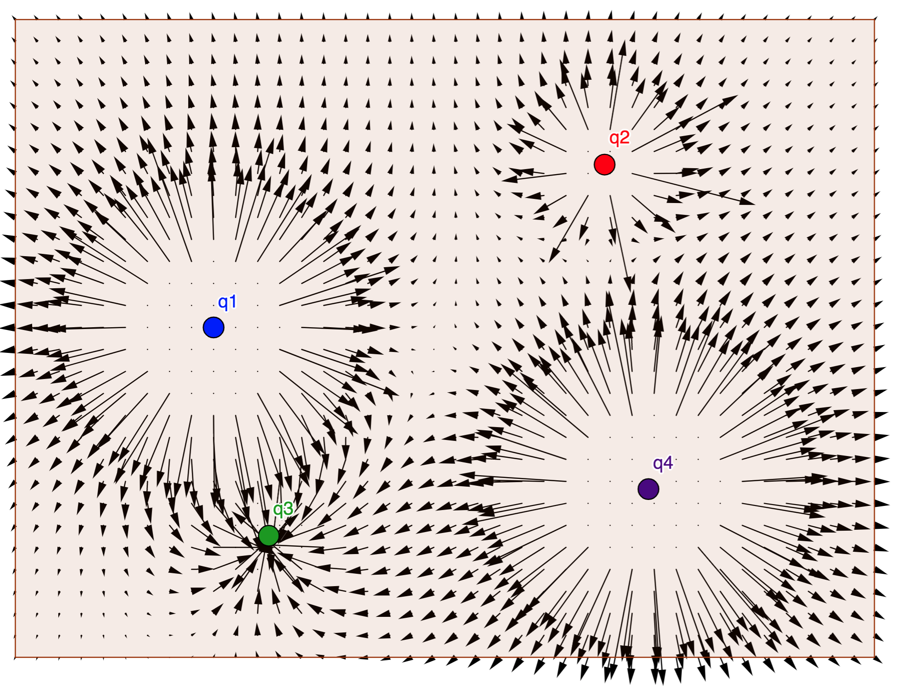
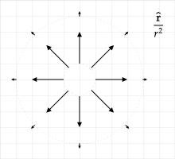

# Field Lines

Previously vector fields were considered. One of the limitations of vector fields diagrams is that the vector lengths can vary widely. In the following, electric field vectors due to four point charges is shown. (This diagram was created with a [Geogebra App](https://tutorial.math.lamar.edu/classes/calciii/VectorFields.aspx)). The vectors near the point charges are not shown because they are too long. In addition, the lines for the vector lengths at points far away from the point charges are not visible.

Another way of visualizing a vector field is with a field line diagram. The following diagram was created by setting equal the lengths of the vectors in the previous diagram. This is not a field line diagram, however. This is still a type of vector field diagram, one in which the vector lengths are all equal.

In this diagram, one can more easily see the general variations in the direction of the field. A field line diagram is similar to this diagram in the sense that it allows you to determine the direction of the field at various points in space. However, it differs in how it is constructed. In the diagram below, vectors were drawn at pre--selected points. In a field line diagram, lines are drawn from a starting point by following an algorithm and the locations with a field line depend on the choice of the starting point.

% For solution, discuss this app:
% https://academo.org/demos/electric-field-line-simulator/

Field lines are computed with the following algorithm:

* Pick a starting point $(x,y)$ in space. Estimate the field vector direction there (ignore the magnitude).
* Take a small step along this vector to another point. Estimate the field direction at this point. Pay particular attention to how the direction changes relative to the previous direction. Connect this point to the previous point with a straight line.
* Repeat 2. until you step off the page, step into a charge, or reach a location where the electric field is zero.
* Repeat 1.-3. until you have as many field lines as desired.

> A field line tells you the direction of force at a given point on the line. A common misconception is that the field line is the path along which a particle will move if released at any point on the line. This is not true in general.

## Example -- Constant Field

Near Earth, the force exerted by Earth on a mass is $\mathbf{F}=-mg\yhat$. Draw field lines for $\mathbf{F}$.

In the following diagram, the starting point is $a_1$. At this point, the direction of force is downwards and a short vector was drawn, where the length corresponds to the length of the step. At point $a_2$, this process was repeated. The field line is created by drawing a line through these short vectors. To complete the diagram, field lines with starting points $a_2$ and $a_3$ were created. The final field line diagram is shown on the right. To create it, vectors associated with the small steps were replaced with a line and a single arrow was used to show direction.

The interpretation of this diagram is that at any point, the direction of the force on a particle placed there is downwards. As noted earlier, a common misconception is that the field line corresponds to the path of a particle. To see that this is not true in general, consider a particle released with zero vertical velocity a horizontal velocity at point $a_1$. As shown in the following figure, the trajectory of the particle will be a parabola and the trajectory will cross field lines.

## Example - Inverse Square Law

The draw field associated with $\mathbf{A} = \boldsymbol{\hat{r}}/r^2$ starting at the points $s=1$, $\theta=0, \pi/4, ..., 2\pi$.

**Answer**: The vector fields associated with the given vector were considered in [Vector Fields](vector_fields.html#vector-fields), and the diagram found is shown below.

On the left diagram in the following figure, the inner vectors correspond to the first step for starting points at $r=1$, $\phi=0,\pi/4,...$ in the $x$--$y$ plane. Without taking an additional step, we can note that all steps will be radial and outward. Therefore, the field lines point radially outward, as shown in the diagram on the right. Note that the field lines were extended inwards towards the origin because if the starting point had been on a circle with a radius of near zero, the field lines would still follow a radial path outwards.

What would be the path of a particle that has a horizontal velocity at a point for which $y\gt 0$?

## Example

Plot field lines associated with the two starting points $(x,y)=(1,0)$, $(x,y)=(1,1)$, and $(x,y)=(0,1)$ for $\mathbf{A} = x\xhat + y^2\yhat$.

**Answer**: Three steps were taken for each starting point and are shown on the left of the following figure.

At $(x,y)=(1,0)$, the slope is $0$ and a small step was taken that ends at $(x,y)=(1.5,0)$. At this point, the slope of the vector is still $0$, and a small step from this point was taken that ends at $(x,y)=(2.0,0)$. At this point, the slope of the vector is still $0$, and a small step from this point was taken that ends at $(x,y)=(2.5,0)$. A similar process was used for the field line starting at $(x,y)=(0,1)$.

At $(x,y)=(1,1)$, the vector is $\mathbf{A} = \xhat + \yhat$ and a line with a slope of $1$ is drawn. The first step ends at $(x,y)=(1.5,1.5)$ at which point $\mathbf{A} = \xhat + 2.25\yhat$ and a short line with the slope of $2.5$ is drawn. An exact calculation of the slope was not performed for the third step. Based on the equation, we expect the slope to continue to increase as we step.

## Problem

Plot field lines associated with the two starting points shown in the diagram for $\mathbf{A}=-\sin\phi\xhat + \cos\phi\yhat$. Draw the field lines until they encounter the $-x$--axis.

## Problem

1\. Plot field lines associated with a positive point charge at $(x,y,z)=(1,0,0)$.

2\. Plot field lines associated with a positive point charges at $(x,y,z)=(\pm 1,0,0)$.

