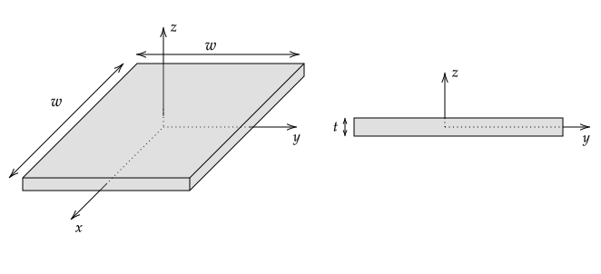

# Study Guide

The final exam will have five problems. It is from 10:30 am - 1:15 pm on Thursday, December 9th, in Innovation Hall, room 131.

Ideally, you would prepare by 

1. Redoing the homework problems without looking at the solution (and only looking at the part that you need to take another step if you are stuck).

  In many homework problems, I have asked you to figure out the solution's features before attempting to find them. Thinking about the expected features of the solution when you are stuck often helps and is much more beneficial than checking the solution.

2. Doing the example and supplementary problems in the notes; and

3. Doing the example problems in chapters 2-6 of Griffiths related to the problems in 1. and 2. above.

I spoke with many students who did poorly on the first exam. A common part of their description of their preparation involved memorizing equations and reading solutions. As I have discussed many times, reading solutions are essentially a waste of time. You may instead want to use your time more productively by, say, playing tiddlywinks or Goat Simulator.

At this point, having someone who knows how to solve a problem explain its solution to you is also generally a waste of time. It is 50x more helpful if you present your solution and thought process to someone else. If you get stuck, seek out only suggestions for things to think about.

----

**Problem 1.** will be a short answer problem involving one or more of: Conceptual questions on [Gauss's law](gauss_law.html) and/or Ampere's law, and drawing the vector field for a given charge or current distribution.

**Problems 2. and 3.** will involve two of

* Finding an integral for $\mathbf{E}$ for a continuous charge distribution (the integral will not need to be evaluated; you will need to be able to do all of the other steps). See problems in [Continuous Charge Distributions](continuous_charge_distributions.html).
* Finding $\mathbf{E}$, $V$, and $\sigma$ for charge distributions and conductor shapes for which Gauss's law can be used. See problems in [Gauss's law](gauss_law.html). Explaining the reason Gauss's law can or cannot be used.
* 1--D boundary value problems -- Derive the general equation for $V$ in cartesian, cylindrical, and spherical. See problems in [1-D Boundary Value Problems](boundary_value_problems.html#1-d). Find $V$ given boundary conditions. Find $\sigma$ given $V$ (as was done in [HW 5.2](hw5.html#1-d-boundary-value-problem)). Also, solving a problem using only Gauss's law (as was done in [HW 5.1](hw5.md!#spherical-capacitor)).
* 2--D cartesian boundary value problems (either find an equation that satisfies 3 of the 4 boundary conditions or given an equation that satisfies 3 of the four boundary conditions, find $V$ using Fourier's trick). For this, do examples 3.3 and 3.4 of Griffith's, the homework problems, and variations on the homework problem ($V_o$ at all possible sides, for example). See also [2-D Boundary Value Problems](boundary_value_problems.html#1-2-cartesian).
* Finding the exact equation for $\mathbf{E}$ and $V$ for a discrete charge distribution and using the binomial expansion equation to find an approximation at large distances from the charges.
* Using the general [monopole expansion equation](monopole_expansion.html) to find an approximate expression for $V$ due to one or more point charges.

**Problems 4. and 5.** will involve two of

* Computing $\sigma_b$ and $\rho_b$ given $\mathbf{P}$
* Computing the electric field due to bound surface or volume charges.
* Computing the total electric field for a polarizable object immersed in an external electric field.
* Finding the force on a current--carrying object given an external magnetic field.
* Using the Biot--Savart equation to find the magnetic field due to a current--carrying object.
* Using Ampere's law, if applicable, to find the magnetic field. Explaining the reason Ampere's law can or cannot be used.
* Computing $\mathbf{K}_b$ and $\mathbf{J}_b$ given $\mathbf{M}$
* Computing the magnetic field due to the bound surface or volume currents.
* Computing the total magnetic field when a magnetizable object is immersed in an external magnetic field.

The equations that you should understand and know without reference are

* Differential lengths for a circle or an curve; differential areas for a cylinder's cap or side; differential area for a sphere; differential volume for a cylinder and sphere.
* The general equation for Coulomb's Law for a point charge and charge densities;
* The general equation for electric potential due to a point charge;
* Gauss' Law in integral and differential form with an understanding of the meaning of all terms;
* Integral and differential relationship between electric field and electric potential;
* Gradient, divergence, and Laplacian in cartesian coordinates;
* "Basic" derivatives and integrals;
* The general equation for the Lorentz Force law;
* The general equation for the Biot--Savart law for a current loop;
* Ampere's law in integral and differential form;
* The equations for bound charge densities and bound current densities;
* Any equations not in this list will be given as needed.

I do not provide an equation sheet for the above equations because a significant amount of learning takes place when you are forced to come up with a way to remember these equations. For example, if you are very good at applying Gauss's law, you do not need to memorize the electric field due to an infinite sheet of charge or the electric field inside and outside of a uniformly charged sphere. These equations can be derived in less than a minute using Gauss's law and a bit of physical reasoning.

I will pay even more attention to notation on this exam. For example,

1. equations for scalars should not be written with unit vectors on the right-hand-side; and
2. integrals over a closed surface or line should be written as $\oint$.

Regarding item 1. above, it is understandable that sometimes unit vectors are dropped or arrows above variables are missed. However, if these errors are too frequent, I must assume that you don't understand basic vector notation and factor this into your score accordingly.

When I am grading, I am looking for evidence that you understood something.  If you are stuck, explain what you understand. Note that writing an equation that you have memorized that is related to the problem only shows a minimal amount of understanding. 

%A -- Can explain at a conceptual level how to solve HW problems and Griffiths example problems correctly and can justify all of the steps. Evidence for this is solutions to exam problems with correct justifications, most of the needed justifications addressed, and a few algebraic errors. In addition, when the final solution does not make sense, the reason is stated.

%C -- Difficulties solving problems that were covered in a freshman--level physics course. Weak understanding of the justifications and motivations for steps in HW problems and Griffiths example problems. 

%F -- A lack of understanding of fundamental concepts covered in freshman--level physics course. Evidence for this includes writing equations that are correct but not related to the problem, writing solutions that are clearly wrong based on basic concepts without an explanation why the solution is clearly wrong.

# Exam

**PHYS 305 Final Exam** | December 9th, 2021

* Write your name on all pages.
* Solve all five problems.
* Each problem is equally weighted.

**Equations**

$\nabla f = {\partial f \over \partial s}\hat{\boldsymbol s}+ {1 \over s}{\partial f \over \partial s}\hat{\boldsymbol \phi}+ {\partial f \over \partial z}\hat{\mathbf z}$

$\boldsymbol{\nabla}\cdot\mathbf{U}={1 \over s}{\partial \left( s U_s  \right) \over \partial s}+{1 \over s}{\partial U_\phi \over \partial \phi}+{\partial U_z \over \partial z}$

$\boldsymbol{\nabla}\times \mathbf{U} = 
\left({\frac {1}{s }}{\frac {\partial U_{z}}{\partial \phi }}-{\frac {\partial U_{\phi }}{\partial z}}\right) {\hat {\boldsymbol {s }}}
+
\left({\frac {\partial U_{s}}{\partial z}}-{\frac {\partial U_{z}}{\partial s}}\right) {\hat {\boldsymbol {\phi }}}
+
{\frac {1}{s}}\left({\frac {\partial \left(s U_{\phi }\right)}{\partial s}}-{\frac {\partial U_{s}}{\partial \phi }}\right) {\hat {\mathbf {z} }}$

$\mathbf{\nabla} f = {\partial f \over \partial r}\hat{\mathbf r}+ {1 \over r}{\partial f \over \partial \theta}\hat{\boldsymbol \theta}+ {1 \over r\sin\theta}{\partial f \over \partial \phi}\hat{\boldsymbol \phi}$

$\boldsymbol{\nabla}\cdot\mathbf{U}={1 \over r^2}{\partial  \over \partial r}\left( r^2 U_r \right) + {1 \over r\sin\theta}{\partial \over \partial \theta} \left(  U_\theta\sin\theta \right) + {1 \over r\sin\theta}{\partial U_\phi \over \partial \phi}$

$\boldsymbol{\nabla}\times \mathbf{U} =
{\frac {1}{r\sin \theta }}\left({\frac {\partial }{\partial \theta }}\left(U_{\phi }\sin \theta \right)
-
{\frac {\partial U_{\theta }}{\partial \phi }}\right) {\hat {\mathbf {r} }}
+
{\frac {1}{r}}\left({\frac {1}{\sin \theta }}{\frac {\partial U_{r}}{\partial \phi }}
-
{\frac {\partial }{\partial r}}\left(rU_{\phi }\right)\right) {\hat {\boldsymbol {\theta }}}
+
{\frac {1}{r}}\left({\frac {\partial }{\partial r}}\left(rU_{\theta }\right)
-
{\frac {\partial U_{r}}{\partial \theta }}\right) {\hat {\boldsymbol {\phi }}}$

$\mathbf{P}=\epsilon_o\chi_e\mathbf{E}$

## Ampere's Law

% Copied to notes

The infinitely long solid cylinder shown on the left in the following figure carries a current in the $+z$ direction. In a., b., and c., the loops shown as dotted lines are in the $y$--$z$ plane. In d., e., and f., the loops are in the $x$-$y$ plane.

1. Which, if any, of loops a.--f. can be used with Ampere's law to find $B_\phi$? 
2. For each of the loops not selected for your answer to part 1., explain why they cannot be used with Ampere's law to find $B_\phi$.
2. Assuming that the radius of the cylinder is $R$ and that it carries a current $I$, what is $\boldsymbol{\nabla}\times\mathbf{B}$ inside and outside of the cylinder?

## Monopole Expansion

% Copied to notes

For $r\gg r'$, the potential at $\mathbf{r}$ due to a point charge $q$ at $\mathbf{r}'$ can be written as

$\displaystyle V = \frac{kq}{\char"0509} = \frac{kq}{r}\sum_{n=0}^\infty\left(\frac{r'}{r}\right)^nP_n(\cos\alpha)$

where $\alpha$ is the angle between $\mathbf{r}$ and $\mathbf{r}'$ and $P_n$ are Legendre polynomial functions.

1. Find $V(r, \theta, \phi)$ for a point charge $q$ at $(x,y,z)=(b,b,0)$ by keeping only the $n=0$ and $n=1$ terms. Note that $P_0(u)=1$ and $P_1(u)=u$.
2. Use the $V$ found in part 1. to find the $\hat{\mathbf{r}}$ component of $\mathbf{E}$ in spherical coordinates.

## Gauss's Law and Potential Differences

% Copied to notes

The following figure shows a cross section of three spherical objects.

* For the charged solid sphere within $r\le R$, $\rho=(Q/\pi R^4)r$
* The net charge on the conducting shell is $-Q$. This shell has an inner radius of $2R$ and an outer radius of $3R$.
* The ("frozen in") polarization of the polarized outer shell is $\displaystyle\mathbf{P}=\frac{P_o}{4\pi}\frac{R^2}{r^2}\hat{\mathbf{r}}$. This shell has an inner radius of $4R$ and an outer radius of $5R$.

1. Find $E_r(r)$
2. Find the potential difference between the charged solid sphere and the inner surface of the conductor (that is, find $V(2R)-V(R)$).

\newpage
    
## Polarizable Object

% Copied to notes

A slab of polarizable material is placed between two infinite sheets of charge as shown in the following figure.

The slab is between $y=t$ and $y=2t$ and is infinite in extent in the $x$ and $z$ directions. The bottom sheet of charge is in the $y=0$ plane and has a charge density of $\sigma_o$. The top sheet of charge is in the $y=3t$ plane and has a charge density of $-\sigma_o$.

You may assume without proof that $\rho_b=0$.

1. Find and plot $E_y(y)$ if the slab has an electric susceptibility of $\chi_e=0$.
2. Find and plot $E_y(y)$ if the slab has $\chi_e=0.5$.
3. Compute the potential difference between  $y=3t$ and $y=0$ (that is, find $V(3t)-V(0)$).

## Current--Carrying Slab

% Copied to notes

The slab shown on the left in the following figure carries a current density of $J_o\xhat$. A cross section of the slab is shown on the right. Assume $w\gg t$ so that the slab can be treated as infinite in the $x$ and $y$ directions.

1. What is the direction of $\mathbf{B}$ outside of the slab ($z\gt t/2$ and $z\lt -t/2$)?
2. What is $\mathbf{B}$ in the $x$--$y$ plane?
3. Find $\mathbf{B}(z)$

%**Answer**
%
%1. $z\gt +t/2$, $\mathbf{B}$ in $-\yhat$
%
%    $z\lt -t/2$, $\mathbf{B}$ in $+\yhat$ 
%    
%2. $\mathbf{B}=0$
%
%3. Inside, $B_y=-\mu_oJ_oz$.
%
%    $z>+t/2$, $B_y=-\mu_oJ_ot/2$
%    
%    $z<-t/2$, $B_y=+\mu_oJ_ot/2$
