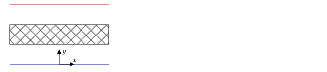

**PHYS 305 Make-up Final Exam** | December 15th, 2021

* Write your name on all pages.
* Solve all five problems.
* Each problem is equally weighted.

**Equations**

$\mathbf{P}=\epsilon_o\chi_e\mathbf{E}$

$\displaystyle \mathbf{M}=\frac{\chi_m}{\mu_o(1+\chi_m)}\mathbf{B}$

$\nabla f = {\partial f \over \partial s}\hat{\boldsymbol s}+ {1 \over s}{\partial f \over \partial s}\hat{\boldsymbol \phi}+ {\partial f \over \partial z}\hat{\mathbf z}$

$\boldsymbol{\nabla}\cdot\mathbf{U}={1 \over s}{\partial \left( s U_s  \right) \over \partial s}+{1 \over s}{\partial U_\phi \over \partial \phi}+{\partial U_z \over \partial z}$

$\boldsymbol{\nabla}\times \mathbf{U} = 
\left({\frac {1}{s }}{\frac {\partial U_{z}}{\partial \phi }}-{\frac {\partial U_{\phi }}{\partial z}}\right) {\hat {\boldsymbol {s }}}
+
\left({\frac {\partial U_{s}}{\partial z}}-{\frac {\partial U_{z}}{\partial s}}\right) {\hat {\boldsymbol {\phi }}}
+
{\frac {1}{s}}\left({\frac {\partial \left(s U_{\phi }\right)}{\partial s}}-{\frac {\partial U_{s}}{\partial \phi }}\right) {\hat {\mathbf {z} }}$

$\mathbf{\nabla} f = {\partial f \over \partial r}\hat{\mathbf r}+ {1 \over r}{\partial f \over \partial \theta}\hat{\boldsymbol \theta}+ {1 \over r\sin\theta}{\partial f \over \partial \phi}\hat{\boldsymbol \phi}$

$\boldsymbol{\nabla}\cdot\mathbf{U}={1 \over r^2}{\partial  \over \partial r}\left( r^2 U_r \right) + {1 \over r\sin\theta}{\partial \over \partial \theta} \left(  U_\theta\sin\theta \right) + {1 \over r\sin\theta}{\partial U_\phi \over \partial \phi}$

$\boldsymbol{\nabla}\times \mathbf{U} =
{\frac {1}{r\sin \theta }}\left({\frac {\partial }{\partial \theta }}\left(U_{\phi }\sin \theta \right)
-
{\frac {\partial U_{\theta }}{\partial \phi }}\right) {\hat {\mathbf {r} }}
+
{\frac {1}{r}}\left({\frac {1}{\sin \theta }}{\frac {\partial U_{r}}{\partial \phi }}
-
{\frac {\partial }{\partial r}}\left(rU_{\phi }\right)\right) {\hat {\boldsymbol {\theta }}}
+
{\frac {1}{r}}\left({\frac {\partial }{\partial r}}\left(rU_{\theta }\right)
-
{\frac {\partial U_{r}}{\partial \theta }}\right) {\hat {\boldsymbol {\phi }}}$

# Ampere's Law

In cylindrical coordinates with cylindrical unit vectors, the magnetic field can be written in the form

$\mathbf{B}(s,\phi,z)=B_s(s,\phi,z)\hat{\mathbf{s}}+B_\phi(s,\phi,z)\hat{\boldsymbol{\phi}}+B_z(s,\phi,z)\zhat$

To find $B_\phi$ due to current flowing along an infinitely long wire that runs along the $z$-axis, Ampere's law can be used.

1. Explain why $B_s$ and $B_z$ are zero.
2. When using Ampere's law to find $B_\phi$, a justification must be made for why $B_\phi$ is independent of $\phi$.
    1. Provide this justification.
    2. Explain where this justification is used.

\newpage

# Boundary Value Problem

The cross--section of a long conducting duct is shown in the following figure. Three of the sides are held at $V=0$ and the bottom side is held at $V=V_o$.

Find $V(x,y)$.

# Charge on Cylinder

Charge is uniformly distributed on the curved surface of a cylinder of length $h$ and radius $R$. The cylinder is centered on the origin, aligned with the $z$--axis, and has a charge density of $\sigma_o$.

Find an equation for $\mathbf{E}$ on the $z$--axis in terms of a single integral with an integrand that depends only on $dz'$, $z'$, $z$, and $R$. You do not need to evaluate the integral.

# Magnetizable Object

A slab of magnetizable material is placed between two infinite current--carrying sheets shown in the following figure. The cross section below is in the $z=0$ plane.

The slab is between $y=t$ and $y=2t$ and is infinite in extent in the $x$ and $z$ directions. The bottom sheet is in the $y=0$ plane and carries a surface current with density of $K_o\xhat$. The top sheet is in the $y=3t$ plane and carries a surface current with density of $-K_o\xhat$.

You may assume without proof that $\mathbf{J}_b=0$.

1. Find and plot $B(y)$ if the slab has a magnetic susceptibility of $\chi_m=0$.
2. Find and plot $B(y)$ if the slab has $\chi_m=0.5$.

\newpage

# Current--Carrying Slab

The slab shown on the left in the following figure carries a current density of $J_o\xhat$. A cross section of the slab is shown on the right. Assume $w\gg t$ so that the slab can be treated as infinite in the $x$ and $y$ directions.

1. What is the direction of $\mathbf{B}$ outside of the slab ($z\gt t/2$ and $z\lt -t/2$)?
2. What is $\mathbf{B}$ in the $x$--$y$ plane?
3. Find $\mathbf{B}(z)$

