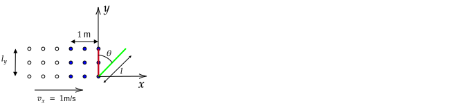

# Introduction

Flux means "flow". In this tutorial, the rate of flow of particles (in units of particles per second) past a point, line, and area will first be considered. The rate of flow of particles past depends on the particle density and velocity.

In this course, you will use the techniques covered here in two different ways:

1. When computing electric current, you will need to compute the rate of flow of charged particles past a point, line, or area. You will use the same techniques used here and then multiply the result by the charge per particle to arrive at a current.

2. In the development of E&M, Faraday and Maxwell supposed that electric and magnetic field vectors produced a flux -- in place of the particle density times the velocity vector, they used the electric and magnetic field. In this case, although we speak of electric and magnetic flux, it is important to remember that these fluxes are abstractions; there is no flow of particles. Although electric and magnetic fluxes are not associated with the flow of particles, the techniques used for particle flux apply.

> **Caution**: When dealing with electric and magnetic flux, don't think of the flow of particles -- just think about vectors.

This section is primarily a mathematical review of flux and requires the use of normal vectors, which were reviewed previously. You will use electric flux in when Gauss's law (Chapter 3) is covered and magnetic flux when the Biot--Savart law is covered (Chapter 5) and also when Faraday's law is covered (Chapter 7). Particle flux will be used when computing current distributions for use in the Biot-Savart law (Chapter 5).

Finally, electric and magnetic flux are a fundamental component of divergence and the divergence theorem, which is covered next.

# Particle Flux

In this section, the flux quantity is $\dot{N}$, which corresponds to a number of particles per second.

## Past a point

### Example

The particles shown as dots travel at a velocity of 1 m/s to the right. What is $\dot{N}$, the number of particles pass the point shown in one second?

**Answer**:

In one second, all of the blue particles pass the point, so $\dot{N}=3/s$. More generally

$$\dot{N}=\lambda v$$

where $\lambda$ is the number of particles per unit length and $v$ is the magnitude of the speed, both evaluated at the point.

### Example

The particles shown as dots flow outward from a source at the origin with a constant velocity. What is $\dot{N}$ out of the region between $x = \pm 1$? Assume that outward flow corresponds to positive $\dot{N}$.

**Answer**:

The flux past $x=-1$ is $\lambda v$ and past $x=+1$ is $\lambda v$. Both are postive because the flow is outward of the region. 

To generalize this, we can state that the flux into or out of a linear region is

$$\dot{N} = \lambda\mathbf{v}\bfcdot \hat{\mathbf{n}}$$

where the vector $\hat{\mathbf{n}}$ is defined to point outward from the linear region on its endpoints. With this convention, if $\dot{N}$ is positive, there is a net flow out of the region; if $\dot{N}$ is negative, there is a net flow into the region. We will use this convention also with flow out of a closed area and a closed volume.

Repeating the previous problem

At $x=-1$, $\mathbf{v}=-v\xhat$ and $\hat{\mathbf{n}}=-\xhat$, so $\dot{N}_{x={-1}}=\lambda (-v\xhat)\bfcdot(-\hat{\mathbf{n}}\xhat)=\lambda v$

At $x=+1$, $\mathbf{v}=+v\xhat$ and $\hat{\mathbf{n}}=+\xhat$, so $\dot{N}_{x={+1}}=\lambda (+v\xhat)\bfcdot(+\hat{\mathbf{n}}\xhat)=\lambda v$

So the total flux out of the region between $x=\pm 1$ is

$\dot{N} = \dot{N}\_{x={-1}} + \dot{N}\_{x={+1}} = 2\lambda v$

### Problem

Particles flow as shown in the following figure. When a particle encounters the origin, it is absorbed and does not continue to flow (another expression for this is "the origin is a sink").

Use the equation $\dot{N} = \lambda\mathbf{v}\bfcdot \hat{\mathbf{n}}$ to find the the flux into or out of the region between $x=\pm 1$.

## Through a Line

In this section, we consider computing the flux of particles through an open line (a line that does not form a closed loop) and then the flux of particles into or out of a region bounded by a closed loop.

%The primary result is that if particles are emitted  from a point with constant velocity and uniformily in all directions, 

### Through an Open Line

Each of the $18$ particles shown as dots travels at a velocity of $v_x=$1 m/s to the right. All of the particles are in the $x$-$y$ plane. In one second, how many particles flow through the red line per second?

In one second, all of the blue dots pass through the red line, so $N = 3\cdot 3$ particles pass through the rectangle per second.

In more general terms, we can write

$$\dot{N} = \sigma v_x l_y$$

where $\dot{N}$ is the number particles that pass through the line per second, $\sigma$ is the number of particles per unit area and $l_y$ is the length of the red line that particles pass through.

Next, suppose we wanted to compute the number of particles that pass through the green line per second. In this case, we note that that the number of particles that pass through the green line is the same as the number of particles that pass through the red line. Although the green line is longer, the flux is still $\dot{N} = n v_x l_y$, which is justified by this observation.

Note that in the previous paragraph, we found a new line that was perpendicular to the velocity to compute the flux through green line. Equivalently, we can multiply the component of velocity that is perpendicular to the green line by the length of the green line. That is, we break the velocity vector into two components -- a component parallel to the line and a component perpendicular to it.

In the left-hand side of the diagram below, the velocity of one of the particles that is on the green line is broken down into components parallel and perpendicular to it. The right-hand side shows the a flow of particles parallel to the green line, which do not contribute to the flux, and perpendicular to the green line, which do contribute to the flux.

The component of velocity that is perpendicular to the green line is $v_{\perp}=v_x\cos\theta$ and so the flux through the green line is $\dot{N} = \sigma (v_x\cos\theta) l = \sigma v_x (l\cos\theta) = n v_x l_y$, where $l_y=l\cos\theta$ was used in the last step. This is the same answer as found previously.

In summary, to compute the flux through the green line, we could equivalently

1. Find the component of the green line that is perpendicular to the velocity; or
2. Find the component of the velocity that is perpendicular to the green line.

Using the definition of the dot product, $\mathbf{A}\bfcdot \mathbf{B}=AB\cos\theta$, we can write

$$\dot{N} = \sigma \mathbf{v}\bfcdot\hat{\mathbf{n}} l$$

where a normal vector $\hat{\mathbf{n}}$ was used. This normal vector is defined to be perpendicular to the line through which the flux is computed. For a given line, two normal directions can be defined. As a result, if the computed $\dot{N}$ is positive, there is a net flow through the line in the direction of $\hat{\mathbf{n}}$; if the computed $\dot{N}$ is negative, there is a net flow through the line in the direction opposite of $\hat{\mathbf{n}}$.

#### Example

For $\mathbf{v}=v_x\xhat$, use the equation $\dot{N} = n \mathbf{v}\cdot\hat{\mathbf{n}} l$ to find $\dot{N}$ through (1) the red and (2) the green line.

**Answer**

(1) For the red line, the line perpendicular to it that points to the right is $\hat{\mathbf{n}}=\xhat$, so

$$\dot{N} = \sigma \mathbf{v}\cdot\hat{\mathbf{n}}l = \sigma (v_x\xhat)\cdot(\xhat) l_y = \sigma v_x\xhat\cdot\xhat l_y$$

Because the answer is positive, there is a net flow across the line in the direction of the chosen direction of the normal vector (from left to right). If we would have chosen the normal vector to be $\hat{\mathbf{n}}=-\xhat$, $\dot{N}$ would be negative and we would conclude there is a net flow in the direction opposite of $\hat{\mathbf{n}}$ (corresponding to left to right).

(2)

From the diagram above, a unit vector normal to the green line is $\hat{\mathbf{n}}=\cos\theta\xhat-\sin\theta\yhat$, so

$\dot{N} = \sigma \mathbf{v}\bfcdot\hat{\mathbf{n}} l = \sigma (v_x\xhat)\bfcdot(\cos\theta\xhat-\sin\theta\yhat) l$

$\phantom{\dot{N}}= \sigma v_x \cos\theta l = \sigma v_x l_y$

where $l_y=l\cos\theta$ was used in the last step. This answer is the same as that in part (1), which is expected because the same number of particles flow past the red line per second as flow across the green line.

#### Problem

For $\mathbf{v}=v_y\yhat$, use the equation $\dot{N} = \sigma \mathbf{v}\cdot\hat{\mathbf{n}} l$ to find $\dot{N}$ through (1) the red and (2) the green line. Use the same normal vector as in the previous example.

#### Example

If $\mathbf{v}=v_x\xhat+v_y\yhat$, compute $\dot{N}$ through the green line.

**Answer**:

To answer this, we can use (a) superposition or (b) $\dot{N} = \sigma \mathbf{v}\cdot\hat{\mathbf{n}} l$. 

(a)

In the previous problem, you computed $\dot{N}$ when $\mathbf{v}=v_y\yhat$ and should have found $\dot{N}=-\sigma v_y l\sin\theta$. In the first example, $\dot{N}$ was computed for $\mathbf{v}=v_x\xhat$ and found $\dot{N}=\sigma v_x l\cos\theta$. In both cases, the same normal vector was used. 

As a result,

$$\dot{N} = \sigma v_x l\cos\theta - \sigma v_y l\sin\theta$$

(b)

$\dot{N} = \sigma \mathbf{v}\cdot\hat{\mathbf{n}} l =  \sigma (v_x\xhat+v_y\yhat)\cdot(\cos\theta\xhat-\sin\theta\yhat) l$

$\phantom{\dot{N}}=\sigma v_x l\cos\theta - \sigma v_y l\sin\theta$

which is the same as that found in part (a) using superposition. Recall that the sign of $\dot{N}$ can be positive or negative depending on the values of the constants $v_x$, $v_y$, and $\theta$. If $\dot{N}$ is negative, it means that the net flow of particles is in the direction oppostive to the normal vector drawn on the diagram above.

### Using Integration

Suppose that $\sigma$ and $\mathbf{v}$ are not constant over the red line of length $l$ as depicted in the following diagram.

In this case, we can first compute the number of particles that pass through an infinitesimal length $dl$ on $l$ over which $\sigma$ and $\mathbf{v}$ are constant. Replacing $N$ with $dN$ and $l$ with $dl$ gives the flux through $dl$:

$$d\dot{N} = \sigma(l) \mathbf{v}(l)\cdot\hat{\mathbf{n}} dl$$

To find the total number that pass through $L$, sum over all differential lengths on a line $\mathcal{L}$

$$\dot{N} = \int_{\mathcal{L}} \sigma(l) \mathbf{v}(l)\cdot\hat{\mathbf{n}} dl$$

#### Example

If $\sigma=\sigma_o y/l_y$ and $\mathbf{v}=v_x\xhat$,

1. sketch particles with the given density and velocity variation and determine if the flux is expected to be smaller, equal, or larger than the flux if $\sigma=\sigma_o$.

Then find the flux that 

2. passes through the red line and
3. passes through the green line.

**Answer**:

1\. The following diagram shows a density that is increasing linearly with $y$ and is zero when $y=0$ as was given in this problem. It also shows that the velocity does not change over the line.

At the top, $y=l_y$, and the density is $\sigma_o$. Because the density is lower on all other parts of the line, we expect the flux to be less than $\sigma_ov_xl_y$.

2\. The flux that passes the red line is

$$\dot{N} = \int_0^{l_y} \sigma_o \frac{y}{l_y} v_x dl=\frac{\sigma_o}{2}v_xl_y$$

This result is less than $\sigma_o v_x l_y$, which was expected. The fact that the answer is 1/2 of this makes sense because the average density on the line is $\sigma_o/2$.

3\. The flux is the same as 1.

#### Problem

If $\sigma=\sigma_o$ and $\mathbf{v}=(v_x y/l_y)\xhat$,

1. sketch particles with the given density variation and velocity, determine if the flux is expected to be smaller, equal, or larger than the flux if $\mathbf{v}=v_x\xhat$.

Then find the flux that 

2. passes through the black line and
3. passes through the green line.

#### Example

Compute $\dot{N}$ through the half--circle shown as a solid line. Use $\sigma=\sigma_o$.

**Answer**

The easy way to solve this problem is to note that the number of particles that pass through the solid line in a given second must also pass through the dotted line (of length $2R$) in a given second. As a result, the flux is

$$\dot{N}=\sigma_ov_x(2R)=2 \sigma_o v_x R$$

The difficult way to solve this problem is to find the vector normal to the solid black line and then use

$$\dot{N} = \int_0^{L} \sigma(l) \mathbf{v}(l)\cdot\hat{\mathbf{n}} dl$$

As covered in [Vectors](vectors.md#normal-unit-vectors) the outward normal of a circle is $\hat{\mathbf{s}}$, so $\hat{\mathbf{n}}=\cos\phi\xhat+\sin\phi\yhat$, which is shown in black in the following diagram.

To be consistent with the previous calculation, we should multiply $\hat{\mathbf{n}}$ by $-1$ so that we are computing the flux through the line with positive flux corresponding to flow from left to right. The corresponding normal vector is shown in blue in the diagram above.

Substition of $\hat{\mathbf{n}}=(-1)(\cos\theta\xhat+\sin\theta\yhat)$, $\mathbf{v}=v_x\xhat$, and $\sigma = \sigma_o$ gives 

$\dot{N} = \int_0^{L} \sigma_o v_x\xhat\cdot(-1)(\cos\theta\xhat+\sin\theta\yhat) dl$

$\phantom{\dot{N}} = -\int_0^{L} \sigma_o v_x\cos\theta dl$$

In this integral, $\theta$ depends on the position along the curved line. As a result, we need to re-write the integrand so that either $dl$ is written in terms of $\theta$ or $\theta$ is written in terms of $l$. It is easier to do the former using $dl=R d\theta$. Substitution gives

$\dot{N} = -\int_{\pi/2}^{3\pi/2} \sigma_o v_x\cos\theta Rd\theta$

$\phantom{\dot{N}} =-\sigma_ov_xR\sin\theta\Big|^{3\pi/2}_{\pi/2}=-\sigma_ov_xR(-1-1)=2 \sigma_o v_x R$

which is the same result found using the easier method.

#### Problem

Particles with constant density $\sigma_o$ flow with constant velocity $v_x$ as shown in the figure below.

Compute the flux through the circle using

$$\dot{N} = \int_0^{L} \sigma(l) \mathbf{v}(l)\cdot\hat{\mathbf{n}} dl$$

Show your steps in dsigmail and use $\sigma=\sigma_o$.

### Through a Closed Line

#### Example

A source of particles is at the origin that sends particles out radially with a velocity of $v_r$. Assume that flow out of a circle corresponds to a positive flux.

1. If the density of particles at the inner circle of radius $R$ is $\sigma_i$, what is $\dot{N}$ through the inner circle?
1. What is $\sigma_o$, the density of particles through at the outer circle of radius $2R$?
1. What is $\dot{N}$ through the outer circle of radius $2R$?

**Answer**

(1) $\dot{N}_i=\sigma_i v_r 2\pi R$. We could have used $\dot{N}=\sigma_i\mathbf{v}\bfcdot\hat{\mathbf{n}}l$; in this case $l=2\pi R$ and the velocity is in the same direction as the normal vector, so the dot product reduces to $v_r$.

(2) In the following diagram it is shown that $\sigma$ is inversely propotional to $r$. If the particles are traveling at a constant velocity outwards, the same number of particles will be on the line associated with the inner circle as the outer circle. The length of any circle is $2\pi r$, so $\sigma = (\text{num particles on } l)/(l dr) = n_o/(2\pi r dr)$, where $dr$ is the thickness of the line.

From this, we can conclude that $\sigma$ at $2R$ is $1/2$ that at $R$. That is, $\sigma_o=\sigma_i/2$.

(3) $\dot{N}_o=(\sigma_o/2) v_r 2\pi (2R)=\sigma_o v_r 2\pi R$, which is the same result as (1). This is expected - if the particles flow outwards at a constant velocity, each time a particle passes the outer circle, there is a particle behind it that passes the inner circle.

---

The previous problem is a key problem related to electric flux. In it we found found that

1. the net flux through a closed line is not zero when there is a source emitting particles inside of it, and
2. the net flux through a circle of any radius centered on the source is the same.

In fact, the net flux through a circle of any radius is the same even if the source is not at the center of the circle. This can be demonstrated with a diagram using two approaches.

**Approach I**

The above diagram shows particles flowing outwards at a constant velocity at a given point in time. The number of particles that pass the red line on the inner circle per second must equal the number per second that pass through the red line on the outer circle if the spacing between the blue dots is to remain constant. Given that this must be true if the particles flow at a constant velocity, we conclude that the flux through the inner red line must be the same as that through the outer red line. To complete the justification, note that this argument does not depend on the length of the inner red line - if it is a full circle, the same arguments apply and we conclude the flux through the inner circle must equal that through the outer circle.

**Approach II**

A mathematical way of showing this is to note that the flux through the inner differential length, $ds_i$, shown in the left of the figure above is $2 \pi R_i d\theta$ so that the differential flux through $ds_i$ is

$$dN_i=\sigma_i v_r ds_i=\sigma_i v_r 2 \pi R_i d\theta$$

and the flux through the outer differential length, $ds_o$, is $2 \pi R_o d\theta$ so the differential flux through $ds_o$ is

$$dN_o=\sigma_o v_r ds_o = \sigma_o v_r 2 \pi R_o 
d\theta$$

To show that $dN_o=dN_i$, consider equating the last two equations. This gives the requirement that

$$R_o\sigma_o=\sigma_iR_i$$

or

$$\sigma_o=\sigma_i\frac{R_i}{R_o}$$

This equation states that the density (number of particles per unit area) is inversely proportitional to distance. This is true based on the arguments given in the previous example.

A mathematical way of showing this is to note that the flux through the inner differential length, $ds_i$, shown in the diagram above is $2 \pi R_i d\theta$ so that the differential flux through $ds_i$ is

$$dN_i=\sigma_i v_r ds_i = \sigma_i v_r 2 \pi R_i d\theta$$

and the flux through the outer differential length, $ds_o=2 \pi R_o d\theta$,w is

$$dN_o=\sigma_o v_r ds_o = \sigma_o v_r 2 \pi R_o d\theta$$

Previously we argued that if the particles flow outwards with a constant velocity, then the number of particles on a circle of radius $R_i$ will be the same as that on a circle of radius $R_o$ so that

$$\sigma_o R_o=\sigma_i R_i \qquad \text{or} \qquad \sigma_o = \sigma_i\frac{R_i}{R_o}$$

Subsituting this into the equation for $dN_o$ gives $dN_o=dN_i$:

$$dN_o=\sigma_o v_r ds_o = \sigma_i\frac{R_i}{R_o} v_r 2 \pi R_o d\theta = \sigma_i v_r 2 \pi R_i d\theta$$

To finish this problem, we need to show that the flux through the outer black arc segment in the right-hand side of the figure below (a repeat of that previously shown) is the same as that through the outer red arc. 

Although visually it may be obvious that this must be true using Approach I, in the future, we will consider the flux of a general vector. In this case, we replace $\sigma \mathbf{v}$ with a vector $\mathbf{E}$ that is not related to the flow of particles and so Approach I is not valid.

The red line is longer than the black line and $v_r$ is perpendicular to the black arc segment but not the red arc segment. The length of the red arc segment is $2\pi d\theta/\cos\phi$ and the component of $v_r$ perpendicular to it is $v_r\cos\phi$. The flux through the red arc segment involves the product of its length and $v_r\cos\phi$ and as a result, the $\cos\phi$ terms cancel and the flux through the red line is the same as that through the black line, as expected from Approach I.

The aguments used in both Approach I and Approach II can be used to show that the flux through a closed line of arbitrary shape as shown in the figure below is also equal to the flux through a circle centered on the source.

#### Problem

Use a diagram to show that the the flux through a closed line of arbitrary shape is also equal to the flux through a circle centered on the source.

#### Problem

Explain why the flux through a circle that is outside a source that emits particles with a constant velocity is zero.

Does this result hold for a source that is outside of a close loop of arbitrary shape?

### Summary of Results

To indicate integration is taken over a closed line, we use and integral with a closed circle, $\oint_\mathcal{L}$.

## Through an Area

### Through an Open Area

The generalization from flux through a line to flux through an area is straightforward. Suppose the following is the cross-section of a three-dimensional diagram.

If the dots are uniformly spaced into and out of the page, and the red line is the side view of a square that goes into the page by $l_y$, then $N=3\cdot 3\cdot 3$ particles pass through the red square per second per unit of area of the red square.

In more general terms, we can write

$$\dot{N} = \rho v_x A$$

where $N$ is the number particles that pass through the rectangle per second, $\rho$ the number of particles per volume (instead of per area) and $A$ is the cross-sectional area that particles pass through (instead of the length of a line that the particles pass through). Using this equation for the diagram given above assuming the red line is the side of a square with area of $1\text{m}^2$,

$$\dot{N} = \rho v_x A = (9/\text{m}^3) (1 \text{ m}/\text{s}) (1\text{ m}^2) = 9/s$$
 
The most general equation for flux through an area is

$$\dot{N} = \int \rho \mathbf{v}\cdot \hat{\mathbf{n}}d{A}$$

where here the normal vector is a vector that is perpendicular to the surface and the integral is taken over the area of interest. Note that often the definition $d\mathbf{A}=\hat{\mathbf{n}}d{A}$ is used to write this as 

$$N = \int \rho \mathbf{v}\cdot d{\mathbf{A}}$$ 

### Through a Closed Area

# Electric Current

## Definitions

The current that flows through a wire has units of charge/s. The equation developed for $\dot{N}$ at a point on a line can be used to compute current if we re--define $\lambda$ to be the number of charges per unit length instead of the number of particles per unit length. In this case, instead of using $\dot{N}$, we use $I$:

$$I=\lambda v$$

Similarly, re--defining $\sigma$ as the number of charges per unit area, the flow of current past a line $\mathcal{L}$ is

$$I=\int_{\mathcal{L}}\sigma \mathbf{v}\bfcdot \hat{\mathbf{n}}dl$$

Finally, re--defining $\rho$ as the number of charges per unit volume, the flow of current past an area $\mathcal{A}$ is 

$$I=\int_{\mathcal{A}}\rho \mathbf{v}\bfcdot \hat{\mathbf{n}}dA$$

### Example -- Computing Total Charge Passing a Point

### Problem -- Computing Total Charge Passing a Line

## Surface Currents

When working with current flowing on a surface, we will need to use the current densities $\mathbf{K}$ and $\mathbf{J}$, respectively.

Surface currents are described and used in Chapter 5.1 of Griffiths.

### Surface Current $\mathbf{K}$

$\mathbf{K}$ has units of (charge/s)/length and is defined by

$\displaystyle \mathbf{K} \equiv \sigma \mathbf{v}$

so that

$\displaystyle I=\int_{\mathcal{L}}\sigma\mathbf{v}\bfcdot \hat{\mathbf{n}}=\int_{\mathcal{L}}\mathbf{K}\bfcdot \hat{\mathbf{n}}dl$

From which it follows that

$\displaystyle dI = \mathbf{K}\bfcdot \hat{\mathbf{n}}dl=Kdl_\perp$

Griffiths uses the equivalent definition

$\displaystyle \mathbf{K} \equiv \frac{d\mathbf{I}}{dl_\perp}$

which follows from the previous equation by multiplying by a unit vector in the direction of $\mathbf{K}$.

### Volume Current $\mathbf{J}$

$\mathbf{J}$ has units of (charge/s)/area and is defined by

$\displaystyle\mathbf{J} \equiv \rho \mathbf{v}$

so that

$\displaystyle I=\int_{\mathcal{A}} \rho\mathbf{v}\bfcdot \hat{\mathbf{n}}=\int_{\mathcal{A}} \mathbf{J}\bfcdot \hat{\mathbf{n}}dA$

From which it follows that

$\displaystyle dI = \mathbf{J}\bfcdot \hat{\mathbf{n}}dA=Jda_\perp$

Griffiths uses the equivalent definition

$\displaystyle \mathbf{J} \equiv \frac{d\mathbf{I}}{da_\perp}$

which follows from the previous equation by multiplying by a unit vector in the direction of $\mathbf{J}$.

# Electric Flux

The videos [1](https://www.youtube.com/watch?v=9MN0eTC-vzQ) and [2](https://www.youtube.com/watch?v=yOv4xxopQFQ) describe most of what is covered in this section.

In the previous section, the flux due to the flow of particles was considered. In this section, we are going to stop thinking about the flow of particles and speak only of the "flux due to a vector". In place of $\rho \mathbf{v}$, we are going to use a vector $\mathbf{E}$.

In general, the electric flux past a point or line is not a quantity of interest. In this section, only the flux through an area is covered.

For the flow of particles through an area, the numper of particles that pass it per unit time was found to be

$$\dot{N}=\int_{\mathcal{A}}\rho \mathbf{v}\bfcdot \hat{\mathbf{n}}dA$$

where $\rho$ is a particle density (particles per unit volume).

For the flow of charges through an area, the number of charges that pass it per unit time was found to be (by )

$$I=\int_{\mathcal{A}}\rho \mathbf{v}\bfcdot \hat{\mathbf{n}}dA$$

where $\rho$ is a charge density (charges per unit volume).

Electric flux is defined by (by convention, a mathematical definition is indicated by $\equiv$)

$$
\Phi_E \equiv \int\mathbf{E}\cdot d\mathbf{A}
$$
\label{eqn:flux}

where $\mathbf{E}$ is the electric field at $dA$, a small patch of area on a surface; the vector $d\mathbf{A}$ is $dA$ multiplied by a unit vector that is normal (perpendicular) to $dA$. Notice that this integral does not have the circle. This means that one can compute the electric flux through any surface. (Later we will see that if the surface is closed, then from Gauss's law it follows that the integral equals $Q_{encl}/\epsilon_o$).

## Example -- Flux Through an Area

In part (a) of following figure, a 3-D view of two planes are shown. The planes are in a region of space where the electric field is in the $+y$-direction. Part (b) shows the planes when viewed from a position on the $+x$-axis; from this view, electric field lines are horizontal.

Compute $\Phi_E$ through the two areas.

\input{Gauss/figures/Flux_Basic}

% If we want to compute how much water flows through the surface area of the titled plane, we can note that it will be the same as the amount of water that flows through the plane with dashed boundaries. Every particle of fluid that flows through the blue surface will flow through the gray surface. If the water is moving at a velocity of $v$, then the quantity of water flowing through the dashed plane will be proportional to $v (A_{dashed})=v(L\cos\phi w)=vA\cos\phi$, where $A=Lw$ is the area of the titled gray plane. Now, even though nothing flows along electric field lines, it turns out that an important quantity is this equation with $E$ replaced $v$, defined to be the electric flux through the surface $A$:

$$
\Phi_E=E(L\cos\phi)w=EA\cos\phi
$$
\label{eqn:simpleflux}

One can always use a diagram similar to the above to find an equation for the electric flux. In general, it is not convenient or easy to draw a diagram for an arbitrarily oriented surface. So we are interested in a more general equation. It turns out that if you define an area vector with a direction that is perpendicular to the surface and use a dot product, you will get the same result: $EA\cos\phi$.

Recall that the dot product of two vectors is the product of their magnitude times $\cos\phi$, where $\phi$ is the angle between them (See Section 1.10 of the textbook). In part (a) the following diagram, the tilt angle $\phi$ between the blue and gray surfaces in the previous diagram is equal to the angle between $\mathbf{E}$ and the newly defined area vector $\mathbf{A}$ (shown in green).

\input{Gauss/figures/Flux_Equation_Forms}

From the definition of the dot product and this newly defined area vector,

$$\mathbf{E}\cdot \mathbf{A} = EA\cos\phi\,,$$

which is the same result as Equation~\ref{eqn:simpleflux}. In part (b), the $\mathbf{E}$ vector is projected onto a line parallel to the area vector and this component is defined to be $E_{\perp}$. This gives yet another way of expressing the dot product:

$$\mathbf{E}\cdot \mathbf{A} = E_{\perp}A$$

To further generalize (complicate?) matters, if we define a unit vector that is in the direction of $\mathbf{A}$ as $\hat{\mathbf{n}}$, then $\mathbf{A}=A\hat{\mathbf{n}}$ and we can write 

$$\mathbf{E}\cdot \mathbf{A} = \mathbf{E}\cdot A\hat{\mathbf{n}}=\mathbf{E}\cdot \hat{\mathbf{n}}A\,.$$

The choice of $n$ as the variable name is because $\hat{\mathbf{n}}$ is normal (perpendicular) to A. In Example 22.2 of the textbook, the equation $\mathbf{E}\cdot \hat{\mathbf{n}}A$ is used and we provide more dsigmails about this example later in this section. For an alternative derivation of the last three equations, see Section 22.2 of the textbook. There is quite a bit of notation to digest in Section 22.2 and above. If you get lost, recall the last two diagrams or Figure 22.6 of the textbook. To help remember all of the relationships, attempt to recreate the last two diagrams from memory.

In the above, an area vector was drawn in the direction of a vector perpendicular to a surface. You may have noticed that one can always draw two vectors perpendicular to a surface (the vectors point in opposite directions). Which to choose? The convention used for electric flux calculations is that if the surface is closed, the area vector points outwards. If the surface is not closed, one must state the direction used for the area vector or you will be asked for the magnitude of the electric flux, so the choice of direction does not matter.

\begin{comment}
\begin{tcolorbox}[enhanced,breakable,parbox=false,colframe=black!50!black,colback=white,height fill,title=Flux through a tilted plane]

\input{Gauss/figures/Flux_Calculation_Problem}

What is the magnitude of electric flux through the plane when

1. The electric field is in the $+x$-direction.

2. The electric field is in the $+y$-direction.

For both parts, check that your answer makes sense by asking what the expected answer is when $\phi=0^\circ$ and/or $\phi=90^\circ$.

3. When the electric field is in the $+x$-direction, what is $E_\perp?$

4. When the electric field is in the $+y$-direction, what is $E_\perp?$

\end{tcolorbox}

\clearpage
\end{comment}

## Example - Flux through faces of a cube

\input{Gauss/figures/Flux_Through_Cube_1}

Find the flux through the six labeled faces of the cube with side length $a$ when the electric field is everywhere in the $+z$ direction.

{\bf Answer}

This example is similar to Example 22.2a of the textbook. We'll solve part 1. using two methods. The first is a more visual method. The second is more mathematical. Although the mathematical complexity of the second method is not really needed for this problem, it allows one to solve the next problem without an additional diagram.

Method I

The electric field is parallel to surfaces 1, 2, 5, and 6. Thinking in terms of the analogy of the electric field representing lines of flow, the flux is zero through these faces.

$\Phi_E^{1}=\Phi_E^{2}=\Phi_E^{5}=\Phi_E^{6}=0$

By convention, the normal direction for surface 3 is outwards from the volume, which is in the $+z$-direction. The electric field is in the same direction, so

$\Phi_E^{3}=E_oA=E_oa^2$

The normal direction for the bottom surface is downwards, which is in the opposite direction as the electric field, so

$\Phi_E^{4}=-E_oA=-E_oa^2$

The total flux through the cube, $\Phi_E^1+...+\Phi_E^6$, is zero. Thinking again in terms of the electric field representing flow lines, every electric field line that enters the cube exits, so the flow in equals the flow out. (Perhaps confusingly, flow out of a volume corresponds to a positive flux. The reason for this convention for flux is that from Gauss's law, a net positive flow out of a closed surface corresponds to a net positive charge inside the surface.)

Method II

Conveniently, the normal vectors are parallel to the Cartesian unit vectors. Based on the diagram, $\hat{\mathbf{n}}_1=\ihat$, $\hat{\mathbf{n}}_2=\jhat$, $\hat{\mathbf{n}}_3=\khat$, $\hat{\mathbf{n}}_4=-\khat$
$\hat{\mathbf{n}}_5=-\jhat$, $\hat{\mathbf{n}}_6=-\ihat$. The negative sign for the last three normal vectors is due to the convention that the normal points outwards from a closed surface.

The area vector is the area times the normal vector, so $\mathbf{A}_1=A\ihat$, $\mathbf{A}_2=A\jhat$, $\mathbf{A}_3=A\khat$, $\mathbf{A}_4=-A\khat$, $\mathbf{A}_4=-A\jhat$, and $\mathbf{A}_4=-A\ihat$, where $A=a^2$.

Recall that $\ihat\cdot\ihat=\jhat\cdot\jhat=\khat\cdot\khat=1$ and the dot product of any other combinations of Cartesian unit vectors is zero: $\ihat\cdot\jhat=0$, $\jhat\cdot\khat=0$, and $\ihat\cdot\khat=0$. Dot products of unit vectors are reviewed in Section 1.10 of the textbook.

$\Phi_E^{1}=\mathbf{E}\cdot \mathbf{A}_1=\mathbf{E}\cdot A\hat{\mathbf{n}}_1=E_o\khat\cdot A\ihat=E_oA(\khat\cdot \ihat)=0$

$\Phi_E^{2}=\mathbf{E}\cdot \mathbf{A}_2=\mathbf{E}\cdot A\hat{\mathbf{n}}_2=E_o\hat{\mathbf{k}}\cdot A\jhat=E_oA(\khat\cdot \jhat)=0$

$\Phi_E^{3}=\mathbf{E}\cdot \mathbf{A}_3=\mathbf{E}\cdot A\hat{\mathbf{n}}_3=E_o\hat{\mathbf{k}}\cdot A\khat=E_oA(\khat\cdot\khat)=E_oA=E_oa^2$

$\Phi_E^{4}=\mathbf{E}\cdot \mathbf{A}_4=\mathbf{E}\cdot A\hat{\mathbf{n}}_4=E_o\hat{\mathbf{k}}\cdot (-A\khat)=-E_oA(\khat\cdot\khat)=-E_oa^2$

$\Phi_E^{5}=\mathbf{E}\cdot \mathbf{A}_5=\mathbf{E}\cdot A\hat{\mathbf{n}}_5=E_o\hat{\mathbf{k}}\cdot (-A\jhat)=E_oA(\khat\cdot\jhat)=0$

$\Phi_E^{6}=\mathbf{E}\cdot \mathbf{A}_6=\mathbf{E}\cdot A\hat{\mathbf{n}}_6=E_o\hat{\mathbf{k}}\cdot (-A\ihat)=-E_oA(\khat\cdot\ihat)=0$

Incidentally, there is an additional questions that could have been asked: How much charge is inside the cube? The net flux through the cube's surface is zero, so it follows from Gauss's law that the total charge enclosed is zero.

%\clearpage

## Example - Flux through faces of a cube

\input{Gauss/figures/Flux_Through_Cube_2}

Find the flux through the faces of the cube, which have area $A$, when the electric field is at an angle of $30^\circ$ with respect to the $+z$-axis towards the $+y$-axis.

{\bf Answer}

Method I

The electric field is parallel to sides 1 and 6, so

$\Phi_E^1=\Phi_E^6=0$

When using this method, it is necessary to draw a diagram to ensure the calculations are correct. In the following, the cube viewed from a point on the $+x$-axis is shown.

\input{Gauss/figures/Flux_Through_Cube_2I}

The above diagram was used to compute the electric field perpendicular to the side faces.

$\Phi_E^2=E_\perp\,2A=E_oA\sin 30^\circ$

$\Phi_E^3=E_\perp\,3A=E_oA\cos 30^\circ$

$\Phi_E^4=E_\perp\,4A=-E_oA\cos 30^\circ$

$\Phi_E^5=E_\perp\,5A=-E_oA\sin 30^\circ$

The negative signs in the last two equations were inserted based on the diagram which shows the electric field points into the volume.

Method II

This is a problem for which Method II is easier in that an additional diagram is not needed. Compare it to the approach taken in Example 22.2b, which is similar to Method I except that an additional diagram was not given (but was likely used to figure out the answer given).

Based on the diagram, $\hat{\mathbf{n}}_1=\ihat$, $\hat{\mathbf{n}}_2=\jhat$, $\hat{\mathbf{n}}_3=\khat$, $\hat{\mathbf{n}}_4=-\khat$
$\hat{\mathbf{n}}_5=-\jhat$, $\hat{\mathbf{n}}_6=-\ihat$

Also from the diagram, 

$\mathbf{E}=E_o\sin30^\circ\jhat+E_o\cos30^\circ\khat$.

What remains is to evaluate dot products (you should be able to skip most of the intermediate steps). Using $\mathbf{E}\cdot\mathbf{A}=\mathbf{E}\cdot A\hat{\mathbf{n}}$,

$\Phi_E^1=\mathbf{E}\cdot \hat{\mathbf{n}}_1A=E_o(\sin 30^\circ\jhat+\cos 30^\circ\khat)\cdot\ihat A = E_oA(\jhat\cdot\ihat\sin 30^\circ+\khat\cdot\ihat\cos 30^\circ)=0$

$\Phi_E^2=\mathbf{E}\cdot \hat{\mathbf{n}}_2A=E_o(\sin 30^\circ\jhat+\cos 30^\circ\khat)\cdot\jhat A = E_oA(\jhat\cdot\jhat\sin 30^\circ+\khat\cdot\jhat\cos 30^\circ)=E_oA\sin 30^\circ$

$\Phi_E^3=\mathbf{E}\cdot \hat{\mathbf{n}}_3A=E_o(\sin 30^\circ\jhat+\cos 30^\circ\khat)\cdot\khat A = E_oA(\jhat\cdot\khat\sin 30^\circ+\khat\cdot\khat\cos 30^\circ)=E_oA\cos 30^\circ$

$\Phi_E^4=\mathbf{E}\cdot \hat{\mathbf{n}}_4A=E_o(\sin 30^\circ\jhat+\cos 30^\circ\khat)\cdot(-\khat A) = -E_oA(\jhat\cdot\khat\sin 30^\circ+\khat\cdot\khat\cos 30^\circ)=-E_oA\cos 30^\circ$

$\Phi_E^5=\mathbf{E}\cdot \hat{\mathbf{n}}_5A=E_o(\sin 30^\circ\jhat+\cos 30^\circ\khat)\cdot(-\jhat A) = -E_oA(\jhat\cdot\jhat\sin 30^\circ+\khat\cdot\jhat\cos 30^\circ)=-E_oA\sin 30^\circ$

$\Phi_E^6=\mathbf{E}\cdot \hat{\mathbf{n}}_6A=E_o(\sin 30^\circ\jhat+\cos 30^\circ\khat)\cdot(-\ihat A) =  -E_oA(\jhat\cdot\ihat\sin 30^\circ+\khat\cdot\ihat\cos 30^\circ)=0$

Checks: The flux is positive for faces 2 and 3. This is consistent with the diagram because if electric field lines were drawn, they would emerge from the volume out of these faces. The flux is negative for faces 4 and 5. This is consistent with the diagram because if electric field lines were drawn, they would enter the volume.

\newpage

## Problem - Flux through faces of a cube

Find the flux through the faces of the cube with side length $a$ when the electric field is at an angle of $60^\circ$ with respect to the $+z$-axis towards the $+x$-axis.

\input{Gauss/figures/Flux_Through_Cube_4}

\ifsolutions
{\bf Answer}:

$\Phi_E^1=E_oA\sin 60^\circ = E_oa^2\sin 60^\circ$

$\Phi_E^2=0$

$\Phi_E^3=E_oA\cos 60^\circ = E_oa^2\cos 60^\circ$

$\Phi_E^4=-E_oA\cos 60^\circ = -E_oa^2\cos 60^\circ$

$\Phi_E^5=0$

$\Phi_E^6=-E_oA\sin 60^\circ = -E_oa^2\sin 60^\circ$

\else
\fi

## Example -- Flux Through a Half Sphere

Compute $\Phi_E$ through the half cylinder.

## Problem -- Flux Through a Half Cylinder
