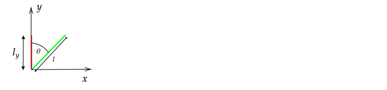

# Introduction

The videos https://www.youtube.com/watch?v=9MN0eTC-vzQ and https://www.youtube.com/watch?v=yOv4xxopQFQ describe most of what is covered in this section.

Flux means "flow". In this tutorial, the rate of flow of particles past a line will first be considered. The rate of flow of particles past a given line depends on the particle density and velocity.

When computing electric current, you will need to compute the rate of flow of charged particles past either a line or an area. You will use the same techniques used here to compute the number of particles that pass a line or an area per second and then multiply the result by the charge per particle to arrive at a current.

In the development of E&M, Faraday and Maxwell supposed that electric and magnetic field vectors produced a flux - in place of the particle density times the velocity vector, they used the electric and magnetic field. 

In this tutorial, the steps required to compute particle flux past a line or an area are first considered. The techniques are then applied to electric and magnetic flux. Although these two types of fluxes are not associated with the flow of particles, the techniques used for particle flux apply.

# Particle Flux

## Through a Line

Each of the $18$ particles shown as dots travels at a velocity of $v_x=$1 m/s. All of the particles are in the $x$-$y$ plane. In one second, how many particles flow through the red line per second?

In one second, all of the blue dots pass through the red line, so $N = 3\cdot 3$ particles pass through the rectangle per second.

In more general terms, we can write

$$\dot{N} = \eta v_x l_y$$

where $\dot{N}$ is the number particles that pass through the line per second, $\eta$ is the number of particles per unit area and $l_y$ is the length of the line that particles pass through.

Next, suppose we wanted to compute the number of particles that pass through the green line per second. In this case, we note that that the number of particles that pass through the green line is the same as the number of particles that pass through the red line. Although the green line is longer, the length that matters in computing the number of particles is $l_y$, so the flux is still $\dot{N} = n v_x l_y$.

Note that in the above we found a new line that was perpendicular to the velocity to compute the flux. Equivalently, we can multiply the component of velocity that is perpendicular to the green line by the length of the green line. In the left-hand side of the diagram below, the calculation of the velocity perpendicular to the green line is shown. The right-hand side shows the a flow of particles that gives the same flux as the given flow.

The component of velocity that is perpendicular to the green line is $v_{\perp}=v_x\cos\theta$ and so the flux through the green line is still $\dot{N} = \eta (v_x\cos\theta) l = \eta v_x l\cos\theta = n v_x l_y$, where $l_y=l\cos\theta$ was used in the last step.

In summary, to compute the flux through the green line, we could equivalently

1. Find the component of the green line that is perpendicular to the velocity; or
2. Find the component of the velocity that is perpendicular to the green line.

Using the definition of the dot product, $\mathbf{A}\cdot \mathbf{B}=AB\cos\theta$, we can write

$$\dot{N} = \eta \mathbf{v}\cdot\hat{\mathbf{n}} l$$

where a normal vector $\hat{\mathbf{n}}$ was used. This normal vector is defined to be perpendicular to the line through which the flux is computed. For a given line, two normal directions can be defined. As a result, if the computed $\dot{N}$ is positive, there is a net flow through the line in the direction of $\hat{\mathbf{n}}$; if the computed $\dot{N}$ is negative, there is a net flow through the line in the direction opposite of $\hat{\mathbf{n}}$.

### Example

For $\mathbf{v}=v_x\xhat$, use the equation $\dot{N} = n \mathbf{v}\cdot\hat{\mathbf{n}} l$ to find $\dot{N}$ through (1) the red and (2) the green line.

**Answer**

(1) For the red line the line perpendicular to it that points to the right is $\hat{\mathbf{n}}=\xhat$, so

$$\dot{N} = \eta \mathbf{v}\cdot\hat{\mathbf{n}}l = \eta (v_x\xhat)\cdot(\xhat) l_y = \eta v_x\xhat\cdot\xhat l_y$$

Because the answer is positive, there is a net flow across the line in the direction of the chosen direction of the normal vector (from left to right). If we would have chosen the normal vector to be $\hat{\mathbf{n}}=-\xhat$, $\dot{N}$ would be negative and we would conclude there is a net flow in the direction opposite of $\hat{\mathbf{n}}$ (corresponding to left to right).

(2)

From the diagram above, a unit vector normal to the green line is $\hat{\mathbf{n}}=\cos\theta\xhat-\sin\theta\yhat$, so

$$\dot{N} = \eta \mathbf{v}\cdot\hat{\mathbf{n}} l = \eta (v_x\xhat)\cdot(\cos\theta\xhat-\sin\theta\yhat) l = \eta v_x \cos\theta l = \eta v_x l_y$$

where $l_y=\cos\theta$ was used in the last step. This answer is the same as that in part (1), which is expected because the same number of particles flow past the red line per second as flow across the green line.

----

### Problem

For $\mathbf{v}=v_y\yhat$, use the equation $\dot{N} = \eta \mathbf{v}\cdot\hat{\mathbf{n}} l$ to find $\dot{N}$ through (1) the red and (2) the green line. Use the same normal vector as in the previous example.

### Example

If $\mathbf{v}=v_x\xhat+v_y\yhat$, compute $\dot{N}$ through the green line.

To answer this, we can use (a) superposition or (b) $\dot{N} = \eta \mathbf{v}\cdot\hat{\mathbf{n}} l$. 

(a)

In the previous problem, you computed $\dot{N}$ when $\mathbf{v}=v_y\yhat$ and should have found $\dot{N}=-\eta v_y l\sin\theta$. In the first example, $\dot{N}$ was computed for $\mathbf{v}=v_x\xhat$ and found $\dot{N}=-\eta v_x l\cos\theta$. In both cases, the same normal vector was used. 

As a result,

$$\dot{N} = \eta v_x l\cos\theta - \eta v_y l\sin\theta$$

(b)

$$\dot{N} = \eta \mathbf{v}\cdot\hat{\mathbf{n}} l =  \eta (v_x\xhat+v_y\yhat)\cdot(\cos\theta\xhat-\sin\theta\yhat) l= \eta v_x l\cos\theta - \eta v_y l\sin\theta$$

which is the same as that found using superposition. Note that the sign of $\dot{N}$ can be positive or negative depending on the values of the constants $v_x$, $v_y$, and $\theta$. If $\dot{N}$ is negative, it means that the net flow of particles is in the direction oppostive to the normal vector drawn on the diagram above.

----

## Through a Line using Integration

Suppose that $\eta$ and/or $\mathbf{v}$ is not constant over the line $l$ as depicted in the following diagram.

In this case, we can first compute the number of particles that pass through a small length $dl$ on $l$ over which $\eta$ and $\mathbf{v}$ are constant. Replacing $N$ with $dN$ and $l$ with $dl$ gives

$$d\dot{N} = \eta(l) \mathbf{v}(l)\cdot\hat{\mathbf{n}} dl$$

Then, to find the total number that pass through $L$, sum over all differential lengths on the line

$$\dot{N} = \int_0^{L} \eta(l) \mathbf{v}(l)\cdot\hat{\mathbf{n}} dl$$

### Example

If $\eta=\eta_o y/L_y$ and $\mathbf{v}=v_x\xhat$, find the flux that 

1. passes through the red line and
2. passes through the green line.

Prior to solving this problem, sketch particles with the given density and velocity variation and determine if the flux is expected to be smaller, equal, or larger than the flux if $\eta=\eta_o$

The following diagram shows a density that is increasing linearly with $y$ and is zero when $y=0$. It also shows that the velocity does not change.

### Problem

If $\eta=\eta_o$ and $\mathbf{v}=(v_x y/L_y)\xhat$, find the flux that 

1. passes through the black line and
2. passes through the green line.

Prior to solving this problem, sketch particles with the given density variation and velocity, determine if the flux is expected to be smaller, equal, or larger than the flux if $\mathbf{v}=v_x\xhat$.

### Example

Compute $\dot{N}$ through the half--circle shown as a solid line. Use $\eta=\eta_o$.

**Answer**

The easy way to solve this problem is to note that the number of particles that pass through the solid line in a given second must also pass through the dotted line (of length $2R$) in a given second. As a result, the flux is

$$\dot{N}=\eta_ov_x(2R)=2 \eta_o v_x R$

The difficult way to solve this problem is to find the vector normal to the solid black line and then use

$$\dot{N} = \int_0^{L} \eta(l) \mathbf{v}(l)\cdot\hat{\mathbf{n}} dl$$

As covered in ???, the outward normal to the surface of a circle is $\hat{\mathbf{n}}=\cos\theta\xhat+\sin\theta\yhat$, which is shown in black in the following diagram.

To be consistent with the previous calculation, we should multiply by $-1$ so that we are computing the flux through the line with positive flux corresponding to flow from left to right. The corresponding normal vector is shown in blue in the diagram above.

Substition of this and $\mathbf{v}=v_x\xhat$ and $\eta = \eta_o$ gives 

$$\dot{N} = \int_0^{L} \eta_o v_x\xhat\cdot(-1)(\cos\theta\xhat+\sin\theta\yhat) dl=-\int_0^{L} \eta_o v_x\cos\theta dl$$

In this integral, $\theta$ depends on the position along the line. As a result, we need to re-write the integrand so that either $dl$ is written in terms of $\theta$ or $\theta$ is written in terms of $l$. It is easier to do the former using $dl=R d\theta$. Substitution gives

$$\dot{N} = -\int_{\pi/2}^{3\pi/2} \eta_o v_x\cos\theta Rd\theta=-\eta_ov_xR\sin\theta\Big|^{3\pi/2}_{\pi/2}=-\eta_ov_xR(-1-1)=2 \eta_o v_x R$$

which is the same result found using the easier method.

### Problem

Compute the flux through the circle using

$$\dot{N} = \int_0^{L} \eta(l) \mathbf{v}(l)\cdot\hat{\mathbf{n}} dl$$

Show your steps in detail and use $\eta=\eta_o$.

## Through a Closed Line

To indicate integration is taken over a closed line, we use $\oint$.

### Example

A source of particles is at the origin that sends particles out radially with a velocity of $v_r$. Assume that flow out of a circle corresponds to a positive flux.

1. If the density of particles at $R$ is $\eta_i$, what is $\dot{N}$ through the inner circle shown with radius $R$?
1. What is $\eta_o$, the density of particles through the outer circle of radisu $2R$?
1. What is $\dot{N}$ through the outer circle of radius $2R$?

**Answer**

(1) $\dot{N}_i=\eta_i v_r 2\pi R$

(2) In the following diagram it is shown that $\eta$ is inversely propotional to $r$. If the particles are traveling at a constant velocity outwards, the same number of particles will be on the line associated with the inner circle as the outer circle. The length of any circle is $2\pi r$, so $\eta = (\text{num particles on } l)/l = n_o/2\pi r$.

From this, we can conclude that $\eta$ at $2R$ is $1/2$ that at $R$. That is, $\eta_o=\eta_i/2$.

(3) $\dot{N}_o=(\eta_o/2) v_r 2\pi (2R)=\eta_o v_r 2\pi R$, which is the same result as (1).

---

The previous problem is a key problem related to electric flux. In it we found found that

1. the net flux through a closed line is not zero when there is a source emitting particles inside of it and
2. the net flux through a circle of any radius centered on the source is the same.

In fact, the net flux through a circle of any radius is the same even if the source is not at the center of the circle. This can be demonstrated with a diagram using two approaches.

**Approach I**

The above diagram shows particles flowing outwards at a constant velocity at a given point in time. The number of particles that pass the red line on the inner circle per second must equal the number per second that pass through the through the red line on the outer circle if the spacing between the blue dots is to remain constant. Given that this must be true if the particles flow at a constant velocity, we conclude that the flux through the inner red line must be the same as that through the outer red line. To complete the justification, note that this argument does not depend on the length of the inner red line - if it is a full circle, the same arguments apply and we conclude the flux through the inner circle must equal that through the outer circle.

**Approach II**

A mathematical way of showing this is to note that the flux through the inner differential length, $ds_i$, shown in the left of the diagram above is $2 \pi R_i d\theta$ so that the differential flux through $ds_i$ is

$$dN_i=\eta_i v_r ds_i=\eta_i v_r 2 \pi R_i d\theta$$

and the flux through the outer differential length, $ds_o$, is $2 \pi R_o d\theta$ so the differential flux through $ds_o$ is

$$dN_o=\eta_o v_r ds_o = \eta_o v_r 2 \pi R_o 
d\theta$$

To show that $dN_o=dN_i$, consider equating the last two equations. This gives the requirement that

$$R_o\eta_o=\eta_iR_i$$

or

$$\eta_o=\eta_i\frac{R_i}{R_o}$$

This equation states that the density (number of particles per unit area) is inversely proportitional to distance. This is true and can be drived by considering a small patch of area associated with both red lines. The inner patch has an area of $A_i = 2\pi r_i d\theta \times dr$ and the larger has an area of $A_o=2\pi R_o d\theta \times dr$. The number of particles in each of these areas must be the same if they move at a constant velocity, so ...

A mathematical way of showing this is to note that the flux through the inner differential length, $ds_i$, shown in the diagram above is $2 \pi R_i d\theta$ so that the differential flux through $ds_i$ is

$$dN_i=\eta_i v_r ds_i = \eta_i v_r 2 \pi R_i d\theta$$

and the flux through the outer differential length, $ds_o=2 \pi R_o d\theta$,w is

$$dN_o=\eta_o v_r ds_o = \eta_o v_r 2 \pi R_o d\theta$$

Previously we argued that if the particles flow outwards with a constant velocity, then the number of particles on a circle of radius $R_i$ will be the same as that on a circle of radius $R_o$ so that

$$\eta_o R_o=\eta_i R_i \qquad \text{or} \qquad \eta_o = \eta_i\frac{R_i}{R_o}$$

Subsituting this into the equation for $dN_o$ gives $dN_o=dN_i$:

$$dN_o=\eta_o v_r ds_o = \eta_i\frac{R_i}{R_o} v_r 2 \pi R_o d\theta = \eta_i v_r 2 \pi R_i d\theta$$

To finish this problem, we need to show that the flux through the outer black arc is the same as that through the outer red arc. Although visually it may be obvious that this must be true using Approach I, in the future, we will consider the flux of a general vector. In this case, we replace $\eta \mathbf{v}$ with a vector $\mathbf{E}$ that is not related to the flow of particles and so Approach I is not valid.

In the right-hand side of the previous diagram, the top part of the figure on the left is shown for small $d\theta$. The red line is longer than the black line and $v_r$ is perpendicular to the black arc but not the red line. The length of the red line is $2\pi d\theta/\cos\phi$ and the component of $v_r$ perpendicular to it is $v_r\cos\phi$. The flux through the red line involves the product of this area and $v_r\cos\phi$ and as a result, the $\cos\phi$ terms cancel and the flux through the red line is the same as that through the black line, as expected from Approach I.

The aguments used in both Approach I and Approach II can be used to show that the flux through a closed line of arbitrary shape as shown in the figure below is also equal to the flux through a circle centered on the source.

### Problem

Use a diagram to show that the the flux through a closed line of arbitrary shape is also equal to the flux through a circle centered on the source.

### Problem

In the above, it is stated that the results hold for lines that close in on themselves.

Is it correct to say that the flux through any two lines must be equal? Explain using a diagram.

----

## Through an Area

The generalization from flux through a line to flux through an area is straightforward. Suppose the following is the cross-section of a three-dimensional diagram.

If the dots are uniformly spaced into the page and the red line is the side view of a square that goes into the page by $l_y$, then $N=3\cdot 3\cdot 3$ particles pass through the red square per second per unit of area of the red square.

In more general terms, we can write

$$\dot{N} = \eta v_x A$$

where $N$ is the number particles that pass through the rectangle per second, $\eta$ is now the number of particles per volume (instead of per area) and $A$ is the cross-sectional area that particles pass through (instead of the length of a line that the particles pass through). Using this equation for the diagram given above using a unit area of $1\text{m}^2$, we find

$$\dot{N} = \eta v_x A = (9/\text{m}^3) (1 \text{ m}/\text{s}) (1\text{ m}^2) = 9/s$$
 
The most general equation for flux through an area is

$$\dot{N} = \int \eta \mathbf{v}\cdot \hat{\mathbf{n}}d{A}$$

where here the normal vector is a vector that is perpendicular to the surface and the integral is taken over the area of interest. Note that often the definition $d\mathbf{A}=\hat{\mathbf{n}}d{A}$ is used to write this as 

$$N = \int \eta \mathbf{v}\cdot d{\mathbf{A}}$$ 
 
# Electric Flux

## Through a Line

In general, the electric flux through a line is not a quantity of interest.

## Through a Area

Electric flux is defined by (by convention, a mathematical definition is indicated by $\equiv$)

$$
\Phi_E \equiv \int\mathbf{E}\cdot d\mathbf{A}
$$
\label{eqn:flux}

where $\mathbf{E}$ is the electric field at $dA$, a small patch of area on a surface; the vector $d\mathbf{A}$ is $dA$ multiplied by a unit vector that is normal (perpendicular) to $dA$. Notice that this integral does not have the circle. This means that one can compute the electric flux through any surface. 

%If the surface is closed, then from Gauss's law it follows that the integral equals $Q_{encl}/\epsilon_o$.

As was done in Section 22.2 of the textbook, we will consider problems where integration is not required to compute the flux. In this case

$$
\Phi_E=\mathbf{E}\cdot \mathbf{A}
$$

* $E$ is constant on a flat surface of area $A$, and
* the angle of \mathbf{E} with respect to $A$ is constant.

In part (a) of following diagram, a 3-D view of two planes are shown. The planes are in a region of space where the electric field is in the $+y$-direction. Part (b) shows the planes when viewed from a position on the $+x$-axis; from this view, electric field lines are horizontal. Suppose that the electric field lines  represent the flow direction of water that is moving with a velocity $v$. 

\input{Gauss/figures/Flux_Basic}

If we want to compute how much water flows through the surface area of the titled plane, we can note that it will be the same as the amount of water that flows through the plane with dashed boundaries. Every particle of fluid that flows through the blue surface will flow through the gray surface. If the water is moving at a velocity of $v$, then the quantity of water flowing through the dashed plane will be proportional to $v (A_{dashed})=v(L\cos\phi w)=vA\cos\phi$, where $A=Lw$ is the area of the titled gray plane. Now, even though nothing flows along electric field lines, it turns out that an important quantity is this equation with $E$ replaced $v$, defined to be the electric flux through the surface $A$:

$$
\Phi_E=E(L\cos\phi)w=EA\cos\phi
$$
\label{eqn:simpleflux}

One can always use a diagram similar to the above to find an equation for the electric flux. In general, it is not convenient or easy to draw a diagram for an arbitrarily oriented surface. So we are interested in a more general equation. It turns out that if you define an area vector with a direction that is perpendicular to the surface and use a dot product, you will get the same result: $EA\cos\phi$.

Recall that the dot product of two vectors is the product of their magnitude times $\cos\phi$, where $\phi$ is the angle between them (See Section 1.10 of the textbook). In part (a) the following diagram, the tilt angle $\phi$ between the blue and gray surfaces in the previous diagram is equal to the angle between $\mathbf{E}$ and the newly defined area vector $\mathbf{A}$ (shown in green).

\input{Gauss/figures/Flux_Equation_Forms}

From the definition of the dot product and this newly defined area vector,

$$\mathbf{E}\cdot \mathbf{A} = EA\cos\phi\,,$$

which is the same result as Equation~\ref{eqn:simpleflux}. In part (b), the $\mathbf{E}$ vector is projected onto a line parallel to the area vector and this component is defined to be $E_{\perp}$. This gives yet another way of expressing the dot product:

$$\mathbf{E}\cdot \mathbf{A} = E_{\perp}A$$

To further generalize (complicate?) matters, if we define a unit vector that is in the direction of $\mathbf{A}$ as $\hat{\mathbf{n}}$, then $\mathbf{A}=A\hat{\mathbf{n}}$ and we can write 

$$\mathbf{E}\cdot \mathbf{A} = \mathbf{E}\cdot A\hat{\mathbf{n}}=\mathbf{E}\cdot \hat{\mathbf{n}}A\,.$$

The choice of $n$ as the variable name is because $\hat{\mathbf{n}}$ is normal (perpendicular) to A. In Example 22.2 of the textbook, the equation $\mathbf{E}\cdot \hat{\mathbf{n}}A$ is used and we provide more details about this example later in this section. For an alternative derivation of the last three equations, see Section 22.2 of the textbook. There is quite a bit of notation to digest in Section 22.2 and above. If you get lost, recall the last two diagrams or Figure 22.6 of the textbook. To help remember all of the relationships, attempt to recreate the last two diagrams from memory.

In the above, an area vector was drawn in the direction of a vector perpendicular to a surface. You may have noticed that one can always draw two vectors perpendicular to a surface (the vectors point in opposite directions). Which to choose? The convention used for electric flux calculations is that if the surface is closed, the area vector points outwards. If the surface is not closed, one must state the direction used for the area vector or you will be asked for the magnitude of the electric flux, so the choice of direction does not matter.

\begin{comment}
\begin{tcolorbox}[enhanced,breakable,parbox=false,colframe=black!50!black,colback=white,height fill,title=Flux through a tilted plane]

\input{Gauss/figures/Flux_Calculation_Problem}

What is the magnitude of electric flux through the plane when

1. The electric field is in the $+x$-direction.

2. The electric field is in the $+y$-direction.

For both parts, check that your answer makes sense by asking what the expected answer is when $\phi=0^\circ$ and/or $\phi=90^\circ$.

3. When the electric field is in the $+x$-direction, what is $E_\perp?$

4. When the electric field is in the $+y$-direction, what is $E_\perp?$

\end{tcolorbox}

\clearpage
\end{comment}

## Example - Flux through faces of a cube

\input{Gauss/figures/Flux_Through_Cube_1}

Find the flux through the six labeled faces of the cube with side length $a$ when the electric field is everywhere in the $+z$ direction.

{\bf Answer}

This example is similar to Example 22.2a of the textbook. We'll solve part 1. using two methods. The first is a more visual method. The second is more mathematical. Although the mathematical complexity of the second method is not really needed for this problem, it allows one to solve the next problem without an additional diagram.

Method I

The electric field is parallel to surfaces 1, 2, 5, and 6. Thinking in terms of the analogy of the electric field representing lines of flow, the flux is zero through these faces.

$\Phi_E^{1}=\Phi_E^{2}=\Phi_E^{5}=\Phi_E^{6}=0$

By convention, the normal direction for surface 3 is outwards from the volume, which is in the $+z$-direction. The electric field is in the same direction, so

$\Phi_E^{3}=E_oA=E_oa^2$

The normal direction for the bottom surface is downwards, which is in the opposite direction as the electric field, so

$\Phi_E^{4}=-E_oA=-E_oa^2$

The total flux through the cube, $\Phi_E^1+...+\Phi_E^6$, is zero. Thinking again in terms of the electric field representing flow lines, every electric field line that enters the cube exits, so the flow in equals the flow out. (Perhaps confusingly, flow out of a volume corresponds to a positive flux. The reason for this convention for flux is that from Gauss's law, a net positive flow out of a closed surface corresponds to a net positive charge inside the surface.)

Method II

Conveniently, the normal vectors are parallel to the Cartesian unit vectors. Based on the diagram, $\hat{\mathbf{n}}_1=\ihat$, $\hat{\mathbf{n}}_2=\jhat$, $\hat{\mathbf{n}}_3=\khat$, $\hat{\mathbf{n}}_4=-\khat$
$\hat{\mathbf{n}}_5=-\jhat$, $\hat{\mathbf{n}}_6=-\ihat$. The negative sign for the last three normal vectors is due to the convention that the normal points outwards from a closed surface.

The area vector is the area times the normal vector, so $\mathbf{A}_1=A\ihat$, $\mathbf{A}_2=A\jhat$, $\mathbf{A}_3=A\khat$, $\mathbf{A}_4=-A\khat$, $\mathbf{A}_4=-A\jhat$, and $\mathbf{A}_4=-A\ihat$, where $A=a^2$.

Recall that $\ihat\cdot\ihat=\jhat\cdot\jhat=\khat\cdot\khat=1$ and the dot product of any other combinations of Cartesian unit vectors is zero: $\ihat\cdot\jhat=0$, $\jhat\cdot\khat=0$, and $\ihat\cdot\khat=0$. Dot products of unit vectors are reviewed in Section 1.10 of the textbook.

$\Phi_E^{1}=\mathbf{E}\cdot \mathbf{A}_1=\mathbf{E}\cdot A\hat{\mathbf{n}}_1=E_o\khat\cdot A\ihat=E_oA(\khat\cdot \ihat)=0$

$\Phi_E^{2}=\mathbf{E}\cdot \mathbf{A}_2=\mathbf{E}\cdot A\hat{\mathbf{n}}_2=E_o\hat{\mathbf{k}}\cdot A\jhat=E_oA(\khat\cdot \jhat)=0$

$\Phi_E^{3}=\mathbf{E}\cdot \mathbf{A}_3=\mathbf{E}\cdot A\hat{\mathbf{n}}_3=E_o\hat{\mathbf{k}}\cdot A\khat=E_oA(\khat\cdot\khat)=E_oA=E_oa^2$

$\Phi_E^{4}=\mathbf{E}\cdot \mathbf{A}_4=\mathbf{E}\cdot A\hat{\mathbf{n}}_4=E_o\hat{\mathbf{k}}\cdot (-A\khat)=-E_oA(\khat\cdot\khat)=-E_oa^2$

$\Phi_E^{5}=\mathbf{E}\cdot \mathbf{A}_5=\mathbf{E}\cdot A\hat{\mathbf{n}}_5=E_o\hat{\mathbf{k}}\cdot (-A\jhat)=E_oA(\khat\cdot\jhat)=0$

$\Phi_E^{6}=\mathbf{E}\cdot \mathbf{A}_6=\mathbf{E}\cdot A\hat{\mathbf{n}}_6=E_o\hat{\mathbf{k}}\cdot (-A\ihat)=-E_oA(\khat\cdot\ihat)=0$

Incidentally, there is an additional questions that could have been asked: How much charge is inside the cube? The net flux through the cube's surface is zero, so it follows from Gauss's law that the total charge enclosed is zero.

%\clearpage

## Example - Flux through faces of a cube

\input{Gauss/figures/Flux_Through_Cube_2}

Find the flux through the faces of the cube, which have area $A$, when the electric field is at an angle of $30^\circ$ with respect to the $+z$-axis towards the $+y$-axis.

{\bf Answer}

Method I

The electric field is parallel to sides 1 and 6, so

$\Phi_E^1=\Phi_E^6=0$

When using this method, it is necessary to draw a diagram to ensure the calculations are correct. In the following, the cube viewed from a point on the $+x$-axis is shown.

\input{Gauss/figures/Flux_Through_Cube_2I}

The above diagram was used to compute the electric field perpendicular to the side faces.

$\Phi_E^2=E_\perp\,2A=E_oA\sin 30^\circ$

$\Phi_E^3=E_\perp\,3A=E_oA\cos 30^\circ$

$\Phi_E^4=E_\perp\,4A=-E_oA\cos 30^\circ$

$\Phi_E^5=E_\perp\,5A=-E_oA\sin 30^\circ$

The negative signs in the last two equations were inserted based on the diagram which shows the electric field points into the volume.

Method II

This is a problem for which Method II is easier in that an additional diagram is not needed. Compare it to the approach taken in Example 22.2b, which is similar to Method I except that an additional diagram was not given (but was likely used to figure out the answer given).

Based on the diagram, $\hat{\mathbf{n}}_1=\ihat$, $\hat{\mathbf{n}}_2=\jhat$, $\hat{\mathbf{n}}_3=\khat$, $\hat{\mathbf{n}}_4=-\khat$
$\hat{\mathbf{n}}_5=-\jhat$, $\hat{\mathbf{n}}_6=-\ihat$

Also from the diagram, 

$\mathbf{E}=E_o\sin30^\circ\jhat+E_o\cos30^\circ\khat$.

What remains is to evaluate dot products (you should be able to skip most of the intermediate steps). Using $\mathbf{E}\cdot\mathbf{A}=\mathbf{E}\cdot A\hat{\mathbf{n}}$,

$\Phi_E^1=\mathbf{E}\cdot \hat{\mathbf{n}}_1A=E_o(\sin 30^\circ\jhat+\cos 30^\circ\khat)\cdot\ihat A = E_oA(\jhat\cdot\ihat\sin 30^\circ+\khat\cdot\ihat\cos 30^\circ)=0$

$\Phi_E^2=\mathbf{E}\cdot \hat{\mathbf{n}}_2A=E_o(\sin 30^\circ\jhat+\cos 30^\circ\khat)\cdot\jhat A = E_oA(\jhat\cdot\jhat\sin 30^\circ+\khat\cdot\jhat\cos 30^\circ)=E_oA\sin 30^\circ$

$\Phi_E^3=\mathbf{E}\cdot \hat{\mathbf{n}}_3A=E_o(\sin 30^\circ\jhat+\cos 30^\circ\khat)\cdot\khat A = E_oA(\jhat\cdot\khat\sin 30^\circ+\khat\cdot\khat\cos 30^\circ)=E_oA\cos 30^\circ$

$\Phi_E^4=\mathbf{E}\cdot \hat{\mathbf{n}}_4A=E_o(\sin 30^\circ\jhat+\cos 30^\circ\khat)\cdot(-\khat A) = -E_oA(\jhat\cdot\khat\sin 30^\circ+\khat\cdot\khat\cos 30^\circ)=-E_oA\cos 30^\circ$

$\Phi_E^5=\mathbf{E}\cdot \hat{\mathbf{n}}_5A=E_o(\sin 30^\circ\jhat+\cos 30^\circ\khat)\cdot(-\jhat A) = -E_oA(\jhat\cdot\jhat\sin 30^\circ+\khat\cdot\jhat\cos 30^\circ)=-E_oA\sin 30^\circ$

$\Phi_E^6=\mathbf{E}\cdot \hat{\mathbf{n}}_6A=E_o(\sin 30^\circ\jhat+\cos 30^\circ\khat)\cdot(-\ihat A) =  -E_oA(\jhat\cdot\ihat\sin 30^\circ+\khat\cdot\ihat\cos 30^\circ)=0$

Checks: The flux is positive for faces 2 and 3. This is consistent with the diagram because if electric field lines were drawn, they would emerge from the volume out of these faces. The flux is negative for faces 4 and 5. This is consistent with the diagram because if electric field lines were drawn, they would enter the volume.

\newpage

## Problem - Flux through faces of a cube

Find the flux through the faces of the cube with side length $a$ when the electric field is at an angle of $60^\circ$ with respect to the $+z$-axis towards the $+x$-axis.

\input{Gauss/figures/Flux_Through_Cube_4}

\ifsolutions
{\bf Answer}:

$\Phi_E^1=E_oA\sin 60^\circ = E_oa^2\sin 60^\circ$

$\Phi_E^2=0$

$\Phi_E^3=E_oA\cos 60^\circ = E_oa^2\cos 60^\circ$

$\Phi_E^4=-E_oA\cos 60^\circ = -E_oa^2\cos 60^\circ$

$\Phi_E^5=0$

$\Phi_E^6=-E_oA\sin 60^\circ = -E_oa^2\sin 60^\circ$

\else
\fi
