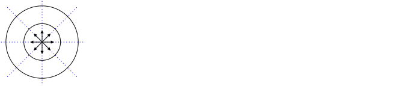
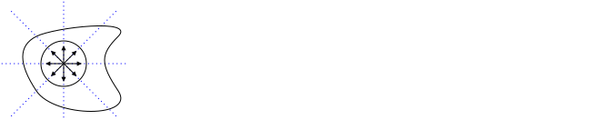
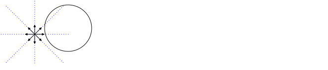

In this tutorial, flux is reviewed. The flux due to a vector field is a fundamental concept in E&M, but Griffiths only provides a 1--page description of the flux due to a vector field in the surface integral section in 1.3.1(b).

The flow of current also constitutes a flux and this is also covered in this tutorial in section 3. This section may be skipped and will be revisited later in the semester.

# Introduction

Flux means "flow". In this tutorial, the rate of flow (or flux) of particles, $\dot{N}$, (in units of # particles per second) and charge, $I$, (in units of charge per second) past a point, line, and area will first be considered. These fluxes depend on a density and velocity.

Next, the flux, $\Phi_E$, associated with an electric field vector, $\mathbf{E}$, will be considered. In this case, the flux does not correspond to the flow of particles, but the calculation technique is similar to that for particles.

In this E&M, you will use the techniques covered here in two different ways:

1. To compute currents associated with the flow of charged particles.
2. To compute the flux associated with either an electric field vector $\mathbf{E}$ or a magnetic field vector $\mathbf{B}$. In the development of E&M, Faraday and Maxwell supposed that $\mathbf{E}$ and $\mathbf{B}$ vectors produced a flux -- in the case of $\mathbf{E}$, they spoke of "electricity flowing along a field line". It was only later realized that there is no flow of "electricity" along a field line. An electric field only tells you about the force a charge would feel if placed at a point in space. An electric field line tells you about the direction of force on a charge when placed somewhere on the field line. Although $\mathbf{E}$ and $\mathbf{B}$ fluxes are not associated with the flow of anything, the techniques used for for calculating them is similar to that for particle fluxes.

%    > **Caution**: When dealing with electric and magnetic flux, don't think of the flow of particles -- just think about vectors.

This tutorial is primarily a mathematical review of flux and requires the use of normal vectors, which were reviewed previously in [Vectors](vectors.html#normal-unit-vectors). You will use electric flux, $\Phi_E$, when Gauss's law (Chapter 3) is covered and magnetic flux, $\Phi_B$, when the Biot--Savart law is covered (Chapter 5) and also when Faraday's law is covered (Chapter 7). Charged particle flux, $I$, will be used when computing current distributions for use in the Biot-Savart law (Chapter 5).

Finally, electric and magnetic flux are a fundamental component of divergence and the divergence theorem, which is covered next.

# Particle Flux

In this section, the flux quantity is $\dot{N}$, which corresponds to a number of particles per second that flow past a point, line, or area.

## Past a point

### Example

The particles shown as dots travel at a velocity of 1 m/s to the right. What is $\dot{N}$, the number of particles pass the X in one second?

**Answer**:
In one second, all of the blue particles pass the point, so $\dot{N}=3/s$. More generally

$$\dot{N}=\lambda v$$

where $\lambda$ is the number of particles per unit length and $v$ is the magnitude of the velocity, both evaluated at the point.

### Example

The particles shown as dots flow outward from a source X at the origin with a constant velocity of 1 m/s. What is $\dot{N}$ out of the gray region? Assume that flow out of the region corresponds to positive $\dot{N}$.

**Answer**:

The flux past $x=-1$ is $\dot{N}\_{-1}=\lambda v$ and past $x=+1$ is $\dot{N}\_{+1}=\lambda v$. Both are postive because the flow is outward of the region. Based on the diagram, there are 6 particles in a length of 2 m, so $\lambda = 3/\text{m}$. Thus,

$\dot{N} =\dot{N}\_{x=+1} + \dot{N}\_{x=-1} = (3/\text{m})\cdot(1\text{ m/s}) + (3/\text{m})\cdot(1\text{ m/s}) = 6/s$

To generalize this, we can state that the flux into or out of a linear region is

$$\dot{N} = \lambda\mathbf{v}\bfcdot \hat{\mathbf{n}}$$

where the vector $\hat{\mathbf{n}}$ is defined to point outward from the region on its endpoints. With this convention, if $\dot{N}$ is positive, there is a net flow out of the region; if $\dot{N}$ is negative, there is a net flow into the region. We will use this convention also with flow past   closed lines and closed areas.

Repeating this problem using $\dot{N} = \lambda\mathbf{v}\bfcdot \hat{\mathbf{n}}$,

at $x=-1$, $\mathbf{v}=-v\xhat$ and $\hat{\mathbf{n}}=-\xhat$, so $\dot{N}_{x={-1}}=\lambda (-v\xhat)\bfcdot(-\hat{\mathbf{n}}\xhat)=\lambda v$

at $x=+1$, $\mathbf{v}=+v\xhat$ and $\hat{\mathbf{n}}=+\xhat$, so $\dot{N}_{x={+1}}=\lambda (+v\xhat)\bfcdot(+\hat{\mathbf{n}}\xhat)=\lambda v$

So the total flux out of the region between $x=\pm 1$ is

$\dot{N} = \dot{N}\_{x={-1}} + \dot{N}\_{x={+1}} = 2\lambda v=2\cdot (3/\text{m})\cdot(1\text{ m/s})=6/s$

which is the same result found previously.

### Problem

Particles flow as shown in the following figure. When a particle encounters the origin X, it is absorbed and does not continue to flow (another expression for this is "the origin is a sink").

Use the equation $\dot{N} = \lambda\mathbf{v}\bfcdot \hat{\mathbf{n}}$ to find the the flux into or out of the region between $x=\pm 1$.

## Through a Line

In this section, we consider computing the flux of particles through an open line (a line that does not form a closed loop) and then the flux of particles into or out of a region bounded by a closed loop.

%The primary result is that if particles are emitted  from a point with constant velocity and uniformily in all directions, 

### Through an Open Line

Each of the $18$ particles shown as dots travels at a velocity of $v_x=$1 m/s to the right. All of the particles are in the $x$-$y$ plane. In one second, how many particles flow through the red line per second?

In one second, all of the blue dots pass through the red line, so $N = 3\cdot 3$ particles pass through the rectangle per second.

In more general terms, we can write

$$\dot{N} = \sigma v_x l_y$$

where $\dot{N}$ is the number particles that pass through the line per second, $\sigma$ is the number of particles per unit area and $l_y$ is the length of the red line that particles pass through. From the diagram, the density is given by $\sigma = 9/((1\text{ m})(l_y))$ and so 

$\displaystyle\dot{N} = \sigma v_x l_y = \frac{9}{(1\text{ m})(l_y)} v_x l_y =\frac{9}{(1\text{ m})} v_x = \frac{9}{(1\text{ m})}\cdot 1\text{ m/s}= 9/s$

as before.

Next, suppose we wanted to compute the number of particles that pass through the tilted green line per second. In this case, we note that that the number of particles per second that pass through the green line is the same as that for the red line. Although the green line is longer, we expect the flux to still be $\dot{N} = n v_x l_y$.

Note that in the previous paragraph, to find the flux through the tilted green line, we used a different line that was perpendicular to the velocity to compute the flux. Equivalently, we can multiply the component of velocity that is perpendicular to the green line by the length of the green line. That is, we break the velocity vector into two components -- a component parallel to the line and a component perpendicular to it.

In the left-hand side of the diagram below, the velocity of one of the particles that is on the green line is broken down into components parallel and perpendicular to it. The right-hand side shows the a flow of particles parallel to the green line, which do not contribute to the flux, and perpendicular to the green line, which do contribute to the flux.

The component of velocity that is perpendicular to the green line is $v_{\perp}=v_x\cos\theta$ and so the flux through the green line is $\dot{N} = \sigma (v_x\cos\theta) l = \sigma v_x (l\cos\theta) = n v_x l_y$, where $l_y=l\cos\theta$ was used in the last step. This is the same answer as found previously.

In summary, to compute the flux through the green line, we could equivalently

1. Find the component of the green line that is perpendicular to the velocity; or
2. Find the component of the velocity that is perpendicular to the green line.

Using the definition of the dot product, $\mathbf{A}\bfcdot \mathbf{B}=AB\cos\theta$, we can write

$$\dot{N} = \sigma \mathbf{v}\bfcdot\hat{\mathbf{n}} l$$

where $l$ is the length of the line to compute the flux through, and $\hat{\mathbf{n}}$ is defined to be perpendicular to the line through which the flux is computed. For a given line, two normal directions can be defined. As a result, if the computed $\dot{N}$ is positive, there is a net flow through the line in the direction of $\hat{\mathbf{n}}$; if the computed $\dot{N}$ is negative, there is a net flow through the line in the direction opposite of $\hat{\mathbf{n}}$.

#### Example

For $\mathbf{v}=v_x\xhat$, use the equation $\dot{N} = n \mathbf{v}\cdot\hat{\mathbf{n}} l$ to find $\dot{N}$ through (1) the red and (2) the green line.

**Answer**

(1) For the red line, the line perpendicular to it that points to the right is $\hat{\mathbf{n}}=\xhat$, so

$\dot{N} = \sigma \mathbf{v}\cdot\hat{\mathbf{n}}l = \sigma (v_x\xhat)\cdot(\xhat) l_y = \sigma v_x\xhat\cdot\xhat l_y=\sigma v_x l_y$

Because the answer is positive, there is a net flow across the line in the direction of the chosen direction of the normal vector (from left to right). If we would have chosen the normal vector to be $\hat{\mathbf{n}}=-\xhat$, $\dot{N}$ would be negative and we would conclude there is a net flow in the direction opposite of $\hat{\mathbf{n}}$ (corresponding to right to left).

(2)

From the diagram above, a unit vector perpendicular to the green line is $\hat{\mathbf{n}}=\cos\theta\xhat-\sin\theta\yhat$ (this could be derived using the technique covered in [Vectors](vectors.md#deriving), so

$\dot{N} = \sigma \mathbf{v}\bfcdot\hat{\mathbf{n}} l = \sigma (v_x\xhat)\bfcdot(\cos\theta\xhat-\sin\theta\yhat) l$

$\phantom{\dot{N}}= \sigma v_x \cos\theta l = \sigma v_x l_y$

where $l_y=l\cos\theta$ was used in the last step. This answer is the same as that in part (1), which is expected because the same number of particles flow past the red line per second as flow across the green line.

#### Problem

For $\mathbf{v}=v_y\yhat$, use the equation $\dot{N} = \sigma \mathbf{v}\cdot\hat{\mathbf{n}} l$ to find $\dot{N}$ through (1) the red and (2) the green line. Use the same normal vector as in the previous example.

#### Example

If $\mathbf{v}=v_x\xhat+v_y\yhat$, compute $\dot{N}$ through the green line.

**Answer**:

To answer this, we can use (a) superposition or (b) $\dot{N} = \sigma \mathbf{v}\cdot\hat{\mathbf{n}} l$. 

(a) Using superposition

In the previous problem, you computed $\dot{N}$ when $\mathbf{v}=v_y\yhat$ and should have found $\dot{N}=-\sigma v_y l\sin\theta$. In the first example, $\dot{N}$ was computed for $\mathbf{v}=v_x\xhat$ and found $\dot{N}=\sigma v_x l\cos\theta$. In both cases, the same normal vector was used. 

As a result,

$\dot{N} = \sigma v_x l\cos\theta - \sigma v_y l\sin\theta$

(b) Using $\dot{N} = \sigma \mathbf{v}\cdot\hat{\mathbf{n}} l$

$\dot{N} = \sigma \mathbf{v}\cdot\hat{\mathbf{n}} l =  \sigma (v_x\xhat+v_y\yhat)\cdot(\cos\theta\xhat-\sin\theta\yhat) l$

$\phantom{\dot{N}}=\sigma v_x l\cos\theta - \sigma v_y l\sin\theta$

which is the same as that found in part (a) using superposition. Recall that the sign of $\dot{N}$ can be positive or negative depending on the values of the constants $v_x$, $v_y$, and $\theta$. If $\dot{N}$ is negative, it means that the net flow of particles is in the direction oppostive to the normal vector drawn on the diagram above.

### Using Integration

Suppose that $\sigma$ and $\mathbf{v}$ are not constant over the red line of length $l$ as depicted in the following figure.

In this case, we can first compute the number of particles that pass through an infinitesimal length $dl$ on $l$ over which $\sigma$ and $\mathbf{v}$ are constant. Replacing $N$ with $dN$ and $l$ with $dl$ gives the flux through $dl$:

$$d\dot{N} = \sigma(l) \mathbf{v}(l)\cdot\hat{\mathbf{n}} dl$$

To find the total number that pass through $L$, sum over all differential lengths on a line $\mathcal{L}$

$$\dot{N} = \int_{\mathcal{L}} \sigma(l) \mathbf{v}(l)\cdot\hat{\mathbf{n}} dl$$

#### Example

If $\sigma=\frac{y}{l_y}\sigma_o$ and $\mathbf{v}=v_x\xhat$,

1. sketch particles with the given density and velocity variation and determine if the flux is expected to be smaller than, equal to, or larger than the flux if $\sigma=\sigma_o$.

Then find the flux that 

2. passes through the red line and
3. passes through the green line.

**Answer**:

1\. The following diagram shows a density that is increasing linearly with $y$ and is zero when $y=0$ as was given in this problem. It also shows that the velocity does not change over the red line.

At the top of the red line, $y=l_y$, and the density is $\sigma_o$. Because the density is lower on all other parts of the line, we expect the flux to be less than $\sigma_ov_xl_y$.

2\. The flux that passes the red line is

$\displaystyle\dot{N} = \int_{\mathcal{L}} \sigma(l) \mathbf{v}(l)\cdot\hat{\mathbf{n}} dy = \int_0^{l_y} \frac{y}{l_y}\sigma_o v_x dy=(\sigma_o v_x/l_y) \frac{y^2}{2}\Bigg|_0^{l_y}=\frac{\sigma_o}{2}v_xl_y$

This result is less than $\sigma_o v_x l_y$, which was expected. The fact that the answer is 1/2 of this makes sense because the average density on the line is $\sigma_o/2$.

3\. The flux is expected to be the same as 1. From a previous problem $\hat{\mathbf{n}} = \cos\theta\xhat-\sin\theta\yhat$ as shown below.

$\displaystyle\dot{N}=\int_{\mathcal{L}} \sigma(l) \mathbf{v}(l)\cdot\hat{\mathbf{n}} dl=\int_0^l\left(\frac{y}{l_y}\sigma_o\right) (v_x\xhat)\cdot (\cos\theta\xhat-\sin\theta\yhat) dl'=\int_0^l\frac{y}{l_y}\sigma_ov_x\cos\theta dl'$

There is a complication with this integral. The integration variable $l'$ is the position along the green line, and $y$ depends on it. So we need to either write $l'$ in terms of $y$ or vice-versa. Doing the former using the substitution $y=l'\cos\theta$ in the previous integral gives

$\displaystyle\dot{N}=\int_0^l\frac{l'\cos\theta}{l_y}\sigma_ov_x\cos\theta dl'=(\sigma_o\cos^2\theta v_x/l_y)\int_0^l l'dl'=(\sigma_o\cos^2\theta v_x/l_y)\frac{l^2}{2}=\frac{\sigma_o}{2}v_xl_y$

where $l_y = l\cos\theta$ was used in the last step. As expected, this is the same as found in part 2.

#### Problem

If $\sigma=\sigma_o$ and $\mathbf{v}=(v_x y/l_y)\xhat$,

1. sketch particles with the given density variation and velocity, determine if the flux is expected to be smaller, equal, or larger than the flux if $\mathbf{v}=v_x\xhat$.

Then find the flux that 

2. passes through the black line and
3. passes through the green line.

#### Example

Compute $\dot{N}$ through the half--circle shown as a solid line. Use $\sigma=\sigma_o$.

**Answer**

The easy way to solve this problem is to note that the number of particles that pass through the solid line in a given second must also pass through the dotted line (of length $2R$). As a result, the flux is

$\dot{N}=\sigma_ov_x(2R)= \boxed{2 \sigma_o v_x R}$

The difficult way to solve this problem is to find the vector normal to the solid black line and then use

$\dot{N} = \int_{\mathcal{L}} \sigma(l) \mathbf{v}(l)\cdot\hat{\mathbf{n}} dl$

As covered in [Vectors](vectors.md#normal-unit-vectors), the outward normal of a circle centered on the origin and in the $x$--$y$ plane is $\hat{\mathbf{s}}$, so $\hat{\mathbf{n}}=\cos\phi\xhat+\sin\phi\yhat$, which is shown in black in the following diagram.

To be consistent with the previous calculation, we should multiply $\hat{\mathbf{n}}$ by $-1$ so that we are computing the flux through the line with positive flux corresponding to flow from left to right. The corresponding normal vector is shown in blue in the diagram above.

Substition of $\hat{\mathbf{n}}=(-1)(\cos\phi\xhat+\sin\phi\yhat)$, $\mathbf{v}=v_x\xhat$, and $\sigma = \sigma_o$ into the integrand for $\dot{N}$ gives 

$\dot{N} = \int_\mathcal{L} \sigma_o v_x\xhat\cdot(-1)(\cos\phi\xhat+\sin\phi\yhat) dl$

$\phantom{\dot{N}} = -\int_\mathcal{L} \sigma_o v_x\cos\phi dl$

In this integral, $\theta$ depends on the position $l$ along the curved line. As a result, we need to re-write the integrand so that either $dl$ is written in terms of $\phi$ or $\phi$ is written in terms of $l$. It is easier to do the former using $dl=R d\phi$. Substitution of this and using $\phi=\pi/2$ at $l=0$ and $\phi=3\pi/2$ at the end of $\mathcal{L}$ gives

$\displaystyle\dot{N} = -\int_{\pi/2}^{3\pi/2} \sigma_o v_x\cos\phi Rd\phi$

$\displaystyle\phantom{\dot{N}} =-\sigma_ov_xR\sin\phi\Big|^{3\pi/2}_{\pi/2}=-\sigma_ov_xR(-1-1)=\boxed{2 \sigma_o v_x R}$

which is the same result found using the easier method.

#### Problem

Particles with constant density $\sigma_o$ flow with constant velocity $v_x$ as shown in the figure below.

Compute the flux through the circle using $\dot{N} = \int_\mathcal{L} \sigma(l) \mathbf{v}(l)\cdot\hat{\mathbf{n}} dl$. Show your steps at the same level of detail as given in the previous problems.

### Through a Closed Line

#### Example

A source of particles is at the origin that sends particles out radially and uniformly in all directions the $x$--$y$ plane with a speed of $v_s$. Assume that flow out of a circle corresponds to a positive flux.

1. If the density of particles at the inner circle of radius $R$ is $\sigma_i$, what is $\dot{N}$ through the inner circle?
1. What is $\sigma_o$, the density of particles at the outer circle of radius $2R$?
1. What is $\dot{N}$ through the outer circle of radius $2R$ in terms of $\sigma_i$?

**Answer**

1\. $\boxed{\dot{N}_i=\sigma_i v_r 2\pi R}$. We could have used $\dot{N} = \sigma_i \mathbf{v} \bfcdot \hat{\mathbf{n}} l$; in this case $l=2\pi R$, $\mathbf{v}=v_r\hat{\mathbf{s}}$ and the normal vector is $\hat{\mathbf{s}}$, so the dot product reduces to $v_r$.

2\. On the diagram given, there are eight blue dots on both the inner and outer circle. (If the particles move outwards with a constant velocity, the number of particles on a circle of any radius will be the same). The outer circle is 2x longer than the inner circle, so the density of particles on it must be 1/2 of that on the inner circle. That is, $\sigma_o=\sigma_i/2$.

3\. $\dot{N}_o=\sigma_o v_r 2\pi (2R)=(\sigma_i/2) v_r 2\pi 2R= \boxed{\sigma_i v_r 2\pi R}$, which is the same result as 1. This is expected - if the particles flow outwards at a constant velocity, each time a particle passes the outer circle, there is a particle behind it that passes the inner circle.

----

**Summary of Results**

For a source emitting particles with uniform speed $v_s$ in all directions in a plane, or a sink that absorbs particles with uniform speed in all directions,

1. the net flux through a closed loop is not zero when there is a source emitting particles inside of it,
2. the net flux through a circle of any radius centered on the source is the same, and
3. the density $\sigma$ decreases in proportional to distance from the source.

In fact, the net flux through a circle of any radius is the same even if the source is not at the center of the circle. This can be demonstrated with a diagram using two approaches.

**Approach I** -- Using a Diagram

The above diagram shows particles flowing outwards at a constant velocity at a given point in time. The number of particles that pass the red line on the inner circle per second must equal the number per second that pass through the red line on the outer circle if the spacing between the blue dots is to remain constant. Given that this must be true if the particles flow at a constant velocity, we conclude that the flux through the inner red line must be the same as that through the outer red line. To complete the justification, note that this argument does not depend on the length of the inner red line - if it is a full circle, the same arguments apply and we conclude the flux through the inner circle must equal that through the outer circle.

**Approach II** -- Mathematically

The following details may be skipped.

A mathematical way of showing this is to note that the inner differential length, $ds_i$, shown in the left of the figure above is $2 \pi R_i d\theta$ so that the differential flux through $ds_i$ is

$$dN_i=\sigma_i v_r ds_i=\sigma_i v_r 2 \pi R_i d\theta$$

and the outer differential length, $ds_o$, is $2 \pi R_o d\theta$ so the differential flux through $ds_o$ is

$$dN_o=\sigma_o v_r ds_o = \sigma_o v_r 2 \pi R_o d\theta$$

To show that $dN_o=dN_i$, consider equating the last two equations. This gives the requirement that

$$R_o\sigma_o=\sigma_iR_i$$

or

$$\sigma_o=\sigma_i\frac{R_i}{R_o}$$

This equation states that the density (number of particles per unit area) is inversely proportitional to distance. This was shown to be true in the previous example.

A mathematical way of showing this is to note that the flux through the inner differential length, $ds_i$, shown in the diagram above is $2 \pi R_i d\theta$ so that the differential flux through $ds_i$ is

$$dN_i=\sigma_i v_r ds_i = \sigma_i v_r 2 \pi R_i d\theta$$

and the flux through the outer differential length, $ds_o=2 \pi R_o d\theta$,w is

$$dN_o=\sigma_o v_r ds_o = \sigma_o v_r 2 \pi R_o d\theta$$

Previously we argued that if the particles flow outwards with a constant velocity, then the number of particles on a circle of radius $R_i$ will be the same as that on a circle of radius $R_o$ so that

$$\sigma_o R_o=\sigma_i R_i \qquad \text{or} \qquad \sigma_o = \sigma_i\frac{R_i}{R_o}$$

Subsituting this into the equation for $dN_o$ gives $dN_o=dN_i$:

$$dN_o=\sigma_o v_r ds_o = \sigma_i\frac{R_i}{R_o} v_r 2 \pi R_o d\theta = \sigma_i v_r 2 \pi R_i d\theta$$

To finish this problem, we need to show that the flux through the outer black arc segment in the right-hand side of the figure below (a repeat of that previously shown) is the same as that through the outer red arc.

Although visually it may be obvious that this must be true using Approach I, in the future, we will consider the flux of a general vector. In this case, we replace $\sigma \mathbf{v}$ with a vector $\mathbf{E}$ that is not related to the flow of particles and so Approach I is not valid.

The red line is longer than the black line and $v_r$ is perpendicular to the black arc segment but not the red arc segment. The length of the red arc segment is $2\pi d\theta/\cos\phi$ and the component of $v_r$ perpendicular to it is $v_r\cos\phi$. The flux through the red arc segment involves the product of its length and $v_r\cos\phi$ and as a result, the $\cos\phi$ terms cancel and the flux through the red line is the same as that through the black line, as expected from Approach I.

The aguments used in both Approach I and Approach II can be used to show that the flux through a closed line of arbitrary shape as shown in the figure below is also equal to the flux through a circle centered on the source.

#### Problem

Explain why the flux through a closed line of arbitrary shape is also equal to the flux through a circle centered on the source when particles are emitted from a source with a uniform speed $v_s$ in a plane.

#### Problem

Explain why the flux is zero through a circle that is outside a source that emits particles uniformly in all directions with a speed $v_s$ in a plane.

Does this result hold for a source that is outside of a close loop of arbitrary shape?

### Summary of Results

For a source emitting particles with uniform speed $v_s$ in all directions in a plane, or a sink that absorbs particles with uniform speed in all directions,

1. the density $\sigma$ decreases in proportional to distance from the source or sink.
2. the net flux through an arbitrary closed path that surrounds the source is not zero,
3. the flux through an arbitrary closed path that encloses a source or sink will be the same as that through a circle centered on the source or sink that is within the closd path, and
4. the net flux is zero through an arbitrary closed path that does not enclose a source or sink.

All of the above statements that apply to flow in a plane rely on the fact that $\sigma v_s$ is inversely proportional to the distance $s$ from the source or sink. In the case of electric flux, the analog to a source or sink is the electric field due to a positive or negative infinite line of charge, which has an electric field that is uniform in all directions and is inversely proportional to the distance from the line.

## Through an Area

### Through an Open Area

The generalization from flux through a line to flux through an area is straightforward. Suppose the following is the cross-section of a three-dimensional diagram.

If the dots are uniformly spaced into and out of the page, and the red line is the side view of a square that goes into the page by $l_y$, then $N=3\cdot 3\cdot 3$ particles pass through the red square per second per unit of area of the red square.

In more general terms, we can write

$$\dot{N} = \rho v_x A$$

where $N$ is the number particles that pass through the rectangle per second, $\rho$ the number of particles per volume (instead of per area) and $A$ is the cross-sectional area that particles pass through (instead of the length of a line that the particles pass through). Using this equation for the diagram given above assuming the red line is the side of a square with area of $1\text{m}^2$,

$$\dot{N} = \rho v_x A = (9/\text{m}^3) (1 \text{ m}/\text{s}) (1\text{ m}^2) = 9/s$$
 
The most general equation for flux through an area is

$$\dot{N} = \int \rho \mathbf{v}\cdot \hat{\mathbf{n}}d{A}$$

where here the normal vector is a vector that is perpendicular to the surface and the integral is taken over the area of interest. Note that often the definition $d\mathbf{A}=\hat{\mathbf{n}}d{A}$ is used to write this as 

$$N = \int \rho \mathbf{v}\cdot d{\mathbf{A}}$$ 

### Through a Closed Area

Previously, a source of particles that emitted particles with a uniform speed in all directions in a plane (2--dimensional flow) was considered.

Here we suppose a source emits particles uniformly in all directions with a uniform speed $v_r$ in three dimensions. Think of a light bulb at the origin that emits photons in all directions, and think of the photons as the particle. Or, think of a bunch of tiny people at the origin who throw baseballs.

#### Problem

A source at the origin emits particles with a uniform speed $v_r$ in all directions.

1\. Explain why the density of particles, $\rho$ is inversly proportional to the square of the distance $r$ from the origin.

2\. Explain why the net flux through an arbitrary closed surface that surrounds the source is not zero,

3\. Explain why the flux through an arbitrary closed surface that encloses a source or sink will be the same as that through a the surface of a sphere centered on the source that is fully within the closed arbitrary surface.

4\. Explain why the net flux through an arbitrary closed surface that does not enclose the source or sink is zero.

In the case of electric flux, the analog to a source or sink is the electric field due to a positive or negative charge, which has an electric field that is uniform in all directions and is inversely proportional to $r^2$.

# Electric Current

**This section on surface currents can be skipped. We will revisit it in Chapter 5.**

This topic is covered briefly in Chapter 5.1.3 of Griffiths. At this point, these notes only contain an overview and examples and problems will be added when Chapter 5 is covered.

## Definitions

The current that flows through a wire has units of charge/s. The equation developed for $\dot{N}$ at a point on a line can be used to compute current if we re--define $\lambda$ to be the number of charges per unit length instead of the number of particles per unit length. In this case, instead of using $\dot{N}$, we use $I$:

$$I=\lambda v$$

Similarly, re--defining $\sigma$ as the number of charges per unit area, the flow of current past a line $\mathcal{L}$ is

$$I=\int_{\mathcal{L}}\sigma \mathbf{v}\bfcdot \hat{\mathbf{n}}dl$$

Finally, re--defining $\rho$ as the number of charges per unit volume, the flow of current past an area $\mathcal{A}$ is 

$$I=\int_{\mathcal{A}}\rho \mathbf{v}\bfcdot \hat{\mathbf{n}}dA$$

### Example -- Computing Total Charge Passing a Point

### Problem -- Computing Total Charge Passing a Line

## Surface Currents

When working with current flowing on a surface, we will need to use the current densities $\mathbf{K}$ and $\mathbf{J}$, respectively.

Surface currents are described and used in Chapter 5.1 of Griffiths.

### Surface Current $\mathbf{K}$

$\mathbf{K}$ has units of (charge/s)/length = (current/length) and is defined by

$\displaystyle \mathbf{K} \equiv \sigma \mathbf{v}$ so that $\displaystyle I=\int_{\mathcal{L}}\sigma\mathbf{v}\bfcdot \hat{\mathbf{n}}=\int_{\mathcal{L}}\mathbf{K}\bfcdot \hat{\mathbf{n}}dl$

From which it follows that

$\displaystyle dI = \mathbf{K}\bfcdot \hat{\mathbf{n}}dl=Kdl_\perp$

where $dl_\perp$ is a differential element of length that is perpendicular to $\mathbf{K}$.

Griffiths uses the equivalent definition

$\displaystyle \mathbf{K} \equiv \frac{d\mathbf{I}}{dl_\perp}$

which follows from $dI=Kdl_\perp$ by multiplying both sides by a unit vector in the direction of $\mathbf{K}$.

### Volume Current $\mathbf{J}$

$\mathbf{J}$ has units of (charge/s)/area and is defined by

$\displaystyle\mathbf{J} \equiv \rho \mathbf{v}$ so that $\displaystyle I=\int_{\mathcal{A}} \rho\mathbf{v}\bfcdot \hat{\mathbf{n}}=\int_{\mathcal{A}} \mathbf{J}\bfcdot \hat{\mathbf{n}}dA$

From which it follows that

$\displaystyle dI = \mathbf{J}\bfcdot \hat{\mathbf{n}}dA=Jda_\perp$

Griffiths uses the equivalent definition

$\displaystyle \mathbf{J} \equiv \frac{d\mathbf{I}}{da_\perp}$

which follows from $dI = Jda_\perp$ by multiplying both sides by a unit vector in the direction of $\mathbf{J}$.

# Electric Flux

The videos [1](https://www.youtube.com/watch?v=9MN0eTC-vzQ) and [2](https://www.youtube.com/watch?v=yOv4xxopQFQ) describe most of what is covered in this section. See also your textbook for Physics 260. This topic is briefly covered in the surface integral section in 1.3.1(b) of Griffiths.

In the previous sections, the flux due to the flow of particles was considered. In this section, we are going to stop thinking about the flow of particles and speak only of the "flux due to a vector". In place of $\rho \mathbf{v}$, we are going to use a vector $\mathbf{E}$.

In general, the electric flux past a point or line is not a quantity of interest. In this section, only the flux through an area is covered.

For the flow of particles through an area, recall that the number of particles that pass it per unit time was found to be

$$\dot{N}=\int_{\mathcal{A}}\rho \mathbf{v}\bfcdot \hat{\mathbf{n}}dA$$

where $\rho$ is a particle density (particles per unit volume).

Electric flux is defined by (by convention, a mathematical definition is indicated by $\equiv$)

$$
\Phi_E \equiv \int_{\mathcal{A}} \mathbf{E}\cdot d\mathbf{A}= \int_{\mathcal{A}} \mathbf{E}\cdot \hat{\mathbf{n}}dA
$$

where $\mathbf{E}$ is the electric field at $dA$, a small patch of area on a surface ${\mathcal{A}}$; the vector $d\mathbf{A}$ is $dA$ multiplied by a unit vector that is normal (perpendicular) to $dA$. Note that the subscript ${\mathcal{A}}$ on the integral is often omitted; it is typically used when we want to refer to an area in a diagram or in the text describing an equation.

As before, there are two normal unit vectors to any surface. If $\Phi_E$ is found to be positive, then we say that the flux is in the direction of the normal. If $\Phi_E$ is found to be negative, then we say that the flux is in the opposite direction of the normal. Under certain conditions described below, the flux equation simplifies to

$$\Phi_E=\mathbf{E}\bfcdot \mathbf{A}= \mathbf{E}\cdot \hat{\mathbf{n}}A$$

Using the definition $E_\perp = \mathbf{E}\cdot \hat{\mathbf{n}}$, another way of writing this is

$$\Phi_E=E_\perp A$$

where $E_\perp$ is the component of $\mathbf{E}$ that is perpendicular to the surface. (The notation here may be a bit confusing -- the dot product results in the component of $\mathbf{E}$ that is parallel to $\hat{\mathbf{n}}$, so it may seem strange that we use the perpendicular subscript. The reason we call it $E_\perp$ is that it is the component of $\mathbf{E}$ perpendicular to the area.)

If the $\mathcal{A}$ being used to compute the flux is closed, then we write the integral with a circle:

$$
\Phi_E = \oint_{\mathcal{A}} \mathbf{E}\cdot d\mathbf{A} = \oint_{\mathcal{A}} \mathbf{E}\cdot \hat{\mathbf{n}}dA
$$

When the surface is closed, there is no ambiguity in the direction of the normal -- by convention, it is always the one that points outward from the volume enclosed by $\mathcal{A}$. 

An integral equation must be used if the integrand $\mathbf{E}\cdot \hat{\mathbf{n}}dA$ changes over the surface $\mathcal{A}$. That is, if **either** the electric field magnitude or its direction changes on a surface $\mathcal{A}$, then we must use the integral equation. 

To see this, rewrite the integrand $\mathbf{E}\cdot \hat{\mathbf{n}}dA$ using the defintion of the dot product $\mathbf{U}\cdot\mathbf{V}=UV\cos\theta_{UV}$, where $\theta_{UV}$ is the angle between $\mathbf{U}$ and $\mathbf{V}$:

$$\mathbf{E}\cdot d\mathbf{A}=\mathbf{E}\cdot\hat{\mathbf{n}}dA=|\mathbf{E}||\hat{\mathbf{n}}|\cos\theta_{E\hat{n}}dA=|\mathbf{E}|\cos\theta_{E\hat{n}}dA$$

where $\theta_{E\hat{n}}$ is the angle between the normal unit vector and $\mathbf{E}$ and the fact that a unit vector has a magnitude of $1$ was used. From this, we conclude that if the either $|\mathbf{E}|$ changes on the surface or if the angle between $\mathbf{E}$ and the normal vector at any point on the surface changes, integration is required.

## Example -- Flux Through an Area

In part (a) of following figure, a 3-D view of two planes are shown. The planes are in a region of space where the electric field is constant and in the $+y$-direction. Part (b) shows the planes when viewed from a position on the $+x$-axis; from this view, electric field lines are horizontal.

Compute $\Phi_E$ through the two areas.

% If we want to compute how much water flows through the surface area of the titled plane, we can note that it will be the same as the amount of water that flows through the plane with dashed boundaries. Every particle of fluid that flows through the blue surface will flow through the gray surface. If the water is moving at a velocity of $v$, then the quantity of water flowing through the dashed plane will be proportional to $v (A_{dashed})=v(L\cos\phi w)=vA\cos\phi$, where $A=Lw$ is the area of the titled gray plane. Now, even though nothing flows along electric field lines, it turns out that an important quantity is this equation with $E$ replaced $v$, defined to be the electric flux through the surface $A$:

In this problem, the electric field magnitude and direction direction does not change on either surface, so the integral equation is not needed.

**Approach I** -- Using $E_\perp A$

For the blue surface, $A=wL\cos\varphi$ and $E_\perp=E$ and so

$$\Phi_E=E_\perp A = E(wL\cos\varphi)=E(wL\cos\varphi)$$

For the gray surface, we need a diagram to compute the electric field perpendicular to it.

From the diagram, $E_\perp=E\cos\varphi$ and the gray area is $wL$, so

$$\Phi_E=E_\perp A = E\cos\varphi(wL)=E(wL\cos\varphi)$$

which is the same as the flux through the blue plane.

**Approach I** -- Using $\Phi_E=\mathbf{E}\cdot \hat{\mathbf{n}}A$

$\mathbf{E}=E\yhat$ was given and for the blue plane, $A=wL\cos\varphi$, and $\hat{\mathbf{n}}=\yhat$, so 

$$\Phi_E=\mathbf{E}\bfcdot\hat{\mathbf{n}}A =(E\yhat)\bfcdot \yhat(wL\cos\varphi )=E(wL\cos\varphi)$$

For the gray plane, $A=wL$. From the diagram below,
$\hat{\mathbf{n}}=\cos\varphi\yhat + \sin\varphi \zhat$

Substitution gives

$\Phi_E=\mathbf{E}\bfcdot\hat{\mathbf{n}}A =(E\yhat)\bfcdot (\cos\varphi\yhat + \sin\varphi \zhat)(wL)=E(wL\cos\varphi)$

Note that an alternative way of computing $\hat{\mathbf{n}}$ is to use the fact that the plane is perpendicular to the tilted line, find the equation for the tilted line, and then use the equation for $\hat{\mathbf{n}}$ to a line covered in [Vectors](vectors.html#normal-unit-vectors).

%Recall that the dot product of two vectors is the product of their magnitude times $\cos\phi$, where $\phi$ is the angle between them. In part (a) the following diagram, the tilt angle $\phi$ between the blue and gray surfaces in the previous diagram is equal to the angle between $\mathbf{E}$ and the newly defined area vector $\mathbf{A}$ (shown in green).

%

## Problem -- Flux through a Tilted Plane

What is the magnitude of electric flux through the plane when

1. The electric field has a magnitude of $E_o$ and is in the $+x$-direction.

2. The electric field has a magnitude of $E_o$ and is in the $+y$-direction.

For both parts, check that your answer makes sense by asking what the expected answer is when $\phi=0^\circ$ and/or $\phi=90^\circ$.

## Example - Flux through faces of a cube I

Find the flux through the six labeled faces of the cube with side length $a$ when the electric field is everywhere in the $+z$ direction.

{\bf Answer}

This will be solved using two methods. The first is a more visual method. The second is more mathematical. Although the mathematical complexity of the second method is not really needed for this problem, it allows one to solve the next problem without an additional diagram.

**Method I**

The electric field is parallel to surfaces 1, 2, 5, and 6. Thinking in terms of the analogy of the electric field representing lines of flow, the flux is zero through these faces.

$\Phi_E^{1}=\Phi_E^{2}=\Phi_E^{5}=\Phi_E^{6}=0$

By convention, the normal direction for surface 3 is outwards from the volume, which is in the $+z$-direction. The electric field is in the same direction, so

$\Phi_E^{3}=E_oA=E_oa^2$

The normal direction for the bottom surface is downwards, which is in the opposite direction as the electric field, so

$\Phi_E^{4}=-E_oA=-E_oa^2$

The total flux through the cube, $\Phi_E^1+...+\Phi_E^6$, is zero. Thinking again in terms of the electric field representing flow lines, every electric field line that enters the cube exits, so the flow in equals the flow out. 

**Method II**

Conveniently, the normal vectors are parallel to the Cartesian unit vectors. Based on the diagram, $\hat{\mathbf{n}}_1=\ihat$, $\hat{\mathbf{n}}_2=\jhat$, $\hat{\mathbf{n}}_3=\khat$, $\hat{\mathbf{n}}_4=-\khat$
$\hat{\mathbf{n}}_5=-\jhat$, $\hat{\mathbf{n}}_6=-\ihat$. The negative sign for the last three normal vectors is due to the convention that the normal points outwards from a closed surface.

The area vector is the area times the normal vector, so $\mathbf{A}_1=A\ihat$, $\mathbf{A}_2=A\jhat$, $\mathbf{A}_3=A\khat$, $\mathbf{A}_4=-A\khat$, $\mathbf{A}_4=-A\jhat$, and $\mathbf{A}_4=-A\ihat$, where $A=a^2$.

Recall that $\ihat\cdot\ihat=\jhat\cdot\jhat=\khat\cdot\khat=1$ and the dot product of any other combinations of Cartesian unit vectors is zero: $\ihat\cdot\jhat=0$, $\jhat\cdot\khat=0$, and $\ihat\cdot\khat=0$.

$\Phi_E^{1}=\mathbf{E}\cdot \mathbf{A}_1=\mathbf{E}\cdot A\hat{\mathbf{n}}_1=E_o\khat\cdot A\ihat=E_oA(\khat\cdot \ihat)=0$

$\Phi_E^{2}=\mathbf{E}\cdot \mathbf{A}_2=\mathbf{E}\cdot A\hat{\mathbf{n}}_2=E_o\hat{\mathbf{k}}\cdot A\jhat=E_oA(\khat\cdot \jhat)=0$

$\Phi_E^{3}=\mathbf{E}\cdot \mathbf{A}_3=\mathbf{E}\cdot A\hat{\mathbf{n}}_3=E_o\hat{\mathbf{k}}\cdot A\khat=E_oA(\khat\cdot\khat)=E_oA=E_oa^2$

$\Phi_E^{4}=\mathbf{E}\cdot \mathbf{A}_4=\mathbf{E}\cdot A\hat{\mathbf{n}}_4=E_o\hat{\mathbf{k}}\cdot (-A\khat)=-E_oA(\khat\cdot\khat)=-E_oa^2$

$\Phi_E^{5}=\mathbf{E}\cdot \mathbf{A}_5=\mathbf{E}\cdot A\hat{\mathbf{n}}_5=E_o\hat{\mathbf{k}}\cdot (-A\jhat)=E_oA(\khat\cdot\jhat)=0$

$\Phi_E^{6}=\mathbf{E}\cdot \mathbf{A}_6=\mathbf{E}\cdot A\hat{\mathbf{n}}_6=E_o\hat{\mathbf{k}}\cdot (-A\ihat)=-E_oA(\khat\cdot\ihat)=0$

%Incidentally, there is an additional questions that could have been asked: How much charge is inside the cube? The net flux through the cube's surface is zero, so it follows from Gauss's law that the total charge enclosed is zero.

%\clearpage

## Example - Flux through faces of a cube II

Find the flux through the faces of the cube, which have area $A$, when the electric field is at an angle of $30^\circ$ with respect to the $+z$-axis towards the $+y$-axis.

{\bf Answer}

**Method I**

The electric field is parallel to sides 1 and 6, so

$\Phi_E^1=\Phi_E^6=0$

When using this method, it is necessary to draw a diagram to ensure the calculations are correct. In the following, the cube viewed from a point on the $+x$-axis is shown.

The above diagram was used to compute the electric field perpendicular to the side faces.

$\Phi_E^2=E_{\perp 2}A=E_oA\sin 30^\circ$

$\Phi_E^3=E_{\perp 3}A=E_oA\cos 30^\circ$

$\Phi_E^4=E_{\perp 4}A=-E_oA\cos 30^\circ$

$\Phi_E^5=E_{\perp 5}A=-E_oA\sin 30^\circ$

The negative signs in the last two equations were inserted based on the diagram which shows the electric field points into the volume.

**Method II**

Based on the diagram in the problem statement, $\hat{\mathbf{n}}_1=\ihat$, $\hat{\mathbf{n}}_2=\jhat$, $\hat{\mathbf{n}}_3=\khat$, $\hat{\mathbf{n}}_4=-\khat$
$\hat{\mathbf{n}}_5=-\jhat$, $\hat{\mathbf{n}}_6=-\ihat$

Also from the diagram, 

$\mathbf{E}=E_o\sin30^\circ\jhat+E_o\cos30^\circ\khat$.

What remains is to evaluate dot products (you should be able to skip most of the intermediate steps). Using $\mathbf{E}\cdot\mathbf{A}=\mathbf{E}\cdot A\hat{\mathbf{n}}$,

$\Phi_E^1=\mathbf{E}\cdot \hat{\mathbf{n}}_1A=E_o(\sin 30^\circ\jhat+\cos 30^\circ\khat)\cdot\ihat A = E_oA(\jhat\cdot\ihat\sin 30^\circ+\khat\cdot\ihat\cos 30^\circ)=0$

$\Phi_E^2=\mathbf{E}\cdot \hat{\mathbf{n}}_2A=E_o(\sin 30^\circ\jhat+\cos 30^\circ\khat)\cdot\jhat A = E_oA(\jhat\cdot\jhat\sin 30^\circ+\khat\cdot\jhat\cos 30^\circ)=E_oA\sin 30^\circ$

$\Phi_E^3=\mathbf{E}\cdot \hat{\mathbf{n}}_3A=E_o(\sin 30^\circ\jhat+\cos 30^\circ\khat)\cdot\khat A = E_oA(\jhat\cdot\khat\sin 30^\circ+\khat\cdot\khat\cos 30^\circ)=E_oA\cos 30^\circ$

$\Phi_E^4=\mathbf{E}\cdot \hat{\mathbf{n}}_4A=E_o(\sin 30^\circ\jhat+\cos 30^\circ\khat)\cdot(-\khat A) = -E_oA(\jhat\cdot\khat\sin 30^\circ+\khat\cdot\khat\cos 30^\circ)=-E_oA\cos 30^\circ$

$\Phi_E^5=\mathbf{E}\cdot \hat{\mathbf{n}}_5A=E_o(\sin 30^\circ\jhat+\cos 30^\circ\khat)\cdot(-\jhat A) = -E_oA(\jhat\cdot\jhat\sin 30^\circ+\khat\cdot\jhat\cos 30^\circ)=-E_oA\sin 30^\circ$

$\Phi_E^6=\mathbf{E}\cdot \hat{\mathbf{n}}_6A=E_o(\sin 30^\circ\jhat+\cos 30^\circ\khat)\cdot(-\ihat A) =  -E_oA(\jhat\cdot\ihat\sin 30^\circ+\khat\cdot\ihat\cos 30^\circ)=0$

**Check**: The flux is positive for faces 2 and 3. This is consistent with the previous figure because if electric field vectors point outward from the volume. The flux is negative for faces 4 and 5, which is consistent with the diagram because the electric field vectors point into the volume.

## Problem - Flux Through a Cube III

Find the flux through the faces of the cube with side length $a$ when the electric field is at an angle of $60^\circ$ with respect to the $+z$-axis towards the $+x$-axis.

%{\bf Answer}:

%$\Phi_E^1=E_oA\sin 60^\circ = E_oa^2\sin 60^\circ$

%$\Phi_E^2=0$

%$\Phi_E^3=E_oA\cos 60^\circ = E_oa^2\cos 60^\circ$

%$\Phi_E^4=-E_oA\cos 60^\circ = -E_oa^2\cos 60^\circ$

%$\Phi_E^5=0$

%$\Phi_E^6=-E_oA\sin 60^\circ = -E_oa^2\sin 60^\circ$

## Example -- Flux Through a Dome

A spherical shell of radius $R$ is centered on the origin and cut in half. A view from the $+x$--axis is shown on the right of the following figure.

Compute $\Phi_E = \int_{\mathcal{A}} \mathbf{E}\cdot d\mathbf{A}$ with $\mathbf{E}=E_o\zhat$. Justify all of your steps.

**Answer**:

In this problem, the magnitude of the electric field is constant on the surface, but its direction changes with respect to a line that is perpendicular to the surface. As a result, we must use the integral form and add the fluxes on each differential area element.

A differential element on the surface on a sphere is of radius $R$ is $dA = R^2 \sin\theta d\theta d\phi$. The normal vector is $\hat{\mathbf{r}}$. Thus

$d\mathbf{A}=\hat{\mathbf{n}}dA = \hat{\mathbf{r}}R^2 \sin\theta d\theta d\phi $

Dotting this with $\mathbf{E}=E_o\zhat$ gives

$ \mathbf{E}\cdot d\mathbf{A}=E_oR^2\sin\theta d\theta d\phi \zhat\bfcdot \hat{\mathbf{r}}$.

To do the dot product when the terms have unit vectors in different coordinate systems, in general, we need to write both in the same coordinate system. This means either writing $\zhat$ with spherical unit vectors or $\hat{\mathbf{r}}$ with cartesian unit vectors. However, for $\zhat\bfcdot \hat{\mathbf{r}}$, we can use a short--cut. The dot product of two vectors is the product of the magnitudes of the vectors multiplied by $\cos$ of the angle between the two vectors. If you draw a diagram of $\zhat$ and $\hat{\mathbf{r}}$, you should see that the angle between them happens to be the spherical angle $\theta$. As a result, we can immediately write $\zhat\bfcdot \hat{\mathbf{r}}=\cos\theta$. Using this,

$\mathbf{E}\cdot d\mathbf{A}=E_oR^2\sin\theta d\theta d\phi \cos\theta$.

The last step is to do the integration. Here we integrate over $\phi$ from $0$ to $2\pi$ and $\theta$ from $0$ to $\pi/2$.

$\displaystyle\Phi_E = \int_{\mathcal{A}} \mathbf{E}\cdot d\mathbf{A}=\int_{\phi=0}^{2\pi}\int_{\theta=0}^{\pi/2} E_oR^2\sin\theta d\theta d\phi \cos\theta$

Integrating over $\phi$ and factoring out the constants gives

$\displaystyle\Phi_E = 2\pi E_oR^2\int_{\theta=0}^{\pi/2} \sin\theta \cos\theta d\theta  = 2\pi E_oR^2\int_{\theta=0}^{\pi/2} \frac{\sin 2\theta}{2} d\theta$

The integral evaluates to $1/2$, so

$\displaystyle\Phi_E=E_o\pi R^2$

**Check**: Because the electric field is the same everwhere and using the field line/particle flow analogy, we expect that if the shell had a circular cap on the bottom, the flux through the cap would be the same magnitude as the flux through the shell but negative. The field is perpendicular to the cap but in the direction opposite to the normal vector, so $\Phi_E=-E_o (\pi R^2)$, as expected. (Later we will see that even with an electric field that was not uniform, the fluxes would still add to zero provided that there are no charges inside the closed surface formed by the shell and cap.)

A related problem is to compute the flux through a full sphere. You can do this without calculation by drawing the electric field and using symmetry. At each point on the top of the sphere, there is a differential element with a positive flux that is equal and opposite to a differential element with a negative flux on the bottom part of the sphere. As a result, the answer is zero for a closed sphere.

**FIGURE**

Alternatively, from the field line/particle flow analogy, the net flow in must equal the net flow out, so the answer should be zero.

## Problem -- Flux Through a Disk

A disk of radius $R$ is centered on the origin and in the $x$--$y$ plane. Sketch the vector fields

1\. $\mathbf{E}=E_o\zhat$

2\. $\mathbf{E}=\frac{E_o}{\sqrt{3}}(\xhat + \yhat + \zhat)$

3\. $\mathbf{E}=E_o\hat{\mathbf{s}}$

Then, starting with the equation $\Phi_E=\int_{\mathcal{A}} \mathbf{E}\cdot d\mathbf{A}$, compute $\Phi_E$ using $\hat{\mathbf{n}}=\zhat$ for each vector field.
 
Justify your steps at the level of detail given in the example problems. Recall that a differential element of area on a disk is $s ds d\phi$.

## Example -- Flux Through a Sphere

If $\mathbf{E}=kQ\hat{\mathbf{r}}/r^2$, find the flux through the surface of a sphere centered on the origin of radius 

1. $R$
2. $2R$

**Answer**:

Although the electric field direction changes on the surface of the sphere, we do not need integration. Earlier it was stated that if the either $|\mathbf{E}|$ changes on the surface or if the angle between $\mathbf{E}$ and the normal vector at any point on the surface changes, integration is required. Here the normal vector to the surface of the sphere is $\hat{\mathbf{r}}$, which is always aligned with $\mathbf{E}$, because its direction is also given by $\hat{\mathbf{r}}$. In addition, on the surface of a sphere, the electric field magnitude does not not change -- it is $E=kQ/R^2$. Thus, both conditions that are needed to avoid integration are satisfied.

1\. $\displaystyle\Phi_E=E_{\perp}A = \left(\frac{kQ}{R^2}\right) (4\pi R^2)=4\pi k Q$

2\. $\displaystyle\Phi_E=E_{\perp}A = \left(\frac{kQ}{(2R)^2}\right) \Big(4\pi (2R)^2\Big)=4\pi k Q$

## Problem -- Flux Through a Sphere

Repeat the previous problem by starting with $\Phi_E = \int_{\mathcal{A}} \mathbf{E}\cdot d\mathbf{A}$. Show an justify your steps at the level of detail given in previous examples.

## Problem -- Flux Through a Half Cylinder

A cylindrical shell (like a toilet paper roll with caps added to ends) is sliced in half as shown on the left of the following figure; on the right, a view from the +$x$--axis is shown.

If $\mathbf{E}=E_o\yhat$,

1\. compute the magnitude of the electric flux through the surface using $\Phi_E = \int_{\mathcal{A}} \mathbf{E}\cdot d\mathbf{A}$. Justify all of your steps for the three integrals that must be evaluated (two caps and curved surface). Recall that a differential element of area on the curved surface of a cylinder of radius $R$ is $Rd\phi dz$ and a differential element on a disk is $sdsd\phi$; and

2\. what is the magnitude of the electric flux through a full cylindrical shell with caps? Justify your answer if you answer without doing a calculation.

