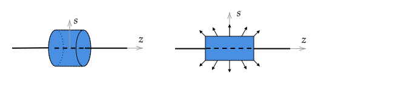

# Introduction

## Integral Form

Gauss's law states that the integral of electric flux, $\Phi_E$ over a closed surface, $\mathcal{A}$, is related to the amount of charge inside the surface according to

$$\Phi_E\equiv\oint_{\mathcal{A}} \mathbf{E}\cdot d\mathbf{A} = \frac{Q_{\text{Inside }\mathcal{A}}}{\epsilon_0}$$

To simplify notation, $Q_{Inside\text{ }\mathcal{A}}$ is usually written as $Q_{encl}$ and often the $\mathcal{A}$ is dropped:

$$\boxed{\oint \mathbf{E}\cdot d\mathbf{A} = \frac{Q_{encl}}{\epsilon_0}}$$

This equation is also known as Gauss's law in integral form.

### Problem

1. A point charge $q$ is placed outside of a spherical shell.  What is the electric flux through its surface due to the point charge?
2. A point charge is placed at the center of a spherical shell. What is the electric flux through the shell's surface due to the point charge?
3. A point charge is placed just inside a spherical shell.
   1. What is the electric flux through the shell's surface?
   2. Is the electric field magnitude constant on the surface of the shell?

Justify your answers.

%**Answer**
%1. Zero.  
%2. $q/\epsilon_0$%

%   The answer for 1. and 2. follow from Gauss' Law in integral form: $\Phi_E = \oint \mathbf{E}\cdot d\mathbf{A} = Q_{encl}/\epsilon_0$. In both cases, $q$ is the total charge inside of the surface on which we want to know the electric flux, $\Phi_E$. The integral would be difficult to compute for 2.
%3. &nbsp;
%   1. $q/\epsilon_0$. We can think of flux as proportional to the number of field lines that pass through a surface.  Lines going in provide negative flux, lines out positive.  If you draw field lines due to a point charge through a closed surface that does not enclose the point charge, all of the point charge's field lines going into the surface must exit.
%   2. Note that in cases 1. and 3., Gauss' Law would not be useful for computing the electric field. Gauss' Law is useful for computing the electric field when it is constant or zero on a Gaussian surface, and its angle with respect to the surface normal is constant, in which case it can be factored out of the integral.

## Differential Form

Gauss's law in differential form relates the divergence of the vector field $\mathbf{E}$ at anly location in space to the charge density, $\rho$, at that location:

$$\boxed{\boldsymbol{\nabla}\bfcdot \mathbf{E} = \frac{\rho}{\epsilon_o}}$$

It is important to remember that both $\mathbf{E}$ and $\rho$ in general depend on position, which can be emphasized by writing $\mathbf{E}$ and $\rho$ with argument of $x,y,z$ or, more generally, $\mathbf{r}$, so that there is no reference to a coordinate system:

$${\boldsymbol{\nabla}\bfcdot \mathbf{E}(\mathbf{r}) = \frac{\rho(\mathbf{r})}{\epsilon_o}}$$

Gauss's law in integral form states that one can find the charge density at any point in space by computing the divergence of $\mathbf{E}$ at that point.

### Derivation

Starting with Gauss's law

$$\oint \mathbf{E}\cdot d\mathbf{A} = \frac{Q_{encl}}{\epsilon_0}$$

rewrite $Q_{enc}$ in terms of an integral over the volume enclosed by the closed surface associated with the flux. This gives

$$\oint \mathbf{E}\cdot d\mathbf{A} = \frac{1}{\epsilon_0}\int \rho d\tau$$

From the [divergence theorem](divergence.html), the left--hand side can be written as

$$\int(\boldsymbol{\nabla}\bfcdot \mathbf{E}) d\tau = \frac{1}{\epsilon_0}\int \rho d\tau$$

This can be written as

$$\int \left(\boldsymbol{\nabla}\bfcdot\mathbf{E} - \frac{\rho}{\epsilon_0} \right)d\tau = 0$$

This equation applies to an arbitrary volume. Suppose there is a volume for which the integrand is positive in a subvolume. The integral can be zero if the contribution to the integral for the rest of the volume is opposite in value. However, because the volume is arbitrary, the integral must also apply to the subvolume. As a result, we conclude that the integrand must always be zero. Another way of looking at this is to consider an arbitrary infinitesimal volume $\Delta \tau$. As $\Delta \tau \rightarrow 0$, the equation approaches $\left(\boldsymbol{\nabla}\bfcdot\mathbf{E} - {\rho}/{\epsilon_0} \right)\Delta \tau=0$. To be true, for all $\Delta \tau$, $\boldsymbol{\nabla}\bfcdot\mathbf{E} = {\rho}/{\epsilon_0}$ is required.

# Partial Proof of Gauss's Law in Integral Form

In this section, we only consider the start and end of the proof of Gauss's law in integral form. It is not important for you to be able to derive the part of the proof that was omitted. However, you should have a general understanding of the approach needed for the omitted part of the derivation based on the discussion given in the [notes on Flux](flux.html).

Consider a charge $q_{origin}$ at the origin and a Gaussian surface of a spherical shell of radius $R$ centered on the origin. Gauss's law is then

$$\Phi_E = \oint_{SS}\mathbf{E}\cdot d\mathbf{A}=\frac{q_{origin}}{\epsilon_o}$$

For this surface, $d\mathbf{A}=R^2\sin\theta d\theta d\phi \mathbf{\hat{r}}$ and the field on the surface is $\mathbf{E}=kq_{origin}\mathbf{\hat{r}}/R^2$. Subtitution gives

\begin{aligned}
\displaystyle\oint_{SS}\mathbf{E}\cdot d\mathbf{A} = & kq_{origin}\int_{\phi=0}^{2\pi}\int_{\theta=0}^\pi \frac{\mathbf{\hat{r}}}{R^2}\bfcdot (R^2\sin\theta d\theta d\phi \mathbf{\hat{r}})\\\\
=& kq_{origin}\int_{\phi=0}^{2\pi}\int_{\theta=0}^\pi \sin\theta d\theta d\phi\\\\
=& kq_{origin}4\pi\\\\
=& \frac{q_{origin}}{\epsilon_o}
\end{aligned}

Where $k=1/4\pi\epsilon_o$ was used in the last step.
## Problem

In another universe, the electric field created by a charge $q$ at the origin is found to be $\mathbf{E} = k'q\hat{\mathbf{r}}/r^3$, where $k'$ is a constant with appropriate units.

Is Gauss's law valid in this universe?

----

At this point, we have not proven the general equation, only a special case. To complete the proof, we would proceed by

1. Considering a charge inside of a spherical surface but not at the origin.
2. Considering a charge outside of a spherical surface.
3. Considering the previous two cases for an arbitrary surface.

To do this, one could apply arguments for Approach II used in the [notes on Flux](flux.html#through-a-closed-line). (One would need to generalize these arguments to apply to a closed surface instead of a closed line.)

Once the proof is complete for a single point charge inside an arbitrary closed surface and outside of an arbitrary closed surface, there is one final step of generalization to an arbitrary number of charges. This step only requires the use of superposition.

Assuming that we have shown that the electric field $\mathbf{E}\_{1i}$ due a single point charge $q_{1i}$ inside of an arbitrary closed surface satisfies the relationship

$$\oint \mathbf{E}\_{q_{1i}}\cdot d\mathbf{A} = \frac{q_{1i}}{\epsilon_0}$$

we can apply this to another point charge inside of the surface by simply changing the subscript:

$$\oint \mathbf{E}\_{q_{2i}}\cdot d\mathbf{A} = \frac{q\_{2i}}{\epsilon_0}$$

These two equations can be combined to be

$$\oint \mathbf{E}\_{q_{1i}}\cdot d\mathbf{A} + \oint \mathbf{E}\_{q_{2i}}\cdot d\mathbf{A} = \frac{q_{1i}}{\epsilon_0} + \frac{q\_{2i}}{\epsilon_0}$$

By superposition, the total electric field is $\mathbf{E}\_I=\mathbf{E}\_{q\_{1i}}+\mathbf{E}\_{q\_{2i}}$. As a result, it follows that

$$\oint \mathbf{E}\_I\cdot d\mathbf{A} = \frac{q_{1i}+q_{2i}}{\epsilon_0}$$

This argument can be repeated for an arbitrary of number of charges inside of a volume, giving

$$\oint \mathbf{E}\_I\cdot d\mathbf{A} = \frac{q_{1i}+q_{2i}+...}{\epsilon_0}$$

To finish the proof, assume that we have shown that for a single point charge $q_{1o}$ outside of a closed surface that

$$\oint \mathbf{E}\_{q\_{1o}}\cdot d\mathbf{A} = 0$$

This applies to another charge outside of the same closed surface

$$\oint \mathbf{E}\_{q\_{2o}}\cdot d\mathbf{A} = 0$$

So by superposition, the electric field $\mathbf{E}\_O=\mathbf{E}\_{1o}+\mathbf{E}\_{2o}$ due to all charges outside of the surface is

$$\oint \mathbf{E}_O\cdot d\mathbf{A} = 0$$

Finally, combine the two equations

$$\oint \mathbf{E}\_I\cdot d\mathbf{A} = \frac{q_{1i}+q_{2i}+...}{\epsilon_0}$$

$$\oint \mathbf{E}\_O\cdot d\mathbf{A} = \frac{q_{1i}+q_{2i}+...}{\epsilon_0}$$

to give

$$\oint \mathbf{E}\_I\cdot d\mathbf{A} + \oint \mathbf{E}\_O\cdot d\mathbf{A} = \frac{Q_i}{\epsilon_o}$$

Finally, we can use superposition to state that the total electric field, $\mathbf{E}$, is the sum of the electric field due to charges inside with the electric field due to charges outside the sphere. That is, $\mathbf{E}=\mathbf{E}_I+\mathbf{E}_O$. As a result

$$\oint \mathbf{E}\cdot d\mathbf{A} = \frac{q_{1i}+q_{2i}+...}{\epsilon_0}=\frac{Q_{encl}}{\epsilon_o}$$

# Using -- Charges on an Insulator

By insulator, we mean that the charges are fixed. Insulator and non--conductor mean the same thing.

In Gauss' Law, the electric field is inside of an integral:

$$\oint \mathbf{E}\cdot d\mathbf{A} = \frac{Q_{encl}}{\epsilon_0}$$

As a result, using it to find the electric field for a collection of charges would seem more difficult than using Coulomb's law, for which the electric field is written explicitly as

$$\displaystyle \mathbf{E}=\int  \frac{\hat{\textbf{\char"0509}}}{\char"0509^2}\lambda dl
\qquad
\displaystyle \mathbf{E}=\int  \frac{\hat{\textbf{\char"0509}}}{\char"0509^2}\sigma dA
\qquad
\displaystyle \mathbf{E}=\int  \frac{\hat{\textbf{\char"0509}}}{\char"0509^2}\rho d\tau
$$

for charges on a line, on a surface, or in a volume, respectively.

In general, Coulomb's law can always be used to compute $\mathbf{E}$ if the charge density is known. However, there is a certain class of problems for which using Gauss's law is much easier than using Coulomb's law.

> When a symmetry argument can be made for why
>
> 1. $|\mathbf{E}|$ is constant or zero on a closed surface and
> 2. why the angle between $\mathbf{E}$ and $d\mathbf{A}$ is constant on the part of the closed surface for which $|\mathbf{E}|$ is not zero,
>
> then Gauss's law can be used to easily find **the magnitude** of an electric field on a surface. **The direction** of the field is determined by a symmetry argument.

The location and charge distributions for which symmetry + Gauss's law can be used to find $\mathbf{E}$ includes

* near the center of a long and uniformly charged line;
* near the center of a long and uniformly charged cylindrical shell;
* near the center of a long and uniformly charged solid cylinder for which the density only varies with radius;
* near the center of a large and uniformly charged flat sheet (of any shape);
* at any location for a uniformly charged spherical shell;
* at any location for charged sphere for which the density only varies with radius;
* just outside of _any_ conductor, even if the charge density is not uniform on the surface (we will use Gauss's law to show that all of the charge on a conductor must be on its surface); and
* at any point inside a conductor with _any_ shape and any surface charge density.

Gauss' law is also useful when one can find a surface on which the electric field is always zero -- in this case, one can conclude the amount of charge inside the surface is zero. Finally, Gauss' Law is useful if you are given the electric field on a surface and want to calculate the amount of charge enclosed.

There are three equally important steps to using Gauss's law

1. The symmetry argument
2. Computing $\Phi_E$
3. Computing $Q_{encl}$

Because there are only a few problems for which Gauss's law can be used, the symmetry argument is often forgotten. In the following, I emphasize the symmetry argument and provide an explicit justification for each of the calculations made in the three steps above. On homeworks and exams, I am interested in knowing that you understood the justifications for the steps. It is quite easy to get the correct answer for Gauss's law problems without really understanding the justifications and just writing one or two unjustified equations that are consistent with the answer.

## Common Error

A common usage error is to draw a Gaussian surface that has no net charge inside of it and conclude that the electric field is zero on the surface. Without any other information, if the net charge inside a surface is zero, you can only conclude the electric flux, $\Phi_E$ is zero.

## Example -- Long Line of Charge

In a previous homework, the electric field due to a long line of charge was considered. An argument was made for why the field only has a vertical component on a line centered on and perpendicular to the charged line.

Consider a Gaussian cylinder as shown on the left of the following figure.

The electric field vectors at a few points on the Gaussian surface are also shown on the right, which is a side view of the image on the left. It would seem that this Gaussian surface does not satisfy the constraint of "$|\mathbf{E}|$ is constant or zero on all surfaces, and the angle between $\mathbf{E}$ and $d\mathbf{A}$ is constant on a surface".

However, consider what happens when we make the line very long (or equivalently, shrink the Gaussian surface). The field lines in the region of the Gaussian surface become more and more vertical. Based on this, we can state that the electric field must have the form

$\mathbf{E}=E_s(s)\hat{\mathbf{s}}$

in the region of the Gaussian cylinder. Thus, symmetry has told us that although the general equation for the electric field has the form

$\mathbf{E}(s,\phi,z)=E_s(s,\phi,z)\hat{\mathbf{s}}+E_\phi(s,\phi,z)\boldsymbol{\hat{\phi}}+E_z(s,\phi,z)\zhat$

At this point, we only know that $\mathbf{E}$ will only have an $\hat{\mathbf{s}}$ component and can only possibly depend only on $s$.

$\mathbf{E}(s)=E_s(s)\hat{\mathbf{s}}$

The next step is to do the surface integral, which can be split into three parts: 

$\displaystyle \oint \mathbf{E}\cdot d\mathbf{A} = \int_{\text{Right cap}} \mkern-36mu\mathbf{E}\bfcdot d\mathbf{A} + \int_{\text{Left cap}}\mkern-30mu\mathbf{E}\bfcdot d\mathbf{A} + \int_{\text{Curved surface}}\mkern-60mu\mathbf{E}\bfcdot d\mathbf{A}$

On each surface, $d\mathbf{A}$ is different.

1. Right cap, for which $d\mathbf{A}=s'ds'd\phi\hat{\mathbf{z}}$
2. Left cap, for which $d\mathbf{A}=-s'ds'd\phi\hat{\mathbf{z}}$
3. Curved surface, for which $d\mathbf{A}=sd\phi dz\hat{\mathbf{s}}$

The dot products $\mathbf{E}\cdot d\mathbf{A}$ for each integrals are
1. Right cap: $E_s(s)\hat{\mathbf{s}}\bfcdot (s'ds'd\phi\hat{\mathbf{z}})=0$ because $\hat{\mathbf{s}}$ is perpendicular to $\zhat$.
2. Left cap: $E_s(s)\hat{\mathbf{s}}\bfcdot (-s'ds'd\phi\hat{\mathbf{z}})=0$ because $\hat{\mathbf{s}}$ is perpendicular to $\zhat$.
3. Curved surface: $E_s(s)\hat{\mathbf{s}}\bfcdot sd\phi dz\hat{\mathbf{s}}=E_s(s) s d\phi dz$

As argued above, the integrand for the first two integrals are zero, so we are left with

$\displaystyle \oint\mathbf{E}\cdot d\mathbf{A} = \int_{\text{Curv surface}}\mkern-60mu\mathbf{E}\bfcdot d\mathbf{A}$

The electric field is constant on the curved surface, so integration is not needed. The area of the curved surface is $2\pi s h$ and so

$\displaystyle\int_{\text{Curved surface}}\mkern-60mu\mathbf{E}\bfcdot d\mathbf{A}=E_s(s)2\pi s h$

The charge enclosed in the cylinder is

$Q_{encl}=\lambda_o h$

Using Gauss's law, we can equate the flux the curved surface and $Q_{encl}/\epsilon_o$:

$\displaystyle E_s(s)2\pi s h = \frac{\lambda_o h}{\epsilon_o}$

And so

$\displaystyle E_s(s) = \frac{\lambda_o}{2\pi\epsilon_o}\frac{1}{s}$

We are not done. The problem asked for $\mathbf{E}$. Using symmetry arguments, we concluded that $\mathbf{E}$ must have the form

$\displaystyle \mathbf{E}(s)=E_s(s)\hat{\mathbf{s}}$

So combining the symmetry argument equation with the result of Gauss's law gives

$\displaystyle\mathbf{E}(s) = \frac{\lambda_o}{2\pi\epsilon_o}\frac{\hat{\mathbf{s}}}{s}$

To be technically correct, we should also state that this result is valid only in the limit that the length of the line approaches infinity, or equivalently, at locations near the center of a finite line of charge at a radial distance from the center that approaches zero.

## Problem -- Comparison of Gauss's law Result with Exact

From Gauss's law, for a "long" line of charge,

$\displaystyle \mathbf{E}_G(s) = \frac{\lambda_o}{2\pi\epsilon_o}\frac{\hat{\mathbf{s}}}{s}$

In the notes on [Continuous Charge Distributions](continuous_charge_distributions.md!#example-integral-can-be-solved-exactly), it was shown that the exact answer is

$\displaystyle \mathbf{E}_C(s)=k\frac{2L\lambda_o}{s\sqrt{L^2 + s^2}}\hat{\mathbf{s}}$

1\. Compute $E_G/E_C$ for $s/L=1/10$.

2\. Show that for $s\ll L$, $\mathbf{E}_C$ can be written in the form
   
$\displaystyle \mathbf{E}_C(s) \simeq \left(\frac{B_1}{s} + \frac{B_2}{s^2} + \frac{B_3}{s^3}\right)\hat{\mathbf{s}}$

   and find the non--zero constants in terms of $\epsilon_o$, $\lambda_o$, and $L$.
   
## Problem -- Sheet of Charge

A large non--conducting sheet has a uniform charge density $\sigma_o$. Find $\mathbf{E}$ using Gauss's law.

# Using -- Charges on a Conductor

In problems where we are given a charge denstity that is placed on a non--conductor, we can use the Coulomb's law integral to directly find the electric field. For example, if we are told charges are distributed on a square with $\sigma(x,y)$, we can directly evaluate the integral

$$\displaystyle \mathbf{E}=\int  \frac{\hat{\textbf{\char"0509}}}{\char"0509^2}\sigma dA$$

In the case of conductors, all we typically know is that a certain amount of charge has been placed on it. If the conductor is not a perfect sphere, we don't know how the charge distributes on the conductor's surface and so we don't know $\sigma$. If we don't know $\sigma$, we can't evaluate the integral.

However, Gauss's law can be used to give us some information about $\mathbf{E}$.

Prior to using Gauss's law to determine this additional information, we need to know the properties of conductors (see 2.5.1 of Griffiths and make sure that you understand the justifications for each of the following):

1. $\mathbf{E}=0$ inside a conductor.
2. All charges must reside on the surface of a conductor.
3. The electric field is perpendicular to the surface of a conductor.

Suppose a net charge $Q$ is placed on a conductor of arbitrary shape. We can make three statements about the electric field.

1. For points far away, the electric field will approach $kQ\hat{\mathbf{r}}/r^2$, where $r$ is the distance from the center of the conductor.
2. Inside the field is zero due because it is a conductor.
4. The electric field is perpendicular to the surface because it is a conductor.

There is one more statement about the electric field that we can make using Gauss's law. Consider a small Gaussian cylinder as shown in the following diagram. The cylinder is oriented so that the centerline is perpendicular to the surface and half of the cylinder is inside the conductor.

The surface charge density $\sigma$ on the conductor is not known. If the cylinder radius is small, the charge inside of the cylinder is $\sigma \pi s^2$ and integration of $\sigma$ is not needed. Gauss's law then reads

$$\oint \mathbf{E}\cdot d\mathbf{A} = \int_{\text{Right cap}} \mkern-36mu\mathbf{E}\bfcdot d\mathbf{A} + \int_{\text{Left cap}}\mkern-30mu\mathbf{E}\bfcdot d\mathbf{A} + \int_{\text{Curved surface}}\mkern-60mu\mathbf{E}\bfcdot d\mathbf{A}=\frac{Q_{encl}}{\epsilon_o}=\frac{\sigma \pi s^2}{\epsilon_o}$$

The field on the left cap is zero because it is inside of the conductor and so the second integral is zero. The field just outside of the curved surface and outside of the conductor is perpendicular to the surface because it is the surface of the conductor, so the integrand of the third integral is zero. (Said another way, the normal vector for the curved surface is perpendicular to the electric field just outside of the conductor).

The field on the right cap will be perpendicular to its surface, so $E_z\hat{\mathbf{z}}$, where $E_z$ is unknown. If the cylinder is small, the integral for the flux through the right cap is the product of the field and the area, $E_z\pi s^2$ because the field is nearly constant on cap. Thus,

$$E_z\pi s^2 = \frac{\sigma \pi s^2}{\epsilon_o}$$

and so

$$E_z = \frac{\sigma}{\epsilon_o}$$

Based on this, and in more general terms, the additional statement is that we can make about the electric field due to charges on a conductor is

4. $\displaystyle E_\perp = \frac{\sigma}{\epsilon_o}$, where in general $\sigma$ is not constant on the surface of the conductor.

> * This is the magnitude of the field. The direction depends on the sign of $\sigma$. If $\sigma$ is positive, $\mathbf{E}$ points outwards from the volume of the conductor.
> * In general, we will not know $\sigma$. Finding it will require the techniques covered in Chapter 3 of Griffiths. 
> * This field is twice the magnitude of the field due to charges uniformly distributed on a non--conducting sheet. The reason for this is considered in the following example.

## Example

A large conducting slab of thickness $t$ and surface area $A$ has a net charge of $Q$ placed on it. A side view is shown below.

Find and plot the electric field for all $x$.

**Answer**:

When a net charge is placed on a conductor, the charges rearrange themselves such that the electric field inside it is zero. If half of the charges move to the right surface and the other half moves to the left, the charge distribution will appear as two sheets of charge, each with the same surface charge density of $\sigma$.

The electric field to the right is the field due to the two sheets of charge: $(\sigma/2\epsilon_o+\sigma/2\epsilon_o)\xhat=\sigma/\epsilon_o\xhat$. The field to the left is $-(\sigma/2\epsilon_o+\sigma/2\epsilon_o)\xhat=\sigma/\epsilon_o\xhat$.

This result is consistent with the claim that the field just outside of the conductor is $\sigma/\epsilon_o$. This field is twice that of a sheet of charge because the field just outside of the conductor is due to all charges -- the left and right face of the conductor both create an electric field.

A general feature of plots of this form is that when one passes through a surface (conducting or non--conducting) with a charge density $\sigma$, there is a jump in the electric field of $\sigma/\epsilon_o$.

## Problem

Repeat the previous example when there is an external electric field of $\mathbf{E}=E_o\xhat$.

## Problem

Repeat the previous problem when the slab has a net charge of $Q$.

## Example -- Charge Inside Conductor with a Cavity

A charge $q$ is placed at the center of a spherical conductor of radius $2R$ with a spherical cavity of radius $R$.

Use Gauss' law to find equations for the electric field in the following three regions

1. $r \lt R$
2. $R \lt r \lt 2R$
3. $r \gt 2R$

and the surface charge density at $r=R$ and $r=2R$.

Plot the electric field versus the distance from the charge.

**Answer**: Covered in class.

## Problem -- Charge Inside Conductor with a Cavity

Repeat the previous problem when the conductor has a net charge of $3Q$. 