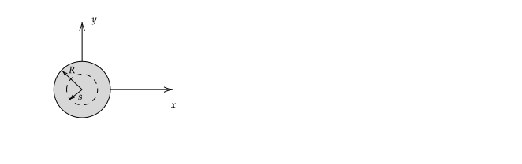
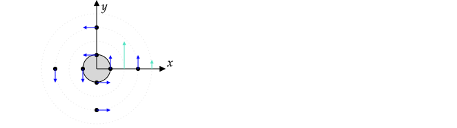

Due on Thursday, November 17th at 3:00 pm.

Send your solutions to the email address rweigel+phys305@gmu.edu as a scanned PDF. Use a file name of `Yourlastname_PHYS305_HW11.pdf` (one file only, please). Capitalize the first letter in your last name and use caps and underscores as indicated. **Include your name on the first sheet**.

This HW covers 5.2 and 5.3 of Griffiths.

# Two current sheets

In the following figure, the cross--section of two planes is shown. The planes are infinite in extent in the $\pm z$ direction and $w\gg t$, so they are infinite in extent in the $\pm x$ direction.

On the red plane, the surface current density is $\mathbf{K}=K_o\zhat$, so that current flows out of the page.
On the blue, plane the surface current density is $\mathbf{K}=-K_o\zhat$, so that current flows into the page.

The Amperian loop to be used in part 3. of this problem is shown as a dotted line. 

1. Find $\mathbf{B}$ using the equation for the magnetic field due to a large flat current sheet (Equation 5.58 of Griffiths 4th Edition) and superposition.
2. Plot $B_x(y)$ in the range $-2t\le y\le 2t$.
3. Show that $\oint \mathbf{B}\bfcdot d\mathbf{l} = \mu_o I_{encl}$ is satisfied for the Amperian loop shown.

**Answer**

1. Equation 5.58 is for a sheet with a different orientation. The magnitude of the field above and below the sheet is $\mu_oK/2$ and the direction is given by the right--hand rule.

  Between the sheets, the fields are in the same direction and outside they are in the opposite direction. The field is zero except between the sheets where it is $\mathbf{B}=-\mu_oK_o\xhat$.
  
  This configuration is analagous to two sheets of charge with charge density $\pm \sigma_o$; outside, the field is zero and inside it is $\sigma_o/\epsilon_o$.

3. The sign of $I_{encl}$ depends on the direction of integration around the Amperian loop. Choosing clockwise roation, $I_{encl}=K_od$, where $d$ is the width of the loop. If $1$ is the right segment, $2$ is the lower, $3$ is the left, and $4$ is the top, then

   $\oint \mathbf{B}\bfcdot d\mathbf{l}=\int_{1}\mathbf{B}\bfcdot d\mathbf{l}+\int_{2}\mathbf{B}\bfcdot d\mathbf{l}+\int_{3}\mathbf{B}\bfcdot d\mathbf{l}+\int_{4}\mathbf{B}\bfcdot d\mathbf{l}$.
   
   On segments $1$ and $3$, $\mathbf{B}$ is perpendicular to $d\mathbf{l}$, so their integrands are zero. On segment $4$, $\mathbf{B}$ is zero, so its integrand is zero.
   
   On segment $2$, $d\mathbf{l}=-dx\xhat$ and

   $\int_{0}^d\mathbf{B}\bfcdot d\mathbf{l}=\int_{0}^d(-\mu_oK_o\xhat)\bfcdot (-dx\xhat)=\mu_oK_od$
   
   Therefore, we have shown
   
   $\left(\oint \mathbf{B}\bfcdot d\mathbf{l} = \mu_oK_od\right) = \left(\mu_o I_{encl} = \mu_o K_o d\right)$
   

# Long solid cylindrical wire

The cross--section of a long and solid cylindrical wire is shown in the following figure. The wire is infinite in extent in the $\pm z$ direction. A constant current density per unit area of $J_o$ flows along the wire in the $+z$ direction. (The total current flowing along the wire is the integral of $J_o$ over the cross--section shown.)

An Amperian loop of radius $s$ is shown as a dotted line.

1. Find $I_{encl}(s)$ by the Amperian loop for $s\le R$ and $s\ge R$.
2. It can be shown that the magnetic field is

  $\displaystyle\mathbf{B}=\frac{\mu_oJ_o}{2}s\boldsymbol{\hat{\phi}}$ for $s\le R$

  $\displaystyle\mathbf{B}=\frac{\mu_oI}{2\pi s}\boldsymbol{\hat{\phi}}$ for $s\ge R$

  Sketch the [vector field](vector_fields.html) for this magnetic field; plot vectors at $s=R/2$ and $s=2R$ for $\phi=0, \pi/2, \pi, 3\pi/2$. (A total of 8 vectors. The relative sizes of the vectors should be correct.)

3. Show that $\oint \mathbf{B}\cdot d\mathbf{l}=\mu_oI_{enc}$ is satisfied for $s\le R$ and $s\ge R$.

4. Show that $\boldsymbol{\nabla}\bfcdot\mathbf{B}=0$ is satisfied for $s\le R$ and $s\ge R$.

5. Show that $\boldsymbol{\nabla}\times\mathbf{B}=\mu_o\mathbf{J}$ is satisfied for $s\le R$ and $s\ge R$.

**Answer**

When using Ampere's law, one must choose a direction of integration around the loop. This direction of integration is used to determine the sign of $I_{encl}$. If the direction of integration is counterclockwise, then from the right--hand rule, current flowing out of the page is positive.

1. If the Amperian loop has a radius of $s$, then $I_{encl}=J_o\pi s^2$ for $s\le R$ and $I_{encl}=J_o\pi R^2$ for $s\ge R$. Note that the amount of current enclosed increases with the radius of the Amperian loop until it is larger than $R$.

2. To compare the magnitude of the vectors, we need to write them with the same constants. The total current flowing through the wire is $I=\pi R^2J_o$. Plugging this and $s=R/2$ into the equation for $s\ge R$ gives $B_\phi=\mu_oJ_oR/4$. This happens to be the same as $B_\phi(s=2R)$. As a result, the vectors are the same magnitude at $s=R/2$ and $s=2R$. The requested vectors are shown in blue in the figure below. The green vectors were added to show the trend in the vector magnitude as a function of distance from the origin.

   

3. For counterclockwise rotation, $d\mathbf{l}=s d\phi \hat{\boldsymbol{\phi}}$.

  For $s\le R$, 

  $\displaystyle\oint \mathbf{B}\cdot d\mathbf{l} = \int_0^{2\pi}\left(\frac{\mu_o J_o}{2}s\hat{\boldsymbol{\phi}}\right)\bfcdot (s d\phi \hat{\boldsymbol{\phi}})=\mu_oJ_o\pi s^2$
  
  From 1., $I_{encl}=J_o\pi s^2$. Thus
  
  $\left(\displaystyle\oint \mathbf{B}\cdot d\mathbf{l} = \mu_oJ_o\pi s^2\right)=\left(\mu_oI_{encl}=\mu_oJ_o\pi s^2\right)$
   
  For $s\ge R$, 

  $\displaystyle\oint \mathbf{B}\cdot d\mathbf{l} = \int_0^{2\pi}\left(\frac{\mu_o I}{2\pi s}\hat{\boldsymbol{\phi}}\right)\bfcdot (s d\phi \hat{\boldsymbol{\phi}})=\mu_oI$
  
  As noted earlier, $I$ is the total current flowing through the wire. For $s\ge R$, $I_{encl}=I$. Thus
  
  $\left(\oint \mathbf{B}\cdot d\mathbf{l}=\mu_oI\right)=\left(\mu_oI_{enc}=\mu_oI\right)$

4. The divergence in cylindrical coordinates is $\boldsymbol{\nabla}\cdot\mathbf{B}={1 \over s}{\partial \left( s B_s  \right) \over \partial s}+{1 \over s}{\partial B_\phi \over \partial \phi}+{\partial B_z \over \partial z}$.

   For $s\le R$, $B_s=B_z=0$ so the first and third terms are a derivative of zero. $B_\phi$ depends only on $s$, so $B_\phi = B_\phi(s)$ and so the partial derivative is zero. Thus, $\boldsymbol{\nabla}\bfcdot\mathbf{B}=0$.
   
   For $s\ge R$, $\boldsymbol{\nabla}\bfcdot\mathbf{B}=0$ for the same reasons.
   
5. $\boldsymbol{\nabla}\times \mathbf{B} = 
\left({\frac {1}{s }}{\frac {\partial B_{z}}{\partial \phi }}-{\frac {\partial B_{\phi }}{\partial z}}\right) {\hat {\boldsymbol {s }}}+\left({\frac {\partial B_{s}}{\partial z}}-{\frac {\partial B_{z}}{\partial s}}\right) {\hat {\boldsymbol {\phi }}}+{\frac {1}{s}}\left({\frac {\partial \left(s B_{\phi }\right)}{\partial s}}-{\frac {\partial B_{s}}{\partial \phi }}\right) {\hat {\mathbf {z} }}$

  For $s\le R$, $B_s=B_z=0$ and $B_\phi=B_\phi(s) =\frac{\mu_oJ_o}{2}s\boldsymbol{\hat{\phi}}$, so
  
  $\boldsymbol{\nabla}\times \mathbf{B} = -\frac{1}{s}\frac{\partial (sB_\phi)}{\partial s}\zhat=\mu_oJ_o\zhat$
  
  For $s\le R$, the current $J_o$ was given to flow out of the page, which means $\mathbf{J}=J_o\zhat$.
  
  For $s\ge R$, we get $\boldsymbol{\nabla}\times \mathbf{B}=0$. This is expected because no current flows outside the wire.

   
   