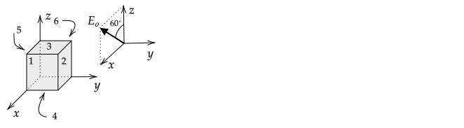

# Particle Flux in Plane

1\. Explain why the flux through a closed line of arbitrary shape is also equal to the flux through a circle centered on the source when particles are emitted from a source with a uniform speed $v_s$ in a plane.

2\. Explain why the flux is zero through a circle that is outside a source that emits particles uniformly in all directions with a speed $v_s$ in a plane.

Does this result hold for a source that is outside of a close loop of arbitrary shape?

# $\Phi_E$ Flux Through Cube Faces

Find the flux through each of the faces of the cube with side length $a$ when the electric field is at an angle of $60^\circ$ with respect to the $+z$-axis towards the $+x$-axis.

%{\bf Answer}:

%$\Phi_E^1=E_oA\sin 60^\circ = E_oa^2\sin 60^\circ$

%$\Phi_E^2=0$

%$\Phi_E^3=E_oA\cos 60^\circ = E_oa^2\cos 60^\circ$

%$\Phi_E^4=-E_oA\cos 60^\circ = -E_oa^2\cos 60^\circ$

%$\Phi_E^5=0$

%$\Phi_E^6=-E_oA\sin 60^\circ = -E_oa^2\sin 60^\circ$

# $\Phi_E$ Through a Half Cylinder

A cylindrical shell (like a toilet paper roll with caps added to ends) is sliced in half as shown on the left of the following figure; on the right, a view from the +$x$--axis is shown.

If $\mathbf{E}=E_o\yhat$,

1\. compute the magnitude of the electric flux through the surface using $\Phi_E = \int_{\mathcal{A}} \mathbf{E}\cdot d\mathbf{A}$. Justify all of your steps for the three integrals that must be evaluated (two caps and curved surface). Recall that a differential element of area on the curved surface of a cylinder of radius $R$ is $Rd\phi dz$ and a differential element on a disk is $sdsd\phi$; and

2\. what is the magnitude of the electric flux through a full cylindrical shell with caps? Justify your answer if you answer without doing a calculation.

# Divergence Due to Solid Sphere of Charge

Outside of a solid sphere of radius $R$ with uniformly distributed charge $Q$, the field is

$\displaystyle\mathbf{E}(r)=kQ\frac{1}{r^2}\boldsymbol{\hat{r}}$

inside, it is

$\displaystyle\mathbf{E}(r)=kQ\frac{r}{R^3}\boldsymbol{\hat{r}}$

Compute $\boldsymbol{\nabla}\bfcdot\mathbf{E}$ using any coordinate system and plot it versus $r$.

# Symmetry

# Binomial Expansion

