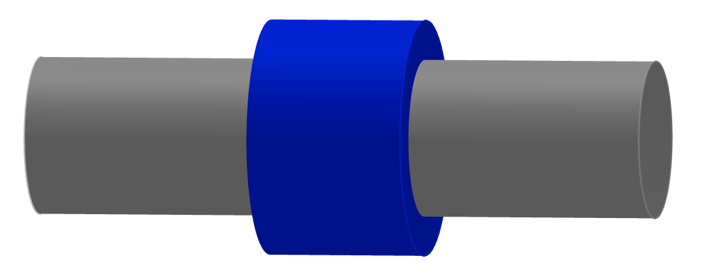

Due on Thursday, September 16th at 3:00 pm.

Send your solutions to the email address rweigel+phys305@gmu.edu as a scanned PDF. Use a file name of `Yourlastname_PHYS305_HW3.pdf` (one file only please). Capitalize the first letter in your last name and use caps and underscores as indicated. **Include your name on the first sheet**.

# Discrete Charge Distributions

Two point charges $q$ are located at $x=\pm b$.

1. Find $\mathbf{E}$ on the $x$--axis in terms of $k$, $q$, $b$, and cartesian coordinates and unit vectors.
2. For $x\gg b$, write an equation for $\mathbf{E}$ in the form

   $\displaystyle \mathbf{E}=\left[B_o+\frac{B_1}{x} + \frac{B_2}{x^2} + \frac{B_3}{x^3}\right]\xhat$
   
   by using the binomial expansion formula with your answer from 1. The values for $B_0, ..., B_3$, if non--zero, should be written in terms of $k$, $q$, and $b$. The binomial expansion formula to first order in $\delta$ is $1/(1+\delta)^n\simeq 1-n\delta$, which applies for $\delta \ll 1$.
3. State at least one check that you made of your answer to 2.

**Answer**

1. Two ways of getting the answer are
   1. Write the field due to each charge in the regions $x\lt -b$, $-b\lt x\lt b$, and $x>b$ and manually insert the correct sign. For example, in the region $-b\lt x\lt b$, the charge at $+b$ has a field that points to the left, so $\mathbf{E}\_{+b}=-kq\xhat/(b-x)^2$; the charge at $-b$ has a field that points to the right, so $\mathbf{E}\_{-b}=+kq\xhat/(b-x)^2$.

   2. Use $\displaystyle kq\frac{\hat{\textbf{\char"0509}}}{\char"0509^2}=kq\frac{\mathbf{r}-\mathbf{r}'}{|\mathbf{r}-\mathbf{r}'|^3}$ with $\mathbf{r}'=\pm b\xhat$ and $\mathbf{r}=b\xhat$.

      $\displaystyle\mathbf{E}=\mathbf{E}\_{+b}+\mathbf{E}\_{-b}=kq\frac{x\xhat-b\xhat}{|x\xhat-b\xhat|^3}+kq\frac{x\xhat+b\xhat}{|x\xhat+b\xhat|^3}$

      This simplifies to

      $\displaystyle\mathbf{E}=\mathbf{E}\_{+b}+\mathbf{E}\_{-b}=kq\frac{(x-b)\xhat}{|x-b|^3}+kq\frac{(x+b)\xhat}{|x+b|^3}$

      where now the $|\cdot|$ operator corresponds to the abslute value. This equation gives the correct sign for the fields due to each charges in all three regions mentioned above.

2. For $x\gt b$, the absolute value signs can be dropped and cancellation gives 

  $\displaystyle\mathbf{E}=\mathbf{E}\_{+b}+\mathbf{E}\_{-b}=kq\xhat\left(\frac{1}{(x-b)^2}+\frac{1}{(x+b)^2}\right)$
      
  Factoring out $x$ gives

  $\displaystyle\mathbf{E}=\frac{kq}{x^2}\xhat\left(\frac{1}{(1-b/x)^2}+\frac{1}{(1+b/x)^2}\right)$
   
   Using $1/(1+\delta)^n\simeq 1-n\delta$ with $n=2$ and $\delta=-b/x$ and $\delta=b/x$ gives
   
   $\displaystyle\mathbf{E}\simeq\frac{kq}{x^2}\xhat\left[1+\frac{2b}{x}+\left(1-\frac{2b}{x}\right)\right]=\frac{2kq}{x^2}\xhat$

   From this, we conclude $B_0=B_1=B_3=0$ and $B_2=2kq$. (To verify that $B_3$ is zero, one could keep an additional term in the binomial expansion. In this case, $B_3$ is still zero because there is no $1/x^3$ term that results; there will be a postive $B_4$ term, which means that the approximation of $2q/x^2$ is an underestimate -- do you see why this would be?)

3. The answer to 2. corresponds to the field due to $2q$ at the origin, which is expected for $x\gg b$. In addition the direction is in the $+\xhat$ direction, which is expected if $q$ is positive.
    
# Charge Densities

## Solid cylinder

A solid cylinder of radius $R$ and length $L$ has a charge of $+3Q$ uniformly distributed within it. The blue Gaussian cylinder shown has the same center line as the solid cylinder, length $l$, and radius $s$.

1. Find the volume charge density of the charged cylinder and its charge per unit length.

2. Find an equation that relates $Q_{encl}$, the charge inside the Gaussian cylinder, and $s$. Draw a plot of $Q_{encl}$ vs $s$.

## Solid Sphere

A solid sphere of radius $R$ that is centered on the origin has a charge density of $\rho(r)=\rho_o r^2/R^2$.

Compute and plot the charge enclosed in a Gaussian sphere centered on the origin versus the radius of the Gaussian sphere.

# Continuous Charge Distributions I

A line of charge with uniform charge density of $\lambda_o$ extends from $0$ to $L$ on the $x$-axis, where $L>0$.

Follow and show the steps given in the notes and find $\mathbf{E}$ on the $x$--axis for $x>L$ in terms of one or more of $k,\lambda_o,L,x,$ and cartesian coordinates and unit vectors.

# Continuous Charge Distributions II

A uniformly charged disk of radius $R$ with a total charge $Q$ is in the $x$--$y$ plane and centered on the origin.

Follow and show the steps given in the notes and find $\mathbf{E}$ on the $z$--axis in terms of one or more of $k,Q,R,z$, and cartesian unit vectors.

# Extra Credit

A line of charge in the $x$-$y$ plane has a uniform charge density of $\lambda_o$, passes through the origin, is at an angle of $\phi$ with the $x$-axis, and extends from $x=-b$ to $x=b$.

Find $\mathbf{E}$ on the $y$--axis using two two methods:

1. By following the steps in the notes.
2. Transforming the equation for $\mathbf{E}(y)$ given in the notes for a line of charge on the $x$--axis between $x=-L$ and $x=L$ to coordinate system rotated by $\phi$ about the $z$--axis.

**Correction:** This problem statement was a hybrid of two separate problems, and as a result, 5.2 does not make sense. The problem statement should have been

1. Find $\mathbf{E}$ on the $y$--axis by following the steps in the notes. 
2. Check your answer for small $y$ by transforming the equation for $\mathbf{E}(y)$ given in the notes for a line of charge on the $x$--axis between $x=-L$ and $x=L$ to coordinate system rotated by $\phi$ about the $z$--axis.

Another slightly more difficult version of this problem is
1. Find $\mathbf{E}(y)$
2. Compute $\mathbf{E}(x,y)$ for a line of charge on the $x$--axis between $x=-L$ and $x=L$. Rotate the coordinate system by $\phi$ about the $z$--axis and show that this rotated field is consistent with your result from 1.

