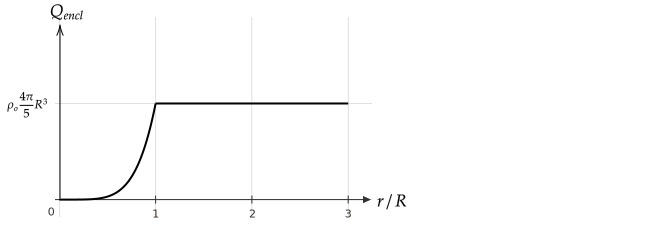
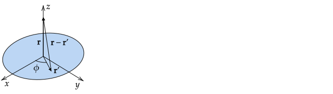
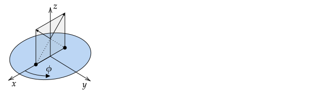

Due on Thursday, September 16th at 3:00 pm.

Send your solutions to the email address rweigel+phys305@gmu.edu as a scanned PDF. Use a file name of `Yourlastname_PHYS305_HW3.pdf` (one file only please). Capitalize the first letter in your last name and use caps and underscores as indicated. **Include your name on the first sheet**.

# Discrete Charge Distributions

Two point charges $q$ are located at $x=\pm b$.

1. Find $\mathbf{E}$ on the $x$--axis in terms of $k$, $q$, $b$, and cartesian coordinates and unit vectors.
2. For $x\gg b$, write an equation for $\mathbf{E}$ in the form

   $\displaystyle \mathbf{E}=\left[B_o+\frac{B_1}{x} + \frac{B_2}{x^2} + \frac{B_3}{x^3}\right]\xhat$
   
   by using the binomial expansion formula with your answer from 1. The values for $B_0, ..., B_3$, if non--zero, should be written in terms of $k$, $q$, and $b$. The binomial expansion formula to first order in $\delta$ is $1/(1+\delta)^n\simeq 1-n\delta$, which applies for $\delta \ll 1$.
3. State at least one check that you made of your answer to 2.

**Answer**

1. Two ways of getting the answer are
   1. Write the field due to each charge in the regions $x\lt -b$, $-b\lt x\lt b$, and $x>b$ and manually insert the correct sign. For example, in the region $-b\lt x\lt b$, the charge at $+b$ has a field that points to the left, so $\mathbf{E}\_{+b}=-kq\xhat/(b-x)^2$; the charge at $-b$ has a field that points to the right, so $\mathbf{E}\_{-b}=+kq\xhat/(b-x)^2$. Many students only wrote the equation for $\mathbf{E}$ in one region, but the problem asked for $\mathbf{E}(x)$, which implies for all $x$.

   2. Use $\displaystyle kq\frac{\hat{\textbf{\char"0509}}}{\char"0509^2}=kq\frac{\mathbf{r}-\mathbf{r}'}{|\mathbf{r}-\mathbf{r}'|^3}$ with $\mathbf{r}'=\pm b\xhat$ and $\mathbf{r}=b\xhat$.

      $\displaystyle\mathbf{E}=\mathbf{E}\_{+b}+\mathbf{E}\_{-b}=kq\frac{x\xhat-b\xhat}{|x\xhat-b\xhat|^3}+kq\frac{x\xhat+b\xhat}{|x\xhat+b\xhat|^3}$

      This simplifies to

      $\displaystyle\mathbf{E}=\mathbf{E}\_{+b}+\mathbf{E}\_{-b}=kq\frac{(x-b)\xhat}{|x-b|^3}+kq\frac{(x+b)\xhat}{|x+b|^3}$

      where now the $|\cdot|$ operator corresponds to the abslute value. This equation gives the correct sign for the fields due to each charges in all three regions mentioned above.

2. For $x\gt b$, the absolute value signs can be dropped and cancellation gives 

  $\displaystyle\mathbf{E}=\mathbf{E}\_{+b}+\mathbf{E}\_{-b}=kq\xhat\left(\frac{1}{(x-b)^2}+\frac{1}{(x+b)^2}\right)$
      
  Factoring out $x$ gives

  $\displaystyle\mathbf{E}=\frac{kq}{x^2}\xhat\left(\frac{1}{(1-b/x)^2}+\frac{1}{(1+b/x)^2}\right)$
   
   Using $1/(1+\delta)^n\simeq 1-n\delta$ with $n=2$ and $\delta=-b/x$ and $\delta=b/x$ gives
   
   $\displaystyle\mathbf{E}\simeq\frac{kq}{x^2}\xhat\left[1+\frac{2b}{x}+\left(1-\frac{2b}{x}\right)\right]=\frac{2kq}{x^2}\xhat$

   From this, we conclude $B_0=B_1=B_3=0$ and $B_2=2kq$. (To verify that $B_3$ is zero, one could keep an additional term in the binomial expansion. In this case, $B_3$ is still zero because there is no $1/x^3$ term that results; there will be a postive $B_4$ term, which means that the approximation of $2q/x^2$ is an underestimate -- do you see why this would be?)

3. The answer to 2. corresponds to the field due to $2q$ at the origin, which is expected for $x\gg b$. In addition the direction is in the $+\xhat$ direction, which is expected if $q$ is positive.
    
# Charge Densities

## Solid cylinder

A solid cylinder of radius $R$ and length $L$ has a charge of $+3Q$ uniformly distributed within it. The blue Gaussian cylinder shown has the same center line as the solid cylinder, length $l$, and radius $s$.

1. Find the volume charge density of the charged cylinder and its charge per unit length.

2. Find an equation that relates $Q_{encl}$, the charge inside the Gaussian cylinder, and $s$. Draw a plot of $Q_{encl}$ vs $s$.

**Answer**

_Note: An earlier version of this solution had $Q$ in place of $3Q$._

1. $\rho=3Q/(\pi R^2 L)$; $3Q = \lambda L$, so $\lambda = 3Q/L$
2. &nbsp;

   $s \le R$, $Q_{encl}=\rho \pi s^2 l=3Q(s^2/R^2)(l/L)$
   
   $s\ge R$, $Q_{encl}=\rho\pi R^2 l = 3Q(l/L)$

## Solid Sphere

A solid sphere of radius $R$ that is centered on the origin has a charge density of $\rho(r)=\rho_o r^2/R^2$.

Compute and plot the charge enclosed in a Gaussian sphere centered on the origin versus the radius of the Gaussian sphere.

**Answer**:

A common error was to write $Q_{encl}=\rho V$. This is only true if $\rho$ is constant within $V$. To avoid this type of error, always start by writing the general equation: $Q_{encl}=\int \rho d\tau$. (Do this for Gauss's law in integral form -- don't start with $\phi_E=EA$, start with $\phi_E=\oint \mathbf{E}\bfcdot d\mathbf{A}$.)

$r\le R$: $\displaystyle Q_{encl}=\int \rho(r) d\tau=4\pi\int_0^r\rho_o(r'^2/R^2)r'^2dr'=\rho_o\frac{4\pi}{5}\frac{r^5}{R^2}$

$r\ge R$: $\displaystyle Q_{encl}=\rho_o\frac{4\pi}{5}R^3$

# Continuous Charge Distributions I

A line of charge with uniform charge density of $\lambda_o$ extends from $0$ to $L$ on the $x$-axis, where $L>0$.

Follow and show the steps given in the notes and find $\mathbf{E}$ on the $x$--axis for $x>L$ in terms of one or more of $k,\lambda_o,L,x,$ and cartesian coordinates and unit vectors.

**Answer**

_Note: An earlier version of this answer had the solution for $\mathbf{E}(y)$ instead of $\mathbf{E}(x)$ for $x>L$._

**Answer**:

Students who had difficulty with this problem typically did not follow the steps outlined in the notes. The motivation for the steps is that they help students who have difficulty with these types of problems.

The steps are
1. Identify Answer Features
2. Find $dl$, $dA$, or $d\tau$
3. Find ${\hat{\textbf{\char"0509}}}/{\char"0509^2}$
4. Check $d\mathbf{E}$
5. Simplify $d\mathbf{E}$ using Symmetry Arguments
6. Integrate $d\mathbf{E}$
7. Check Answer

1\. Identify Answer Features

We are asked for the field on the $x$--axis. For $x\gg L$, the line of charge looks like a point charge near the origin, so we expect $E_x=+k\lambda_oL/x^2$. We also expect that as $x\rightarrow L$, the field should become large.

2\. Find $dl$, $dA$, or $d\tau$

The charges are distributed on a line, so we need $dl$. In this case, $dl=dx'$ because the charges are on the $x$--axis.

3\. Find ${\hat{\textbf{\char"0509}}}/{\char"0509^2}$

$\mathbf{r}=x\xhat$ and $\mathbf{r}'=x'\xhat$

$\textbf{\char"0509}=(x-x')\xhat$ and $\char"0509=|\textbf{\char"0509}|=\sqrt{(x-x')^2}=|x-x'|$

$\displaystyle\frac{\hat{\textbf{\char"0509}}}{\char"0509^2}=\frac{(x-x')\phantom{^3}}{|x-x'|^3}\xhat$

We are asked for the field for $x\gt L$. In this case, $x>x'$ (the point of interest is always to the right of a differential charge), so $|x-x'|=x-x'$ and we can write

$\displaystyle\frac{\hat{\textbf{\char"0509}}}{\char"0509^2}=\frac{(x-x')\phantom{^3}}{(x-x')^3}\xhat=\frac{1}{(x-x')^2}\xhat$

4\. Check $d\mathbf{E}$

$d\mathbf{E}=\displaystyle\frac{\hat{\textbf{\char"0509}}}{\char"0509^2}dq$

Where $dq=\lambda_odx'$ from step 2. and

$\displaystyle\frac{\hat{\textbf{\char"0509}}}{\char"0509^2}=\frac{1}{(x-x')^2}\xhat$

from step 3. Thus,

$\displaystyle d\mathbf{E}=\frac{\lambda_odx'}{(x-x')^2}\xhat$

This $d\mathbf{E}$ corresponds to the equation one would write for a point charge $dq=\lambda_odx'$ at $x'$ at a location $x>x'$. If $x\gg x'$, the field becomes that for $dq$ at the origin, as expected.

6\. Integrate $d\mathbf{E}$

$\displaystyle\mathbf{E}=\int_{0}^L\frac{\lambda_odx'}{(x-x')^2}\xhat$

$\xhat$ and $\lambda_o$ do not depend on $dx'$, so they can be factored out of the integral.

$\displaystyle\mathbf{E}=\lambda_o\xhat\int_{0}^L\frac{dx'}{(x-x')^2}$

Many students who did not follow the steps wrote an upper limit of $\infty$, possibly because they were basing their solution on a textbook solution for an infinite line of charge.

Integration gives

$\displaystyle\mathbf{E}=\lambda_o\xhat\left[-\frac{1}{x-x'}\right]_0^L=\lambda_o\xhat\left[-\frac{1}{x-L}+\frac{1}{x}\right]$

Simplifying gives

$\displaystyle\mathbf{E}=\frac{L\lambda_o}{x(x-L)}\xhat$

7\. Check Answer

When $x\gg L$, $E_x$ approaches $L\lambda/x^2$.

As $x\rightarrow L$, $E_x$ becomes large.

# Continuous Charge Distributions II

A uniformly charged disk of radius $R$ with a total charge $Q$ is in the $x$--$y$ plane and centered on the origin.

Follow and show the steps given in the notes and find $\mathbf{E}$ on the $z$--axis in terms of one or more of $k,Q,R,z$, and cartesian unit vectors.

**Answer**:

_Comments_:
* This is an example commonly given in intro physics textbooks and it has a short--cut solution. Some students essentially gave a few equations from the example solution without justification. I asked you to follow the steps given in the notes because the method used in the example solutions won't help you on more complicated problems. So make sure that you know how to solve this problem using the steps in the notes.
* Many students came up with an $\mathbf{E}$ that had the wrong sign. I took off points for this because the sign error would have been obvious if you had checked your answer to verify that $\mathbf{E}$ had a positive $z$ component when $z>0$.π

1\. Identify Answer Features

(a) We expect that for $z\ll R$, $\mathbf{E}$ to aproach that of an infinite sheet of charge, for which $|\mathbf{E}|=\sigma/2\epsilon_o$ is perpendicular to the sheet and points away from it. For this problem, this means $\mathbf{E}=\pm \zhat (Q/\pi R^2)/\sigma_o$ with the $+$ above the sheet ($z\gt 0$) and $-$ below the sheet ($z\lt 0$).

(b) For $z\gg R$, we expect $\mathbf{E}=\pm kQ\zhat/z^2$ with the sign the same as that of $z$.

2\. Find $dA$

The differential charge can be written in cylindrical coordinates as $dq = \sigma s'ds'd\phi'$. 

3\. Find ${\hat{\textbf{\char"0509}}}/{\char"0509^2}$

$\displaystyle \frac{\hat{\textbf{\char"0509}}}{\char"0509^2}=\frac{1}{|\mathbf{r}-\mathbf{r}'|^2}\frac{\mathbf{r}-\mathbf{r}'}{|\mathbf{r}-\mathbf{r}'|}$

In general,

$\displaystyle\mathbf{r} = x\xhat + y\yhat + z\zhat$

The point of interest is constrained to be on the $z$--axis, for which $x=y=0$, so

$\displaystyle\mathbf{r} = z\hat{\mathbf{z}}$

In general,

$\displaystyle\mathbf{r}' = x'\xhat + y'\yhat + z'\zhat$

and the location of the charge acting on the point of interest has $z'=0$, and so

$\displaystyle\mathbf{r}' = x'\xhat + y'\yhat$

Given that $dA$ was written in cylindrical coordinates, we should write $\mathbf{r}'$ using the same coordinate system:

$\displaystyle\mathbf{r}' = s'\cos(\phi')\hat{\mathbf{x}}+s'\sin(\phi')\hat{\mathbf{y}}$

Note that $s'$ is used in this equation makes $\mathbf{r}'$ depend on the radial distance of the charge $dq$. In the ring problem, $R$ is used instead of $s'$.

4\. Check $d\mathbf{E}$

$$d\mathbf{E}= \frac{dq}{4\pi\epsilon_0}\frac{-s'\cos(\phi')\hat{\mathbf{x}}-s'\sin(\phi')\hat{\mathbf{y}}+z\zhat}{(z^2+s'^2)^{3/2}}$$

When $\phi'=0$, $d\mathbf{E}$ has a $-\xhat$ component and no $\yhat$ component. This is consistent with the following sketch. 

If $z\gg s'$, then the $\zhat$ term dominates and is $1/z^2$, so a charge at any $s'$ produces a field at large $z$ that is near that if it were at the origin.

5\. Simplifying $d\mathbf{E}$ using Symmetry Arguments

We want to integrate, so need to write $dq$ in terms of coordinates. On the disk, a small patch has an area of $(s' d\phi')(ds')$, so
$$dq=\sigma (s' d\phi')(ds')$$

This gives

$$\mathbf{E} = \int_0^{2\pi}\int_0^R \frac{\sigma s' d\phi'ds'}{4\pi\epsilon_0}\frac{-s'\cos(\phi')\hat{\mathbf{x}}-s'\sin(\phi')\hat{\mathbf{y}}+z\zhat}{(z^2+s'^2)^{3/2}}$$

Based on the symmetry argument that we can always find another $dq$ that exactly cancels the horizontal component of a given $dq$, we expect the $\hat{\mathbf{x}}$ and $\hat{\mathbf{y}}$ terms to be zero, so we can drop them. Or we can notice that after factoring out everything that does not depend on $\phi$, the integrals for the $\hat{\mathbf{x}}$ and $\hat{\mathbf{y}}$ terms are $\cos\phi\,d\phi$ and $\sin\phi\,d\phi$ from $0$ to $2\pi$, which are both zero. Note that if a 1/2 disk was given, the integral limits would be from $0$ to $\pi$, and one of the integrals would not be zero.

$$\mathbf{E} = \int_0^{2\pi}\int_0^R \frac{\sigma s' d\phi' ds'}{4\pi\epsilon_0}\frac{z\hat{\mathbf{z}}}{(z^2+s'^2)^{3/2}}$$

6\. Integrating $d\mathbf{E}$

Factoring out the constants gives
$$\mathbf{E} = \frac{\sigma z\hat{\mathbf{z}}}{4\pi\epsilon_0} \int_0^{2\pi}\int_0^R \frac{s' d\phi' ds'}{(z^2+s'^2)^{3/2}}$$

Nothing in the integrand depends on $\phi'$, so the $\phi'$ integral redues to $2\pi$
$$\mathbf{E} = \frac{2\pi\sigma z\hat{\mathbf{z}}}{4\pi\epsilon_0} \int_0^R \frac{s' d\phi'}{(z^2+s'^2)^{3/2}}$$

The result of the integration gives the final answer (to integrate, use a substitution of $u^2=s'^2+z^2$ and use $\sqrt{z^2}=|z|$).

$$\mathbf{E} = \frac{\sigma z}{2\epsilon_0} \left(\frac{1}{|z|}-\frac{1}{\sqrt{R^2+z^2}}\right)\hat{\mathbf{z}}$$

7\. Checking Answer

From step 1, we expect that

(a) We expect that for $z\ll R$, $\mathbf{E}$ to aproach that of an infinite sheet of charge, for which $|\mathbf{E}|=\sigma/2\epsilon_o$ is perpendicular to the sheet and points away from it. For this problem, this means $\mathbf{E}=\pm \zhat (Q/\pi R^2)/\sigma_o$ with the $+$ above the sheet ($z\gt 0$) and $-$ below the sheet ($z\lt 0$).

(b) For $z\gg R$, we expect $\mathbf{E}=\pm kQ\zhat/z^2$ with the sign the same as that of $z$.

(a) For $z\ll R$, only the first term in parenthesis is large
$$\mathbf{E} = \frac{\sigma}{2\epsilon_0}\frac{z}{|z|}\hat{\mathbf{z}}$$

Notice how the ${z}/{|z|}$ term tells use the direction of the electric field. When $z>0$, this term is $+1$. When $z<0$, this term is $-1$.

(b) For $z\gg R$, we need to do a bit more work on the second term in parentheses in (3). Factor out a $z$ from the square root to get
$$\mathbf{E} = \frac{\sigma z}{2\epsilon_0} \left(\frac{1}{|z|}-\frac{1}{|z|\sqrt{1+R^2/z^2}}\right)\hat{\mathbf{z}}$$

Because $R/z \ll 1$, we can use the binomial expansion to get
$$\mathbf{E} \simeq \frac{\sigma z}{2\epsilon_0} \left[\frac{1}{|z|}-\frac{1}{|z|}\left(1-\frac{R^2}{2z^2}\right)\right]\hat{\mathbf{z}}$$

Simplifying gives

$$\mathbf{E} \simeq \frac{\sigma}{2\epsilon_0} \frac{R^2}{2z^2}\frac{z}{|z|}\hat{\mathbf{z}}$$

To show that in this limit the result is the same as if all of the charge was at the origin, we need to compute the charge on the disk, which is
$$Q=\sigma\pi R^2$$

Substituing for $\sigma$ gives

$$\mathbf{E} \simeq \frac{Q}{4\pi\epsilon_0} \frac{1}{z^2}\frac{z}{|z|}\hat{\mathbf{z}}$$

# Extra Credit

A line of charge in the $x$-$y$ plane has a uniform charge density of $\lambda_o$, passes through the origin, is at an angle of $\phi$ with the $x$-axis, and extends from $x=-b$ to $x=b$.

Find $\mathbf{E}$ on the $y$--axis using two two methods:

1. By following the steps in the notes.
2. Transforming the equation for $\mathbf{E}(y)$ given in the notes for a line of charge on the $x$--axis between $x=-L$ and $x=L$ to coordinate system rotated by $\phi$ about the $z$--axis.

**Correction:** This problem statement was a hybrid of two separate problems, and as a result, 5.2 does not make sense. The problem statement should have been

1. Find $\mathbf{E}$ on the $y$--axis by following the steps in the notes. 
2. Check your answer for small $y$ by transforming the equation for $\mathbf{E}(y)$ given in the notes for a line of charge on the $x$--axis between $x=-L$ and $x=L$ to coordinate system rotated by $\phi$ about the $z$--axis.

Another slightly more difficult version of this problem is
1. Find $\mathbf{E}(y)$
2. Compute $\mathbf{E}(x,y)$ for a line of charge on the $x$--axis between $x=-L$ and $x=L$. Rotate the coordinate system by $\phi$ about the $z$--axis and show that this rotated field is consistent with your result from 1.

**Partial Answer**:

This is a line of charge, so the general relationship is $dq'=\lambda dl'$.

In general, a differential element parallel to a line in the $x-y$ plane can be written as

$d\mathbf{l}' = dx'\hat{\mathbf{x}} + dy'\hat{\mathbf{y}}$

the magnitude of $d\mathbf{l}'$ is

$dl' = \sqrt{(dx')^2+(dy')^2}$

factoring out $dx'$ gives a formula that may be familiar from a calculus course in which the the length of a curve is computed:

$dl' = dx'\sqrt{1+\left(\frac{dy'}{dx'}\right)^2}$

In this problem, we are not explicitly given $dy'/dx'$, but it can be derived by noting from a diagram that $\tan\phi = y'/x'$ so that

$y' = x'\tan\phi$

and so $dy'/dx' = \tan\phi$. Substitution gives

$dl' = dx'\sqrt{1+\left(\frac{dy'}{dx'}\right)^2}=dx'\sqrt{1+\tan^2\phi}$

and finally an equation for $dq'$

$dq'=\lambda dl'= dx'\sqrt{1+\tan^2\phi}$

In general,

$\mathbf{r}=x\hat{\mathbf{x}}+y\hat{\mathbf{y}}+z\hat{\mathbf{z}}$ and $\mathbf{r}'=x'\hat{\mathbf{x}}+y'\hat{\mathbf{y}}+z'\hat{\mathbf{z}}$

For this problem, we only want to know $\mathbf{r}$ for points on the $y$-axis, so $x=0$ and $z=0$ leaving

$\mathbf{r}=y\hat{\mathbf{y}}$

the line of charge is in the $x$-$y$ plane, so $z'$ is always zero, leaving

$\mathbf{r}'=x'\hat{\mathbf{x}}+y'\hat{\mathbf{y}}$

Write 

$\displaystyle d\mathbf{E} = \frac{dq'}{4\pi\epsilon_0}\frac{\mathbf{r}-\mathbf{r}'}{|\mathbf{r}-\mathbf{r}'|^3}$

replacing $dq'$ with the differential found in Step 1, $dq' = dx'\sqrt{1+\tan^2\phi}$, and using the reduced versions of $\mathbf{r}$ and $\mathbf{r}'$ in Step 2. Noting that

$\mathbf{r}-\mathbf{r}'=y\hat{\mathbf{y}}-\big(x'\hat{\mathbf{x}}+y'\hat{\mathbf{y}}\big)$

which can be rewritten as

$\mathbf{r}-\mathbf{r}'=-x'\hat{\mathbf{x}}+(y-y')\hat{\mathbf{y}}$

The magnitude is

$|\mathbf{r}-\mathbf{r}'|=\sqrt{(-x')^2 + (y-y')^2}=\sqrt{x'^2 + (y-y')^2}$

and substitution gives

$\displaystyle d\mathbf{E} = \frac{dx'\sqrt{1+\tan^2\phi}}{4\pi\epsilon_0}\frac{-x'\hat{\mathbf{x}}+(y-y')\hat{\mathbf{y}}}{\big(x'^2 + (y-y')^2\big)^{3/2}}$

The final step is to integrate this equation from $x'=0$ to $x'=b$:

$\displaystyle \mathbf{E}(y) = \int_0^{b}\frac{dx'\sqrt{1+\tan^2\phi}}{4\pi\epsilon_0}\frac{-x'\hat{\mathbf{x}}+(y-y')\hat{\mathbf{y}}}{\big(x'^2 + (y-y')^2\big)^{3/2}}$

$dl'$ was found in terms of $dx'$, so all of the primed variables need to be written in terms of $x'$. Using $y'=x'\tan\phi$ gives an equation that is ready for integration

$\displaystyle \mathbf{E}(y) = \int_0^{b}\frac{dx'\sqrt{1+\tan^2\phi}}{4\pi\epsilon_0}\frac{-x'\hat{\mathbf{x}}+(y-x'\tan\phi)\hat{\mathbf{y}}}{\big(x'^2 + (y-x'\tan\phi)^2\big)^{3/2}}$

To solve this, start by factoring out the constant terms 

$\displaystyle \mathbf{E}(y) =\frac{\sqrt{1+\tan^2\phi}}{4\pi\epsilon_0} \int_0^{b}\frac{-x'\hat{\mathbf{x}}+(y-x'\tan\phi)\hat{\mathbf{y}}}{\big(x'^2 + (y-x'\tan\phi)^2\big)^{3/2}}dx'$

and write the equation in terms of two integrals with $y$ and $\phi$ treated as a constant with respect to the integration. In terms of these integrals, $\mathbf{E}$ is

$\displaystyle \mathbf{E}(y) =\frac{\sqrt{1+\tan^2\phi}}{4\pi\epsilon_0} \big[{I_1\hat{\mathbf{x}}+(I_2+I_1\tan\phi)\hat{\mathbf{y}}}\big]$

where

$I_1=\displaystyle \int_0^{b}\frac{-x'}{\big(x'^2 + (y-x'\tan\phi)^2\big)^{3/2}}dx'$

$I_2=\displaystyle \int_0^{b}\frac{y}{\big(x'^2 + (y-x'\tan\phi)^2\big)^{3/2}}dx'$

As $y\rightarrow 0$, we expect the field to be perpendicular to the line and to be related to the field along a line perpendicular to it. One can use the equation for $\mathbf{E}(y)$ for a line of charge along the $x$--axis from $x \pm b$ and re--name $y$ as $y'$, with $y'$ the perpendicular distance from the rotated line. In this case, $y$ and $y'$ are related by $y=y'\cos\phi$.

To finish the problem, integrate and let $y/b\rightarrow 0$. You should find that $\mathbf{E}$ becomes perpendicular to the line, and setting $y=y'\cos\phi$ should give a match to the equation for $\mathbf{E}(y')$.
