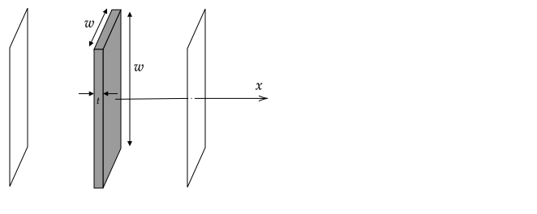

Due on Thursday, September 23rd at 3:00 pm.

Send your solutions to the email address rweigel+phys305@gmu.edu as a scanned PDF. Use a file name of `Yourlastname_PHYS305_HW4.pdf` (one file only, please). Capitalize the first letter in your last name and use caps and underscores as indicated. **Include your name on the first sheet**.

# Gauss's law

1\. Use Gauss's law to find the electric field near the center (from $s=0$ to $s=3R$) of a long solid nonconducting cylinder  of length $L$, radius $R$, and uniform charge density $\rho_o$. Assume $L\gg R$.

Provide explicit justifications for the symmetry argument (described in [the notes](gauss_law.html#using-charges-on-an-insulator)) required to apply Gauss's law and include supporting diagrams. Also, provide justifications for all steps in evaluating the integral in Gauss's law.

2\. Plot the electric field magnitude as a function of $s$ from $s=0$ to $s=3R$.

# Conducting Slab Between Charged Sheets

A conducting slab is centered on the origin, has thickness $t$, surface area $A=w^2$, and has a net charge of $Q$. At $x=\pm 5t$ there are nonconducting sheets with uniform charge density $\pm \sigma_o$. The thickness $t$ of the slab is much smaller than $w$.

1. Find the surface charge density on both faces of the conducting slab, assuming that any charge on it is uniformly distributed.
2. Find and plot $E_x$ versus $x$.
3. Find and plot the electric potential $V$ versus $x$. Assume $V(0)=0$.

# Conducting Sphere with a Cavity

The following figure shows the cross--section of a spherical conductor of radius $2R$ with a spherical cavity of radius $R$, both of which are centered on the origin. There is a nonconducting spherical shell that is also centered on the origin, has a $3q$ uniformly distributed on its surface, and a radius $3R$. At the origin, there is a charge $q$.

Using Gauss's law, 

1. Find and plot $E$ versus $r$.
2. Find and plot $V$ versus $r$. Assume $V(r=\infty)=0$.

Justify your steps when using Gauss's law.

# Work Required to Assemble Charges

For the following charge distribution, compute 

1. the electric potential at the origin, 
2. the electric potential at any position $x,y$, and
2. the work required to assemble the charge distribution.

