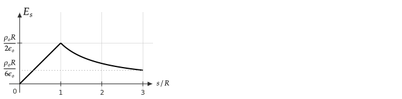
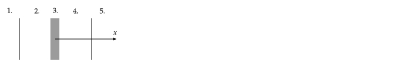
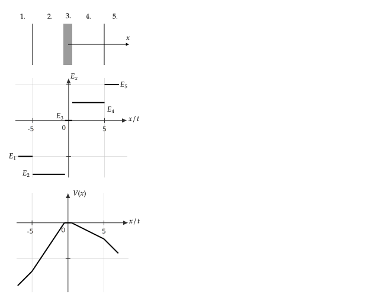

Due on Thursday, September 23rd at 3:00 pm.

Send your solutions to the email address rweigel+phys305@gmu.edu as a scanned PDF. Use a file name of `Yourlastname_PHYS305_HW4.pdf` (one file only, please). Capitalize the first letter in your last name and use caps and underscores as indicated. **Include your name on the first sheet**.

# Gauss's law

1\. Use Gauss's law to find the electric field near the center (from $s=0$ to $s=3R$) of a long solid nonconducting cylinder  of length $L$, radius $R$, and uniform charge density $\rho_o$. Assume $L\gg R$.

Provide explicit justifications for the symmetry argument (described in [the notes](gauss_law.html#using-charges-on-an-insulator)) required to apply Gauss's law and include supporting diagrams. Also, provide justifications for all steps in evaluating the integral in Gauss's law.

2\. Plot the electric field magnitude as a function of $s$ from $s=0$ to $s=3R$.

**Answer**:

This problem can be found in many textbook examples. I want you to show me that you understand the steps. It is easy to write a few equations and get the correct result without understanding much. I looked for evidence that you understood the steps based on correct justifications when grading.

1\. A common error was a lack of justification for $\mathbf{E}=E_s(s)\hat{\mathbf{s}}$. More justification is needed than "because it is long" or "due to symmetry" because the reason is not obvious. Also, a diagram showing straight field lines is not a justification -- it follows from a symmetry argument. As covered in the notes on symmetry, there are two types: Cancellation and geometrical. To use cancellation symmetry as an argument, you must provide an explanation and/or diagram. Same for geometrical. There are three ways to justify $\mathbf{E}=E_s(s)\hat{\mathbf{s}}$.

1. Consider pairs of infinite lines of charge.

    A problem related to this was given on [HW #2](hw2.html#symmetry). If the cylinder is long, then it can be thought of as being composed of many long lines of charge. A view looking down the axis of the cylinder is shown in the following figure. Lines of charge at $s$ and $\varphi$ and $2\pi-\varphi$ each create an electric field along the line $\varphi=0$ that have a component that is both parallel perpendicular to the line along $\phi=0$. However, the parallel components cancel leaving only a perpendicular component. 
(This will also be true for a point inside of the cylinder.) As a result, the net electric field is perpendicular to the cylinder.

    

2. Consider 4 charges at $\pm z$ and $\phi$ and $\pm z$ and $2\pi-\phi$. On the $x$ axis, the field from the two charges at $+z$ will have canceling horizontal components but $z$ components that do not cancel and is in the $+x$ direction. The two charges at $-z$ will have canceling horizontal components but $z$ components that do not cancel and is in the $-x$ direction. The net field in the $x$ direction due to the four charges is zero.

3. Using geometrical symmetry (translational and rotational).

   In general, $\mathbf{E}=E_s(s,\phi,z)\hat{\mathbf{s}}+E_\phi(s,\phi,z)\hat{\boldsymbol{\phi}}+E_z(s,\phi,z)\hat{\mathbf{z}}$.
   
   If the cylinder is infinitely long, then the solution can have no $z$ dependence -- the system is the same if the origin of $z$ changes. The cylinder is symmetric with respect to rotation about $z$, so there can be no $\phi$ dependence. Based on this, the field can have the form
   
   $\mathbf{E}=E_s(s)\hat{\mathbf{s}}+E_\phi(s)\hat{\boldsymbol{\phi}}+E_z(s)\hat{\mathbf{z}}$
   
    If $E_z$ was not zero, then rotation by $\pi$ around the $z$ axis would give $E_z$ in the same direction. However, rotation by $\pi$ around the $y$ axis would give $E_z$ in the opposite direction. This contradiction implies that $E_z=0$. A similar argument leads to $E_\phi=0$. Based on this, the field can have the form
    
    $\mathbf{E}=E_s(s)\hat{\mathbf{s}}$

2\. A common error was plugging in a value of $R$ or $3R$. In the flux equation. 

The flux equation is the same for all $s$: $\Phi_E=E_s2\pi s h$. (I expected a diagram of a Gaussian cylinder and a statement for why the flux through only one surface is non--zero.)

For $s\lt R$, $Q_{encl}=\rho_o\pi s^2 h$

For $s\gt R$, $Q_{encl}=\rho_o\pi R^2 h$

Equating the flux to $Q_{encl}/\epsilon_o$ gives 

$E_s=\rho_o s/(2\epsilon_o)$ for $s\le R$ for $s\le R$

$E_s=\rho_o R^2/(2\epsilon_o s)$ for $s\ge R$

Combining this with the symmetry argument result gives

$\displaystyle\mathbf{E}(s)=\frac{\rho_o}{ 2\epsilon_o}s\hat{\mathbf{s}}$ for $s\le R$

$\displaystyle\mathbf{E}(s)=\frac{\rho_o R^2}{2\epsilon_o}\frac{\hat{\mathbf{s}}}{s}$ for $s\ge R$

# Conducting Slab Between Charged Sheets

A conducting slab is centered on the origin, has thickness $t$, surface area $A=w^2$, and has a net charge of $Q$. At $x=\pm 5t$ there are large nonconducting sheets with uniform charge density $\pm \sigma_o$. The thickness $t$ of the slab is much smaller than $w$.

1. Find the surface charge density on both faces of the conducting slab, assuming that any charge on it is uniformly distributed.
2. Find and plot $E_x$ versus $x$.
3. Find and plot the electric potential $V$ versus $x$. Assume $V(0)=0$.

**Answer**

Technically you should have provided answers for $E_x$ and $V$ for $x\gt 5t$ and $x\lt -5t$. I gave extra credit if answers were given for these regions.

A common error was issues with signs. In the notes I mentioned that one way of getting the signs right is to assume all unknown surface charges are positive and write the equations for the electric field accordingly.

Another common error was in plotting $V$. $V$ should be continuous and if $E_x(x)$ is constant, $V(x)$ should be linear. If $E_x$ is positive, the slope of $V$ should be negative. To check your $V$ plot, draw vectors for $\mathbf{E}$ with directions given by your $E_x$ plot. If you are moving in the direction of $\mathbf{E}$, $V$ should decrease.

1\. There are to unknown surface charge densities,  $\sigma_L$ and $\sigma_R$, corresponding to the surface charge density on the left and right faces of the slab, respectively. Because the slab is a conductor, all charges must be on its surface. The total charge is

$Q=\sigma_L A+\sigma_R A$

so that

$\displaystyle \sigma_L+\sigma_R=\frac{Q}{A}$

Assume that $\sigma_L$ and $\sigma_R$ are positive. Inside the slab, the net electric field is zero and the field has four contributions

$\displaystyle  0=-\frac{\sigma_o}{2\epsilon_0}+\frac{\sigma_L}{2\epsilon_o}-\frac{\sigma_R}{2\epsilon_o}-\frac{\sigma_o}{2\epsilon_0}$

Note the sign associated with each. At points to the right of a sheet with a positive surface charge density, the field is to the right. At points to the left of a sheet with a positive surface charge density, the field is to the left. The directions reverse for a sheet with a negative surface charge density.

Solving the last two equations for $\sigma_L$ and $\sigma_R$ gives

$\displaystyle \sigma_L=\left(\frac{Q}{2A}+\sigma_o\right)$

$\displaystyle \sigma_R=\left(\frac{Q}{2A}-\sigma_o\right)$

This answer can be checked by comparing with [the example given in the notes](gauss_law.html#using-charges-on-a-conducto). In that problem, there were no sheets of charge, so setting $\sigma_o=0$ should give the same surface charge densities as that problem.

To find the potentials, start at a point where the potential is know and then integrate from that point to $x$. In the following, the potentials in Region 2 and 4 labeled in the following figure are computed first to obtain potentials at $V(5t)$ and $V(-5t)$. In general, I looked only at the sketch of the potential -- when $E_x$ is negative, the potential should be increasing with $x$; when $E_x$ is positive, the potential should be decreasing with $x$.

**Region 2**

$\displaystyle  E_{x2}=-\frac{\sigma_o}{2\epsilon_0}-\frac{\sigma_L}{2\epsilon_o}-\frac{\sigma_R}{2\epsilon_o}-\frac{\sigma_o}{2\epsilon_0}=-\frac{\sigma_o}{\epsilon_o}-\frac{Q/A}{2\epsilon_o}$

$\displaystyle V_2(x) = V(-t/2)-\int^x_{-t/2}E_{x2}dx'=0-E_{x2}\left(x+\frac{t}{2}\right)$

**Region 3**

$E_{x3}=0$ because this region is inside a conductor.

The potential is constant in this region because the field is zero. The potential was given at $x=0$ to be zero, so

$V_3(x)=0$

**Region 4**

$\displaystyle  E_{x4}=-\frac{\sigma_o}{2\epsilon_0}+\frac{\sigma_L}{2\epsilon_o}+\frac{\sigma_R}{2\epsilon_o}-\frac{\sigma_o}{2\epsilon_0}=-\frac{\sigma_o}{\epsilon_o}+\frac{Q/A}{2\epsilon_o}$

$\displaystyle V_4(x) = V(t/2)-\int^x_{t/2}E_{x4}dx'=0-E_{x4}\left(x-\frac{t}{2}\right)$

----

I gave extra credit for answers in Region 1 and 5.

**Region 1**

The fields due to the two sheets with charge density $\pm \sigma_o$ cancel.

$\displaystyle  E_{x1}=+\frac{\sigma_o}{2\epsilon_0}-\frac{\sigma_L}{2\epsilon_o}-\frac{\sigma_R}{2\epsilon_o}-\frac{\sigma_o}{2\epsilon_0}=-\frac{Q/A}{2\epsilon_o}$

$\displaystyle V_1(x) = V(-5t)-\int^x_{-5t}E_{x1}dx'=V(-5t)-E_{x1}\left(x+5t\right)$

Where $V(-5t)$ is obtained by plugging in $-5t$ in the equation for $V_2(x)$

**Region 5**

The fields due to the two sheets with charge density $\pm \sigma_o$ cancel.

$\displaystyle  E_{x5}=-\frac{\sigma_o}{2\epsilon_0}+\frac{\sigma_L}{2\epsilon_o}+\frac{\sigma_R}{2\epsilon_o}+\frac{\sigma_o}{2\epsilon_0}=\frac{Q/A}{2\epsilon_o}$

$\displaystyle V_5(x) = V(5t)-\int^x_{5t}E_{x5}dx'=V(5t)-E_{x5}\left(x-5t\right)$

Where $V(5t)$ is obtained by plugging in $5t$ in the equation for $V_4(x)$

----

The final plot is shown in the following figure. It was assumed that $Q/A=4\sigma_o$. As noted in class, if $Q/A < 2\sigma_o$, $E_{x4}$ will be negative and a plot with either sign of $E_{x4}$ was accepted. 

# Conducting Sphere with a Cavity

The following figure shows the cross--section of a spherical conductor of radius $2R$ with a spherical cavity of radius $R$, both of which are centered on the origin. There is a nonconducting spherical shell that is also centered on the origin, has a $3q$ uniformly distributed on its surface, and a radius $3R$. At the origin, there is a charge $q$.

Using Gauss's law, 

1. Find and plot $E$ versus $r$.
2. Find and plot $V$ versus $r$. Assume $V(r=\infty)=0$.

Justify your steps when using Gauss's law.

**Answer**

Not graded.

For $r\lt 3R$, the answer to this will be idential to the [example given in the notes](gauss_law.html#example-charge-inside-conductor-with-a-cavity). There are two justifications (1) inside of a uniformly charged spherical shell the electric field is zero and (2) the equations for Gauss's law for the inner regions will not depend on the charge on the shell at $3R$ because this charge is outside of the Gaussian surfaces used to find the field for $r\lt 3R$.

For $r\gt 3R$, the field is $4kq/r^2$. A Gaussian sphere with a radius of $r\gt 3R$ will have $Q_{encl}=4q$.

To find $V$, start with a point where the potential is known. In this case, it is $r=\infty$.

$r\ge 3R$

$\displaystyle V(x)=V(\infty)-\int_{\infty}^rE(r')dr'=0+\frac{4kq}{r}$

$2R \le r\le 3R$

$\displaystyle V(x)=V(3R)-\int_{3R}^rE(r')dr'=\frac{4kq}{3R}+\frac{kq}{r}$

$R \le r\le 2R$

$\displaystyle V(x)=V(2R)-\int_{2R}^r 0dr'=V(2R)$

where $\displaystyle V(2R)=\frac{4kq}{3R}+\frac{kq}{2R}=\frac{11}{5}\frac{kq}{R}$

$0 \lt r\le R$

$\displaystyle V(x)=V(R)-\int_{R}^r \frac{kq}{r^2}dr'=\frac{11}{5}\frac{kq}{R}+\frac{kq}{r}$

where the fact that $V(R)=V(2R)$ was used.

# Work Required to Assemble Charges

For the following charge distribution, compute 

1. the electric potential at the origin, 
2. the electric potential at any position $x,y$, and
2. the work required to assemble the charge distribution.

**Answer**

1\. A common error was having a term in $V$ that was $kq_1/(-b)$. The denominator of potential is a length which must be positive. Also, many student wrote answers for 2. that were correct but when $x=y=0$ was plugged in, they did not get the same equation that they wrote for this part.

1\. and 2\.

$V(\mathbf{r})=k \sum_{i=1}^3 {\frac{q_i}{\char"0509_i}}$

$\char"0509_1=|\textbf{\char"0509}-\textbf{\char"0509}'|=|x\xhat+y\yhat-(-b)\xhat|=\sqrt{(x+b)^2+y^2}$

$\char"0509_2=|\textbf{\char"0509}-\textbf{\char"0509}'|=|x\xhat+y\yhat-b\xhat|=\sqrt{(x-b)^2+y^2}$

$\char"0509_3=|\textbf{\char"0509}-\textbf{\char"0509}'|=|x\xhat+y\yhat-b\yhat|=\sqrt{x^2+(y-b)^2}$

So the answer to 2. is

$\displaystyle V(x,y)=k\left(\frac{q_1}{\sqrt{(x+b)^2+y^2}}+\frac{q_2}{\sqrt{(x-b)^2+y^2}}+\frac{q_3}{\sqrt{x^2+(y-b)^2}}\right)$

Plugging in $x=y=0$ gives the answer to 1. 

$\displaystyle V(x,y)=k\left(\frac{q_1}{b}+\frac{q_2}{b}+\frac{q_3}{b}\right)$

3\. 

$\displaystyle W=\frac{kq_1q_2}{\sqrt{2}b}+\frac{kq_1q_3}{2b} + \frac{kq_2q_3}{\sqrt{2}b}$

