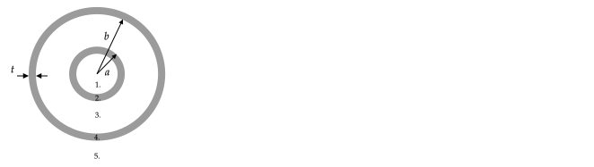

Due on Thursday, September 30th at 3:00 pm.

Send your solutions to the email address rweigel+phys305@gmu.edu as a scanned PDF. Use a file name of `Yourlastname_PHYS305_HW5.pdf` (one file only, please). Capitalize the first letter in your last name and use caps and underscores as indicated. **Include your name on the first sheet**.

This homework covers [Capacitance](capacitance.html) and [Boundary Value Problems](boundary_value_problems.html). See also the sections of Griffiths referenced in these notes.

# Spherical Capacitor

Charge is uniformly distributed on two concentric spherical conducting shells, the cross-section of which is shown. Both shells have a thickness of $t$. The inner shell has an outer radius of $a$. The outer shell has an inner radius of $b$.

1a. Use Gauss's law to show that there can be no charge on the inner surface of the inner conductor. 

1b. Use Gauss's law to show that the charge on the inner surface of the outer conductor is $+Q$. 

2\. What is the electric field in each of the 5 labeled regions? Region $1.$ is the empty volume inside of the inner conductor, region $2.$ is the volume of the inner conductor, region $3.$ is the empty volume between the conductors, region $4.$ is the volume of the outer conductor, and region $5.$ is the region outside of the outer conductor.

%3\. How much work will it take to move a charge $q_o$ from the outer surface of the inner shell to the inner surface of the outer shell? Said another way, what is the difference in potential energy, $PE_b-PE_a$, for this charge?

3\. What is the potential difference, $V(b)-V(a)$?

4\. Write the capacitance in terms of $\epsilon_o$, $a$, and $b$.

# 1-D Boundary Value Problem

In spherical coordinates, the Laplacian is

$$\nabla^2V = { {1 \over r^{2}}{\partial  \over \partial r}\left(r^{2}{\partial V \over \partial r}\right)+{1 \over r^{2}\sin \theta }{\partial  \over \partial \theta }\left(\sin \theta {\partial V \over \partial \theta }\right)+{1 \over r^{2}\sin ^{2}\theta }{\partial ^{2}V \over \partial \phi ^{2}}}$$

If $V=V(r)$, then this reduces to

$$\nabla^2V = { {1 \over r^{2}}{\partial  \over \partial r}\left(r^{2}{\partial V \over \partial r}\right)}$$

1\. Find $V(r)$ that satisfies

$${ {1 \over r^{2}}{\partial  \over \partial r}\left(r^{2}{\partial V \over \partial r}\right)}=0$$

in terms of $r$ and two unknown constants $a$ and $b$. Follow the steps given [in the notes](boundary_value_problems.html#cylindrical) for the cylindrical problem.

2\. Two concentric spherical conducting shells are connected to a battery such that the inner shell is at a potential of $0$ and the outer shell is at a potential of $V_o$. The inner shell has an outer radius of $a$. The outer shell has an inner radius of $b$. Use your equation from part 1. and these boundary conditions to find $V(r)$ between the conductors in terms of $V_o$, $a$, and $b$.

3\. In section 2.5.3 of Griffiths, the equation for the electric field immediately outside of a conductor is stated to be $\mathbf{E}=(\sigma/\epsilon_o)\hat{\mathbf{n}}$. Use the potential $V(r)$ found in part 2. to find the electric field $\mathbf{E}(r)$ between $a$ and $b$ and then evaluate this electric field at $a$ and $b$. Use these electric fields to find the surface charge densities at $a$ and $b$.

# 2--D Laplacian

Laplace's equation in cartesian coordinates when $V=V(x,y)$ is

$$\nabla^2V = \frac{\partial^2 V}{\partial x^2} + \frac{\partial^2 V}{\partial y^2} = 0$$

For arbitrary constants $A,B,C,D,$ and $m$ the following four equations satisfy it

1. $V(x,y) = \big(A\cosh mx+B\sinh mx\big)\big(C\cos my+D\sin my\big)$
2. $V(x,y) = \big(A\cos mx+B\sin mx)(C\cosh my+D\sinh my\big)$
3. $V(x,y) = \big(Ae^{mx}+Be^{-mx})(C\cos my+D\sin my\big)$
4. $V(x,y) = \big(A\cos mx+B\sin mx\big)\big(Ce^{my}+De^{-my}\big)$

1\. Show that equation 1. satisfies $\nabla^2V=0$. Recall that the definitions of the hyperbolic $\sin$ and $\cos$ are $\sinh z = (e^{mz}-e^{-mz})/2$ and $\cosh z = (e^{mz}+e^{-mz})/2$.

2\. Show that equation 1. is related to equation 3. Do this by labeling the constants in equation 3. with primes and finding the constants in equation 1. in terms of the primed constants.

3\. Show that equation 2. is related to equation 4. Do this by labeling the constants in equation 4. with primes and finding the constants in equation 2. in terms of the primed constants.

4\. Show that equation 1. can be derived from equation 2. by using Euler's identity $e^{iz}=\cos z+i\sin z$ and the definitions of the hyperbolic $\sin$ and $\cos$. Do this by labeling the constants in equation 2. with primes and finding the constants in equation 1. in terms of primed constants.