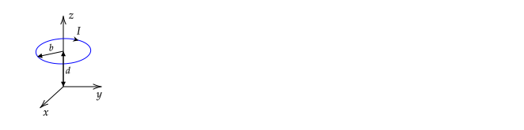

# Introduction

An electric field is created by charges. The charges that create the electric field can be stationary or moving.

A stationary or moving charge $q$ in an electric field (created by other charges) experiences a force of

$$\mathbf{F} = q \mathbf{E}$$

A magnetic field is created by moving charges. (A stationary charge **does not** create a magnetic field.) A moving charge $q$ in a magnetic field (created by other moving charges) experiences a force of

$$\mathbf{F} = q \mathbf{v}\times\mathbf{B}$$

The direction of the force on $q$ is perpendicular to a plane that contains $\mathbf{v}$ and $\mathbf{B}$. This plane can be visualized by imagining orienting a piece of paper such that both the  $\mathbf{v}$ and $\mathbf{B}$ vectors lie on the paper.

The magnitude of $\mathbf{F}$ can be computed using the above equation or

$$F = qvB\sin\theta$$

where $\theta$ is the angle between $\mathbf{v}$ and $\mathbf{B}$ and $\theta \le 180^{\circ}$. (For example, the angle between two vectors can be said to be $10^{\circ}$ or $350^{\circ}$. In the above equation, use $10^{\circ}$ -- if $350^{\circ}$ was used, we would get a negative value for the magnitude of a vector, which is positive by definition.)

There are two special cases for which the general equation $\mathbf{F} = q \mathbf{v}\times\mathbf{B}$ simplifies:

1. If the direction of motion is perpendicular to the magnetic field (so that $\theta = 90^{\circ}$), the magnitude of the force is $F = qvB$ and the direction is determined by right-hand-rule.
2. If the direction of motion is parallel to the magnetic field (so that $\theta = 0^{\circ}$), the magnitude of the force is $F = 0$.

In these notes, we are given $\mathbf{B}$ and we compute the resulting force on a moving charge using the Lorentz force law. 
Magnetic fields are created by moving charges, so this given $\mathbf{B}$ must be created by a configuration of moving charges, and in the next set of notes, we determine the magnetic field that results from charges flowing in a closed loop at a constant speed using the Biot--Savart law.

Similarly, we we first started using $\mathbf{F}_E=q\mathbf{E}$, we were given an electric field $\mathbf{E}$. Electric fields are created by charges, so the given $\mathbf{E}$ must have been created by charges, and we computed $\mathbf{E}$ due to various charge configurations using Coulomb's law.

# Computing $\mathbf{F}$ on single charges

The Lorentz force law allows us to calculate $\mathbf{F}$ given $\mathbf{v}$.

# Computing single charge trajectories

# Force on Current Loop

A current loop with a radius of $b$ is parallel to the $x-y$ plane and centered on $z=d$. The current in the loop is  $I$.

There is an external magnetic field of 

$$\mathbf{B}_{ext}=\frac{\mu_o}{4\pi}\frac{m_o}{r^3}\left(2\cos\theta\hat{\mathbf{r}}+\sin\theta\hat{\boldsymbol{\theta}}\right)$$

(This field is due to a magnetic dipole at the origin.)

1. What is $\mathbf{B}_{ext}$ at $(x,y,z)=(b,0,d)$?
2. Explain why the net force on the loop will be in the  $z$ direction. (Note: earlier had $-z$ typo.)
2. If the loop is flexible, will it tend to compress or expand?
2. Compute the net force (magnitude and direction) on the loop. Your answer should be in terms of  $\mu_o$,  $I$,  $m_o$,  $b$, and  $d$. It may help to draw the loop as viewed from a point above with vectors indicating the direction of $\mathbf{B}_{ext}$ and the associated force.

Note that the loop shown will create a magnetic field. However, when computing the force on the loop, the field due to the loop is omitted, and only $\mathbf{B}_{ext}$ is used. The reason is the same reason that when you compute the force on an object in mechanics, you only use the force due to the gravitational field of Earth. Although each part of the object exerts a gravitational force on the other parts of the object, the net "self--force" is zero.

**Answer**

1\. At this point (and actually any point on the wire), $\cos\theta=d/r$ and $\sin\theta=b/r$, where $r=\sqrt{b^2+d^2}$. Substitution gives

$\displaystyle\mathbf{B}_{ext}=\frac{\mu_o}{4\pi}\frac{m_o}{(b^2+d^2)^2}\left(2d\hat{\mathbf{r}}+b\hat{\boldsymbol{\theta}}\right)$

2\. From part (c) of the figure above, at any point on the wire, the field has components in $+s$ and $+z$ directions (for small enough $\theta$). The cross product of $\hat{\mathbf{s}}$ with $\mathbf{I}$, which is into the page in the view of part (c), gives a $+\zhat$ force.

3\. The cross product $\mathbf{B}=B_z\zhat$ with $\mathbf{I}$ gives a force in the $-\hat{\mathbf{s}}$ direction on each element of the wire. This force tends to compress the wire. The sum of the forces over the differential element is zero. (If you compress a ball, you are applying a force to each element on the surface, but the net force is zero because the ball does not accelerate.)

4\. The easiest way to solve this is to write $\mathbf{B}\_{ext}$ with cylindrical unit vectors (given that $\mathbf{I}$ was written with a cylindrical unit vector and we need to compute $\mathbf{I}\times \mathbf{B}\_{ext}$). 

The given field is
$\mathbf{B}_{ext}=B_o(2\cos\theta\hat{\mathbf{r}} + \sin\theta\boldsymbol{\hat{\theta}})$, where $B_o\equiv\mu_o m_o/4\pi r^3$ and $r$, $\sin\theta$, and $\cos\theta$ are given in the answer to part 1.

To write $\mathbf{B}_{ext}$ in cylindrical coordinates, one can use a diagram to show that

$\hat{\mathbf{r}}=\cos\theta\zhat + \sin\theta\hat{\mathbf{s}}$

$\hat{\boldsymbol{\theta}}=-\sin\theta\zhat + \cos\theta\hat{\mathbf{s}}$

(These formulas are not given on the pages at the end of Griffiths, but they can be derived from the given formulas. However, you should also be able to derive them using a diagram.)

Substitution gives

$\displaystyle\frac{\mathbf{B}_{ext}}{B_o}=(3\cos^2\theta-1)\zhat + 3\cos\theta\sin\theta\mathbf{\hat{s}}$

(Earlier, I noted that for small enough $\theta$, $\mathbf{B}_{ext}$ has a $+z$ component. From this equation, we can see that the requirement for this is $3\cos^2\theta-1 > 1$ or $b\lt \sqrt{2}d$.)

Both components are constant on the loop because $\theta$ is constant. Based on the answers to 2. and 3., we only expect the $\hat{\mathbf{s}}$ component of the field to give a _net_ force. Given these two arguments, we can finish the problem by writing $\mathbf{F}=ILB_{ext\text{ }s}\zhat$ with $L=2\pi b$ and $B_{ext\text{ }s}=3\cos\theta\sin\theta$. In the following, details on the math that leads to these conclusions are shown.

We need to evaluate

$\displaystyle \mathbf{F}=\int dl \mathbf{I}\times \mathbf{B}$

From the diagram, $\mathbf{I}=-I\boldsymbol{\hat{\phi}}$ and $dl=b d\phi$.
The cross product needed for computing the force is

$\mathbf{I}\times \mathbf{B}_{ext}=-IB_o\left((3\cos^2\theta-1)\boldsymbol{\hat{\phi}}\times\zhat + 3\cos\theta\sin\theta\boldsymbol{\hat{\phi}}\times\mathbf{\hat{s}}\right)$

Evaluating the unit vector cross products gives

$\mathbf{I}\times \mathbf{B}_{ext}=IB_o(1-3\cos^2\theta)\mathbf{\hat{s}} + 3IB_o\cos\theta\sin\theta\zhat$

We usually would convert $\hat{\mathbf{s}}$ to cartesian unit vectors before integration. However, we know that the integral of $d\phi\hat{\mathbf{s}}$ from $0$ to $2\pi$ is zero from a diagram (see discussion in [integrating unit vectors](vectors.html#integrating); we also expect this physically -- if we pick two points on opposite sides of the wire, the force on them in the $\hat{\mathbf{s}}$ direction is equal and opposite. As a result, we could drop the $\hat{\mathbf{s}}$ term in the cross product at this point. 

Using $dl=b d\phi$ and the cross product computed above, we have

$\displaystyle \mathbf{F}=\int_0^{2\pi} b d\phi IB_o(1-3\cos^2\theta)\mathbf{\hat{s}} + \int_0^{2\pi} b d\phi 3IB_o\cos\theta\sin\theta\zhat$

Factoring out constants gives

$\displaystyle \mathbf{F}= IB_ob(1-3\cos^2\theta)\int_0^{2\pi} d\phi\mathbf{\hat{s}} +  3IB_ob\cos\theta\sin\theta\int_0^{2\pi} d\phi\zhat$

The first integral is zero after using $\hat{\mathbf{s}}=\cos\phi\xhat + \sin\phi\yhat$. The second integral is $2\pi$. We are left with

$\mathbf{F}=I (2\pi b) B_o  3\cos\theta\sin\theta\zhat$

Using $B_o=\mu_o m_o/4\pi r^3$, $\cos\theta=d/r$, $\sin\theta=b/r$, and $r=\sqrt{b^2+d^2}$ gives

$\displaystyle \mathbf{F}=\frac{3}{2}\frac{\mu_om_oIdb^2}{(b^2+d^2)^{5/2}}\hat{\mathbf{z}}$
