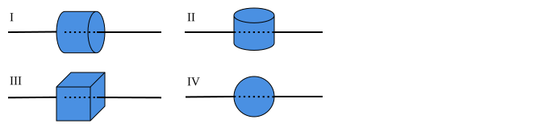
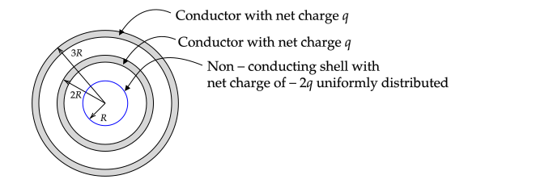

# Study Guide

The midterm exam will have three problems.

For additional problems to practice on, I suggest the problems in the notes linked to below and examples and in--chapter problems in Griffiths related to the topics mentioned below.

Problem 1. will be a short answer problem involving one or more of: [electric flux](flux.md!#electric-flux), [symmetry](symmetry.html), and [Gauss's law](gauss_law.html).

Problems 2. and 3. will involve two of

* Finding an integral for $\mathbf{E}$ for a continuous charge distribution (the integral will not need to be evaluated; you will need to be able to do all of the other steps). See problems in [Continuous Charge Distributions](continuous_charge_distributions.html).
* Finding $\mathbf{E}$, $V$, and $\sigma$ for charge distributions and conductor shapes for which Gauss's law can be used. See problems in [Gauss's law](gauss_law.html).
* 1--D boundary value problems -- Derive the general equation for $V$ in cartesian, cylindrical, and spherical. See problems in [1-D Boundary Value Problems](boundary_value_problems.html#1-d). Find $V$ given boundary conditions. Find $\sigma$ given $V$ (as was done in [HW 5.2](hw5.html#1-d-boundary-value-problem)). Also, solving a problem using only Gauss's law (as was done in [HW 5.1](hw5.md!#spherical-capacitor)).
* 2--D cartesian boundary value problems (either find an equation that satisfies 3 of the 4 boundary conditions or given an equation that satisfies 3 of the four boundary conditions, find $V$ using Fourier's trick). For this, review examples 3.3 and 3.4 of Griffith's, the homework problems, and variations on the homework problem ($V_o$ at all possible sides, for example). See also [2-D Boundary Value Problems](boundary_value_problems.html#1-2-cartesian).
* Finding the exact equation for $\mathbf{E}$ and $V$ for a discrete charge distribution and using the binomial expansion equation to find an approximation at large distances from the charges.
* Using the general [monopole expansion equation](monopole_expansion.html) to find an approximate expression for $V$ due to one or more point charges.

The equations that you should understand and know without reference are

* The general equation for Coulomb's Law for a point charge and charge densities;
* The general equation for electric potential due to a point charge;
* Gauss' Law in integral and differential form with an understanding of the meaning of all terms;
* Integral and differential relationship between electric field and electric potential;
* Gradient, divergence, and Laplacian in cartesian coordinates;
* "Basic" derivatives and integrals; and
* Any equations not in this list will be given as needed.

I will pay particular attention to notation. For example,

1. equations for scalars should not be written with unit vectors on the right-hand-side and
2. integrals over a closed surface should be written as $\oint$.

%A -- Can explain at a conceptual level how to solve HW problems and Griffiths example problems correctly and can justify all of the steps. Evidence for this is solutions to exam problems with correct justifications, most of the needed justifications addressed, and few algebraic errors. In addition, when the final solution does not make sense, the reason is stated.

%C -- Difficulties solving problems that were covered in a freshman--level physics course. Weak understanding of the justifications and motivations for steps in HW problems and Griffiths example problems. 

%F -- A lack of understanding of fundamental concepts covered in freshman--level physics course. Evidence for this includes writing equations that are correct but not related to the problem, writing solutions that are clearly wrong based on basic concepts without an explanation why the solution is clearly wrong.

# Exam

**PHYS 305 Midterm Exam**

October 18th, 2021

**Instructions**:

* Solve problem 1.
* Solve _two of_ problems 2., 3., and 4. Turn in **only two** of these problems. If more than two of these problems are turned in, I will grade only the first two.

## Gauss's Law (10 pts)

1. Which of the following object's surfaces can be used to compute the electric field due to a long line of charge using Gauss's law? Assume the line passes through the center of the objects, is infinitely long, and uniformly charged. Object IV is a sphere. Provide a brief justification for your answers.

2. Use Gauss's law to find the electric field $\mathbf{E}$ for all of the objects that can be used to find the electric field using Gauss's law. Justify all steps.

**Answer**:

As emphasized in class, of equal importance to using Gauss's law to find the field is the justification for why Gauss's law can be used. In the following, I provide a link to the argument that is needed instead of repeating it.

The following figure shows a view with the line of charge perpendicular to the page for cases I--III.

1. I only. Based on [a symmetry argument](#example-long-line-of-charge), the electric field must be perpendicular to the line. The [conditions for using Gauss's law](gauss_law.html#using-charges-on-an-insulator) are only satisfied for I -- the field is constant on the curved surface and its angle with respect to the normal is constant. On the caps, the field is perpendicular to the normal. For II, the field varies in magnitude and direction on all sides. For III, the field is parallel to two surfaces but not constant in magnitude or direction with respect to the normal on four of the sides. For IV, the angle between the normal to the surface and the field changes.

2. See [similar problem in notes](gauss_law.md#example-long-line-of-charge).

## Line of Charge (20 pts)

A straight line of charge extends from $(x,y)=(-b,0)$ to $(x,y)=(0,b)$. The line has a uniform charge density $\lambda_o$.

Find an equation for the electric field in the $x--y$ plane in terms of constants times an integral with an integrand involving $dx'$, $x'$, $x$, $y$, and $b$. You do not need to evaluate the integral.

**Answer**
The equation for the line is $y' = b+x'$.

$dl=dx'\sqrt{1+dy'/dx'}=dx'\sqrt{2}$

$dq=\lambda_odl$

$\mathbf{r}'=x'\xhat + y'\yhat = x'\xhat + (b+x')\yhat$

$\mathbf{r}=x\xhat + y\yhat$

$\displaystyle d\mathbf{E}=\sqrt{2}k\lambda_o\frac{(x-x')\xhat + [y-b-x')]\yhat}{\left[(x-x')^2+(y-b-x')^2\right]^{3/2}}dx'$

$\displaystyle\mathbf{E}(x,y)=\sqrt{2}k\lambda_o\int_{-b}^0\frac{(x-x')\xhat + [y-b-x')]\yhat}{\left[(x-x')^2+(y-b-x')^2\right]^{3/2}}dx'$

\newpage

## Boundary Value Problem (20 pts)

The following figure shows the cross-section of a U--shaped duct that is infinite in extent in the $\pm z$ direction.

The bottom side of the duct is open and the left and right sides extend from $y=0$ to $y=-\infty$ and are held at $V=0$. The top side of the duct is held at $V=V_o$.

Find a non--zero equation for $V(x,y)$ inside of the duct that satisfies three of the four boundary conditions.

Recall that for arbitrary constants $A,B,C,D,$ and $m$ the following four equations satisfy Laplace's equation in 2-D cartesian coordinates.

1. $V(x,y) = \big(A\cosh mx+B\sinh mx\big)\big(C\cos my+D\sin my\big)$
2. $V(x,y) = \big(A\cos mx+B\sin mx)(C\cosh my+D\sinh my\big)$
3. $V(x,y) = \big(Ae^{mx}+Be^{-mx})(C\cos my+D\sin my\big)$
4. $V(x,y) = \big(A\cos mx+B\sin mx\big)\big(Ce^{my}+De^{-my}\big)$

**Answer**:

This is similar to Example 3.3 of Griffiths except rotated by $90^\circ$.

To solve a boundary value problem in 2--D, one must specify the potential on a closed boundary. Here we set the lower boundary to be at $y=-\infty$. Due to the positive potential on the top boundary, negative charges will one the sides will appear near $y=0$ in order to make the electric field perpendicular to sides. The bottom boundary will be far away from all charges and so its potential can be set to zero. The boundary conditions are then

1. $V(x,0)=V_o$ (top)
2. $V(y,0)=0$ (left)
3. $V(y,a)=0$ (right)
4. $V(x,-\infty) = 0$ (bottom)

$V(x,y) = C'e^{-n\pi y/a}\sin(n\pi x/a)$ with $n=\pm 1, \pm 2, ...$ satisfies BCs 2.-4. 

## Conductors (20 pts)

The following figure shows the cross--section of three spherical objects. The conducting spherical shells have a thickness of $t$ and outer radii of $2R$ and $3R$.

1. Find and plot $E_r$ vs. $r$ from $r=0$ to $r=\infty$
2. If $V(0)=0$, find $V(r)$ from $r=0$ to $r=2R$ (no plot needed.)

**Answer**

1\. (Gauss's law justifications not given below because they were not asked for. However, make sure that you know the justifications.)

$r=0$ to $R$: $E_r=0$ ($Q_{encl}=0$)

$r=R$ to $2R-t$: $E_r=-2kq/r^2$ ($Q_{encl}=-2q$)

$r=2R-t$ to $2R$: $E_r=0$ (inside conductor)

$r=2R$ to $3R-t$: $E_r=-kq/r^2$ ($Q_{encl}=-q$)

$r=3R-t$ to $3R$: $E_r=0$ (inside conductor)

$r\gt 3R$: $E_r=0$ ($Q_{encl}=0$)

2\. To find the potential, use

$\displaystyle V(r)=V(ref)-\int_{ref}^rE(r')dr'$

starting with a reference value of $r$ where $V$ is known. Here $V(0)=0$, so first integral is

$\displaystyle V(r)=V(ref)-\int_{0}^rE(r')dr'$

This can be used to find $V(r)$ using $E$ in range $r=0$ to $r=R$.

$r=0$ to $R$:

$\displaystyle V(r)=V(0)-\int_0^R 0 dr'=0$

$r=R$ to $2R-t$:

From the previous equation for $V$, $V(R)=0$ and so in this region

$\displaystyle V(r)=V(R)-\int_R^r E_r(r')dr'=0-\int_{R}^r\frac{-2kq}{r'^2}dr'=2kq\left(\frac{1}{R}-\frac{1}{r}\right)$

$r=2R-t$ to $2R$:

$\displaystyle 
V(r)=V(2R-t)-\int_{2R-t}^rE(r')dr'=V(2R-t)-\int_{2R-t}^r0dr'=V(2R-t)=2kq\left(\frac{1}{R}-\frac{1}{2R-t}\right)$