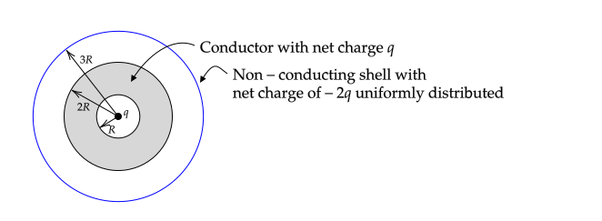

**PHYS 305 Midterm Exam**

October 18th, 2021

**Instructions**:

* Solve problem 1.
* Solve _two of_ problems 2., 3., and 4. Turn in **only two** of these problems. If more than two of these problems are turned in, I will grade only the first two.

# Gauss's Law (10 pts)

1. If a Gaussian sphere encloses no charge, does it follow that $\mathbf{E}=0$ on the surface of the Gaussian sphere? Justify your answer with 1--2 sentences.

2. Charge is uniformly distributed on the surface of a non--conducting spherical shell. The sphere is then dented. Is the electric field inside of the shell different after it is dented? Justify your answer with 1--2 sentences.

# Charge on Cylinder (20 pts)

Charge is uniformly distributed on the curved surface of a cylinder of length $h$ and radius $R$. The cylinder is centered on the origin, aligned with the $z$--axis, and has a charge density of $\sigma_o$.

Find an equation for $\mathbf{E}$ on the $z$--axis in terms of a single integral with an integrand that depends only on $dz'$, $z'$, $z$, and $R$. You do not need to evaluate the integral.

\newpage

# Conductors (20 pts)

The following figure shows the cross--section of a spherical conductor of radius $2R$ with a spherical cavity of radius $R$, both of which are centered on the origin. The net charge on the conductor is $q$.

There is a nonconducting spherical shell that is also centered on the origin, has $-2q$ uniformly distributed on its surface, and a radius of $3R$. At the origin, there is a charge $q$. 

1. Find and plot $E_r$ vs. $r$ from $r=R$ to $\infty$
2. If $V(R)=0$, find and plot $V(r)$ from $r=R$ to $\infty$

# Boundary Value Problem (20 pts)

The cross--section of a long conducting duct is shown in the following figure. Three of the sides are held at $V=0$ and the bottom side is held at $V=V_o$.

Find a non--zero equation for $V(x,y)$ that satisfies three of the four boundary conditions.

----

Recall that for arbitrary constants $A,B,C,D,$ and $m$ the following four equations satisfy Laplace's equation in 2-D cartesian coordinates.

1. $V(x,y) = \big(A\cosh mx+B\sinh mx\big)\big(C\cos my+D\sin my\big)$
2. $V(x,y) = \big(A\cos mx+B\sin mx)(C\cosh my+D\sinh my\big)$
3. $V(x,y) = \big(Ae^{mx}+Be^{-mx})(C\cos my+D\sin my\big)$
4. $V(x,y) = \big(A\cos mx+B\sin mx\big)\big(Ce^{my}+De^{-my}\big)$

----