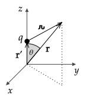
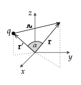

# Introduction

For a single point charge $q$ at $\mathbf{r}'$, the potential at any location in space is

$$V(\mathbf{r})=k{\frac{q}{\char"0509}}=\frac{q}{|\mathbf{r}-\mathbf{r}'|}$$

Often we are interested in an approximation of this potential at points that are far away.

Previously, the [binomial expansion](binomial_expansion.html) was used to find the electric field for point charges along an axis and only at locations on the same axis. The same approximation procedure that is used for the electric field may be used for potential. (In general, it is often easier to start with finding the scalar $V$ and then using it to find the vector $\mathbf{E}$.)

In the following, a general equation for potential at any location in space due to a point charge at any location in space is developed by considering two generalizations:

1. finding the potential at any location in space due to a point charge on the $z$--axis and then
2. finding the potential at any location in space due to a point charge at any location in space.

See also Chapter 3.4 of Griffiths.

# Generalization 1

For a point charge at $\mathbf{r}'=z'\zhat$, 

$$V=kq\frac{1}{\sqrt{x^2+y^2+(z-z')^2}} $$

Expanding the square gives

$$V=kq\frac{1}{\sqrt{x^2+y^2+z^2 - 2zz' + z'^2}} $$

Factoring out $r=\sqrt{x^2+y^2+z^2}$ and using the fact that $r$ is positive by definition, so $|r|=r$, gives

$$V=\frac{kq}{r}\frac{1}{\sqrt{1 - 2\frac{z}{r}\frac{z'}{r} + \frac{z'^2}{r^2}}}$$

Using $z=r\cos\theta$, this is

$$V=\frac{kq}{r}\frac{1}{\sqrt{1 - 2\frac{z'}{r}\cos\theta + \frac{z'^2}{r^2}}}$$

Definining 

$$\displaystyle \delta = - 2\frac{z'}{r}\cos\theta + \frac{z'^2}{r^2}$$

gives

$$V=\frac{kq}{r}\frac{1}{\sqrt{1 +\delta}}$$

The [binomial expansion](binomial_expansion.html), for $\Delta \ll 1$, is

$$\frac{1}{(1+\Delta)^n} = 1 - n\delta + \frac{n(n+1)}{2!}\Delta^2+...$$

So that, with $n=1/2$,

$$\frac{1}{\sqrt{1 +\delta}}=1-\frac{\delta}{2}+\frac{3}{8}\delta^2+...$$

Using the definition $\delta = - 2\frac{z'}{r}\cos\theta + \frac{z'^2}{r^2}$, this can be written (after some algebra) as

$$V=\frac{kq}{r}\left[1+\frac{d}{r}\cos\theta + \left(\frac{d}{r}\right)^2\left(\frac{3\cos^2\theta-1}{2}\right)+ ...\right]$$

where the $...$ terms are proportional to $(d/r)^3$, $(d/r)^4$, .... When only the term proportional to $(d/r)^2$ is kept, the result is referred to as "$V$ to second order in $d/r$". Equivalently, one can say that this is $V$ to third order in $1/r$ (after multiplying through by $1/r$, the highest power of $1/r$ is $1/r^3$) .

## Problem -- Point Charge on $y$--axis

If $\mathbf{r}'=y'\yhat$, find an equation for $V(r,\theta,\phi)$ to second order in $d/r$. 

Check your answer by plugging in $\theta=\pi/2$ and $\phi=\pi/2$ so that $r=y$. For $y\gg y'$, does your equation match the expected potential from approximating $V(y)=kq/|y-y'|$ for $y\gg y'$?

## Problem -- Dipole on $z$--axis

If $\pm q$ are at $z=\pm d$, find the potential to first order in $d/r$.

Use $V$ to compute $\mathbf{E}$ in the $x--y$ plane. Is $\mathbf{E}$ in expected direction?

# Problem -- Dipole on $x$--axis

1\. Find $V(\mathbf{r})$ for charges $\pm q$ at $x=\pm d/2$ using the $n=0$ and $n=1$ terms of

$\displaystyle V = \frac{kq}{\char"0509} = \frac{kq}{r}\sum_{n=0}^\infty\left(\frac{r'}{r}\right)^nP_n(\cos\alpha)$

and also

$\displaystyle V(\mathbf{r})=k\frac{\mathbf{p}\bfcdot\hat{\mathbf{r}}}{r^2}$

2\. Find $\mathbf{E}$ with spherical coordinates and unit vectors using the $V(\mathbf{r})$ that you computed in part 1.

**Answer**

1\.

$\displaystyle V\_+=\frac{kq}{r}\left[1+\frac{r'\_+}{r}\cos\alpha\_+ + ...\right]$

$\displaystyle V\_-=\frac{kq}{r}\left[1+\frac{r'\_-}{r}\cos\alpha\_- + ...\right]$

In this problem, $\alpha_+$, the angle between $\mathbf{r}$ and $\mathbf{r}'_+$ is not simply the polar angle $\theta$ in spherical coordinates. It can be computed from the definition of the dot product:

$\displaystyle \cos\alpha\_+=\frac{\mathbf{r}\bfcdot\mathbf{r}'\_+}{r'
_+ r}$

Using $\mathbf{r}'\_+=(d/2)\xhat$ and $\mathbf{r}=x\xhat + y\yhat + z\zhat$ gives

$\displaystyle \cos\alpha\_+=\frac{x}{r}$

which can be written in spherical coordinates using $x=r\sin\theta\cos\phi$ (you should know this formula or be able to derive it from a diagram). Then,

$\displaystyle \cos\alpha\_+=\sin\theta\cos\phi$

Checks: For $\theta=0$ and $\phi=0$, this gives $\alpha\_+=0$ as expected. For $\theta=90^\circ$ and $\phi=0$, this gives $\alpha\_+=90^\circ$ as expected.

Similar calculation (or using $\pi =\alpha\_+ + \alpha_\-$, which applies to this problem but not in general) gives

$\displaystyle \cos\alpha\_-=-\sin\theta\cos\phi$

Finally, using $V=V\_+ + V\_-$, we get

$\displaystyle V = \frac{kqd}{r^2}\sin\theta\cos\phi$

To compute the potential using

$\displaystyle V(\mathbf{r})=k\frac{\mathbf{p}\bfcdot\hat{\mathbf{r}}}{r^2}$

use $\mathbf{p}=q(\mathbf{r}'\_+-\mathbf{r}'\_-)=qd\xhat$ and $\hat{\mathbf{r}}=(x\xhat + y\yhat + z\zhat)/r$

2\.

Use

$\displaystyle V(r,\theta) = \frac{kqd}{r^2}\sin\theta\cos\phi$ and $\mathbf{E}=-\mathbf{\nabla}V$ with $\mathbf{\nabla}$ in spherical coordinates. This requires evaluation of the partials in

$\displaystyle \mathbf{E}(r,\theta)=-{\partial V \over \partial r}\hat{\mathbf r} - {1 \over r}{\partial V \over \partial \theta}\hat{\boldsymbol \theta} - {1 \over r\sin\theta}{\partial V \over \partial \phi}\hat{\boldsymbol \phi}$

$\displaystyle \mathbf{E}(r,\theta) = \frac{kqd}{r^3}(2\sin\theta\cos\phi\hat{\mathbf{r}}-\cos\theta\cos\phi\hat{\boldsymbol{\theta}}+\sin\phi\hat{\boldsymbol{\phi}})$

Checks: For $\phi=0$ and $\theta=\pi/2$, expect field to be in $+\hat{\mathbf{r}}$ direction. For $\phi=\pi/2$ and $\theta=\pi/2$, expect $+\hat{\boldsymbol{\phi}}$. For $\phi=\pi$ and $\theta=\pi/2$, expect $-\hat{\mathbf{r}}$.

Note that an alternative approach to solving both 1. and 2. problem is to take the solution for the dipole along the $z$ axis and rotate the coordinate system around the $y$--axis.

# Generalization 2

When both the charge and point of interest are at arbitrary locations in space, the angle between $\mathbf{r}$ and $\mathbf{r}'$ is no longer the spherical polar angle, $\theta$. In this case, the angle $\alpha$ between them will depend on both $\theta$ and $\phi$. From the definition of the dot product, $\cos\alpha$ is given by

$$\cos\alpha = \frac{\mathbf{r}\bfcdot\mathbf{r}'}{|\mathbf{r}||\mathbf{r}'|}=\frac{\mathbf{r}\bfcdot\mathbf{r}'}{rr'}$$

To derive an expansion for this configuration, the same steps used in Generalization I can be used but with the replacement of $z'$ with $r'$ and $\theta$ with $\alpha$. With this replacement, we have

$$V=\frac{kq}{r}\left[1+\frac{r'}{r}\cos\alpha + \left(\frac{r'}{r}\right)^2\left(\frac{3\cos^2\alpha-1}{2}\right)+ ...\right]$$

The angle--dependent terms that are multiplied by the powers of $r'/r$ are related to [the Legendre polynomials](https://en.wikipedia.org/wiki/Legendre_polynomials). These polynomials also appear in the solution to Laplace's equation in spherical coordinates. Labeling these terms as $P_0$, $P_1$, ..., and including their functional dependence on $\cos\alpha$ gives

$$V=\frac{kq}{r}\left[P_0(\cos\alpha)+\frac{r'}{r}P_1(\cos\alpha) + \left(\frac{r'}{r}\right)^2P_2(\cos\alpha) + ...\right]$$

Or, more generally,

$$V = \frac{kq}{r}\sum_{n=0}^\infty\left(\frac{r'}{r}\right)^nP_n(\cos\alpha)$$

where the first three terms are $P_0=1$, $P_1=\cos\alpha$, $P_2=(3\cos^2\alpha-1)/2$. To write these terms as Legendre poloynomials, use the definition $u=\cos\alpha$ so that $P_0=1$, $P_1=u$, and $P_2=(3u^2-1)/2$.

## Example

Use

$\displaystyle V = \frac{kq}{r}\sum_{n=0}^\infty\left(\frac{r'}{r}\right)^nP_n(\cos\alpha)$

to find the potential due to a point charge at $z=d$ to third order in $d/r$.

**Answer**

In this case, $\mathbf{r}'=d\zhat$ and $r'=d$, so

$\displaystyle \cos\alpha =\frac{\mathbf{r}\bfcdot\mathbf{r}'}{rr'}=\frac{zd}{rd}=\frac{z}{r}$

from which we conclude, as expected from a diagram, that $\alpha=\theta$ (because in spherical coordinates, $\cos\theta = z/r$). To third order in $d/r$, 

$\displaystyle V=\frac{kq}{r}\left[P_0+\frac{d}{r}P_1 + \left(\frac{d}{r}\right)^2P_2+ \left(\frac{d}{r}\right)^3P_3\right]$

where the first three terms given earlier are $P_0=1$, $P_1=\cos\theta$, $P_2=(3\cos^2\theta-1)/2$. The $P_3$ term can be found in a [table of Legendre polynomials](https://en.wikipedia.org/wiki/Legendre_polynomials#Rodrigues'_formula_and_other_explicit_formulas). It is $P_3=(5u^3-3u)/2$, so $P_3=(5\cos^3\theta-3\cos\theta)/2$. Using these,

$\displaystyle V=\frac{kq}{r}\left[1+\frac{d}{r}\cos\theta + \frac{1}{2}\left(\frac{d}{r}\right)^2(3\cos^2\theta-1)+ \frac{1}{2}\left(\frac{d}{r}\right)^3(5\cos^3\theta-3\cos\theta)\right]$

As a check of this answer, we can set $\theta=0$ (corresponding to a point on the $+z$--axis) so that $r=z$ in the above to get

$\displaystyle V=\frac{kq}{z}\left[1+\frac{d}{z}+ \left(\frac{d}{z}\right)^2+ \left(\frac{d}{z}\right)^3\right]$

and compare with the result of expanding

$\displaystyle V(z)=kq\frac{q}{|z-d|}$

for $z\gg d$ using the binomial expansion. For $z\gt d$, $|z-d|=z-d$ and so

$\displaystyle V(z)=kq\frac{q}{z-d}$

Factoring out $z$

$\displaystyle V(z)=\frac{kq}{z}\frac{1}{1-\frac{d}{z}}$

The [binomial expansion](binomial_expansion.html) to third order in $\Delta$ is

$\displaystyle \frac{1}{(1+\Delta)^n} = 1 - n\Delta + \frac{n(n+1)}{2!}\Delta^2+\frac{n(n+1)(n+2)}{3!}\Delta^3 + ...$

With $n=1$ and $\Delta = d/z$, we conclude

$\displaystyle V(z)=\frac{kq}{z}\left[1+\frac{d}{z}+\left(\frac{d}{z}\right)^2+\left(\frac{d}{z}\right)^3+...\right]$

## Problem

Use

$\displaystyle V = \frac{kq}{r}\sum_{n=0}^\infty\left(\frac{r'}{r}\right)^nP_n(\cos\alpha)$

to find the potential due to a point charge at $z=d$ to third order in $d/r$ on the $-z$ axis.

Compare this with the result of using

$\displaystyle V(z)=kq\frac{q}{|z-d|}$

for $z\ll -d$.
