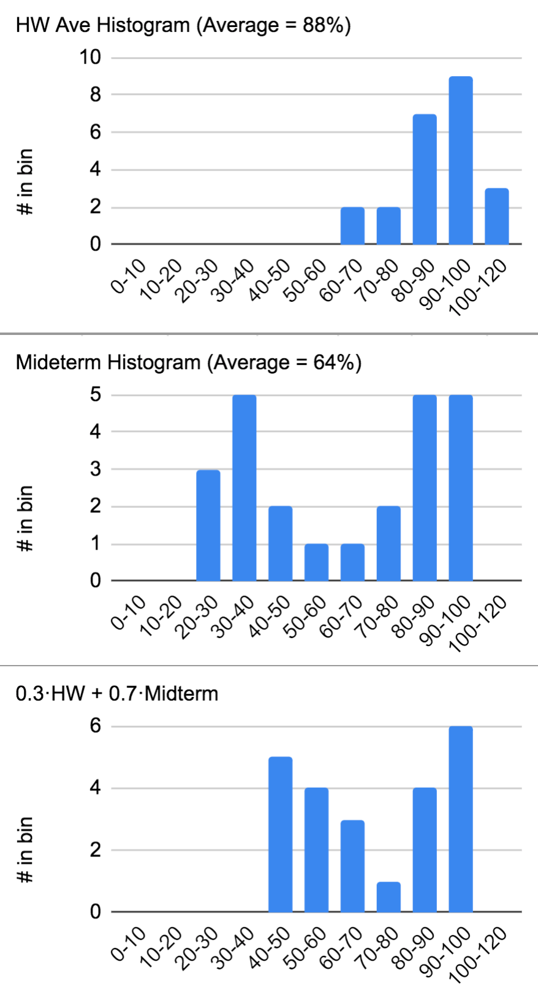

<b>PHYS 305 - Electromagnetic Theory</b>

* Day and Time: Tuesday/Thursday from 12:00 pm - 1:15 pm (on Zoom)
* Office Hours: Tuesday/Thursday from 11:00 am -- noon (on Zoom) and immediately after class
* Discord URL: See email
* Instructor: Bob Weigel
* Email: rweigel@gmu.edu
* Office: 259 Planetary Hall
* Course URL: http://rweigel.github.io/phys305/

**Homeworks and Exams**: [1](hw1.html) | [2](hw2.html) | [3](hw3.html) | [4](hw4.html) | [5](hw5.html) | [6](hw6.html) | [7](hw7.html) | [Midterm](midterm.html) | [8](hw8.html) | [9](hw9.html) | [10](hw10.html) | [11](hw11.html) | [12](hw12.html) | [Final](final.html)

**Notes**
* [Vectors](vectors.html)
* [Vector Fields](vector_fields.html)
* [Field Lines](field_lines.html)
* [Equipotentials](equipotentials.html)
* [Flux](flux.html)
* [Divergence](divergence.html)
* [Binomial Expansion](binomial_expansion.html)
* [Symmetry](symmetry.html)
* [Charge Densities](charge_densities.html)
* [Continuous Charge Distributions](continuous_charge_distributions.html)
* [Gauss's Law](gauss_law.html)
* [Electrostatic Potential](electrostatic_potential.html)
* [Capacitance](capacitance.html)
* [Boundary Value Problems](boundary_value_problems.html)
* [Method of Images](method_of_images.html)
* [Monopole Expansion](monopole_expansion.html)
* [Continuous Electric Dipole Distributions](continuous_electric_dipole_distributions.html)
* [Induced Polarization](induced_polarization.html)
* [Vector Potential](vector_potential.html)
* [Magnetic Dipoles](magnetic_dipoles.html)
* [Magnetization](magnetization.html)
* [Continuous Magnetic Dipole Distributions](continuous_magnetic_dipole_distributions.html)
* [Induced Magnetization](induced_magnetization.html)

%* [Polarization](polarization.html)
%* [Polarized Objects](polarized_objects.html)
%* [Magnetized Objects](magnetized_objects.html)

# Class Schedule

## Tuesday, August 24th

* [Class Video](https://gmu.zoom.us/rec/share/p1sgQwH8YagGQ89O5z2SU1u7OoEpi3NloJpBqgfBGelTdyBYpxGCdmB4Rzal-zei.yqEFeRi4WRIu_O3P) (password in Discord under #recordings)
* Introductions
* Discuss syllabus
* Review [Vectors](vectors.html)

## Thursday, August 26th 

* [Class Video](https://gmu.zoom.us/rec/share/qT-AzI9EFL8CS0Rs1O3srT2hp0pboc7Fv4H2978rVn9nOop1vwEi5e2yM1YHnX0f.NiC4ps_UgetKuDUu) (password in Discord under #recordings)
* Assign [HW 1](hw1.html) covering [Vectors](vectors.html), [Vector Fields](vector_fields.html), [Field Lines](field_lines.html), and  [Equipotentials](equipotentials.html).
* Discuss [HW 1](hw1.html) topics

## Tuesday, August 31st

* [Class Video](https://gmu.zoom.us/rec/share/O6qDLFN8Wl47ZoCYZzgroRAWkU5zbjcmGG5BPkpLKE5ASmfQZL9v3nNcgKiSEBMY.ZQc6TOQg1aVKVwXW) (password in Discord under #recordings)
* Answer questions on [HW 1](hw1.html) topics
 
## Thursday, September 2nd 

* [Class Video](https://gmu.zoom.us/rec/share/xQ4IgtNx9iCAcol7-LxtGbVEb2QFs1sM_KSEuzyI2ORynxZTSuOwwfXzIcIFi-pi.mIiZfgL9-H599tUe) (password in Discord under #recordings)
* [HW #1](hw1.html) due at 3:00 pm; I will be available after class for last--minute questions
* Discuss questions asked about HW #1 topics
* Assign [HW #2](hw2.html) covering [Flux](flux.html), [Divergence](divergence.html), [Binomial Expansion](binomial_expansion.html), and [Symmetry](symmetry.html).
* Discuss modified instructions on submitting HWs
* Cover [HW #2](hw2.html) topics

## Tuesday, September 7th 
* [Class Video](https://gmu.zoom.us/rec/share/NLJGv6lmwCdbkCfVSQHDNcOFaGv_KpEZ0w5uuPi2kt6hEpz_DOL6ocdQvnKtfNDy.uLvp9kPNP7EwGyQN) (password in Discord under #recordings)
* Answer questions on [HW #2](hw2.html) topics ([Flux](flux.html), [Divergence](divergence.html), [Binomial Expansion](binomial_expansion.html), and [Symmetry](symmetry.html))

## Thursday, September 9nd 

* [Class Video](https://gmu.zoom.us/rec/share/Xs5uXw81s2zt9E_qfbh1dbaY8MNo0dT-5nd53UmZetfno_Qkzfga8c7SzT6ESCaV.wnvsAqt68tX3vNWe) (password in Discord under #recordings)
* Return graded HW #1 and post solutions (will do later in day ... I am a few hours behind); discuss common errors
* [HW #2](hw2.html) due at 3:00 pm
* Cover Coulomb's Law, Electric Field, Superposition, Discrete Charge Distributions, [Charge Densities](charge_densities.html), and [Continuous Charge Distributions](continuous_charge_distributions.html).
* [HW #3](hw3.html) will be posted at about 3 pm.

## Tuesday, September 14th
* [Class Video](https://gmu.zoom.us/rec/share/wDEldmZO8k5C2KIOHE0BEzI3JvDPEnfTAl-ruVuOmiJTTRZdbzAZzcL8bQKfSyYn.SsFh6tAlqfolVGo2) (password in Discord under #recordings)
* Comments on common errors on [HW #2](hw2.html)
* Answer questions on [HW #3](hw3.html) topics.

## Thursday, September 16th 

* [Class Video](https://gmu.zoom.us/rec/share/dEhAu-OAButYrJJADVm0aiYqkgtZmwzfauLepoQCyeVIa43lTNECblqEf5s83LjO.oy0IrgiXGQLxFu_E) (password in Discord under #recordings)
* I have started returning graded [HW #2](hw2.html); if you have not received an email from me, expect one by the end of the day. Solutions are on [the same page]((hw2.html) as the problems.
* [HW #3](hw3.html) due at 3:00 pm
* Cover [Gauss's Law](gauss_law.html) and [Electrostatic Potential](electrostatic_potential.html).
* [HW #4](hw4.html) posted after class.

## Tuesday, September 21st

* [Class Video](https://gmu.zoom.us/rec/share/L3PlS7z5u8wfRdNhmQ--CT9ebpcTAXap4udR0zAFkRsL5v1lv8tpkdv8GvcUtW08.V08AvqC-UBWdNF4P) (password in Discord under #recordings)
* Answer questions on [HW #4](hw4.html) topics

## Thursday, September 23rd 

* [Class Video](https://gmu.zoom.us/rec/share/LBXy-Hnb_cDp-bpWmXZzUlqiVjLx9CjIP4yq82Dl4MPe_RaugyxFFj6HDcmNwM5k.3R2ZQCfZhSGhTnLe)
* Graded [HW #3](hw3.html) will be returned later today.
* [HW #4](hw4.html) due at 3pm.
* Introduce [Capacitance](capacitance.html) and [Boundary Value Problems](boundary_value_problems.html).
* Assign [HW #5](hw5.html)

## Tuesday, September 28th 

* [Class Video](https://gmu.zoom.us/rec/share/fDAC-NbqobSVP5USicspApEy690wwswM0L8FK0aihmqrcJtqcEM-mEK67neHbkoL.mMDXDwYfauIYjfZY)
* Comments on [HW #4](hw4.html).
* Answer questions on [HW #5](hw5.html) topics.

## Thursday, September 30th

* [Class Video](https://gmu.zoom.us/rec/share/5STbgJkpQbp0fd1gl7ZIQGgSq_0QMNJQkgbaEKxeasa3iaMHHen6XJzTqrZyiQxN.nkJjEfp9RgskV18e)
* [HW #5](hw5.html) due at 3pm.
* Comment on re--scheduling exam.
* Assign [HW #6](hw6.html) covering 2--D [Boundary Value Problems](boundary_value_problems.html).

## Tuesday, October 5th

* [Class Video](https://gmu.zoom.us/rec/share/XEaltG94BTuzli9QWHUz6-kxqNBM6FuJcigoDByiBvNYymOXNDOwd7mjB29hpy0J.SkqiZycdaVSGf4FV)
* Answer questions on [HW #6](hw6.html) topics
* Discuss Midterm and Turkeybunion's question.

## Thursday, October 7th

* [Class Video](https://gmu.zoom.us/rec/share/KBDm6YSwJu-RKwYEDQEUh01bVIOrvXyF4fP8twTn2uVgPk4vja5vxBbPAHCt9Pfd.3vGSB_o0zQ4ZpRYF)
* [HW #6](hw6.html) due.
* Assign [HW #7](hw7.html) covering the [method of images](method_of_images.html) and the [monopole expansion](monopole_expansion.html). 

## Tuesday, October 12th

* [Class Video](https://gmu.zoom.us/rec/share/2i6-p1GGfJYI-buCLxxeAlhXheRt0l0iNuZyoACZTd8kX406fnyo4fEe9I9ihJQ.8Apt6BVkkLe0RZtN)
* Post [mid--term review study guide](midterm.html).
* No class (Monday classes/labs meet Tuesday. Tuesday classes do not meet this week.)
* Will also be available during regular class time and ad--hoc sessions on Zoom.

## Thursday, October 14th

* [Class Video](https://gmu.zoom.us/rec/share/2i6-p1GGfJYI-buCLxxeAlhXheRt0l0iNuZyoACZTd8kX406fnyo4fEe9I9ihJQ.8Apt6BVkkLe0RZtN)
* [HW #7](hw7.html) due at 3 pm.
* Mid-term review. See the [mid--term review study guide](midterm.html).
* Will return graded [HW #6](hw6.html) later today. Solutions have been posted.
* Will post solutions to [HW #7](hw7.html) later today.

## Tuesday, October 19th

* [Mid-term exam](midterm.html) during class time in Innovation Hall, room 131. Closed book and note. I will provide a list of equations that you need to know.

## Thursday, October 21st

* [Class Video](https://gmu.zoom.us/rec/share/kGfw5XBjEDhVmK6Pn_kgX79dJxSNTnPwZurq4TNMbl8-AHMEeUXiQrLfT1DWXoD8.6rFDVXYUb-K6lm2r)
* Cover Dipoles (3.4 of Griffiths), Polarization (4.1 of Griffiths), and Bound Charge Densities (4.2 of Griffiths).
* [HW #8](hw8.html) will cover above topics and be posted later today.
* I have not finished grading HW #7. It should be done by the weekend.
* You should have received your graded midterm today by email.
* Discuss [Mid-term exam](midterm.html)

## Tuesday, October 26th

* [Class Video](https://gmu.zoom.us/rec/share/k5e2n-nZvp_4zrRKGe7O8PdWpDQlqKBBx4zhHltvyr2xvzNI05Y9OpcpeUwBKywv.8kITOZmBa6QNht_x)
* [HW #8](hw8.html) due at 3 pm.
* Will return HW #7 on Thursday. Sorry for the delay!
* Answer questions on [HW #8](hw8.html) topics

## Thursday, October 28th

* [Class Video](https://gmu.zoom.us/rec/share/fycKC35n1Wx56wr4L7Kln4oSS_p2ztXG29JIMWNgZKoNcPUzBJiV1EXKndRD5w.QHK4KxDiU-JhhIap)
* Computing Bound Charge Densities (4.2 of Griffiths) and resulting field. Introduction to induced polarization in linear dielectrics (4.4 of Griffiths).
* Assign [HW #9](hw9.html) covering above topics.

## Tuesday, November 2nd

* [HW #9](hw9.html) discussion

 
## Thursday, November 4th

* [Class Video](https://gmu.zoom.us/rec/share/ZZySfZ86dahPkI6fX21l8wWnVKiWkolaV1Gz25zqlMonuVwe9NyttnCbtGWIu8sC.KpA1dG7mjI2J9VjL)
* Lorentz force Law and Biot--Savart law
* Assign [HW #10](hw10.html)

## Tuesday, November 9th
* [Class Video](https://gmu.zoom.us/rec/share/dMbfD_UiEAB0C1IsVOvcNNRvFe4x6ftlAArmOZ8BAG5LOUKAn9aPOOZM_MQ818fg.O5Fjfbnd3OhaaTLm)
* Discuss [HW #10](hw10.html)

## Thursday, November 11th
* [Class Video](https://gmu.zoom.us/rec/share/HHHBlyANQPcYHMsLqsHrXNzYsdK_1gzWyEvTYntrVt8nb2GSx2TQIrkhxc0qfsfX.RuakjL7i9v_5egy4)
* Cover divergence and curl of $\mathbf{B}$ and Ampere's law
* [HW #9](hw9.html) will be returned later today
* [HW #10](hw10.html) due at 3 pm
* [HW #11](hw11.html) posted later today

## Tuesday, November 16th
* [Class Video](https://gmu.zoom.us/rec/share/xjckbHA4ZSYhMYZuaM6uX5MjuJZs0lGAbV9vs5bRo-fSbflp3RAoE6GCkJabrzL9.bpUmGau1T1Ym24hE)
* Discuss [HW #11](hw11.html)

## Thursday, November 18th

* [Class Video](https://gmu.zoom.us/rec/share/Zm-xH-qxByEgjxNcaCNQETzvksO0Cl7OQ_EoERI57U3x150VjCnBpP589oDUCkLF.emBu1fF9ZZTQHhS7)
* [HW #11](hw11.html) due
* Discuss [Magnetic Vector Potential](vector_potential.html)
* Assign [HW #12](hw12.html) covering [Magnetic Vector Potential](vector_potential.html), Magnetization, Bound Current Densities, the Auxiliary Field $\mathbf{H}$, and Ampere's Law for $\mathbf{H}$

## Tuesday, November 23rd
* [Class Video](https://gmu.zoom.us/rec/share/ZDczLup1iryB7h9ckD63vh75jPHuI7uApaKVyJcJpTy3YKnWV9OmPBHfkAcagyvd.NGrBsa5fVv4cd5Qp)
* Discuss [HW #12](hw12.html)
* Discuss Magnetization, Bound Current Densities, and Induced Magnetization

## Thursday, November 25th
* No class

## Tuesday, November 30th

* [Class Video](https://gmu.zoom.us/rec/share/KjXE9bfGa2Tgrcn1y4h7LGagIL-Tt7zKj-3v-cRT-BwjSMD31bgPsqg7d4YjmTOl.HeheorJiYh-0nUUW)
* Course evaluations are open. Please submit!
* Final exam room has been scheduled. It is Innovation Hall 131, which is the same room as the midterm. Day and time is Thursday, December 9th from 10:30 am to 1:15 pm.
* Discuss [final exam study guide](final.html)
* Discuss [HW #12](hw12.html)

## Thursday, December 2nd

* Last class
* [Class Video](https://gmu.zoom.us/rec/share/epDQL1EXDoG8ujkVj1eJ0GWL_mPRPL_Pt3w41Z9IkF_h32aH2TW_OJxdldVlRp_n.b3brGpydrNUOAYKu)
* [HW #12](hw12.html) due
* Final review

## Thursday, December 9th

* Final Exam from 10:30 am - 1:15 pm. Location: Innovation Hall 131 (same as midterm).

# Topics

This course covers the topics in Chapters 1-7 of the [textbook](#textbook).

The catalog description is

> [Physics 305 Electromagnetic Theory](https://catalog.gmu.edu/search/?search=PHYS+305)
>
> Interaction of static charges, interaction of stationary currents, electromagnetic induction, and Maxwell's equations.
>
> Required Prerequisites: PHYS 260C and PHYS 301*.
>
> C Requires minimum grade of C.
>
>* May be taken concurrently.

# Format of Course

The delivery of this course is centered on tutorials that introduce topics, provide examples, and require you to solve problems related to the examples. In general, I will not have a formal lecture prepared.

1. Most of what I would normally lecture on has been written into the tutorials and their examples.
2. I have done this to maximize the amount of time available for students to ask question during class.
3. **If you do not work on the tutorials before class, you will not find class attendance helpful.**

# Discord

The first week of class, you should have received an email inviting you to join a Discord server. I will use Discord to answer questions.

# Succeeding in this Course

For many, this may be your first junior/senior-level physics course.  To succeed, you may need to change the way you study. In addition to what is written below, please see [Joe Weingartner's PHYS 303 syllabus](http://physics.gmu.edu/~joe/PHYS303/syllabus.pdf) for his perspective and Feynman's [Never forget an idea again](https://www.scotthyoung.com/learnonsteroids/grab/TranscriptFeynman.pdf).

Success in this course depends primarily on two factors, in order of importance:

1. How many problems you solved "the right way" (I will discuss this in class)
2. How much you discussed problems and concepts with others

Consistent with 1., nearly every concept is followed by an example and then a problem that you are expected to solve to determine if you understood the explanation of the concept and the example.

> It is easy to find solved physics problems. Reading their solution before thinking about them is about as useful as learning to play basketball by watching a video. If you aren't confident that you can solve a problem, attempt to solve it without the use of the solution and compare your solution with a classmate's _before_ looking at the solution.

How to read:

* Read an explanation of a topic and fill in the missing steps.
* Close the book or web page and attempt to repeat the explanation. Check your answer. If you got it wrong, re-visit the problem a day later.
* If you are successful, attempt to re-solve the problem differently (for example, using a different coordinate system or using Gauss' Law instead of Coulomb's law, etc.). Check answer. If you got it wrong, re-visit problem a day later. Keep a separate notebook with a list of things you had issues with and how you resolved them.

%I learned quite a bit about how to think like a professional physicist from my advisor in graduate school. Anytime I would bring up a concept, he would start from first principles, set up a geometry, do dimensional analysis, and write down facts that he knew. Then he would repeat my question to me and attempt to answer it. Doing this repeately serves two purposes (1) It cements in the fundamental concepts by repeating them often and (2) gets you thinking about the fundamentals. I oftentimes rely on this approach when a student asks me about a problem on a physics-related topic that have not thought about for many years.

%To succeed in physics, you should do the same. Use Google and/or a textbook only after you have written down everything you know and attempted to solve a problem with what you wrote down as a starting point. In addition, think about symmetry, dimensions, and related problems that you know how to solve and can use to check your answer by taking a limit. I'll give many examples of this throughout the semester, but related to the last point, if you are given a 2-D problem, try to solve a simpler or 1-D problem for which you know the answer. Then try the more complex or 2-D problem. You probably happen to remember that the electric field falls off like $1/r$ for an infinite line of charge. It has to fall off more slowly than $1/r^2$, and you should know that Coulomb's Law depends on $1/r^2$. If asked to calculate the field for a finite line of charge, first see if you can calculate the equation for the 1/r dependence. Then try the finite line problem - the equation will be a bit more complicated, but having solved the 1/r problem, you will have a prepped yourself. As another example, if asked to compute the field associated with a finite sheet of charge, compute the field for a finite line of charge first, check that your answer is correct in the limit that the line is long, and then try the sheet problem.

%I will be giving you tips like this throughout the semester. Force yourself to follow the problem-solving approaches that I suggest. Many students have a problem-solving approach from freshman/sophomore physics that won't work for more advanced courses (for example, relying on memory instead of relying on your ability to solve a problem by building up from a few basic principles that you have memorized).

# Grading

Your grade for this course has two components:

1. Homework average (30%) - approximately one per week
2. Exam average (70%) - one midterm and one final, equally weighted

Because of the size of this class, I may not grade all problems on every homework assignment. You score is based only on the problems selected for grading.

There will be two exams during the semester and a cumulative final exam. The exams carry equal weight.

The midterm will cover Chapters 1-3 of Griffiths

The final exam will cover Chapters 4-6 of Griffiths

The nominal percentage-to-letter grade conversion is (this is subject to change such that the required percentage score for a given letter grade is lower)

* &gt; 97: A+; 93 to 96.9: A-; 90 to 92.9: A-

* 87 to 89.9: B+; 83 to 86.9: B; 80 to 82.9: B-

* 77 to 79.9: C+; 73 to 76.9: C; 70 to 72.9: C-;
 
* 60 to 69.9: D

* < 60: F

# Textbook

I will follow the outline of the topics covered in chapters 1-6 (and 7, if time) in [Introduction to Electrodynamics (4th Edition) by David J. Griffiths](https://www.amazon.com/Introduction-Electrodynamics-4th-David-Griffiths/dp/0321856562). Note that the 3rd Edition is also widely available. You may buy either edition. However, I will reference pages and problem numbers from 4th edition.

# Suggested References

The following references may be used as additional study aids. They have been listed in order of importance/usefulness.

[Electricity and Magnetism (3rd Edition) by Edward M. Purcell and David J. Morin](https://www.amazon.com/Electricity-Magnetism-Edward-M-Purcell/dp/1107014026/) covers the same topics as Griffiths at the same level.  If you are looking for an alternative explanation, this textbook will be helpful.  The book contains far more examples, discussion, and content than Griffiths.  It also includes solutions.  

[Schaum's outline of theory and problems of electromagnetics by Joseph A. Edminister](http://www.amazon.com/Schaums-Outline-Electromagnetics-4th-Outlines/dp/0071831479/) is a great reference for problems with full solutions and summaries of topics.

[Div, Grad, Curl, and All That: An Informal Text on Vector Calculus (4th Edition) by H. M. Schey](https://www.amazon.com/Div-Grad-Curl-All-That/dp/0393925161/) is an excellent reference for the mathematical background that you need to understand for this course. The book contains a concise and clear review of topics that are covered in a vector calculus course (usually "Calculus III").

[A Student's Guide to Maxwell's Equations (1st Edition) by Daniel Fleisch](https://www.amazon.com/Students-Guide-Maxwells-Equations/dp/0521701473/) notes that "the focus is exclusively on Maxwell’s Equations, which means you won’t have to wade through hundreds of pages of related topics to get to the essential concepts. This leaves room for in-depth explanations of the most relevant features, such as the difference between charge-based and induced electric fields, the physical meaning of divergence and curl, and the usefulness of both the integral and differential forms of each equation." A web page with detailed solutions to problems is available at http://www.danfleisch.com/maxwell/.

[The Feynman Lectures on Physics: Mainly Electromagnetism and Matter, Volume 2, 1977](https://www.amazon.com/Feynman-Lectures-Physics-Mainly-Electromagnetism/dp/020102117X/) contains excellent lecture-style presentations on Electricity and Magnetism.  The full volume is available [online](http://www.feynmanlectures.caltech.edu/II_toc.html).

[Yale Lectures on Physics II](https://www.youtube.com/playlist?list=PLD07B2225BB40E582&feature=plcp ) is a lecture series on topics typically covered in a second-semester physics course and does not cover the mathematics at the level required for this course.  These videos may be useful as a review.

[8.07 Class Notes by John Belcher](http://web.mit.edu/viz/soft/visualizations/IntermediateE&M/classNotes_2010_final.pdf) covers the same topics as Griffiths and has additional examples.

Other links:

* [Finding E-Books at Mason](http://questions.gmu.edu/guideontheside/tutorial/find-ebooks)

# Important Dates

[Important Dates from Registrar](https://registrar.gmu.edu/calendars/fall_2021/#dates)

No class:
* Tuesday, October 12th (Monday classes/labs meet Tuesday. Tuesday classes do not meet this week)
* Thursday, November 28th (Thanksgiving)

Final Exam: Thursday, December 9th 10:30 am - 1:15 pm ([Final Exam Schedule](https://registrar.gmu.edu/wp-content/uploads/Fall-2021-Final-Exam-Schedule.pdf)). Location and delivery method TBD.

Last class: Thursday, December 5th

# University Policy

University Policies: http://universitypolicy.gmu.edu/

# Disability Accommodations

If you have a learning disability or other condition that may affect academic performance, please: a) make sure documentation is on file with Office of Disability Services (http://ods.gmu.edu) to determine the accommodations you need; and b) talk with me to discuss your accommodation needs.

# Counseling and Student Support

* Counseling and Psychological Services provides confidential psychological services, including 24/7 crisis intervention and consultation to faculty and staff: http://caps.gmu.edu/
* Student Support helps students negotiate life situations by connecting them with appropriate on- and off-campus resources
: http://studentsupport.gmu.edu/referral-form/