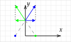
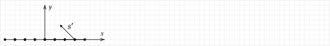

# Symmetry

In E&M, we frequently make use of symmetry arguments to simplify problems. Two types of symmetry are used.

1. Geometrical, in which we make statements about properties of the solution based on the arbitrariness of how the coordinate system was chosen or based on the fact that the system looks the same under a rotation or translation.
2. Cancellation, in which vector components cancel due to "matching pairs."

## Example

Identify (a) geometrical and (b) cancellation symmetries to make statements about the electric field in the $x$--$y$ plane that results from two positive point charges at $x=\pm 1$.

**Answer**:

(a) Suppose that you drew a $\mathbf{E}$ vector with the given $x$--axis and then drew the vector at the same position $(x,y)$ position on a drawing with the $x$--axis having positive to the left. If you overlayed the two drawings with their $x$--axis aligned, the vectors drawn for $\mathbf{E}$ should be identical.

An equivalent way of stating this is if you rotated the system by $180^\circ$ about the $y$--axis, the system will look the same. As a result, if you draw a vector for $x>0$ as shown on the left in the figure below and then rotate your diagram by $180^\circ$, the vector on the rotated diagram (shown on the right) will be correct.

The same argument applies to the $y$--axis. We can conclude that if we draw the vector field for $\mathbf{E}$ in the first quadrant (the region of $x>0$ and $y>0$), symmetry can be used to draw the vector field or field lines in the other three quadrants.

(b) The electric field due to each point charge at an arbitrary point on the $y$--axis is shown below. The $x$--components are equal but in opposite directions. As a result, $\mathbf{E}$ on the $y$--axis must not have an $x$--component. At the origin, the field due to each charge cancels exactly, so $\mathbf{E}$ should be zero there. Note that this cancellation only occurs on the $y$--axis.

We can also state that at the origin, the total electric field will be zero because the field due to each charge is equal and opposite.

## Example

Identify at least one (a) geometrical and (b) cancellation symmetries that allow us to make statements about the electric field in the $x$--$y$ plane that results from equal point charges a the corners of a square, as shown in the following figure.

**Answer**:

(a) Field must be symmetric about $x$-- and $y$--axis, so the vector field or field lines need to only be computed in the first quadrant.

(b) On the $y$--axis, the electric field must have no $x$--component. On the $x$--axis, the electric field must have no $y$--component. At the origin, the field must be zero. (A full answer would require a drawing to justify these statements.)

## Problem -- Infinite Line of Charge

Use symmetry arguments to explain why the electric field due to an infinitely long and uniformly charged line of charge must be perpendicular to it.

## Problem -- Infinite Hollow Cylinder

Use symmetry arguments to explain why the electric field due to an infinitely long cylinder with charge uniformly distributed on its surface must be perpendicular to it both inside and outside of the cylinder.

## Problem -- Infinite Solid Cylinder

Use symmetry arguments to explain why the electric field due to an infinitely long and uniformly charged solid cylinder must be perpendicular to it both inside and outside of the cylinder.

If the charge density depends on the perpendicular distance from the centerline of the cylinder, does your answer change?

## Problem -- Infinite Lines of Charge I.

Identify at least one (a) geometrical and (b) cancellation symmetries to make statements about the electric field in the $x$--$y$ plane that results from infinite lines of charge that are parallel to the $z$--axis as shown in the following figure. The equation for the electric field due to a line of charge is $\mathbf{E}(s')=2k\lambda \mathbf{\hat{s}}'/s'$, where $s'$ is the perpendicular distance from the line as shown in the diagram.

Use a diagram to justify any statements made for (b).

**Answer:**

(a) The charge distribution is symmetric about the $x$--axis, so the electric field vectors for a point at $y\gt 0$ will be the same as that for $y\lt 0$ except with the $E_y$ having the opposite sign. The charge distribution is symmetric about the $y$--axis, so the electric field vectors for a point at $x\gt 0$ will be the same as that for $x\lt 0$ except with the $E_x$ having the opposite sign. 

(b) At a point on the $y$--axis the horizontal electric field created by a line at $+x$ will cancel that of a line at $-x$, so the field will only have a $y$--component.

## Problem -- Infinite Lines of Charge II.

In the following diagram, infinite lines of with uniformly distributed charge extend into and out of the page. The lines are parallel and uniformly spaced and the pattern shown is repeated an infinite number of times to the left and right.

If the spacing between the lines is reduced to zero, explain why the electric field must be upwards or downwards.

## Problem -- Spherical Shell

Use symmetry arguements to explain why the electric field due to a charges uniformly distributed on the surface of a sphere must be perpendicular to the sphere inside and outside of the sphere except at the center of the sphere. Explain why the electric field must be zero at the center of the sphere.

## Problem -- Solid Sphere

Answer the same questions as the previous problem for a sphere with uniformly distributed charge throughout its volume.

If the charge density depends on radius, does your answer change?
