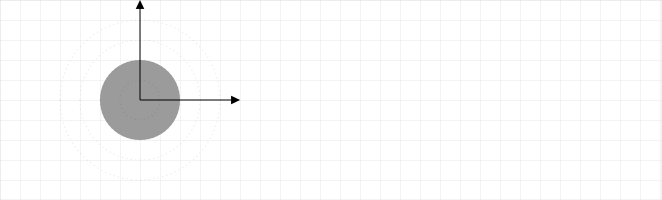

# Introduction

A vector field diagram is a plot showing the vectors associated with a vector function at select points in space. 

An example of a vector function is the electric field due to a positive point charge $Q$ at the origin 

$$\mathbf{E}(r)=\frac{kQ}{r^2}\boldsymbol{\hat{r}}$$

Th vector field diagram of $\mathbf{E}(r)/kQ = \boldsymbol{\hat{r}}/r^2$ is

Generally, only the relative lengths of the vectors is of interest and so a scale indicating a value for the length of a vector was omitted in this figure. Because the outer vectors are at a position that is 4x larger than the inner vectors, the outer vectors have a length that is 1/16 of the inner vectors.

When drawing a vector field diagram, points must be selected where a vector is drawn. The general rule is that just enough points should be selected so that the key patterns can be discerned -- the reader should be able to determine the vectors at points without a vector on the diagram. In the previous figure, it is clear that the vectors are radial, the magnitude is is independent of radius, and the magnitude is proportional to $1/r^2$. These three facts are the key patterns associated with the vector function plotted.

# Examples

# Problems

Prior to solving the problems in this tutorial, read [Vector Fields](
https://math.libretexts.org/Bookshelves/Calculus/Book%3A_Calculus_(OpenStax)/16%3A_Vector_Calculus/16.1%3A_Vector_Fields).

You can experiment with the creation of vector fields using a [GeoGebra app](https://www.geogebra.org/m/QPE4PaDZ).

## Radial Field

Outside of a solid sphere of radius $R$ with uniformly distributed charge $Q$, the field is

$$\mathbf{E}(r)=kQ\frac{1}{r^2}\boldsymbol{\hat{r}}$$

inside, it is

$$\mathbf{E}(r)=kQ\frac{r}{R^3}\boldsymbol{\hat{r}}$$

Sketch the vector field $\mathbf{E}/(kQ)$ inside and outside of the sphere.

## Fields in Cartesian and Cylindrical Coordinates

Plot the vector $\mathbf{A}=\cos\phi\xhat + \sin\phi\yhat$ at the points shown in the following diagram.

Plot the vector $\mathbf{A}=-\sin\phi\xhat + \cos\phi\yhat$ at the points shown in the following diagram.

## Fields in Cartesian Coordinates

Plot the vector $\displaystyle\mathbf{A}=\frac{x}{r}\xhat + \frac{y}{r}\yhat$ at the points shown in the following diagram.

Plot the vector $\displaystyle\mathbf{A}=-\frac{y}{r}\xhat + \frac{x}{r}\yhat$ at the points shown in the following diagram.

## Fields in Cylindrical Coordinates

Plot the vector $\mathbf{A}=\hat{\boldsymbol{\phi}}$ at the points shown in the following diagram.

Plot the vector $\mathbf{A}=\hat{\boldsymbol{\theta}}$ at the points shown in the following diagram.

## 

Plot the vector field

$$\mathbf{F} = x\xhat + y\yhat$$

at $x=1$ and $y=-2, -1, 0, 1, 2$.

## Two Charges

Two point charges $\pm Q$ are at $\pm R$. The electric field in the $x-y$ plane is

$$
\mathbf{E}(r)=kQ\left[\frac{x+R}{[(x+R)^2+(y+R)^2]^{3/2}}\xhat + \frac{y+R}{[(x+R)^2+(y+R)^2]^{3/2}}\yhat - \frac{x-R}{[(x-R)^2+(y-R)^2]^{3/2}}\xhat - \frac{y-R}{[(x-R)^2+(y-R)^2]^{3/2}}\yhat \right]
$$

Plot this $\mathbf{E}/kQ$ at the points shown in the diagram.

