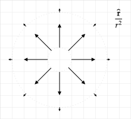
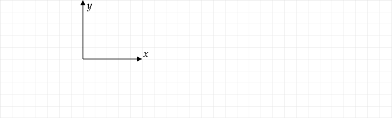
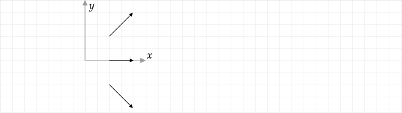
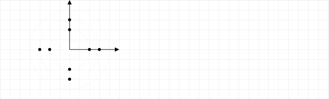
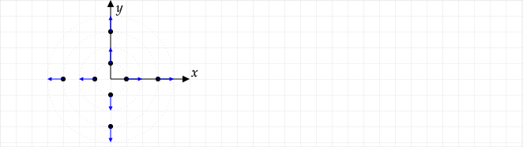

If you have difficulty solving these problems, additional background material is available at [Vector Fields](
https://math.libretexts.org/Bookshelves/Calculus/Book%3A_Calculus_(OpenStax)/16%3A_Vector_Calculus/16.1%3A_Vector_Fields).

You can experiment with the creation of vector fields using a [GeoGebra app](https://www.geogebra.org/m/QPE4PaDZ).

# Vector Fields

A vector field diagram is a plot showing the vectors associated with a vector function at select points in space.

Vector fields are fundamental to the theory of E&M. Many of the fundamental theorems involve derivatives and integrals of vector functions that depend on position.

An example of a vector function is the electric field due to a positive point charge $Q$ at the origin:

$$\mathbf{E}(r)=\frac{kQ}{r^2}\boldsymbol{\hat{r}}$$

The vector field diagram of $\mathbf{A}\equiv\mathbf{E}(r)/kQ = \boldsymbol{\hat{r}}/r^2$ is

Generally, only the relative lengths of the vectors are of interest and so a scale allowing one to determine a numeric value of the magnitude of the vectors was omitted in this figure. Because the outer vectors are at a position that is 4x larger than the inner vectors, the outer vectors have a length that is 1/16 of the inner vectors.

When drawing a vector field diagram, points must be selected where a vector is drawn. The general rule is that just enough points that a reader can determine the general length and direction of vectors at points without a vector on the diagram. In the previous figure, it is clear that the vectors are radial, the magnitude is is independent of radius, and the magnitude is proportional to $1/r^2$. These three facts are the key patterns associated with the vector function plotted.

## Example -- Vector Field with Cartesian Coordinates and Unit Vectors

Plot the vector field $\mathbf{A} = x\xhat + y\yhat$ at $x=1$ and $y=-1, 0, 1$.

**Answer**: At the given points, $A=|\mathbf{A}|=\sqrt{2}, 1, \sqrt{2}$. In the following diagram, the grid spacing has been assumed to be $1$. Note that we could have also solved this probelem in cylindrical coordinates using $\mathbf{A} = s\mathbf{\hat{s}}$. In this case, the values of $s$ would be given by the magnitudes of $A$ already computed and we would need to determine the angles of the vector at each point. For example, the angle at $x=1$, $y=-1$ would be $\tan^{-1}\left(\frac{+1}{-1}\right) = 315^\circ$.

Plot

## Example -- Radial Field With Cylindrical Coordinate and Unit Vector

Outside of a solid and long cylinder of radius $R$ with a uniform linear charge density of $\lambda$, the field is

$$\mathbf{E}(r)=2k\lambda\frac{\boldsymbol{\hat{s}}}{s}$$

inside, it is

$$\mathbf{E}(r)=2k\lambda\frac{s}{R^2}\boldsymbol{\hat{s}}$$

Sketch the vector field $\mathbf{A}\equiv\mathbf{E}/(2k\lambda)$ inside and outside of the cylinder if the cylinder is along the $z$--axis and centered on the origin as shown in the following diagram.

**Answer**: Assume that $R = 1$. As noted, only the relative lengths matter in a vector field diagram. Points at $s=R/2$ are inside the cylinder and so the inside equation is used, giving $\mathbf{A}=\boldsymbol{\hat{s}}/2$. At $s=R$, we can use either formula -- they give the same result of $\mathbf{A}=\boldsymbol{\hat{s}}$. At $s=1.5R$, $\mathbf{A}=2\boldsymbol{\hat{s}}/3$. At $s=2R$, $\mathbf{A}=\boldsymbol{\hat{s}}/2$.  As one moves from the origin outwards, the vectors increase in length until $s=R$ at which point their length decreases as $s$ increases. At a given $\phi$, the vectors are all the same length. 

Plot

## Problem -- Radial Field in Spherical

Outside of a solid sphere of radius $R$ with uniformly distributed charge $Q$, the field is

$$\mathbf{E}(r)=kQ\frac{1}{r^2}\boldsymbol{\hat{r}}$$

inside, it is

$$\mathbf{E}(r)=kQ\frac{r}{R^3}\boldsymbol{\hat{r}}$$

Sketch the vector field $\mathbf{A}\equiv\mathbf{E}/(kQ)$ inside and outside of the sphere.

## Example -- Fields with Cartesian Unit Vectors and Cylindrical Coordinates

Plot the vector $\mathbf{A}=\cos\phi\xhat + \sin\phi\yhat$ at the points shown in the following diagram.

Answer

## Problem -- Fields with Cartesian Unit Vectors and Cylindrical Coordinates

Plot the vector $\mathbf{A}=-\sin\phi\xhat + \cos\phi\yhat$ at the points shown in the following diagram.

%**Answer**:

## Problem -- Fields with Cartesian Unit Vectors and Cartesian Coordinates

Plot the vector $\displaystyle\mathbf{A}=\frac{x}{s}\xhat + \frac{y}{s}\yhat$ at the points shown in the following diagram. Recall that the radial coordinate in cylindrical coordinates is $s$ and $s=\sqrt{x^2+y^2}$.

Plot the vector $\displaystyle\mathbf{A}=-\frac{y}{s}\xhat + \frac{x}{s}\yhat$ at the points shown in the following diagram.

## Problem -- Fields with Cylindrical Unit Vectors and Cylindrical Coordinates

Plot the vector $\mathbf{A}=s\hat{\boldsymbol{\phi}}$ at the points shown in the following diagram.

%## Problem -- Field Due To Two Point Charges

%Two point charges $\pm Q$ are at $\pm R$. The electric field in the $x-y$ plane is

%$$
%\mathbf{E}_{+}(r)=kQ\left[\frac{x+R}{[(x+R)^2+y^2]^{3/2}}\xhat + \frac{y}{[(x+R)^2+y^2]^{3/2}}\yhat\right] 
%$$

%$$
%\mathbf{E}_{-}(r)=-kQ\left[\frac{x-R}{[(x-R)^2+y^2]^{3/2}}\xhat + \frac{y}{[(x-R)^2+y^2]^{3/2}}\yhat \right]
%$$

%Plot $\mathbf{A}\equiv (\mathbf{E}\_{+} + \mathbf{E}\_{-})/kQ$ at

%* $x=0$, $y=R, 2R, 3R$
%* $x=0$, $y=-R, -2R, -3R$
