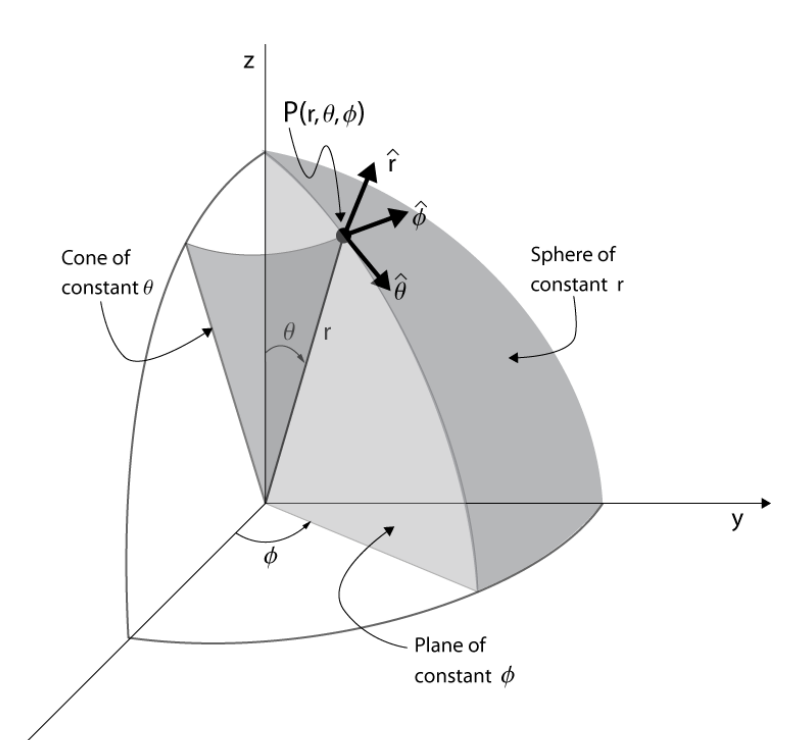

This is primarily a review of concepts related to vectors that are important for E&M. If a topic covered is unfamiliar, please review the basic concepts first. Khan Acadamey has a comprehensive [introduction to vectors](https://www.khanacademy.org/math/precalculus/x9e81a4f98389efdf:vectors) that is recommended.

# Vector Notation

The general form of a 2-dimensional vector is

$$
\mathbf{A} = A_x\xhat + A_y\yhat
$$

Variations on notation include the equivalent equations 

$$
\mathbf{A} = A_x\ihat + A_y\jhat\quad\text{and}\quad \mathbf{A} = \langle A_x, A_y \rangle
$$

The vector $\mathbf{A}$ can be viewed as the sum of the two vectors $A_x\xhat$ and $A_y\yhat$. On the left-hand side of the following diagram, the two components of $\mathbf{A}$ are shown (assuming the scalar quantities $A_x$ and $A_y$ are both positive). In the middle, the sum of these components is shown.

By definition, the magnitude of $\mathbf{A}$ is the given by the Pythagorean formula

$$
A = |\mathbf{A}| = \sqrt{A_x^2 + A_y^2}
$$

As indicated in this equation, $A$ and $|\mathbf{A}|$ are equivalent -- often one is used instead of the other for clarity of presentation. Another representation for the magnitude of $\mathbf{A}$ uses the dot product -- $A =\sqrt{\mathbf{A}\cdot\mathbf{A}}$.

**Common error**: Referring to $|\mathbf{A}|$ as "The absolute value of $\mathbf{A}$". The absolute value operator operates on a scalar, e.g., $-12.1$. When used with a vector, the vertical bars mean "The magnitude of $\mathbf{A}$". Both the absolute value and magnitude operations yield a positive scalar, but their calculation is different. The absolute value operation is to simply drop a negative sign. The magnitude operation requires the use of the Pythagorean formula. 

%If done any programming, you've encountered the concept of ["operation overloading"](https://en.wikipedia.org/wiki/Operator_overloading) - a mathemmatical operation has multiple meanings depending on the arguments. For example the `+` sign in the statement `1 + 2` means "add the numbers before and after it" and in the statement `'B' + 'ob'`, the `+` sign means "concatenate strings to give `'Bob'`. In a similar way, the operator $|\cdot|$ means "absolute value" if $\cdot$ is a scalar and "vector magnitude" if $\cdot$ is a vector.

If $\theta$ is defined to be the angle from the $x$-axis with positive angles counter--clockwise,

$$
A_x = A\cos\theta\quad\text{and}\quad A_y=A\sin\theta
$$

Writing the previous equations as

$$
A_x = |\mathbf{A}|\cos\theta\quad\text{and}\quad A_y=|\mathbf{A}|\sin\theta
$$

makes it clear that the the sign of $A_x$ (or $A_y$) is due to the $\cos\theta$ (or $\sin\theta$) term and not the term that multiplies it. Although $A$ is a positive number because it is a magnitude, writing it as $|\mathbf{A}|$ may make this point clearer.

Elimination of $A$ from $A_x = A\cos\theta$ and $A_y=A\sin\theta$ gives

$$
\frac{\sin\theta}{\cos\theta} = \frac{A_y}{A_x}\quad\text{or} \quad \tan\theta = \frac{A_y}{A_x}
$$

which is expected based on the diagram on the right in the following figure.

## References

Every introductory physics and calculus textbook has a comprehensive introduction to vectors. The reader is encouraged to use them for review. Khan Acadamy has a comprehensive [introduction to vectors](https://www.khanacademy.org/math/precalculus/x9e81a4f98389efdf:vectors) that is recommended.

Several unique perspectives on vectors include 

* [The Feynman Lectures on Physics](https://www.feynmanlectures.caltech.edu/I_11.html), which introduces and motivates the use of vectors by the fact that many laws of physics have invariance (symmetry) under translation and rotation. In the [Vector Addition/Subtraction](vector-addition-subtraction) section of these notes, I motivate the use of vectors by noting that they simplify geometric calculations for which one would usually use Pythagorean's theorem and the Law of Cosines (which is derived from the Pythagorean theorem) multiple times.
* [The Math Centre's Introduction to Vectors](https://www.mathcentre.ac.uk/resources/uploaded/mc-ty-introvector-2009-1.pdf) gives several examples of proving geometrical relationships using vectors (mid-point theorem and an unnamed theorem).

## Problems

### Notation

Is $|A|$ a valid expression for the magnitude of a vector? If not, explain why.

%**Answer**: $A$ is a magnitude of a vector that corresponds to a length so $A\ge 0$ and taking its absolute value is not needed. A reader seeing the statement $|A|$ may conclude that $A$ can be a positive or negative number (because otherwise why would it be written as $|A|$?).

### Computing magnitude and angle

Draw $\mathbf{A}=-1\xhat + \yhat$ and compute $A$ and $\theta$, where $\theta$ is as defined as the angle with respect to the $x$--axis with positive $\theta$ corresponding to counter-clockwise rotation.

### Notation

The conventional definition of a vector, its components, and the angle is 

$\mathbf{A} = A_x\xhat + A_y\yhat$ and $A_x = A\cos\theta\quad\text{and}\quad A_y=A\sin\theta$

where $\theta$ is as defined as the angle with respect to the $x$--axis with positive $\theta$ corresponding to counter-clockwise rotation.

Let $\theta'$ be defined as the angle with respect to the $y$--axis with positive $\theta'$ corresponding to counter-clockwise rotation.

1\. Write the equations for $A'_x$ and $A'_y$ in terms of $\theta'$.

2\. If $A=1$ and $\theta'=45^\circ$, find $A_x$, $A_y$, $A'_x$, and $A'_y$.

%**Answer**: 1. $A'_x=-A\sin\theta'$, $A'_y=A\cos\theta'$; 2. $A'_x=A_x=-A/\sqrt{2}$, $A'_y=A_y=A/\sqrt{2}$

### Notation

If $\mathbf{A} = (x-y)\hat{\mathbf{x}}-y\hat{\mathbf{y}}$,

1\. Compute $|\mathbf{A}|$

2\. Compute $A$

3\. What, if possible, are the values of $x$ and $y$ that will give $A < 0$?

4\. What, if possible, are the values of $x$ and $y$ that will give $90^\circ \le \theta \le 270^\circ$?

%**Answer**: 1. and 2. $|\mathbf{A}|=A=\sqrt{(x-y)^2+y^2}$; 3. Not possible; 4. Need $A_x < 0$, so $y\lt 0$.

# Vector Addition/Subtraction

## Problems

%###

%$\mathbf{A}$ is 1 unit in the $x-$direction and $\mathbf{B}$ is 1 unit in the $y-$direction.  

%Graphically (make no calculations) estimate the vectors $\mathbf{A}$ + $\mathbf{B}$.

%###

%* $\mathbf{A}$ points east and $A=4$ units
%* $\mathbf{B}$ is at an angle of $120^\circ$ from east and $B=4$ units.
%* $\mathbf{C}$ is at an angle of $30^\circ$ south of east and $|\mathbf{C}|=4$ units.

%Graphically (make no calculations) estimate the vectors

%1. $\mathbf{A}+\mathbf{B}$
%2. $3\mathbf{A}-4\mathbf{C}$
%3. $\mathbf{A}+\mathbf{B}-\mathbf{C}$

###

Vector $\mathbf{A}$ connects the origin to the point $a$ at $(x,y)=(2,1)$. Vector $\mathbf{B}$ connects the origin to the point $b$ at $(x,y)=(1,2)$.

Draw and label the following vectors to scale:
* $\mathbf{A}$ and $\mathbf{B}$;
* the unit vectors $\hat{\mathbf{x}}$ and $\hat{\mathbf{y}}$.

Draw and label
* $\mathbf{C}=\mathbf{A}+\mathbf{B}$
* $\mathbf{D}=\mathbf{A}-\mathbf{B}$
* $\mathbf{E}=-\mathbf{A}+\mathbf{B}$, and
* $\mathbf{F}=-\mathbf{A}-\mathbf{B}$.

Compute, in terms of $\hat{\mathbf{x}}$ and $\hat{\mathbf{y}}$ and numbers
* $\mathbf{C}$ and $\hat{\mathbf{C}}$
* $\mathbf{D}$ and $\hat{\mathbf{D}}$
* $\mathbf{E}$ and $\hat{\mathbf{E}}$
* $\mathbf{F}$ and $\hat{\mathbf{F}}$

###

Find the vector made by connecting a line from $(x,y,z)=(1,2,3)$ to $(x,y,z)=(4,5,6)$.

###

Write an equation for the vector made by connecting a line from $(x',y',z')$ to $(x,y,z)$.

# Unit Vectors

A unit vector is a vector with "unit length" (meaning a length of unity, that is, 1).

The "unit" in "unit vector" means "unit length"; perhaps confusingly, unit vectors do not have a unit (such as _meters_) -- they are dimensionless.

A unit vector associated with an arbitrary vector is obtained by dividing it by its magnitude. We indicate that it is a unit vector by using a hat. So a vector such as $\mathbf{r}=r_x\xhat + r_y\yhat$ that has magnitude $r = |\mathbf{r}|=\sqrt{r_x^2 + r_y^2}$
 has an associated unit vector 

$$\hat{\mathbf{r}} = \frac{\mathbf{r}}{r}=\frac{r_x\xhat + r_y\yhat}{r}=\frac{r_x}{\sqrt{r_x^2 + r_y^2}}\xhat + \frac{r_y}{\sqrt{r_x^2 + r_y^2}}\yhat $$

The unit vector points in the same direction as the vector used to create it because

$$\tan\theta = \frac{\hat{r}_y}{\hat{r_x}} = \frac{r_y/r}{r_x/r}= \ \frac{r_y}{r_x}$$

## Example

One reason that unit vectors are useful is that they allow us to make statements of the form: "An object is 11 meters along the direction of $\mathbf{r}$".

Suppose $\mathbf{r}=(10\text{ m})\xhat+(20\text{ m})\yhat$. To find a position that is 11 meters along the direction of $\mathbf{r}$, first find a vector of length 1 that is in the direction of $\mathbf{r}$, namely, its unit vector. Then multiply this unit vector by 11 meters.

$$r = \sqrt{(10\text{ m})^2 + (20\text{ m})^2} = \sqrt{500}\text{ m}$$

$$\hat{\mathbf{r}}=\frac{\mathbf{r}}{r}=\frac{10\text{ m}}{\sqrt{500}\text{ m}}\xhat + \frac{20\text{ m}}{\sqrt{500}\text{ m}}\yhat=\frac{1}{\sqrt{5}}\xhat + \frac{2}{\sqrt{5}}\yhat$$

Notice how the units of meters ($\text{m}$) canceled - a unit vector is dimensionless (we also use the term "unit--less" for "dimensionless").

It was claimed that a unit vector has a length of 1. This can be verified:

$$|\hat{\mathbf{r}}| = \sqrt{\left(\frac{1}{\sqrt{5}}\right)^2 + \left(\frac{2}{\sqrt{5}}\right)^2}=1\quad\checkmark$$

We can now form a vector for the position of the object that is 11 meters along the direction of $\mathbf{r}$:

$$(11\text{ m})\\,\hat{\mathbf{r}}=(11\text{ m})\left(\frac{1}{\sqrt{5}}\xhat + \frac{2}{\sqrt{5}}\yhat\right)$$

Note that unit vector can be associated with any type of vector, not just position vectors.

## Problems

###

If $\mathbf{A} = -3\xhat + 4\yhat$, find $\mathbf{\hat{A}}$, find the unit vector in the direction of $\mathbf{A}$.

###

If $\mathbf{r}=x\xhat + y\yhat$ and $\mathbf{r}' = x'\xhat + y'\yhat$, 

1\. Find $\boldsymbol{\hat{\mathcal{R}}}$, the unit vector in the direction of $\boldsymbol{\mathcal{R}} \equiv \mathbf{r}-\mathbf{r}'$.

2\. Choose number for $(x,y)$ and $(x',y')$, sketch $\mathbf{r}$ and $\mathbf{r}'$, and verify that the direction of $\boldsymbol{\hat{\mathcal{R}}}$ is consistent with the unit vector $\boldsymbol{\mathcal{R}}$ that you computed.

# Curvilinear Unit Vectors

Thus far, only the cartesian unit vectors $\xhat$, $\yhat$, and $\zhat$ have been considered. There are many other coordinate systems, each of which have their own set of unit vectors. The most common non-cartesian coordinate systems are cylindrical and spherical.

## Cylindrical

### Definitions and Notation

The unit vectors for cylindrical, $\hat{\mathbf{s}}$, $\hat{\boldsymbol{\phi}}$, and $\zhat$, are shown in the following diagram at an arbitrary point $P$ (From [danfleisch.com](https://www.danfleisch.com/maxwell/CoordinateSystemReview.pdf)). Note that the conventional symbol for the radial coordinate in cylindrical is either $\rho$ or $r$ and $r$ is used in the following figure. In this course, both of these symbols are already used, so $s$ is used.

* $\hat{\mathbf{s}}$ is always parallel to the $x$--$y$ plane and points radially outward, 
* $\zhat$ always points parallel to the $z$--axis, and
* $\hat{\boldsymbol{\phi}}$ is perpendicular to $\hat{\mathbf{s}}$ and $\zhat$ and points in the direction of increasing $\phi$.

The relationship between cartesian and cylindrical **coordinates** is

$x = s\cos\phi\qquad
y=s\sin\phi\qquad
z=z$

The relationship between cartesian and cylindrical **unit vectors** is

$\hat{\mathbf{s}} = \cos\phi\xhat + \sin\phi\yhat\qquad 
\hat{\boldsymbol{\phi}} = -\sin\phi\xhat + \cos\phi\yhat\qquad
\zhat=\zhat$

### Example - Writing Cylindrical Unit Vectors with Cartesian Coordinates and Unit vectors

$\hat{\mathbf{s}} = \cos\phi\xhat + \sin\phi\yhat$ can be written in terms of cartesian coordinates and unit vectors by using

$\displaystyle \cos\phi = \frac{x}{s}=\frac{x}{\sqrt{x^2+y^2}}$ and $\displaystyle \sin\phi = \frac{y}{s}=\frac{y}{\sqrt{x^2+y^2}}$. Substitution gives $\displaystyle \hat{\mathbf{s}} = \frac{x}{\sqrt{x^2+y^2}}\xhat + \frac{y}{\sqrt{x^2+y^2}}\yhat$

As a check, compute $|\hat{\mathbf{s}}|$ and verify that it is $1$.

### Example - Drawing Cylindrical Unit Vectors

Draw a sketch with a dot indicating the location of 

1. $\mathbf{A} = 1\hat{\boldsymbol{\rho}} + 2\hat{\boldsymbol{\phi}}$ at the position $(\rho,\phi,z) = (1,0,0)$ and

2. $\mathbf{A} = 1\hat{\boldsymbol{\rho}} + 2\hat{\boldsymbol{\phi}}$ at the position $(\rho,\phi,z) = (1,\pi/2,0)$.

### Example - Computing Cylindrical Coordinates Given Cartesian Coordinates

Given the position $(x,y,z)=(1,1,1)$, compute $(s,\phi,z)$.

**Answer**: Substitution of $x=1$ into $x=s\cos\phi$ and $y=1$ into $y=s\sin\phi$ gives $1=s\cos\phi$ and $1=s\sin\phi$. Elimination of $s$ gives $\tan\phi = 1$, so $\phi=\pi/2$. Squaring $x=s\cos\phi$ and $y=s\sin\phi$ and adding gives $x^2+y^2=s^2\cos^2\phi+s^2\sin^2\phi=s^2$, so $s^2=2$ and $s=\sqrt{2}$. Finally, $z$ in cylindrical is the same as $z$ in cartesian, so $z=1$.

## Spherical

### Definitions and Notation

The unit vectors for spherical at an arbitrary point $P$ are shown in the following diagram (From [danfleisch.com](https://www.danfleisch.com/maxwell/CoordinateSystemReview.pdf)).

* $\hat{\mathbf{r}}$ is in the direction of a line drawn from the origin to $P$,
* $\boldsymbol{\hat{\phi}}$ is tangent to a circle that passes through $P$ and is parallel to the $x$--$y$ plane.
* $\boldsymbol{\hat{\theta}}$ is perpendicular to the plane that contains $\hat{\mathbf{s}}$ and $\boldsymbol{\hat{\phi}}$.

The relationship between cartesian and spherical coordinates is

$x = r\cos\theta\cos\phi\qquad
y = r\sin\theta\sin\phi\qquad
z = r\cos\theta$

The relationship between cartesian and spherical unit vectors is

$\hat{\mathbf{r}} = \sin\theta\cos\phi\xhat + \sin\theta\sin\phi\yhat + \cos\theta\zhat$

$\hat{\boldsymbol{\theta}} = \cos\theta\cos\phi\xhat + \cos\theta\sin\phi\yhat-\sin\theta\zhat$

$\hat{\boldsymbol{\phi}} = -\sin\phi\xhat + \cos\phi\yhat$

Note that the equation for $\hat{\boldsymbol{\phi}}$ is the same as that for cylindrical coordinates.

### Example - Writing Spherical Unit Vectors with Cartesian Coordinates and Unit vectors

### Problem - Drawing Spherical Unit Vectors

### Example - Computing Spherical Coordinates Given Cartesian Coordinates

Given the position $(x,y,z)=(1,1,1)$, compute $(r,\theta, \phi)$.

**Answer**: Squaring and summing 

$x = r\cos\theta\cos\phi$

$y = r\sin\theta\sin\phi$

$z = r\cos\theta$

gives

$x^2 + y^2 + z^2 = r^2\cos^2\theta\cos^2\phi + r^2\sin^2\theta\cos^2\phi + r^2\cos^2\theta$

$x^2 + y^2 + z^2 = r^2\cos^2\phi(\sin^2\theta + \cos^2\theta) + r^2\cos^2\theta$

$x^2 + y^2 + z^2 = r^2\cos^2\phi + r^2\sin^2\phi$

$x^2 + y^2 + z^2 = r^2$

So $\fbox{r = \sqrt{3}}$.

Using $z = r\cos\theta$ gives $\fbox{\cos\theta = 1/\sqrt{3}}$.

Using $x=r\cos\theta\cos\phi$ with $r=\sqrt{3}$ and $\cos{\theta}=1/\sqrt{3}$ gives $1 = \sqrt{3}\cdot 1/\sqrt{3} \cdot \cos\phi$, so $\fbox{\cos\phi = 1}$.

## Deriving

### Example - Deriving unit vector relationships with a sketch I

Derive the expression $\hat{\mathbf{s}} = \cos\phi\xhat + \sin\phi\yhat$ using a sketch.

**Solution**: To solve this, compute the cartesian components of $\hat{\mathbf{s}}$. From the sketch, they are $\hat{s}_x=\cos\phi$ and $\hat{s}_y=\sin\phi$. So, $\hat{\mathbf{s}} = \cos\phi\xhat + \sin\phi\yhat$.

**Check**: From the diagram, we expect that when $\phi=0$, $\hat{\mathbf{s}}=\xhat$ and when $\phi=90^\circ$, $\hat{\mathbf{s}}=\yhat$, both of which are consistent with the answer.

### Example - Deriving unit vector relationships with a sketch II

Derive an expression for $\hat{\mathbf{x}}$ in terms of cylindrical unit vectors using a sketch.

**Solution**: To solve this, compute the cylindrical components of $\hat{\mathbf{x}}$. In the diagram below on the left, the three relevant unit vectors are shown. On the diagram on the right, the triangle used to compute the components of $\hat{\mathbf{x}}$ in the $\mathbf{\hat{s}}$ and $\boldsymbol{\hat{\phi}}$ directions is shown. Based on this, $\hat{\mathbf{x}} = \cos\phi\mathbf{\hat{s}} - \sin\phi\boldsymbol{\hat{\phi}}$. Note that the negative sign appears because the component of $\xhat$ parallel to $\boldsymbol{\hat{\phi}}$ is opposite in direction to $\boldsymbol{\hat{\phi}}$.

**Check I**:

From the diagram on the left, we expect that when $\phi=0$, $\xhat=\hat{\mathbf{s}}$ and when $\phi=90^\circ$, $\xhat=-\boldsymbol{\hat{\phi}}$, both of which are consistent with the answer.

**Check II**

Use the equations

$\hat{\mathbf{s}} = \cos\phi\xhat + \sin\phi\yhat$ and $\hat{\boldsymbol{\phi}} = -\sin\phi\xhat + \cos\phi\yhat$

to solve for $\xhat$. Multiply the the first equation by $\cos\phi$ and the second by $-\sin\phi$ and then add the two equations. The result is

$\cos\phi\hat{\mathbf{s}} - \sin\phi\hat{\boldsymbol{\phi}} = \cos\phi(\cos\phi\xhat + \sin\phi\yhat) + \sin\phi(-\sin\phi\xhat + \cos\phi\yhat) = (\cos^2\phi + \sin^2\phi)\xhat = \xhat$

### Problem - Deriving unit vector relationships with a sketch

Derive the expression $\hat{\boldsymbol{\phi}} = -\sin\phi\xhat + \cos\phi\yhat$ using a sketch.

### Problem - Deriving unit vector relationships

Derive an expression for $\hat{\mathbf{y}}$ in terms of cylindrical unit vectors using a sketch and mathematically using $\hat{\mathbf{s}} = \cos\phi\xhat + \sin\phi\yhat$ and $\hat{\boldsymbol{\phi}} = -\sin\phi\xhat + \cos\phi\yhat$.

## Adding

Two vectors that are not written with cartesian unit vectors:

1. cannot be drawn unless one knows their position because the direction of the unit vectors depends on position and
2. cannot be added, subtracted, dotted, or crossed unless the positions of the vectors are the same.

The reason is that curvilinear unit vectors depend on position. For example, in cylindrical coordinates, $\mathbf{\hat{s}}$ and $\boldsymbol{\hat{\phi}}$ depend on $\phi$ according to $\hat{\mathbf{s}} = \cos\phi\xhat + \sin\phi\yhat$ and $\hat{\boldsymbol{\phi}} = -\sin\phi\xhat + \cos\phi\yhat$.

This issue is discussed in Griffiths in Section 1.4.1 where he notes that there is a poisionsus snake lurking in vectors expressed with curvilinear unit vectors. See also related discussions on StackExchange: [1](https://math.stackexchange.com/questions/1365622/adding-two-polar-vectors); [2](https://math.stackexchange.com/questions/802077/cross-product-in-cylindrical-coordinates?rq=1).

To see that vectors written with cylindrical unit vectors cannot be added in general, consider the vectors

$\mathbf{A} = 1\hat{\mathbf{s}}$ at $(s,\phi,z)=(1,90^{\circ},0)$

$\mathbf{B} = 1\hat{\mathbf{s}}$ at $(s,\phi,z)=(1,270^{\circ},0)$

which are skectched below

Visually, these vectors point in opposite directions and so their sum should be zero. However, straightforward addition gives $\mathbf{A}+\mathbf{B}=2\hat{\mathbf{s}}$, which is incorrect.

To add, subtract, dot, cross, integrate, or differentiate two vectors written with curvilinear unit vectors associated with different points in space, one must first re-write the two vectors with cartesian unit vectors. 

At $(s,\phi,z)=(1,0,0)$, $\mathbf{A} = 1\hat{\mathbf{s}} = \yhat$

At $(s,\phi,z)=(1,\pi,0)$, $\mathbf{B} = 1\hat{\mathbf{s}} = -\yhat$

so $\mathbf{A}+\mathbf{B} = \yhat - \yhat = 0$, which is correct.

### Example - Adding Vectors with Curvilinear Unit Vectors

If $\mathbf{A} = -1\hat{\mathbf{s}} - 1\hat{\boldsymbol{\phi}}$ at the position $(s,\phi,z) = (1,0,0)$ and $\mathbf{B} = 1\hat{\mathbf{s}} + 1\hat{\boldsymbol{\phi}}$ at the position $(s,\phi,z) = (1,\pi/2,0)$

1\. Draw $\mathbf{A}$ and $\mathbf{B}$ and 

2\. Compute $\mathbf{A}-\mathbf{B}$.

### Problem - Adding Vectors with Curvilinear Unit Vectors

If $\mathbf{A} = 1\hat{\mathbf{s}} + 1\hat{\boldsymbol{\phi}}$ at the position $(s,\phi,z) = (1,0,0)$ and $\mathbf{B} = 1\hat{\mathbf{s}} + 1\hat{\boldsymbol{\phi}}$ at the position $(s,\phi,z) = (1,\pi/2,0)$

1\. Draw $\mathbf{A}$ and $\mathbf{B}$ and 

2\. Compute $\mathbf{A}-\mathbf{B}$.

%**Answer**

%$\mathbf{A} = 1\hat{\mathbf{x}}$, $\mathbf{B} = 1\hat{\mathbf{y}}$, and $\mathbf{A}-\mathbf{B}=1\hat{\mathbf{x}}-1\hat{\mathbf{y}}$.

## Integrating

Care is also required when integrating unit vectors. Consider the integral

$$\int_0^{\pi/2} \boldsymbol{\hat{\phi}} d\phi$$

a common error is to factor out the unit vector and conclude

$$\int_0^{\pi/2} \boldsymbol{\hat{\phi}} d\phi =\boldsymbol{\hat{\phi}}\int_0^{\pi/2}  d\phi=\boldsymbol{\hat{\phi}}\frac{\pi}{2}$$

To see why this is wrong, consider a diagram of the vectors being integrated. Each vector has a length of $\Delta\phi$ and the direction is given by the direction of $\hat{\boldsymbol{\phi}}$.

If one increases the number of vectors and decreases $\Delta \phi$ in the diagram, the sum becomes and integral. Visually, we expect the integral to be a vector that points upwards and to the left because all of the vectors contributing to the sum are in this direction (except the first and last).

As noted earlier, the addition of vectors expressed with unit vectors in general requires first expressing them with cartesian unit vectors. Integration is a form of addition, and so the rule also applies. Using the relationship $\hat{\boldsymbol{\phi}} = -\sin\phi\xhat + \cos\phi\yhat$, we can write the integrand using cartesian unit vectors

$$\int_0^{\pi/2} \boldsymbol{\hat{\phi}} d\phi = \int_0^{\pi/2}(-\sin\phi\xhat + \cos\phi\yhat)d\phi$$

The cartesian unit vectors do not depend of $\phi$, so they can be factored out, giving

$$\int_0^{\pi/2} \boldsymbol{\hat{\phi}} d\phi = -\xhat\int_0^{\pi/2}\sin\phi d\phi + \yhat\int_0^{\pi/2}\cos\phi d\phi = -\xhat + \yhat$$

which has the expected direction of upwards and to the left. In addition, the angle is that of the vector at $\phi=\pi/4$, which is also expected because the average $x$ and $y$ components are both $45^\circ$.

### Problem - Integration of Vector with Curvilinear Unit Vectors

Compute

$$\int_0^{\pi/2} \mathbf{\hat{s}} d\phi$$

and use a sketch to show that your answer has the expected direction.

### Problem - Integration of Vector with Curvilinear Unit Vectors

Compute

$$\int_0^1 \mathbf{\hat{s}} ds$$

and use a skecth to show that your answer has the expected direction.

# Tangent Unit Vectors

## Computing

The general equation for a unit vector that is tangent to the curve $y=f(x)$ is

$$\mathbf{\hat{t}}=\frac{\xhat + \frac{dy}{dx}\yhat}{\sqrt{1 + \left( \frac{dy}{dx}\right)^2}}$$

This equation can be derived using the following diagram. At the point shown, the slope of the line is $dy/dx$. If we considered a small horizontal displacement of $dx$, then a point on the tangent line is given by stepping upwards by the slope times $dx$. 

To form the tangent vector $\mathbf{T}$, add the horizontal and vertical displacements as vectors

$$\mathbf{T} = dx\xhat + \frac{dy}{dx}dx\yhat$$

Dividing $\mathbf{T}$ by $|\mathbf{T}|$ gives a unit vector $\mathbf{\hat{t}}=\mathbf{T}/|\mathbf{T}|$.

### Example - Computing Tangent Unit Vector

Compute the unit tangent vector to the curve $y = 1+x$.

$$\mathbf{\hat{t}}=\frac{\xhat + \frac{dy}{dx}\yhat}{\sqrt{1 + \left( \frac{dy}{dx}\right)^2}}$$

Before computing, write down the expected answer, which for this problem can be computed without using this formula.

**Answer**: From a sketch of the line, or because the slope of the line is $1$, we expect the unit tangent vector to be at a $45^\circ$ angle, so the $x$-- and $y$--components should be equal. Substitution of $dy/dx=1$ into the formula gives $\mathbf{\hat{t}}=(\xhat + \yhat)/\sqrt{2}$.

### Problem - Computing Tangent Unit Vector

Compute the unit tangent vector to the curve $y = 1+x^2$. Before computing, write down the expected answer when $x=0$ and as $x\rightarrow \infty$.

### Example - Computing Tangent Unit Vector

Show that the tangent unit vector to a circle centered on the origin is $\boldsymbol{\hat{\phi}}$.

**Answer**: For $y > 0$, the equation for a circle is $y = \sqrt{1-x^2}$. After computing the derivative and inserting into the equation above, you should arrive at $\mathbf{\hat{t}}=(-y\xhat+x\yhat)/\sqrt{x^2+y^2}$. In cartesian coordinates, $x=s\cos\phi$ and $y=s\sin\phi$, and $s=\sqrt{x^2+y^2}$. Using these gives $\mathbf{\hat{t}}=-\sin\phi\xhat+\cos\phi\yhat$, which is the same as the formula for $\boldsymbol{\hat{\phi}}$.

## Use in Integration

The most common use of unit tangent vectors is in integration of either a force or an electric field (which is proportional to a force). For example, to compute work,

$$W=\int \mathbf{F}\boldsymbol{\cdot} d\mathbf{l} = \int \mathbf{F}\boldsymbol{\cdot} \mathbf{\hat{t}} dl$$

where the relationship $d\mathbf{l}=\mathbf{\hat{t}}dl$ was used.

### Example - Work in a constant gravitational field

# Normal Unit Vectors

## Computing

## Use in Computing Work