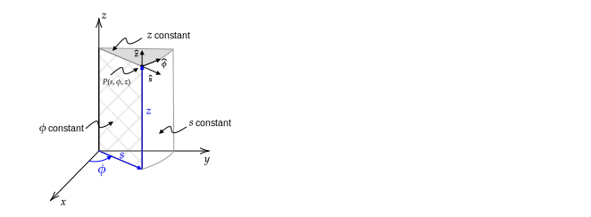
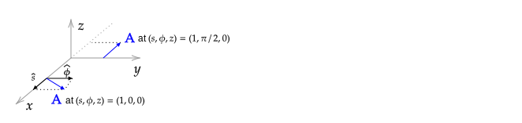
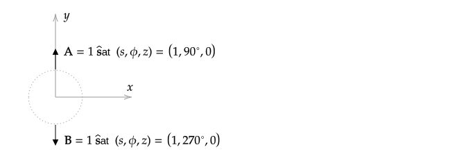
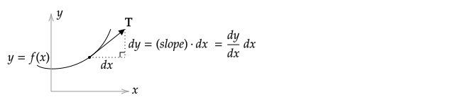
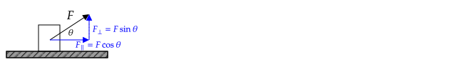

This is primarily a review of concepts related to vectors that are important for E&M. If a topic covered is unfamiliar, please review the basic concepts first. Khan Academy has a comprehensive [introduction to vectors](https://www.khanacademy.org/math/precalculus/x9e81a4f98389efdf:vectors) that is recommended.

The topics covered on this page are either discussed or used in Griffiths chapter 1.1--1.4.

# Vector Notation

The general form of a 2-dimensional vector is

$$
\mathbf{A} = A_x\xhat + A_y\yhat
$$

Variations on notation include the equivalent equations 

$$
\mathbf{A} = A_x\ihat + A_y\jhat\quad\text{and}\quad \mathbf{A} = \langle A_x, A_y \rangle
$$

The vector $\mathbf{A}$ can be viewed as the sum of the two vectors $A_x\xhat$ and $A_y\yhat$. On the left-hand side of the following figure, the two components of $\mathbf{A}$ are shown (assuming the scalar quantities $A_x$ and $A_y$ are both positive). In the middle, the sum of these components is shown.

By definition, the magnitude of $\mathbf{A}$ is given by the Pythagorean formula

$$
A = |\mathbf{A}| = \sqrt{A_x^2 + A_y^2}
$$

As indicated in this equation, $A$ and $|\mathbf{A}|$ are equivalent -- often one is used instead of the other for clarity of presentation. Another representation for the magnitude of $\mathbf{A}$ uses the dot product -- $A =\sqrt{\mathbf{A}\cdot\mathbf{A}}$.

**Common error**: Referring to $|\mathbf{A}|$ as "The absolute value of $\mathbf{A}$". The absolute value operator operates on a scalar, e.g., $-12.1$. When used with a vector, the vertical bars mean "The magnitude of $\mathbf{A}$". Both the absolute value and magnitude operations yield a positive scalar, but their calculation is different. The absolute value operation is to simply drop a negative sign. The magnitude operation requires the use of the Pythagorean formula. 

%If done any programming, you've encountered the concept of ["operation overloading"](https://en.wikipedia.org/wiki/Operator_overloading) - a mathematical operation has multiple meanings depending on the arguments. For example the `+` sign in the statement `1 + 2` means "add the numbers before and after it" and in the statement `'B' + 'ob'`, the `+` sign means "concatenate strings to give `'Bob'`. Similarly, the operator $|\cdot|$ means "absolute value" if $\cdot$ is a scalar and "vector magnitude" if $\cdot$ is a vector.

If $\theta$ is defined to be the angle from the $x$-axis with positive angles counterclockwise,

$$
A_x = A\cos\theta\quad\text{and}\quad A_y=A\sin\theta
$$

Writing the previous equations as

$$
A_x = |\mathbf{A}|\cos\theta\quad\text{and}\quad A_y=|\mathbf{A}|\sin\theta
$$

makes it clear that the sign of $A_x$ (or $A_y$) is due to the $\cos\theta$ (or $\sin\theta$) term and not the term that multiplies it. Although $A$ is a positive number because it is a magnitude, writing it as $|\mathbf{A}|$ may make this point clearer.

Elimination of $A$ from $A_x = A\cos\theta$ and $A_y=A\sin\theta$ gives

$$
\frac{\sin\theta}{\cos\theta} = \frac{A_y}{A_x}\quad\text{or} \quad \tan\theta = \frac{A_y}{A_x}
$$

which is expected based on the diagram on the right of the previous figure.

## References

Every introductory physics and calculus textbook has a comprehensive introduction to vectors. The reader is encouraged to use them for review. Khan Acadamy has a comprehensive [introduction to vectors](https://www.khanacademy.org/math/precalculus/x9e81a4f98389efdf:vectors) that is recommended.

Several unique perspectives on vectors include 

* [The Feynman Lectures on Physics](https://www.feynmanlectures.caltech.edu/I_11.html), which introduces and motivates the use of vectors by the fact that many laws of physics have invariance (symmetry) under translation and rotation. In the [Vector Addition/Subtraction](vector-addition-subtraction) section of these notes, I motivate the use of vectors by noting that they simplify geometric calculations for which one would usually use Pythagorean's theorem and the Law of Cosines (which is derived from the Pythagorean theorem) multiple times.
* [The Math Centre's Introduction to Vectors](https://www.mathcentre.ac.uk/resources/uploaded/mc-ty-introvector-2009-1.pdf) gives several examples of proving geometrical relationships using vectors (mid-point theorem and an unnamed theorem).

## Problems

### Notation

Is $|A|$ a valid expression for the magnitude of a vector? If not, explain why.

%**Answer**: $A$ is a magnitude of a vector that corresponds to a length so $A\ge 0$ and taking its absolute value is not needed. A reader seeing the statement $|A|$ may conclude that $A$ can be a positive or negative number (because otherwise, why would it be written as $|A|$?).

### Computing magnitude and angle

Draw $\mathbf{A}=-1\xhat + \yhat$ and compute $A$ and $\theta$, where $\theta$ is as defined as the angle with respect to the $x$--axis with positive $\theta$ corresponding to counterclockwise rotation.

### Notation

The conventional definition of a vector, its components, and the angle is $\mathbf{A} = A_x\xhat + A_y\yhat$, where $A_x = A\cos\theta$, $A_y=A\sin\theta$, and $\theta$ is as defined as the angle with respect to the $x$--axis with positive $\theta$ corresponding to counter-clockwise rotation.

Let $\theta'$ be defined as the angle with respect to the $y$--axis with positive $\theta'$ corresponding to counterclockwise rotation.

1\. Write the equations for $A'_x$ and $A'_y$ in terms of $\theta'$.

2\. If $A=1$ and $\theta'=45^\circ$, find $A_x$, $A_y$, $A'_x$, and $A'_y$.

%**Answer**: 1. $A'_x=-A\sin\theta'$, $A'_y=A\cos\theta'$; 2. $A'_x=A_x=-A/\sqrt{2}$, $A'_y=A_y=A/\sqrt{2}$

### Notation

If $\mathbf{A} = (x-y)\hat{\mathbf{x}}-y\hat{\mathbf{y}}$,

1\. Compute $|\mathbf{A}|$

2\. Compute $A$

3\. What, if possible, are the values of $x$ and $y$ that will give $A < 0$?

4\. What, if possible, are the values of $x$ and $y$ that will give $90^\circ \le \theta \le 270^\circ$?

%**Answer**: 1. and 2. $|\mathbf{A}|=A=\sqrt{(x-y)^2+y^2}$; 3. Not possible; 4. Need $A_x < 0$, so $y\lt 0$.

# Vector Addition/Subtraction

See notes from class.

## Problems

%###

%$\mathbf{A}$ is 1 unit in the $x-$direction and $\mathbf{B}$ is 1 unit in the $y-$direction.  

%Graphically (make no calculations) estimate the vectors $\mathbf{A}$ + $\mathbf{B}$.

%###

%* $\mathbf{A}$ points east and $A=4$ units
%* $\mathbf{B}$ is at an angle of $120^\circ$ from the east and $B=4$ units.
%* $\mathbf{C}$ is at an angle of $30^\circ$ south of east and $|\mathbf{C}|=4$ units.

%Graphically (make no calculations) estimate the vectors

%1. $\mathbf{A}+\mathbf{B}$
%2. $3\mathbf{A}-4\mathbf{C}$
%3. $\mathbf{A}+\mathbf{B}-\mathbf{C}$

###

Vector $\mathbf{A}$ connects the origin to the point $a$ at $(x,y)=(2,1)$. Vector $\mathbf{B}$ connects the origin to the point $b$ at $(x,y)=(1,2)$.

Draw and label the following vectors to scale:
* $\mathbf{A}$ and $\mathbf{B}$;
* the unit vectors $\hat{\mathbf{x}}$ and $\hat{\mathbf{y}}$.

Draw and label
* $\mathbf{C}=\mathbf{A}+\mathbf{B}$
* $\mathbf{D}=\mathbf{A}-\mathbf{B}$
* $\mathbf{E}=-\mathbf{A}+\mathbf{B}$, and
* $\mathbf{F}=-\mathbf{A}-\mathbf{B}$.

Compute, in terms of $\hat{\mathbf{x}}$ and $\hat{\mathbf{y}}$ and numbers
* $\mathbf{C}$ and $|\mathbf{C}|$
* $\mathbf{D}$ and $|\mathbf{D}|$
* $\mathbf{E}$ and $|\mathbf{E}|$
* $\mathbf{F}$ and $|\mathbf{F}|$

###

Find the vector made by connecting a line from $(x,y,z)=(1,2,3)$ to $(x,y,z)=(4,5,6)$.

###

Write an equation for the vector made by connecting a line from $(x',y',z')$ to $(x,y,z)$.

**Answer**

The requested vector can be formed by first computing the vectors from the origin to the given points. They are

$\mathbf{r}=x\xhat + y\yhat + z\zhat$ and $\mathbf{r}'=x'\xhat + y'\yhat + z'\zhat$.

If the requested vector is defined to be $\textbf{\char"0509}$, then from a diagram (draw this!), $\textbf{\char"0509}+\mathbf{r}'=\mathbf{r}$, or equivalently, $\textbf{\char"0509}=\mathbf{r}-\mathbf{r}'$. So

$\textbf{\char"0509}=x\xhat + y\yhat + z\zhat-(x'\xhat + y'\yhat + z'\zhat) = (x-x')\xhat + (y-y')\yhat + (z-z')\zhat$

# Unit Vectors

A unit vector is a vector with "unit length" (meaning a length of unity, that is, 1).

The "unit" in "unit vector" means "unit length"; perhaps confusingly, unit vectors do not have a unit (such as _meters_) -- they are dimensionless.

A unit vector associated with an arbitrary vector is obtained by dividing it by its magnitude. We indicate that it is a unit vector by using a hat. So a vector such as $\mathbf{r}=r_x\xhat + r_y\yhat$ that has magnitude $r = |\mathbf{r}|=\sqrt{r_x^2 + r_y^2}$
 has an associated unit vector 

$$\hat{\mathbf{r}} = \frac{\mathbf{r}}{r}=\frac{r_x\xhat + r_y\yhat}{r}=\frac{r_x}{\sqrt{r_x^2 + r_y^2}}\xhat + \frac{r_y}{\sqrt{r_x^2 + r_y^2}}\yhat $$

The unit vector points in the same direction as the vector used to create it because

$$\tan\theta = \frac{\hat{r}_y}{\hat{r_x}} = \frac{r_y/r}{r_x/r}= \ \frac{r_y}{r_x}$$

## Example

One reason that unit vectors are useful is that they allow us to make statements of the form: "An object is 11 meters along the direction of $\mathbf{r}$".

Suppose $\mathbf{r}=(10\text{ m})\xhat+(20\text{ m})\yhat$. To find a position that is 11 meters along the direction of $\mathbf{r}$, first find a vector of length 1 that is in the direction of $\mathbf{r}$, namely, its unit vector. Then multiply this unit vector by 11 meters.

$$r = \sqrt{(10\text{ m})^2 + (20\text{ m})^2} = \sqrt{500}\text{ m}$$

$$\hat{\mathbf{r}}=\frac{\mathbf{r}}{r}=\frac{(10\text{ m})\xhat + (20\text{ m})\yhat}{\sqrt{500}\text{ m}}=\frac{\xhat + 2\yhat}{\sqrt{5}}$$

Notice how the units of meters ($\text{m}$) canceled - a unit vector is dimensionless (we also use the term "unit--less" for "dimensionless").

It was claimed that a unit vector has a length of 1. This can be verified:

$$|\hat{\mathbf{r}}| = \sqrt{\left(\frac{1}{\sqrt{5}}\right)^2 + \left(\frac{2}{\sqrt{5}}\right)^2}=1\quad\checkmark$$

We can now form a vector for the position of the object that is 11 meters along the direction of $\mathbf{r}$:

$$(11\text{ m})\hat{\mathbf{r}}=(11\text{ m})\left(\frac{1}{\sqrt{5}}\xhat + \frac{2}{\sqrt{5}}\yhat\right)$$

Note that a unit vector can be associated with any type of vector, not just position vectors.

## Problems

###

If $\mathbf{A} = -3\xhat + 4\yhat$, find $\mathbf{\hat{A}}$, find the unit vector in the direction of $\mathbf{A}$.

###

If $\mathbf{r}=x\xhat + y\yhat$ and $\mathbf{r}' = x'\xhat + y'\yhat$, 

1\. Find $\hat{\textbf{\char"0509}}$, the unit vector in the direction of $\textbf{\char"0509} \equiv \mathbf{r}-\mathbf{r}'$.

2\. Choose numbers for $(x,y)$ and $(x',y')$, sketch $\mathbf{r}$ and $\mathbf{r}'$, and verify that the direction of $\hat{\textbf{\char"0509}}$ is consistent with the unit vector $ \textbf{\char"0509}$ that you computed.

**Answer**

1\.

$$\hat{\textbf{\char"0509}}=\frac{\textbf{\char"0509}}{\char"0509}$$

$$\textbf{\char"0509} = \mathbf{r}-\mathbf{r}' = x\xhat + y\yhat- (x'\xhat + y'\yhat)=(x-x')\xhat + (y-y')\yhat$$

$$\char"0509=|\textbf{\char"0509}|=\sqrt{(x-x')^2+(y-y')^2}$$

Substitution gives

$$\hat{\textbf{\char"0509}}=\frac{\textbf{\char"0509}}{\char"0509}=\frac{(x-x')\xhat + (y-y')\yhat}{\sqrt{(x-x')^2+(y-y')^2}}$$

# Curvilinear Unit Vectors

Thus far, only the cartesian unit vectors $\xhat$, $\yhat$, and $\zhat$ have been considered. There are many other coordinate systems, each of which has their own set of unit vectors. The most common curvilinear coordinate systems are cylindrical and spherical.

## Cylindrical

### Definitions and Notation

The unit vectors for cylindrical coordinates, $\hat{\mathbf{s}}$, $\hat{\boldsymbol{\phi}}$, and $\zhat$, are shown in the following figure at an arbitrary point $P$. Note that the conventional symbol for the radial coordinate in cylindrical is either $\rho$ or $r$, but $s$ is used in the following figure. In this course, $\rho$ is used for charge density, and $r$ is used for the spherical radial coordinate, so $s$ will be used instead.

* $\hat{\mathbf{s}}$ is always parallel to the $x$--$y$ plane and points radially outward, 
* $\zhat$ always points parallel to the $z$--axis in the direction of increasing $z$, and
* $\hat{\boldsymbol{\phi}}$ is perpendicular to $\hat{\mathbf{s}}$ and $\zhat$ and points in the direction of increasing $\phi$.

The relationship between cartesian and cylindrical **coordinates** is

$x = s\cos\phi\qquad
y=s\sin\phi\qquad
z=z$

The relationship between cartesian and cylindrical **unit vectors** is

$\hat{\mathbf{s}} = \cos\phi\xhat + \sin\phi\yhat\qquad 
\hat{\boldsymbol{\phi}} = -\sin\phi\xhat + \cos\phi\yhat\qquad
\zhat=\zhat$

### Example - Writing Cylindrical Unit Vectors with Cartesian Coordinates and Unit vectors

$\hat{\mathbf{s}} = \cos\phi\xhat + \sin\phi\yhat$ can be written in terms of cartesian coordinates and unit vectors by using

$\displaystyle \cos\phi = \frac{x}{s}=\frac{x}{\sqrt{x^2+y^2}}$ and $\displaystyle \sin\phi = \frac{y}{s}=\frac{y}{\sqrt{x^2+y^2}}$. Substitution gives $\displaystyle \hat{\mathbf{s}} = \frac{x}{\sqrt{x^2+y^2}}\xhat + \frac{y}{\sqrt{x^2+y^2}}\yhat$

As a check, compute $|\hat{\mathbf{s}}|$ and verify that it is $1$.

### Example - Drawing Cylindrical Unit Vectors

Draw a sketch showing

1. $\mathbf{A} = \hat{\mathbf{s}} + \hat{\boldsymbol{\phi}}$ at the position $(s,\phi,z) = (1,0,0)$ and

2. $\mathbf{A} = \hat{\boldsymbol{\phi}}$ at the position $(s,\phi,z) = (1,\pi/2,0)$.

**Answer**:

### Example - Computing Cylindrical Coordinates Given Cartesian Coordinates

Given the position $(x,y,z)=(1,1,1)$, compute $(s,\phi,z)$.

**Answer**: Substitution of $x=1$ into $x=s\cos\phi$ and $y=1$ into $y=s\sin\phi$ gives $1=s\cos\phi$ and $1=s\sin\phi$. Elimination of $s$ gives $\tan\phi = 1$, so $\phi=\pi/2$. Squaring $x=s\cos\phi$ and $y=s\sin\phi$ and adding gives $x^2+y^2=s^2\cos^2\phi+s^2\sin^2\phi=s^2$, so $s^2=2$ and $s=\sqrt{2}$. From $x=s\cos\phi$, it follows that $\phi=45^\circ$. Finally, $z$ in cylindrical is the same as $z$ in cartesian, so $z=1$.

### Problem

Write $\hat{\mathbf{s}}/s$ in cartesian coordinates with cartesian unit vectors.

## Spherical

### Definitions and Notation

The unit vectors for spherical at an arbitrary point $P$ are shown in the following figure (From [danfleisch.com](https://www.danfleisch.com/maxwell/CoordinateSystemReview.pdf)).

* $\hat{\mathbf{r}}$ is in the direction of a line drawn from the origin to $P$,
* $\boldsymbol{\hat{\phi}}$ is tangent to a circle that passes through $P$, is parallel to the $x$--$y$ plane, and has a center on the $z$-axis.
* $\boldsymbol{\hat{\theta}}$ is perpendicular to the plane that contains $\hat{\mathbf{s}}$ and $\boldsymbol{\hat{\phi}}$.

The relationship between cartesian and spherical coordinates is

$x = r\sin\theta\cos\phi\qquad
y = r\sin\theta\sin\phi\qquad
z = r\cos\theta$

The relationship between cartesian and spherical unit vectors is

$\hat{\mathbf{r}} = \sin\theta\cos\phi\xhat + \sin\theta\sin\phi\yhat + \cos\theta\zhat$

$\hat{\boldsymbol{\theta}} = \cos\theta\cos\phi\xhat + \cos\theta\sin\phi\yhat-\sin\theta\zhat$

$\hat{\boldsymbol{\phi}} = -\sin\phi\xhat + \cos\phi\yhat$

Note that the equation for $\hat{\boldsymbol{\phi}}$ in spherical coordinates is the same as that for cylindrical coordinates.

### Problem - Writing Spherical Unit Vectors with Cartesian Coordinates and Unit vectors

Write $\hat{\mathbf{r}}$ with cartesian coordinates and unit vectors.

### Problem - Drawing Spherical Unit Vectors

Draw a sketch showing

1. $\mathbf{A} = \hat{\mathbf{r}} + \hat{\boldsymbol{\theta}}$ at the position $(r,\theta,\phi) = (1,0,0)$ and

2. $\mathbf{A} = \hat{\boldsymbol{\theta}}$ at the position $(r,\theta,\phi) = (1,\pi/2,\pi/2)$.

### Problem - Computing Spherical Coordinates Given Cartesian Coordinates

Given the position $(x,y,z)=(1,1,1)$, compute $(r,\theta, \phi)$.

%**Answer**: Squaring and summing 

%$x = r\cos\theta\cos\phi$

%$y = r\sin\theta\sin\phi$

%$z = r\cos\theta$

%gives

%$x^2 + y^2 + z^2 = r^2\cos^2\theta\cos^2\phi + r^2\sin^2\theta\cos^2\phi + r^2\cos^2\theta$

%$x^2 + y^2 + z^2 = r^2\cos^2\phi(\sin^2\theta + \cos^2\theta) + r^2\cos^2\theta$

%$x^2 + y^2 + z^2 = r^2\cos^2\phi + r^2\sin^2\phi$

%$x^2 + y^2 + z^2 = r^2$

%So $\fbox{r = \sqrt{3}}$.

%Using $z = r\cos\theta$ gives $\fbox{\cos\theta = 1/\sqrt{3}}$.

%Using $x=r\cos\theta\cos\phi$ with $r=\sqrt{3}$ and $\cos{\theta}=1/\sqrt{3}$ gives $1 = \sqrt{3}\cdot 1/\sqrt{3} \cdot \cos\phi$, so $\fbox{\cos\phi = 1}$.

### Problem -- Writing Vector in Spherical in Cartesian

Write $\hat{\mathbf{r}}/r^2$ in cartesian coordinates with cartesian unit vectors.

## Deriving

### Example - Deriving unit vector relationships with a sketch I

Derive the expression $\hat{\mathbf{s}} = \cos\phi\xhat + \sin\phi\yhat$ using a sketch.

**Solution**: To solve this, we need to compute the cartesian components of $\hat{\mathbf{s}}$. From the sketch, they are $\hat{s}_x=\cos\phi$ and $\hat{s}_y=\sin\phi$. So, $\hat{\mathbf{s}} = \cos\phi\xhat + \sin\phi\yhat$.

**Check**: From the figure, we expect that when $\phi=0$, $\hat{\mathbf{s}}=\xhat$ and when $\phi=90^\circ$, $\hat{\mathbf{s}}=\yhat$, both of which are consistent with the answer.

### Example - Deriving unit vector relationships with a sketch II

Derive an expression for $\hat{\mathbf{x}}$ in terms of cylindrical unit vectors using a sketch.

**Solution**: To solve this, compute the cylindrical components of $\hat{\mathbf{x}}$. In the figure below on the left, the three relevant unit vectors are shown. On the diagram on the right, the triangle used to compute the components of $\hat{\mathbf{x}}$ in the $\mathbf{\hat{s}}$ and $\boldsymbol{\hat{\phi}}$ directions is shown. Based on this, $\hat{\mathbf{x}} = \cos\phi\mathbf{\hat{s}} - \sin\phi\boldsymbol{\hat{\phi}}$. Note that the negative sign appears because the component of $\xhat$ parallel to $\boldsymbol{\hat{\phi}}$ is opposite in direction to $\boldsymbol{\hat{\phi}}$.

**Check I**: $|\xhat|=\sqrt{\cos^2\phi+(-\sin\phi)^2}=1$, so the answer has unit length.

**Check II**:

From the diagram on the left, we expect that when $\phi=0$, $\xhat=\hat{\mathbf{s}}$ and when $\phi=90^\circ$, $\xhat=-\boldsymbol{\hat{\phi}}$, both of which are consistent with the answer.

**Check III**

Use the equations

$\hat{\mathbf{s}} = \cos\phi\xhat + \sin\phi\yhat$ and $\hat{\boldsymbol{\phi}} = -\sin\phi\xhat + \cos\phi\yhat$

to solve for $\xhat$. Multiply the first equation by $\cos\phi$ and the second by $-\sin\phi$ and then add the two equations. The result is

$\cos\phi\hat{\mathbf{s}} - \sin\phi\hat{\boldsymbol{\phi}} = \cos\phi(\cos\phi\xhat + \sin\phi\yhat) - \sin\phi(-\sin\phi\xhat + \cos\phi\yhat)$

$\phantom{\cos\phi\hat{\mathbf{s}} - \sin\phi\hat{\boldsymbol{\phi}}}= (\cos^2\phi + \sin^2\phi)\xhat = \xhat$

### Problem - Deriving unit vector relationships with a sketch

Derive the expression $\hat{\boldsymbol{\phi}} = -\sin\phi\xhat + \cos\phi\yhat$ using a sketch.

### Problem - Deriving unit vector relationships

Derive an expression for $\hat{\mathbf{y}}$ in terms of cylindrical unit vectors then mathematically using $\hat{\mathbf{s}} = \cos\phi\xhat + \sin\phi\yhat$ and $\hat{\boldsymbol{\phi}} = -\sin\phi\xhat + \cos\phi\yhat$.

## Adding

Two vectors that are not written with cartesian unit vectors:

1. cannot be drawn unless one knows their position because the direction of the unit vectors depends on position and
2. cannot be added, subtracted, dotted, or crossed unless the positions of the vectors are the same.

The reason is that curvilinear unit vectors depend on position. For example, in cylindrical coordinates, $\mathbf{\hat{s}}$ and $\boldsymbol{\hat{\phi}}$ depend on $\phi$ according to $\hat{\mathbf{s}} = \cos\phi\xhat + \sin\phi\yhat$ and $\hat{\boldsymbol{\phi}} = -\sin\phi\xhat + \cos\phi\yhat$.

This issue is discussed in Griffiths in Section 1.4.1 where he notes that there is a poisonous snake lurking in vectors expressed with curvilinear unit vectors. See also related discussions on StackExchange: [1](https://math.stackexchange.com/questions/1365622/adding-two-polar-vectors); [2](https://math.stackexchange.com/questions/802077/cross-product-in-cylindrical-coordinates?rq=1).

To see that vectors written with cylindrical unit vectors cannot be added in general, consider the vectors

$\mathbf{A} = 1\hat{\mathbf{s}}$ at $(s,\phi,z)=(1,90^{\circ},0)$

$\mathbf{B} = 1\hat{\mathbf{s}}$ at $(s,\phi,z)=(1,270^{\circ},0)$

which are skectched below.

Visually, these vectors point in opposite directions and so their sum should be zero. However, straightforward addition gives $\mathbf{A}+\mathbf{B}=1\hat{\mathbf{s}} + 1\hat{\mathbf{s}} = 2\hat{\mathbf{s}}$, which is incorrect.

To add, subtract, dot, cross, integrate, or differentiate two vectors written with curvilinear unit vectors associated with different points in space, one must first re-write the two vectors with cartesian unit vectors. 

At $(s,\phi,z)=(1,0,0)$, $\mathbf{A} = 1\hat{\mathbf{s}} = \yhat$

At $(s,\phi,z)=(1,\pi,0)$, $\mathbf{B} = 1\hat{\mathbf{s}} = -\yhat$

so $\mathbf{A}+\mathbf{B} = \yhat - \yhat = 0$, which is correct.

### Problem - Adding Vectors with Curvilinear Unit Vectors

If $\mathbf{A} = 1\hat{\mathbf{s}}$ at the position $(s,\phi,z) = (1,0,0)$ and $\mathbf{B} = 1\hat{\mathbf{s}}$ at the position $(s,\phi,z) = (1,\pi/2,0)$

1\. Draw $\mathbf{A}$ and $\mathbf{B}$ and 

2\. Compute $\mathbf{A}+\mathbf{B}$.

### Problem - Adding Vectors with Curvilinear Unit Vectors

If $\mathbf{A} = 1\hat{\mathbf{s}}$ at the position $(s,\phi,z) = (1,0,0)$ and $\mathbf{B} = \hat{\boldsymbol{\phi}}$ at the position $(s,\phi,z) = (1,\pi/2,0)$

1\. Draw $\mathbf{A}$ and $\mathbf{B}$ and 

2\. Compute $\mathbf{A}+\mathbf{B}$.

## Integrating

Care is also required when integrating unit vectors. Consider the integral

$$\int_0^{\pi/2} \boldsymbol{\hat{\phi}} d\phi$$

a common error is to factor out the unit vector and conclude

$$\int_0^{\pi/2} \boldsymbol{\hat{\phi}} d\phi =\boldsymbol{\hat{\phi}}\int_0^{\pi/2}  d\phi=\frac{\pi}{2}\boldsymbol{\hat{\phi}}$$

To see why this is wrong, consider a diagram of the vectors being integrated. Each vector has a length of $\Delta\phi$, and the direction is given by the direction of $\hat{\boldsymbol{\phi}}$.

If one increases the number of vectors and decreases $\Delta \phi$ in the figure, the sum of the vectors becomes and integral. Visually, we expect the integral to be a vector that points upwards and to the left because all of the vectors contributing to the sum are in this direction (except the first and last).

As noted earlier, the addition of vectors expressed with unit vectors in general requires first expressing them with cartesian unit vectors. Integration is a form of addition, and so this rule also applies to integration. Using the relationship $\hat{\boldsymbol{\phi}} = -\sin\phi\xhat + \cos\phi\yhat$, we can write the integrand using cartesian unit vectors

$$\int_0^{\pi/2} \boldsymbol{\hat{\phi}} d\phi = \int_0^{\pi/2}(-\sin\phi\xhat + \cos\phi\yhat)d\phi$$

The cartesian unit vectors do not depend on the coordinate of integration, $\phi$, so they can be factored out, giving

$$\int_0^{\pi/2} \boldsymbol{\hat{\phi}} d\phi = -\xhat\int_0^{\pi/2}\sin\phi d\phi + \yhat\int_0^{\pi/2}\cos\phi d\phi = -\xhat + \yhat$$

which has the expected direction of upwards and to the left and is consistent with the summation of the small vectors from head to tail as shown in the following figure.

### Problem - Integration of Vector with Curvilinear Unit Vectors

Compute

$$\int_0^{\pi/2} \mathbf{\hat{s}} d\phi$$

and use a sketch to show that your answer has the expected direction.

### Problem - Integration of Vector with Curvilinear Unit Vectors

Compute

$$\int_0^1 \mathbf{\hat{s}} ds$$

and use a sketch to show that your answer has the expected direction.

## Problems

Evaluate

$\int_0^{1}\int_0^{1} \hat{\boldsymbol{\phi}} dx dy$

$\int_0^{2\pi} \hat{\boldsymbol{\theta}} d\theta$

$\int_0^{2\pi} \hat{\mathbf{r}} d\theta$

$\int_0^{1}\int_0^{1}\int_0^{1} \hat{\mathbf{r}} dx dy dz$

$\int_0^{1}\int_0^{1}\int_0^{1} r\hat{\mathbf{r}} dx dy dz$

$\int_0^{1} \int_0^{1} \rho^2 dx dy$

# Tangent Unit Vectors

## Computing

The general equation for a unit vector that is tangent to the curve $y=f(x)$ is

$$\mathbf{\hat{t}}=\frac{\xhat + \frac{dy}{dx}\yhat}{\sqrt{1 + \left( \frac{dy}{dx}\right)^2}}$$

This equation can be derived using the following figure. At the point shown, the slope of the line is $dy/dx$. If we consider a small horizontal displacement of $dx$, then a point on the tangent line is given by stepping upwards by the slope times $dx$. 

To form the tangent vector $\mathbf{T}$, add the horizontal and vertical displacements as vectors

$$\mathbf{T} = dx\xhat + \frac{dy}{dx}dx\yhat$$

Dividing $\mathbf{T}$ by $|\mathbf{T}|$ gives a unit vector $\mathbf{\hat{t}}=\mathbf{T}/|\mathbf{T}|$.

Note that there are two unit vectors that are tangent to a given curve. Both $\mathbf{t}$ and $-\mathbf{t}$ are tangent to the curve shown in the previous figure. Generally, you will be given a convention to follow to determine which one to use. In mechanics, the choice will typically depend on the choice of the coordinate system, which determines the direction of positive movement. In E&M, a convention such as the right-hand rule will be used.

----
For curves in three dimensions, there is a more complex formula for the tangent vector that requires writing the path in parametric form. For the types of problems covered in this course, we will not need this formula.

Unit vectors can also be derived for a surface. However, there are infinitely unit vectors that are tangent to a surface. To narrow the choices, one needs to specify a curve on the surface. As a result, the formula used for computing a vector tangent to a surface is usually the formula for the unit vector that is tangent to a curve in three dimensions.

---

### Example - Computing Tangent Unit Vector

Compute the unit tangent vector to the curve $y = 1+x$.

$$\mathbf{\hat{t}}=\frac{\xhat + \frac{dy}{dx}\yhat}{\sqrt{1 + \left( \frac{dy}{dx}\right)^2}}$$

Before computing, write down the expected answer, which for this problem can be computed without using this formula.

**Answer**: From a sketch of the line, or because the slope of the line is $1$, we expect the unit tangent vector to be at a $45^\circ$ angle, so the $x$-- and $y$--components should be equal. Substitution of $dy/dx=1$ into the formula gives $\mathbf{\hat{t}}=(\xhat + \yhat)/\sqrt{2}$.

### Problem - Computing Tangent Unit Vector

Compute the unit tangent vector to the curve $y = 1+x^2$. Before computing, write down the expected answer when $x=0$ and as $x\rightarrow \infty$.

### Example - Computing Tangent Unit Vector

Show that the tangent unit vector to a circle centered on the origin is $\boldsymbol{\hat{\phi}}$, which is one of the unit vectors in both cylindrical and spherical coordiinates.

**Answer**: For $y > 0$, the equation for a circle is $y = \sqrt{1-x^2}$. After computing the derivative and inserting into the equation for $\mathbf{\hat{t}}$, you should arrive at $\mathbf{\hat{t}}=(-y\xhat+x\yhat)/\sqrt{x^2+y^2}$. In cartesian coordinates, $x=s\cos\phi$ and $y=s\sin\phi$, and $s=\sqrt{x^2+y^2}$. Using these gives $\mathbf{\hat{t}}=-\sin\phi\xhat+\cos\phi\yhat$, which is the same as the definining formula for $\boldsymbol{\hat{\phi}}$ in both cylindrical and spherical coordinates given previously.

## General Use

The most common use of unit tangent vectors is in an integration involving either a force or an electric field (which is proportional to a force). For example, the equation for the work due to a force is

$$W=\int \mathbf{F}\boldsymbol{\cdot} d\mathbf{l} = \int \mathbf{F}\boldsymbol{\cdot} \mathbf{\hat{t}} dl$$

where the relationship $d\mathbf{l}=\mathbf{\hat{t}}dl$ was used. An alternative way of writing $\mathbf{F}\boldsymbol{\cdot} \mathbf{\hat{t}}$ is as $F$ with a subscript for "parallel", $F_{\parallel}$.

In the following figure, a force acts at an angle to the direction of movement of an object. The force that determines the acceleration in the $x$--direction is $F\cos\theta$.

More generally, the force along the direction of movement is $\mathbf{F}\cdot \mathbf{\hat{t}}$, where $\mathbf{\hat{t}}$ is a unit vector in the direction of movement. In the above figure, $\mathbf{F}=F(\cos\theta\xhat + \sin\theta\yhat)$ and $\mathbf{\hat{t}}=\xhat$, so

$F_\parallel = \mathbf{F}\cdot \mathbf{\hat{t}} = F(\cos\theta\xhat + \sin\theta\yhat)\boldsymbol{\cdot}\xhat = \cos\theta\xhat\boldsymbol{\cdot}\xhat + \sin\theta\yhat\boldsymbol{\cdot}\xhat = F\cos\theta$

## Problem 

1\. Use a diagram to compute the component of $\mathbf{F}$ in the direction of movement of the object on a frictionless inclined plane.

2\. Write $\mathbf{F}$ and $\mathbf{t}$ in vector notation an compute the component of $\mathbf{F}$ in the direction of movement using $F_\parallel=\mathbf{F}\cdot \mathbf{\hat{t}}$

**Answer**:

1\. From the following diagram, $F_{\parallel}=F\cos\alpha\$.

Based on the grid spacing, $\theta=\tan^{-1}(3/4)$. From the equation for $\mathbf{F}$, $F=\sqrt{13}F_o$, $\beta=\tan^{-1}(3/2)$, and $\alpha=\beta-\theta$, so

$F_\parallel = \sqrt{13}F_o\cos(\beta-\alpha)=\sqrt{13}F_o\cos[\tan^{-1}(3/2)-\tan^{-1}(3/4)]$

2\. Based on the grid spacing a vector tangent to the plane is
$\mathbf{\hat{T}}= 4\xhat + 3\yhat$, so $\mathbf{\hat{t}}=(4\xhat + 3\yhat)/5$.

$\displaystyle F_{\parallel} = \mathbf{F}\cdot \mathbf{\hat{t}} = (2F_o\xhat+3F_o\yhat)\boldsymbol{\cdot}(4\xhat + 3\yhat)/5=\frac{8}{5}F_o+\frac{9}{5}F_o=\frac{17}{5}F_o$

It is left to the reader to confirm that the answer from 1. is the same as the answer to 2 (bonus -- do it without a calculator using trig identities: $\tan^{-1}x-\tan^{-1}y = \tan^{-1}[(x-y) / (1+xy)]$ and $\cos(\tan^{-1}x) = 1/\sqrt{1+x^2}$ ([derivation](https://www.mathway.com/popular-problems/Trigonometry/300305))).

# Normal Unit Vectors

## Curve

The general equation for a unit vector that is perpendicular (normal) to the curve $y=f(x)$ is

$$\mathbf{\hat{n}}=\frac{-\frac{dy}{dx}\xhat + \yhat}{\sqrt{1 + \left( \frac{dy}{dx}\right)^2}}$$

Similar to the unit tangent vector, there are two unit vectors perpendicular to a curve, $\mathbf{\hat{n}}$ and $-\mathbf{\hat{n}}$, and the choice of which to use will depend on the choice of coordinate system or the right-hand rule.

A mathematical derivation of $\mathbf{\hat{n}}$ is to note that we need a vector that satisfies $\mathbf{\hat{n}}\boldsymbol{\cdot}\mathbf{\hat{t}}=0$ and $|\mathbf{\hat{n}}|=1$. From the dot product and using the notation $\mathbf{\hat{n}}=\hat{n}_x\xhat+\hat{n}_y\yhat$ and $\mathbf{\hat{t}}=\hat{t}_x\xhat+\hat{t}_y\yhat$,

$$\mathbf{\hat{n}}\boldsymbol{\cdot}\mathbf{\hat{t}}=0=\hat{n}_x\hat{t}_x+\hat{n}_y\hat{t}_y\quad \Rightarrow\quad  \hat{n}_x=-\hat{n}_y\frac{\hat{t}_y}{\hat{t}_x}$$

Using

$$\mathbf{\hat{t}}=\frac{\xhat + \frac{dy}{dx}\yhat}{\sqrt{1 + \left( \frac{dy}{dx}\right)^2}}$$

gives

$$\hat{n}_x=-n_y\frac{ \frac{\frac{dy}{dx}}{\sqrt{1 + \left( \frac{dy}{dx}\right)^2 }}}{\frac{1}{\sqrt{1 + \left( \frac{dy}{dx}\right)^2}}}  \quad\Rightarrow\quad \hat{n}_x=-\hat{n}_y\frac{dy}{dx}\quad\Rightarrow\quad \mathbf{\hat{n}}=-\hat{n}_y\frac{dy}{dx}\xhat + \hat{n}_y\yhat$$

Using $|\mathbf{\hat{n}}|=1$, gives the requirement that $\hat{n}_y=1/\sqrt{1 + \left( \frac{dy}{dx}\right)^2}$.

**Check I:** $\mathbf{\hat{n}}\boldsymbol{\cdot}\mathbf{\hat{t}}$ should be zero.

$$\mathbf{\hat{n}}\boldsymbol{\cdot}\mathbf{\hat{t}}=\frac{(-\frac{dy}{dx}\xhat + \yhat)\boldsymbol{\cdot}(\xhat + \frac{dy}{dx}\yhat)}{1+\left( \frac{dy}{dx}\right)^2}=\frac{-\frac{dy}{dx}+\frac{dy}{dx}}{1+\left( \frac{dy}{dx}\right)^2}=0$$

**Check II:** When $y=x$, we expect the normal vector to point down and to the right or up and to the left (recall that there are two unit vectors normal to a curve at a given point). With $y=x$, $\mathbf{\hat{n}}$ is proportional to $-\xhat+\yhat$, which points up and to the left.

----

In cylindrical coordinates, $\hat{\mathbf{s}}$ and $\hat{\boldsymbol{\phi}}$ are perpendicular and their equations are

$\hat{\mathbf{s}} = \cos\phi\xhat + \sin\phi\yhat\qquad 
\hat{\boldsymbol{\phi}} = -\sin\phi\xhat + \cos\phi\yhat$

Note that the equation for $\hat{\boldsymbol{\phi}}$ is formed by swapping the $\cos\phi$ and $\sin\phi$ terms in the equation for $\hat{\mathbf{s}}$ and adding a negative sign to the $\xhat$ term. The equation for $\mathbf{\hat{n}}$ can also be formed by swapping the terms in the equation for $\mathbf{\hat{t}}$ and adding a negative sign to the $\xhat$ term.

----

### Problem -- Derivation

Use a diagram to derive the equation for $\mathbf{\hat{n}}$.

### Problem -- Computing Normal Forces

In the following figure, the component of $\mathbf{F}$ perpendicular to the direction of movement is $F_\perp = \mathbf{F}\cdot \mathbf{\hat{n}}$.

1\. Use a diagram to compute $F_\perp$ in terms of $F_o$.

2\. Write $\mathbf{\hat{n}}$ in vector notation an compute the component of $\mathbf{F}$ perpendicular to the direction of movement using $F_\perp=\mathbf{F}\cdot \mathbf{\hat{n}}$

## Surface

In E&M, normal (perpendicular) vectors are more often used for surfaces rather than curves. The general equation for a vector perpendicular to a surface is 

$$\mathbf{\hat{n}} = \frac{\mathbf{u}\times\mathbf{v}}{|\mathbf{u}\times\mathbf{v}|}$$

where $\mathbf{u}$ and $\mathbf{v}$ are two non--colinear vectors on the surface.

### Example -- Finding the Normal to a Plane

Use the equation for $\mathbf{\hat{n}}$ to find a normal unit vector for the rectangular surface shown in the following figure.

**Answer**: Two non--colinear vectors on the surface can be formed by drawing vectors from the corner at the origin to two other corners. These vectors are $\mathbf{u}=4\zhat$ and $\mathbf{v}=3\xhat$. 

$$\mathbf{u}\times\mathbf{v}=4\zhat\times 3\xhat=12\yhat$$

$$\mathbf{\hat{n}} = \frac{\mathbf{u}\times\mathbf{v}}{|\mathbf{u}\times\mathbf{v}|}=\frac{12\zhat}{|12\zhat|}=\yhat$$

as expected. If we had chosen $\mathbf{u}=3\xhat$ and $\mathbf{v}=4\zhat$, the answer would have been $-\yhat$, which is the other unit vector perpendicular to the surface. We could have also chosen one of the vectors to be the vector that connected the origin to the corner at $(x,y,z)=(3,0,4)$ and the other to be either $3\xhat$ or $4\zhat$.

### Problem -- Finding the Normal to a Plane

Use the equation for $\mathbf{\hat{n}}$ to find a normal vector for the surface when $\phi=45^\circ$.

**Comment:**  You should solve this using $\mathbf{\hat{n}} = {\mathbf{u}\times\mathbf{v}}/{|\mathbf{u}\times\mathbf{v}|}$, but in class, I noted a short--cut answer is "$\hat{\boldsymbol{\phi}}$ at $45^\circ$". To see this plot the plane as viewed from a point a large distance along the $z$--axis, as shown below. The blue line is along the cylindrical unit vector $\hat{\mathbf{s}}$ and by definition, $\hat{\boldsymbol{\phi}}$ is perpendicular to it. Using $\hat{\boldsymbol{\phi}} = -\sin\phi\xhat + \cos\phi\yhat$ with $45^\circ$ gives $\hat{\mathbf{n}}=(-\xhat+\yhat)/\sqrt{2}$. Note that the problem statement asks for "a normal vector", so $\hat{\mathbf{n}}=(\xhat-\yhat)/\sqrt{2}$ is also a valid answer.

%**Answer**: Following the same procedure as in the previous problem of drawing vectors from the origin to a corner, we have $\mathbf{u}=\xhat + \yhat$ and $\mathbf{v}=\zhat$,

%$\mathbf{u}\times\mathbf{v}=(\xhat + \yhat)\times\zhat = \xhat\times\zhat + \yhat\times\zhat=-\yhat + \xhat$

%and so

%$\mathbf{\hat{n}}=\displaystyle\mathbf{u}\times\mathbf{v}=\frac{\xhat - \yhat}{|\xhat - \yhat|}=\frac{\xhat - \yhat}{\sqrt{2}}$

# Dot Products

By definition, for unit vectors,

* $\hat{\mathbf{u}}\cdot\hat{\mathbf{u}} = 1$
* $\hat{\mathbf{u}}\cdot\hat{\mathbf{v}} = 0$

where $\hat{\mathbf{u}}$ and $\hat{\mathbf{v}}$ are unit vectors from the same coordinate system.

$c\hat{\mathbf{x}}\cdot d\hat{\mathbf{x}} = cd \hat{\mathbf{x}}\cdot\hat{\mathbf{x}} = cd$

By definition, 

$\mathbf{A}\cdot \mathbf{B} = (A_x\hat{\mathbf{x}} + A_y\hat{\mathbf{y}} + A_z\hat{\mathbf{z}})\cdot (B_x\hat{\mathbf{x}} + B_y\hat{\mathbf{y}} + B_z\hat{\mathbf{z}})$

which gives nine dot products

$$
\begin{align} & A_x\hat{\mathbf{x}}\cdot B_x\hat{\mathbf{x}}+A_x\hat{\mathbf{x}}\cdot B_y\hat{\mathbf{y}}+A_x\hat{\mathbf{x}}\cdot B_z\hat{\mathbf{z}} \\ + & A_y\hat{\mathbf{y}}\cdot B_x\hat{\mathbf{x}}+A_y\hat{\mathbf{y}}\cdot B_y\hat{\mathbf{y}}+A_y\hat{\mathbf{y}}\cdot B_z\hat{\mathbf{z}} \\ + & A_z\hat{\mathbf{y}}\cdot B_x\hat{\mathbf{x}}+A_z\hat{\mathbf{y}}\cdot B_y\hat{\mathbf{y}}+A_z\hat{\mathbf{y}}\cdot B_z\hat{\mathbf{z}}
\end{align}
$$

of which three are not zero due to the dot product property of unit vectors.

$$\mathbf{A}\cdot \mathbf{B} = A_xB_x+A_yB_y+A_zB_z$$

The dot product is often used to denote the squared magnitude of a vector

$\mathbf{A}\cdot \mathbf{A} = A^2 = A_x^2 + A_y^2 + A_z^2$

$\mathbf{A}\cdot \mathbf{B}$
* Is a scalar
* Is also called the projection of $\mathbf{A}$ onto $\mathbf{A}$ 
* Is distributive: $\mathbf{A}\cdot (\mathbf{B}+\mathbf{C}) = \mathbf{A}\cdot \mathbf{B} + \mathbf{A}\cdot \mathbf{C}$
* Is commutative: $\mathbf{A}\cdot \mathbf{B} = \mathbf{B}\cdot \mathbf{A}$

$\mathbf{A}\cdot \mathbf{B} =AB\cos(\alpha)$, where $\alpha$ is angle between $\mathbf{A}$ and $\mathbf{B}$

$\mathbf{A}\cdot \mathbf{B}$ can be used to easily compute the angle between two 3-dimensional vectors

## Problems

###

Write $\mathbf{F}\cdot \mathbf{r}$ in terms of  $F_x,F_y,F_z,r_x,r_y,$ and $r_z$.

Write $\frac{1}{2}m\mathbf{V}\cdot \mathbf{V}$ in terms of $V_x,V_y,$, and $V_z$.

###

Write $\mathbf{A}\cdot \mathbf{B}\cdot \mathbf{C}$ in terms of  $A_x,A_y,A_z,B_x,B_y,B_z,C_x,C_y$ and $C_z$.

###

Compute $V^2-\mathbf{V}\cdot\mathbf{V}$ where $\mathbf{V}=1\hat{\mathbf{x}}+2\hat{\mathbf{x}}+3\hat{\mathbf{x}}$.

###

Given $\mathbf{F} = \hat{\mathbf{x}} + \hat{\mathbf{z}}$ and $\mathbf{r} = \hat{\mathbf{y}} + \hat{\mathbf{z}}$, compute angle between $\mathbf{F}$ and $\mathbf{r}$ using
* $\mathbf{F}\cdot \mathbf{r} = Fr\cos(\alpha)$
* the law of cosines or some other geometrical method
* graphically

###

Give an explanation for the statement "$\mathbf{A}\cdot \mathbf{B}$ is the projection of $\mathbf{A}$ onto $\mathbf{B}$".

Is it valid to also say "$\mathbf{A}\cdot \mathbf{B}$ is the projection of $\mathbf{B}$ onto $\mathbf{A}$"?

###

Show that the dot product is distributive.

###

Show that the dot product is commutative.

# Cross Products

The motivation for the cross product notation is that we often find equations of the form $AB\sin\theta$ where $A$ and $B$ are the magnitudes of vector $\mathbf{A}$ and $\mathbf{B}$, respectively, and $\sin\theta$ is the angle between the two vectors with $\theta =0$ along $\mathbf{A}$. Associated with the scalar $AB\sin\theta$ is a direction that is perpendicular to the plane that both $\mathbf{A}$ and $\mathbf{B}$ lie in. Calling the normal vector $\hat{\mathbf{n}}$, we are often interested in the quantity

$$AB\sin\theta\hat{\mathbf{n}}$$

Using a diagram to compute the angle between two arbitrarily oriented vectors is difficult, as is finding $\hat{\mathbf{n}}$. It can be shown that the answer is

$$AB\sin\theta\hat{\mathbf{n}}= (A_yB_z - A_zB_y)\hat{\mathbf{i}} + (A_zB_x - A_xBz)\hat{\mathbf{j}} + (A_xB_y - A_yB_x)\hat{\mathbf{k}}$$

In general, instead of writing $AB\sin\theta\hat{\mathbf{n}}$, we use the definition

$$\mathbf{A}\times \mathbf{B}\equiv AB\sin\theta\hat{\mathbf{n}}$$

so that

$$\mathbf{A}\times \mathbf{B} = (A_yB_z - A_zB_y)\hat{\mathbf{i}} + (A_zB_x - A_xBz)\hat{\mathbf{j}} + (A_xB_y - A_yB_x)\hat{\mathbf{k}}$$

A mneomic for this equation is to evaluate the determinant of

Alternatively, one can compute the nine cross products that result from evaluating

$$\mathbf{A}\times \mathbf{B} = (A_x\hat{\mathbf{i}} + A_y\hat{\mathbf{j}} + A_z\hat{\mathbf{k}})\times (B_x\hat{\mathbf{i}} + B_y\hat{\mathbf{j}} + B_z\hat{\mathbf{k}})$$

along with the cross products for the cartesian unit vectors, which are

\begin{aligned}
\hat{\mathbf{x}}\times\hat{\mathbf{x}} & = 0  & \hat{\mathbf{y}}\times\hat{\mathbf{y}} & = 0  & \hat{\mathbf{z}}\times\hat{\mathbf{z}} & = 0  \\
\hat{\mathbf{x}}\times\hat{\mathbf{y}} & =  \hat{\mathbf{z}} & \hat{\mathbf{y}}\times\hat{\mathbf{z}} & =  \hat{\mathbf{x}} & \hat{\mathbf{z}}\times\hat{\mathbf{x}} & =  \hat{\mathbf{y}} \\
\hat{\mathbf{y}}\times\hat{\mathbf{x}} & = -\hat{\mathbf{z}} & \hat{\mathbf{z}}\times\hat{\mathbf{y}} & = -\hat{\mathbf{x}} & \hat{\mathbf{x}}\times\hat{\mathbf{z}} & = -\hat{\mathbf{y}} \\
\end{aligned}

For problems where $\mathbf{A}$ has one term and $\mathbf{B}$ has two or one terms, it is easier to use this method. For example ...

These cross products of unit vectors all follow from the definition $\mathbf{A}\times \mathbf{B}=AB\sin\theta\hat{\mathbf{n}}$. For example, if $\mathbf{A}=\xhat$ and $\mathbf{B}=\xhat$, then the angle between them is zero, so $\sin \theta=0$ and finaly $\xhat\times\xhat=0$.

They can be derived either by using the right-hand rule or a mnemonic (memory) aid for remembering this table. If you do the cross product of two consecutive unit vectors in the order indicated by the arrows in the circle shown in the following figure, the result is the remaining unit vector (the second row in the table).

If you do the cross product of two unit vectors in reverse order, the result is the remaining unit vector with a negative sign (the third row in the table).

For example, in $\xhat\times\yhat$, to go from $\xhat$ to $\yhat$, your rotate clockwise, so the result is $\zhat$. In $\zhat\times\yhat$, you go from $\zhat$ to $\yhat$ by rotating counterclockwise, so the result is $-\xhat$.

The same procedure can be used for cylindrical and spherical unit vectors by using one of the diagrams in the following figure. Note that the order of the unit vectors is the same as one usually writes the coordinates. For example, we typically write $(x,y,z)$, $(s,\phi,z)$, and $(r,\theta,\phi)$ when indicating a position in cartesian, cylindrical, and spherical coordinates, respectively.

$$\mathbf{A}\times \mathbf{B} = (A_x\hat{\mathbf{i}} + A_y\hat{\mathbf{j}} + A_z\hat{\mathbf{k}})\times (B_x\hat{\mathbf{i}} + B_y\hat{\mathbf{j}} + B_z\hat{\mathbf{k}})$$

$$\mathbf{A}\times \mathbf{B} = (A_yB_z - A_zB_y)\hat{\mathbf{i}} + (A_zB_x - A_xBz)\hat{\mathbf{j}} + (A_xB_y - A_yB_x)\hat{\mathbf{k}}$$

Note that each component has no subscripted term corresponding to that component (e.g., $x-$component does not have $A_x$ or $B_x$.

Above is difficult to memorize.  Use the determinant method to help.

----

* $\mathbf{A}\times \mathbf{B} = \mathbf{A}\mathbf{B}\sin(\theta)\hat{\mathbf{n}}$, where $\hat{\mathbf{n}}$ is unit vector to plane of $\mathbf{A}$ and $\mathbf{B}$
* Right-hand rule used to determine direction of $\hat{\mathbf{n}}$
* Distributive: $\mathbf{A}\times (\mathbf{B}+\mathbf{C})$ = $(\mathbf{A}\times \mathbf{B}) + (\mathbf{A}\times \mathbf{C})$
* Not communicative: $\mathbf{B}\times \mathbf{A} = -(\mathbf{A}\times \mathbf{B})$
* $|\mathbf{A}\times \mathbf{B}|$ is area of parallelogram generated by $\mathbf{A}$ and $\mathbf{B}$
* Cross product of two parallel vectors is zero: $\mathbf{A}\times (a\mathbf{A}) = 0$, where $a$ is scalar

Using $\mathbf{A}\times \mathbf{B} = \mathbf{A}\mathbf{B}\sin(\theta)\hat{\mathbf{n}}$, show that $\mathbf{A}\times (\mathbf{B}+C) = \mathbf{A}\cdot \mathbf{B} + \mathbf{A}\cdot C$ (i.e., show that cross product is distributive). Assume all vectors are in the $x-y$ plane. (similar to p1.1 DJG89)

Using $\mathbf{A}\times \mathbf{B} = \mathbf{A}\mathbf{B}\sin(\theta)\hat{\mathbf{n}}$, show that $\mathbf{B}\times \mathbf{A} = -(\mathbf{A}\times \mathbf{B})$.

Is $(\mathbf{A}\times \mathbf{B})\times \mathbf{C} = \mathbf{A}\times (\mathbf{B}+\mathbf{C})$ (i.e., is the cross product associative?). (similar to p1.2 JDG89).

Does $\mathbf{A}\cdot \mathbf{B}\times \mathbf{C}$ mean $(\mathbf{A}\cdot \mathbf{B}) \times \mathbf{C}$ or $\mathbf{A}\cdot (\mathbf{B}\times \mathbf{C})$?

# Triple Products

Dot and cross product combinations.

* $\mathbf{A}\cdot(\mathbf{B}\times \mathbf{C}) = \mathbf{B}\cdot(\mathbf{C}\times \mathbf{A}) = \mathbf{C}\cdot(\mathbf{A}\times \mathbf{B})$.  Note that "alphabetical" ordering is preserved.
* $\mathbf{A}\cdot (\mathbf{B}\times \mathbf{C}) = (\mathbf{A}\times \mathbf{B})\cdot \mathbf{C}$
* Geometrically, $|\mathbf{A}\cdot(\mathbf{B}\times \mathbf{C})|$ is a volume.

Draw a volume corresponding to $|\mathbf{A}\cdot(\mathbf{B}\times \mathbf{C})|$ by drawing three vectors and additional lines to complete the volume boundary.  Use the fact that $\mathbf{B}\times \mathbf{C}$ is an area.  Use the diagram to argue

* BAC-CAB rule $\mathbf{A}\times(\mathbf{B}\times \mathbf{C}) = \mathbf{B}\times(\mathbf{A}\cdot \mathbf{C}) - \mathbf{C}(\mathbf{A}\cdot \mathbf{B})$
* A term with more than one cross product can be simplified to have only one cross product.

Show that $(\mathbf{A}\times \mathbf{B})\cdot (\mathbf{C}\times \mathbf{D}) = (\mathbf{A}\cdot \mathbf{C})(\mathbf{B}\cdot \mathbf{D}) - (\mathbf{A}\cdot D)(\mathbf{B}\cdot \mathbf{C})$.

Show that $\mathbf{A}\times (\mathbf{B}\times (\mathbf{C}\times \mathbf{D})) = \mathbf{B}(\mathbf{A}\cdot(\mathbf{C}\times \mathbf{D})) - (\mathbf{A}\cdot \mathbf{B})(\mathbf{C}\times \mathbf{D})$.

Prove the BAC-CAB rule $\mathbf{A}\times(\mathbf{B}\times \mathbf{C}) = \mathbf{B}\times(\mathbf{A}\cdot \mathbf{C}) - \mathbf{C}(\mathbf{A}\cdot \mathbf{C})$ (DJG89 p 1.6).

Prove that $(\mathbf{A}\times(\mathbf{B}\times \mathbf{C})) + (\mathbf{B}\times(\mathbf{C}\times \mathbf{A})) + (\mathbf{C}\times (\mathbf{A}\times \mathbf{B})) = 0$ (DJG89 p1.7).

Under what conditions does $\mathbf{A}\times (\mathbf{B}\times \mathbf{C}) = (\mathbf{A}\times \mathbf{B})\times \mathbf{C}$ (DJG89 p 1.7).

